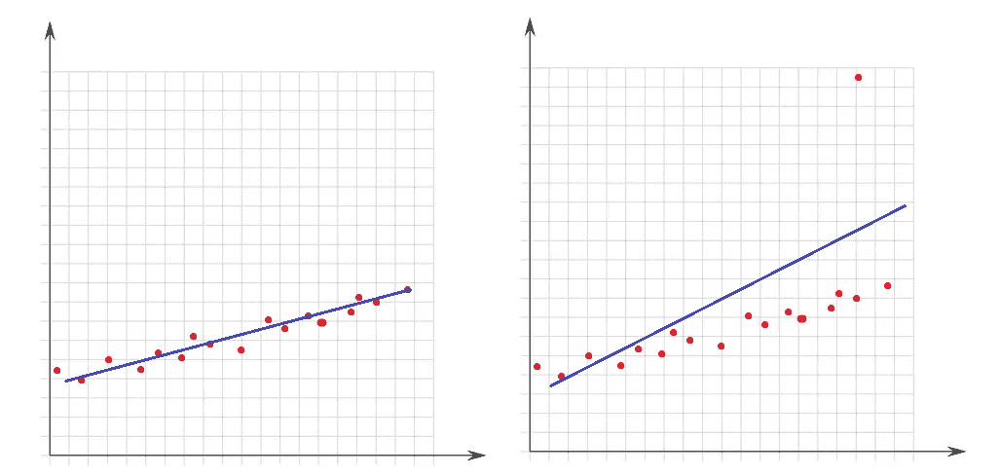

# Python 数据清理完整指南

> 原文：<https://medium.com/analytics-vidhya/complete-guide-to-data-cleaning-with-python-8c686104686c?source=collection_archive---------0----------------------->

## 了解如何逐步进行数据清理

我很确定你听过这句著名的数据科学名言:

> 在数据科学项目中，数据清理需要花费 90%的时间。

如果您还没有，那么请记住，数据清理是数据科学工作流程的基础。正如人们吃什么就是什么(另一句名言)，机器学习模型根据你给它提供的数据来执行。长话短说，杂乱的数据会导致糟糕的性能，而干净的数据是良好模型性能的先决条件。当然，干净的数据并不意味着始终有好的性能，正确选择模型(剩余的 10%)也很重要，但是没有干净的数据，即使是理想的模型也无法在理想的水平上执行。

**在这篇博客**中，我将列出**数据清理**中解决的**问题**，并展示可能的**解决方案。**

希望你会喜欢！


# 缺失数据

当数据集中存在缺失数据时，最好不要急于去填补。因为空细胞这个地方本身就能告诉你一些有用的东西。例如:

*   NA 值仅在数据集的尾部或中部背靠背。这意味着，在数据收集过程中可能存在技术问题。然后，您分析特定样本序列的数据收集过程，并尝试找到问题的根源。
*   如果 70–80%以上的列为 NA，您可以删除该列。
*   如果 NA 值在表格中的可选问题列中，则该列可以像用户回答(1)或未回答(0)那样解码。

我们将使用 python 库来检查上述情况，该库的`[missingno](https://github.com/ResidentMario/missingno).` `matrix` 函数对于这种方式非常方便。图中的白线是 NAs:

```
import missingno as msno
msno.matrix(df)
```


说到插补，有很多方法，比如:

*   均值、中值、众数；
*   kNN
*   零或常数等。

不同的方法各有优缺点，也没有适合所有情况的“最佳”技术。以下文章是插补技术的理论和代码实现的最佳资源之一:

[](https://towardsdatascience.com/6-different-ways-to-compensate-for-missing-values-data-imputation-with-examples-6022d9ca0779) [## 弥补缺失数据的 6 种不同方法(数据插补，附实例)

towardsdatascience.com](https://towardsdatascience.com/6-different-ways-to-compensate-for-missing-values-data-imputation-with-examples-6022d9ca0779) 

# 极端值

异常值是相对于数据集的其他点而言非常大或非常小的值。它们的存在极大地影响了数学模型的性能。让我们通过这个简单的例子来了解性能下降的原因:



在左图中，没有异常值，直线与数据点非常吻合。然而，在右图中，存在一个异常值，当线试图覆盖数据集的所有点时，一个异常值的存在会改变线的位置，并且它不适合至少一半的点。

我们知道为什么离群值对数据集有害，让我们继续讨论一些数学概念。首先，有必要定义什么是“极大”或“极小”。

高于/小于 Q3/Q1 1.5 倍 IQR(四分位间距)的值称为异常值。IQR 是 Q3 和 Q1 的差值(IQR = Q3-Q1)。

我编写了下面的函数来检查数据集中异常值的数量:

处理异常值的一种方法是让它们等于 Q3 或 Q1。通过使用 pandas 和 numpy 库，下面的函数完成了这个任务。给你。`lower_upper_range`函数查找外部为异常值的范围。然后使用 [numpy clip](https://numpy.org/doc/stable/reference/generated/numpy.clip.html) 功能将数值剪切到范围内。

# 不一致的数据

离群值问题是关于数值特征的，现在来说说字符串列。不一致的数据意味着一列的不同类有不同的表示。比如性别一栏，男/女和 M / F 都有，这种情况下会有 4 个班，但实际上有两个班。

正如您所预测的，这个任务没有自动化，因此我们需要手动分析这些类。`[unique](https://pandas.pydata.org/docs/reference/api/pandas.unique.html)` [熊猫的功能](https://pandas.pydata.org/docs/reference/api/pandas.unique.html)就是为了这个目的。我们以[车价预测数据](https://www.kaggle.com/code/goyalshalini93/car-price-prediction-linear-regression-rfe/data)的名称列为例来看。


这里有马自达、日产、保时捷、丰田等等。说明了不一致数据问题。我更喜欢用[熊猫 loc 函数](https://pandas.pydata.org/docs/reference/api/pandas.DataFrame.loc.html)来解决:

# 无效数据

此类别包含逻辑上不正确的值。举个例子，

*   某人年龄 560；
*   花费的时间为-8 小时；
*   一个人的身高是 1200 厘米-秒等等。

对于数值列[，熊猫描述函数](https://pandas.pydata.org/docs/reference/api/pandas.DataFrame.describe.html)可用于识别此类错误:

```
df.describe()
```


导致无效数据的原因有两种:

1.  数据收集错误

数据工程师可以为高度列键入 1799 而不是 179。这种随机错误可以被视为空值，并与其他 n as 一起进行估算。

2.数据操作错误

数据集的一些列可以是由开发人员编码的函数的输出。例如，一个函数根据出生日期计算年龄，结果是负数。这意味着方程是不正确的。

# 重复数据

当数据集中有相同的行时，就是重复数据问题。这可能是因为数据组合错误(同一行来自多个来源)，用户可能提交他或她的答案两次，等等。处理这个问题的理想方法是删除复制行。

要检查是否有重复行，可以使用[熊猫重复功能](https://pandas.pydata.org/docs/reference/api/pandas.DataFrame.duplicated.html):

```
df.loc[df.duplicated()]
```

识别出重复项存在后，[熊猫](https://pandas.pydata.org/docs/reference/api/pandas.DataFrame.drop_duplicates.html)的功能是删除重复行:

```
df.drop_duplicates()
```

# 数据类型

使用年龄列时，您是否遇到过奇怪的字符串错误？这是因为列的数据类型分配不正确。因此，使用 [pandas dtype 函数](https://pandas.pydata.org/docs/reference/api/pandas.DataFrame.dtypes.html)检查所有列的数据类型是一个很好的做法。

此外，我强烈建议您看看这篇关于不同数据类型的内存使用的文章，并通过选择正确的类型来加快进程。

[](https://www.linkedin.com/pulse/reducing-memory-usage-do-before-you-start-any-data-vusal-k-kamalzada/) [## 减少内存使用:在开始任何数据科学项目之前这样做

www.linkedin.com](https://www.linkedin.com/pulse/reducing-memory-usage-do-before-you-start-any-data-vusal-k-kamalzada/) 

# 额外收获:数据泄露问题

在建立模型之前，数据集被分成训练集和测试集。测试集是看不见的数据，用于评估模型性能。如果测试集在数据清理或数据预处理步骤中被模型以某种方式“看到”，则称为**数据泄漏**。这就是为什么应该在清理和预处理步骤之前拆分数据:


让我们以缺失值插补为例。数字栏中有 NAs，用平均值法估算。当在分割前*完成时，使用整个数据集的平均值，但如果在*分割后*完成，将分别使用训练和测试的平均值。*

第一种情况的问题是，测试集中的估算值将与训练集相关，因为平均值是整个数据集的平均值。因此，当使用训练集构建模型时，它也会“看到”测试集。但是我们分割的目标是保持测试集完全新鲜，并像新数据一样用于性能评估。这就是为什么数据集必须在操作前分割。

正如我们讨论为什么第二个场景是正确的，现在让我们继续讨论它将如何在代码中实现。根据第一印象，你可以说，这是没有效率的，也可能是正确的。但是由于数据泄露问题非常重要，而且是首要问题，所以这是您应该采取的方式。为了让它高效，sklearn 库提供了 [**管道**](https://scikit-learn.org/stable/modules/generated/sklearn.pipeline.Pipeline.html) 。简单地说，管道是您将数据作为输入发送到的所有操作步骤的组合，输出是干净的数据。关于建设管道的细节，你可以参考这个博客:

[](https://towardsdatascience.com/how-to-use-sklearn-pipelines-for-ridiculously-neat-code-a61ab66ca90d) [## 如何将 Sklearn 管道用于极其简洁的代码

towardsdatascience.com](https://towardsdatascience.com/how-to-use-sklearn-pipelines-for-ridiculously-neat-code-a61ab66ca90d) 

# 谢谢你

对于交流:

【https://www.linkedin.com/in/anar-abiyev-224a45196】T4/