# 熊猫图书馆完整指南(Python 代码)——第 1 / 4 部分

> 原文：<https://medium.com/analytics-vidhya/complete-guide-to-pandas-library-python-code-part-1-4-420cd5bd8249?source=collection_archive---------9----------------------->

在我作为数据科学家的职业生涯中，我亲自实现了许多东西，今天在这篇文章中，我将重点关注一个 Python 库，它真正帮助我度过了所有困难的分析情况，从基本到高级数据操作和使用 Pandas 库的探索技术。

熊猫图书馆就像你想象的那样强大。以这种方式，无论你开始哪种类型的项目，你都将使用熊猫来开始它的探索。

## 索引

1.  导入数据
2.  索引、子集设置、选择
3.  数据类型转换(日期/时间戳)
4.  处理缺失数据
5.  数据汇总

对于这个例子，我们将使用一个关于心脏病的数据集，在这里获取数据。

```
*## Import Essential Libraries*import pandas as pd
import numpy as np*## To let pandas display max columns , rows*pd.options.display.max_rows = 500
pd.options.display.max_columns = 500
```

## 导入数据

根据文件格式的类型，Pandas 有几种导入数据集的方法。

*   CSV 格式(*注意:将数据文件保存在与 jupyter 笔记本相同的目录中，否则使用完整路径)*

```
df = pd.read_csv("heart.csv")
```

*   Excel 格式

```
df = pd.read_excel("heart.xlsx"  , sheet_name = '')
```

这些只不过是 pandas 提供给你的几个工具，你可以用它们作为阅读器功能将数据读入 pandas。类似地，如果您想在 EDA 过程结束时导出数据集，您可以使用它们的 writer 函数作为 *pd.to_csv()* 和 pd。 *to_excel()。*

```
df.head()
```

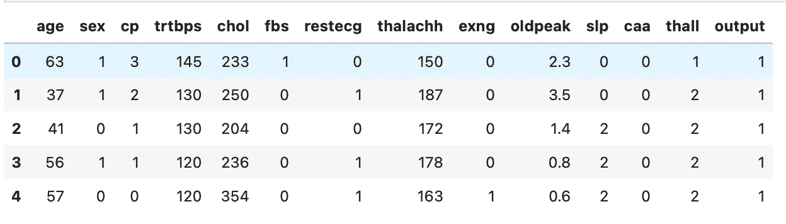

图片由 [Vijay yadav](https://medium.com/u/7a227215482f?source=post_page-----420cd5bd8249--------------------------------) 提供

快速浏览数据集总是一个更好的开始，您可以使用 head 方法查看前几行，同样，如果您需要查看数据集的最后几行，您可以通过。tail()方法。

```
df.tail()
```

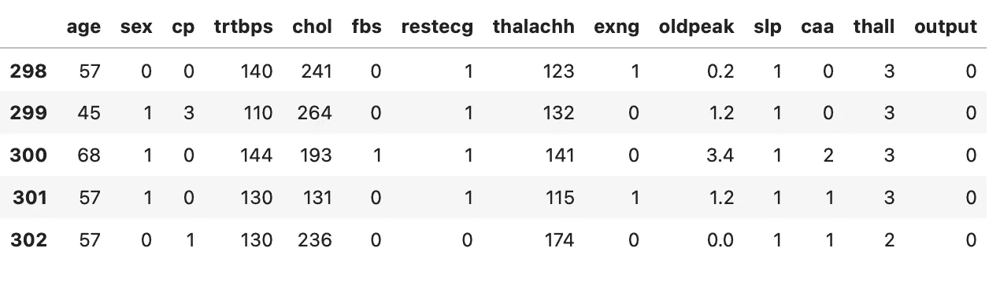

图片由 [Vijay yadav](https://medium.com/u/7a227215482f?source=post_page-----420cd5bd8249--------------------------------) 提供

## 索引、子集设置、选择


照片由[米卡·鲍梅斯特](https://unsplash.com/@mbaumi?utm_source=medium&utm_medium=referral)在 [Unsplash](https://unsplash.com?utm_source=medium&utm_medium=referral) 上拍摄

请记住使用 excel 表格时的筛选功能，如何简单地选择和处理数据子集，如何从整个数据集中选择任何特定的数据并对其进行几乎所有的操作。这正是 Python 索引操作符“[ ]”和属性操作符“.”的用法在熊猫工作。

基本上我们将使用基于标签的索引**。loc、**和基于整数的索引**。iloc** 用于多轴分度。仔细理解这一点，这很棘手但非常重要。

```
df.loc[:]
```

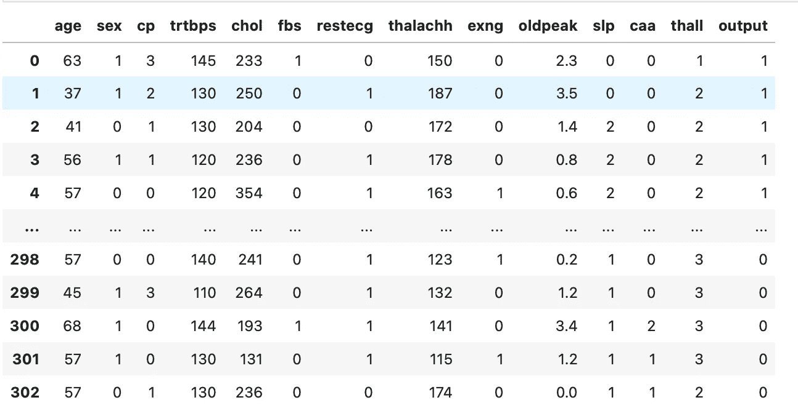

图片由 [Vijay yadav](https://medium.com/u/7a227215482f?source=post_page-----420cd5bd8249--------------------------------) 提供

> **LOC(行索引器、列索引器)**

*loc* 方法有两个输入，第一个称为行索引器，它将索引标签作为值，第二个参数称为列索引器，它将列标签作为选择数据的标识符，符号“:”表示要子集化的值的范围。
假设您没有提供任何值，但提供了':'符号，如上例所示，loc 方法默认显示数据集的每个标签。

```
df.loc[0:5]
```

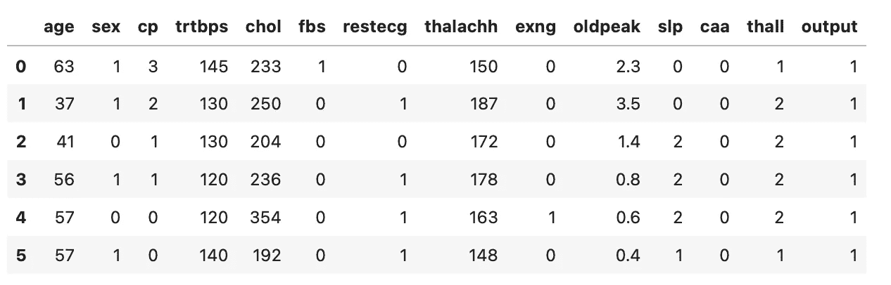

在这个例子中，我们提到了从索引标签 0 到 5 中进行选择的 loc 方法，因为没有指定列标签，所以默认情况下它会选择所有的列标签。

```
df.loc[0:10,'age']
```

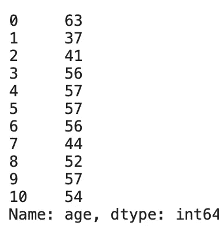

在本例中，我们只提到了一个列索引器标签“age ”,因此输出按照行索引器对数据进行行子集化，按照列索引器对数据进行列子集化。

此外，我们可以对任意范围的数据进行切片，并在范围中随机指定其标签。

```
df.loc[50:60 , ['age' , 'sex', 'cp']]
```

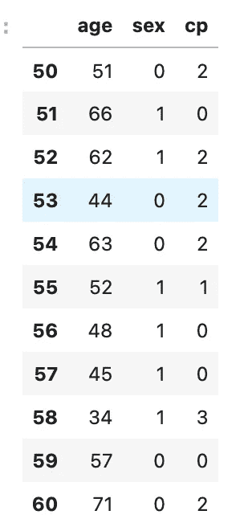

这是一个有趣的结果，您可能会注意到，我们从范围 50:60 中指定了 row_indexer，并且在列索引器中传递了一个列索引器列表。

因此，您可以想象在基于标签对数据集进行切片的情况下，这个工具是多么强大。

*   单个标签，例如`5`或`'a'`
*   标签的列表或数组`['a', 'b', 'c']`
*   带标签的切片对象`'a':'f'`

> **。iloc 基于整数的索引**

基于整数的索引仅仅意味着通过整数索引定位任何特定的行或列(从轴的`0`到`length-1`)。这就是为什么这种方法可能是选择子集的更健壮的方法，因为它不会受到影响，即使列名在整个程序中被改变。

```
df.iloc[50:55 , [ 0,6,10]]
```

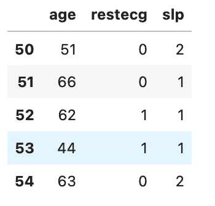

正如您所看到的，我们使用了 50:55 的行索引，通过指定它们各自的索引来子集化行和列索引。

## 使用 isin()函数进行选择

```
# Create a new column 
old_age = list(range(60,100))# First Method
df[df['age'] > 60]# Second Method
df['senior_citizens']  = df['age'].isin(old_age)df[df['senior_citizens'] == True ].head()
```

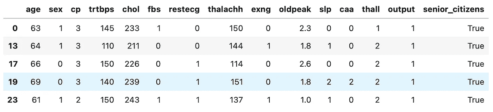

图片由 [Vijay yadav](https://medium.com/u/7a227215482f?source=post_page-----420cd5bd8249--------------------------------) 提供

我们随机创建了一个名为“老年人”的额外功能，给每个 60 岁以上的人贴上标签。在本例中，我们可以看到创建数据子集的两种方式。第一种方法使用一个简单的大于运算符来比较数值，这样我们就能得到正确的数据集。

但是，如果我们有分类值或者需要比较多个值的条件，这种方法就没有用了。
这就是我们使用 **isin()** 函数的地方，它允许我们迭代列表或数组格式中提供的每个值。在这种方法中，即使原始变量“old age”的值或范围发生变化，我们也不需要担心我们的代码。因为我们使用的是 isin()函数，所以只要变量存在，它就为真。

```
## Also you can index data by using the index of the datadf[df.index > 10]df[df.index.isin([2,5,7,8,4,5,7,8,7,5,4,3,5,7,8,84])]
```

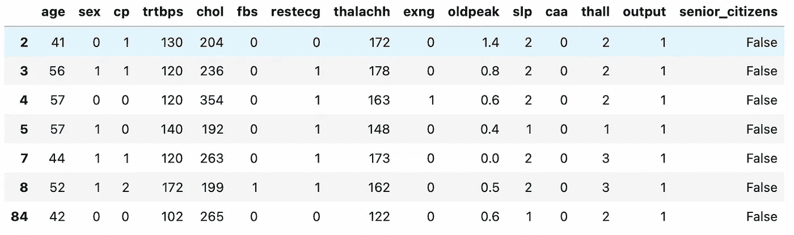

## 数据类型转换(日期/时间戳)


照片由[瓦尔德马·布兰德](https://unsplash.com/@waldemarbrandt67w?utm_source=medium&utm_medium=referral)在 [Unsplash](https://unsplash.com?utm_source=medium&utm_medium=referral) 拍摄

Pandas 非常灵活地处理数据帧中的各种数据类型。因此，它也为将一个系列的任何给定数据类型转换为其他有效的数据类型提供了极大的可行性。
例如，当您将数据从 excel 导入 jupyter notebook for EDA 时，日期列可能会转换为字符串格式，如果不将其转换回日期格式，则实际上无法使用。

让我们创建一个示例数据框架来演示这种情况。

```
import datetimedate = pd.date_range('2020/01/01', end = '2020/12/31' , freq= 'D')df_date = pd.DataFrame(date , columns = {'Date'})
df_date.head()
```

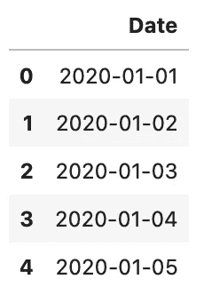

pandas 中的此功能根据提供的属性创建一个日期范围，如指定的开始日期、结束日期，频率可以是日、周、月和年。

日期列
的默认 dypte 是 datetime。Datetimeindex，我们可以将其转换为 object，反之亦然，只是为了演示。

```
df_date['Date'] = df_date['Date'].astype('object')df_date['Date'] = df_date['Date'].apply(pd.to_datetime)
```

上述函数将日期类型转换为对象，然后再转换回日期时间格式。同样，您可以使用这个方法来转换所需的列，或者为您希望解析为日期的列提供一个预检查。

```
df_date['Day Name']  = date.day_name()df_date['Month_Number'] = date.monthdf_date['Month_Name'] = date.month_name()
```

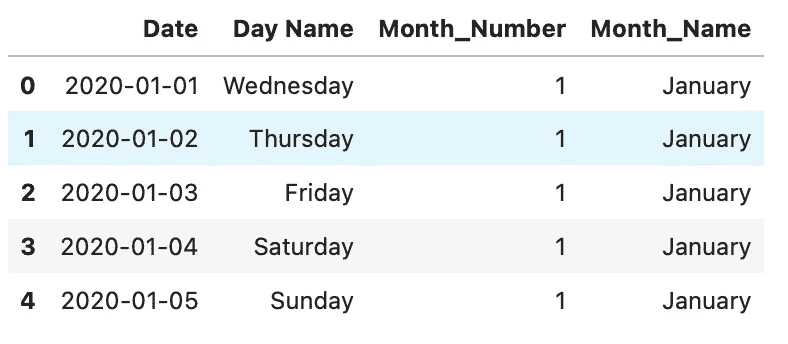

正如您在上面的代码中看到的，我们可以生成多个额外的特征，这对进一步分析、全面理解数据或只是为了自我探索非常重要。然而，当您必须处理日期时间格式时，pandas 中的这个功能非常方便。

## 处理缺失数据

> “由于数据以多种形状和形式出现， [pandas](https://pandas.pydata.org/pandas-docs/stable/user_guide/missing_data.html) 旨在灵活处理缺失数据。虽然出于计算速度和方便的原因，`NaN`是默认的缺失值标记，但我们需要能够轻松地检测不同类型数据的值:浮点、整数、布尔和一般对象。”


布雷特·乔丹在 [Unsplash](https://unsplash.com?utm_source=medium&utm_medium=referral) 上拍摄的照片

处理缺失数据是任何预处理方法中最重要的步骤之一，事实上也是必不可少的步骤。缺失值就像缺失的乐高积木一样，可能会决定整个数据集的成败。识别缺失数据，找出缺失数据背后的原因，并选择适当的方法来估算数据是一项非常耗时耗力的任务，因此让我们来了解其中的一些方法。

```
# First lets check if we have any null value in dataprint("There are total {} null values".format(df.isnull().any().sum()))
```

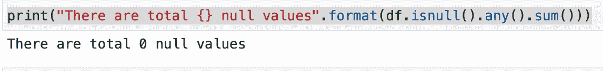

因为我们的数据集中没有任何空值，所以让我们创建一些空值。我们可以简单地使用 loc 或 iloc 函数选择某些行，就像我们在本文前面讨论的那样，然后分配 np.nan 值。

```
# assign null values to age and sex column.df.loc[50:70, ['age' , 'sex']] = np.nan
```

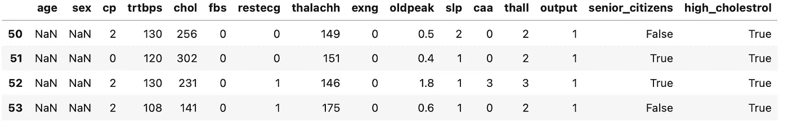

```
# now lets check again for any null value in dataprint("There are total {} null values".format(df.isnull().any().sum()))
```

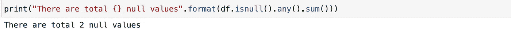

现在，我们已经成功地将值 np.nan 赋给了这里的两列即“年龄”和“性别”，我们可以通过再次调用 isnull()函数再次验证它。

向缺失的列输入数据是一件需要在继续之前好好考虑的事情。在开始估算价值之前，先问问自己这些问题。

*   *为什么数据首先会丢失，丢失的原因是实际原因、数据不可用还是数据不适用。*
*   *不管怎样，有多少数据丢失了，它是如何代表全部数据的。*
*   *是我的失踪栏。包含数字或分类数据。*
*   数据缺失是否有某种模式。

因此，如你所见，在进入 while 数据插补过程之前，你可以尝试回答几个问题。

```
#First Method
df.loc[50:70, ['age']] = 0#Second Method
df['sex'] = df.loc[50:70, ['sex']].fillna(df['sex'].mode()[0])#Third Method
df['age'] = df.loc[50:70, ['age']].fillna(df['age'].mean())
```

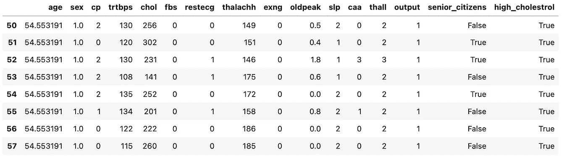

图片由 [Vijay yadav](https://medium.com/u/7a227215482f?source=post_page-----420cd5bd8249--------------------------------) 提供

第一个方法是一个简单的赋值方法，你可以简单地给这个列赋值，如果这个值没有任何意义的话，或者说你不确定应该放什么值，所以你只给每个人赋值“0”。

但是，假设您缺少的列是一个分类值，您显然不能通过任何统计或聚合方法生成任何新值。在这种情况下，您可以查看哪个值在数据中出现得最多，并且您可以采用列的模式，通过访问第一个值来估算该值。
当然，这不是最好的估算方法，但正如我之前所说，这取决于你对上述问题的回答。

类似地，在第三种情况下，我们有 Pandas 的 **fillna()** 函数，它很容易处理缺失值。使用 fillna()，缺失值可以由特殊值或聚合值(如平均值、中值)替换。此外，使用向前填充方法和向后填充方法，可以用缺失值之前或之后的值替换缺失值，这对于时间序列数据集非常有用。

## 删除缺少的值

*   *什么时候应该考虑从数据集中删除任何值？*


辛蒂娅·玛丽莎在 [Unsplash](https://unsplash.com?utm_source=medium&utm_medium=referral) 上拍摄的照片

很简单，假设您有 1000 行数据，而您只有 10 行或最多 100 行空值，这相当于最多 10%的数据。删除这么多记录可能不会影响您的整体数据集质量或任何基础信息(大多数情况下)，但是它肯定会使您的数据集在丢失值记录方面更加整洁。记住这是一个权衡，是否值得将取决于数据集本身或具体情况。

```
df.dropna(axis=0, inplace=True)print("There are total {} null values".format(df.isnull().any().sum()))print("Updated Shape of the dataset is {}".format(df.shape))
```

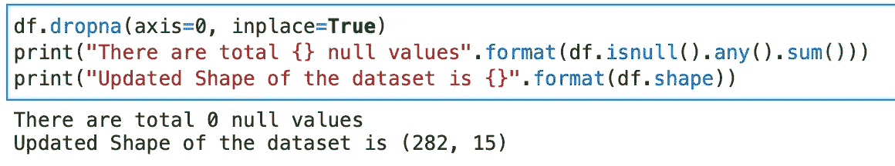

请注意，我们现在总共有“0”个空值，但是数据集的总形状从 303 行减少到 282 行。这意味着我们已经成功地删除了所有具有 NaN 或缺失值的行，从而使我们的数据集没有缺失值。此外，我们使用(**轴= 0)** ，因为我们打算跨行删除丢失的值。

当我们使用值为 true 的 **"inplace"** 属性时，该函数会从原始数据集中删除这些行，因此这是对原始数据集所做的永久更改，并且无法恢复。解决方法是在删除前创建数据集的副本，或者在删除时创建数据集的另一个实例。

```
upated_dataset = df.dropna(axis=0) ## assigning new instance of Dataprint("There are total {} null values in the Updated dataset".format(df.isnull().any().sum()))
print("Updated Shape of the new dataset is {}".format(df.shape))
```

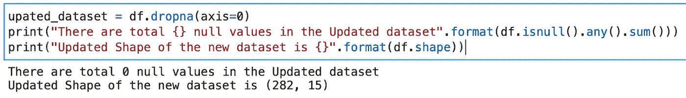

## 数据汇总


照片由[凯尔西·钱斯](https://unsplash.com/@kchance8?utm_source=medium&utm_medium=referral)在 [Unsplash](https://unsplash.com?utm_source=medium&utm_medium=referral) 上拍摄

太棒了，你已经完成了本文的最后一部分，我希望一切顺利。汇总是任何数据分析过程的关键，我们还没有完成，因为使用 pandas 进行**数据争论、绘图、可视化和统计建模**还有很多事情要做，这些将分别在本系列的第 2、3 和 4 部分中介绍。
但是首先，让我们习惯一些总结技巧。

**内容:** *info()、describe()、value_counts()、nunique()、groupby()。*

```
# This method prints information about a DataFrame including the index dtype and columns, non-null values and memory usage.df.info()
```

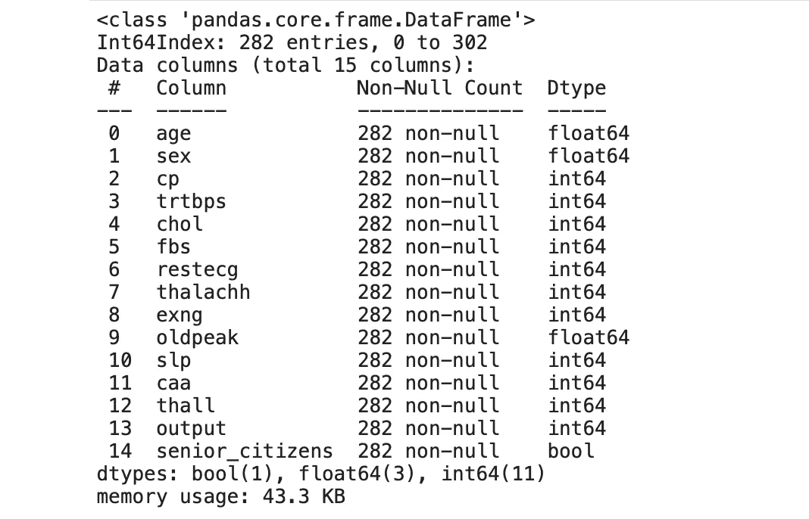

```
# This function will describe you numerical as well as categorical data will all important stats at a glance.df.describe(percentiles=None, include=None, exclude=None, datetime_is_numeric=False)
```

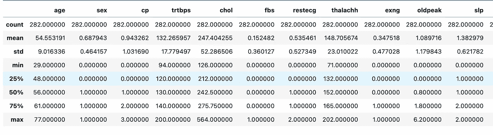

*   **百分点**属性表示数据集的四分位数范围(数据的 25%、50%和 75%)
*   **std** 是观察值的标准偏差， **mean** 是数值的平均值
*   **Count** 是观测值的总数， **min -max** 是数据集中的最小值和最大值。

默认情况下，这个函数只对数字列有效，但是如果您想对分类值有一个很好的描述，您可以通过包含一个“include”对象来实现。

```
# In my dataset , I only have one categorical column.df.describe(include='object')
```

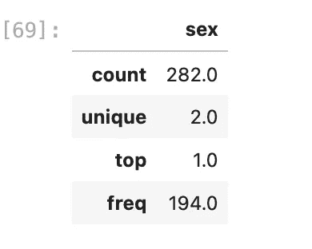

```
# value_counts() function will give you the count of all different types of values available in the Dataframe or series.df['senior_citizens'].value_counts()
```

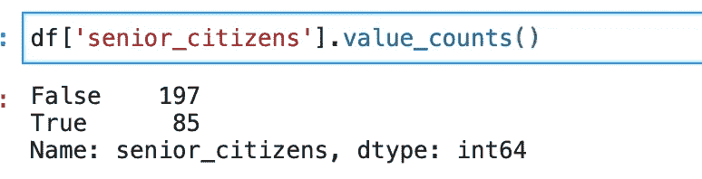

```
# unique() and nunique() function will give you all the unique values in a particular series and number of unique values in the series respectively.df['senior_citizens'].unique()df['senior_citizens'].nunique()
```

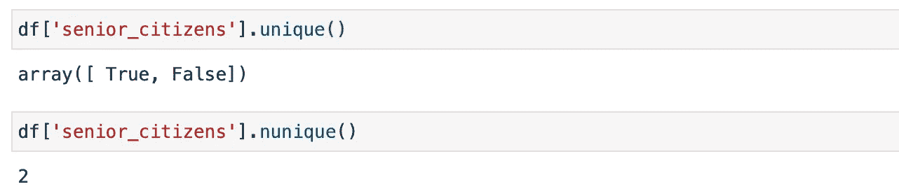

```
## A groupby operation involves some combination of splitting the object, applying a function, and combining the results. This can be used to group large amounts of data and compute operations on these groups.df.groupby('sex').count()
```

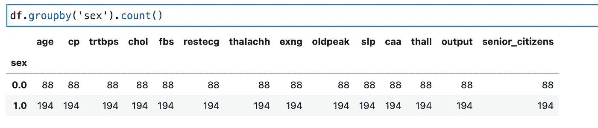

这里，函数的第一个参数是“by”参数，它将根据该参数对所有列的其余部分进行分组。类似地，您可以使用任何其他分类特性对其余的列进行分组。它还可以将值列表作为“by”参数，并将创建一个多索引数据帧。

```
df.groupby(['sex' , 'senior_citizens']).count()
```

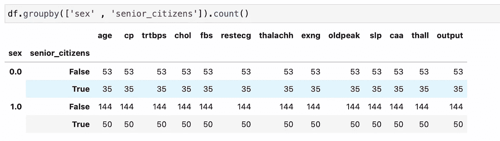

此外，您可以筛选出想要实际分组的列数，并只显示这些特定列的结果。使用列表理解来传递列的标签。

```
df.groupby(['sex' , 'senior_citizens'])[['age' , 'cp' , 'chol' , 'fbs']].count()
```

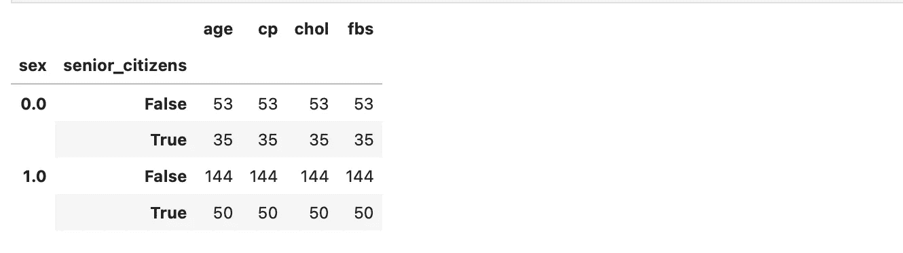

**结论。**

*   我们使用了几种方法通过 pandas 库、read.csv()和 read.excel()导出数据。
*   使用基于标签或基于整数的标签，通过 loc、iloc 函数对数据进行选择和索引。
*   我们还了解了如何处理数据帧中的日期数据类型、日期时间函数中的不同参数，以及如何使用它来创建新功能。
*   处理缺失值并确定缺失值背后的原因。
*   Pandas 提供了多种数据汇总功能，这使得对数据集的探索变得更加容易和有趣。

感谢你阅读我文章的第一部分。现在，您对基本功能有了很好的理解，现在可以进入第 2 部分，继续阅读数据争论文章。

# 其他文章。

*   [第二部](https://datasciencestuff.medium.com/complete-guide-to-pandas-library-python-code-part-2-4-4c0d9d9bd511)和[第三部](https://datasciencestuff.medium.com/complete-guide-to-pandas-library-python-code-part-3-4-6bc11f9465d0)在这里链接，如果你还没有看的话，一定要看看。