# 熊猫图书馆完整指南(Python 代码)——第 2/ 4 部分

> 原文：<https://medium.com/analytics-vidhya/complete-guide-to-pandas-library-python-code-part-2-4-4c0d9d9bd511?source=collection_archive---------11----------------------->

我们在第一部分学到了很多基础知识。现在，您知道了如何使用多种条件、过滤器和选择来创建数据框的子集。我们还讲述了如何处理缺失值，找出缺失值背后的原因，并使用多熊猫函数总结数据集。

这部分将重点介绍[熊猫](https://pandas.pydata.org/pandas-docs/stable/index.html)库的**数据角力能力**。


[Firmbee.com](https://unsplash.com/@firmbee?utm_source=medium&utm_medium=referral)在 [Unsplash](https://unsplash.com?utm_source=medium&utm_medium=referral) 上拍照

## 索引

*   使用不同的数据类型。
*   重塑数据帧对象
*   绕轴旋转
*   数据聚合和分组操作

在接下来的两篇文章中，我们将对 2020 年数据集使用**堆栈溢出调查。**该数据集拥有来自 180 多个国家的近 65，000 份回复。调查的目的是涵盖开发者体验的所有方面，从职业满意度和求职到教育和对开源软件的看法。

数据集:[https://insights.stackoverflow.com/survey](https://insights.stackoverflow.com/survey)

## 加载数据集和基本的数据理解。

```
data = pd.read_csv("survey_results_public.csv")
data.head()
```

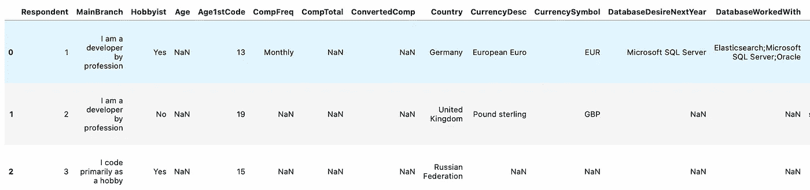

*数据集第一眼*

始终将理解和验证数据集中所有属性的真实性作为 EDA 过程的首要目标。
在开始任何事情之前，检查以下提到的一些基本事项:

> **考虑数据集= df**

```
**df.shape**  #Shape of the whole dataset**df.dtypes**  #Data type of every attribute**df.describe**  #Overview of all statistical detail of Numerical col.**df.describe(include = 'object')**  #For Object Columns.**df.isnull().sum()** #Total number of null values in Dataset.**df['column name'].unique()**  #Total number of unique cat. values
```

## *使用不同的数据类型*


照片由[迪昂布莱克](https://unsplash.com/@deonblack?utm_source=medium&utm_medium=referral)在 [Unsplash](https://unsplash.com?utm_source=medium&utm_medium=referral) 上拍摄

通过执行上述步骤，您将对数据集有一个很好的了解，假设您发现各种应该是对象或分类格式的属性都是整数格式，反之亦然，如果一个应该是日期格式的列是对象格式又会怎样。我们需要在继续分析之前解决这个问题，因为这是确保我们的数据集讲述正确故事的一个非常重要的步骤。

```
**# Converting numeric datatype to Object**data['Respondent'] = data['Respondent'].astype('object')**# Converting object datatype to Numeric**data['Age'] = pd.to_numeric(data.Age)**# Converting object datatype to Date format**new_data['date']  = pd.to_datetime(new_data['date'])
```

## 重塑表格和数据透视表

现在，重塑数据集仅仅意味着以最适合您需求的格式制作和拆分数据集。例如，如果您想要创建时间序列图，您需要一个**日期**列作为您的索引，并且需要绘制的值必须在每个日期的列中。

对于这样的需求，您甚至不需要处理数据集中的其余列，因此您可以删除它们，或者简单地创建一个包含所需特定列的单独的数据集。

现在，为了重塑数据集，您可以根据您想要执行的操作，使用 pandas 中的多个函数，即 ***、pivot()、pivot_table()、melt()、stack()*** 。

让我们来看看实际情况，为此我们将使用一个单独的[数据集](https://www.kaggle.com/rashikrahmanpritom/heart-attack-analysis-prediction-dataset)。只是为了更方便。

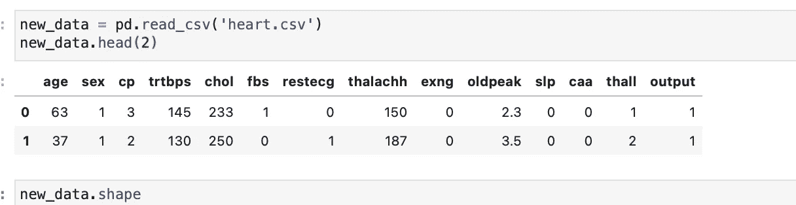

现在，正如您所看到的，这个数据集有更多的数字列，但没有日期属性。因此，我们可以创建一个只是为了演示的目的

```
new_data['date'] = pd.date_range(start='2020/01/01'  , end='2020/10/29', freq='D') # pd.daterange() -- This function creates a date range.# start -- This specifies the start of the date range# end  -- This specifies the end of the date range.# freq -- Creates dates based on days. Other options are W, M, Y.# period -- Specifies how many interval between dates(12 for a Year)
```

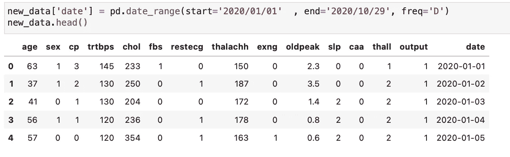

## 创建枢纽

```
new_data.pivot(index='date' , columns='cp' ,values = 'age' ).head()
```

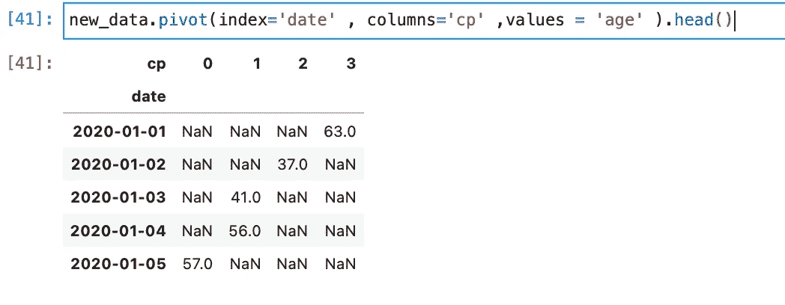

当您创建 pivot **index** 、 **column** 和 **values** 是三个需要指定的重要参数，数据将相应地被重新整形。请注意，values 参数是将根据这些行索引和列索引绘制的参数。

**重要提示:**请记住，如果省略了 values 参数，并且数据集中有多个列，则生成的透视数据框架将采用所有这些列，并创建一个分层索引。

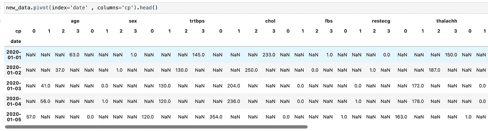

如果您看到，在这个例子中，我没有提供 values 参数，因此 pivot 创建了一个包含数据集中所有其他列的多索引数据框架。

上面的数据集中有如此多的 NaN 值，我们可以使用 fillna()参数用任何值填充它们。

```
new_data.pivot(index='date' , columns='cp' ,values = ['age','sex' ,'chol']).fillna(0).head()
```

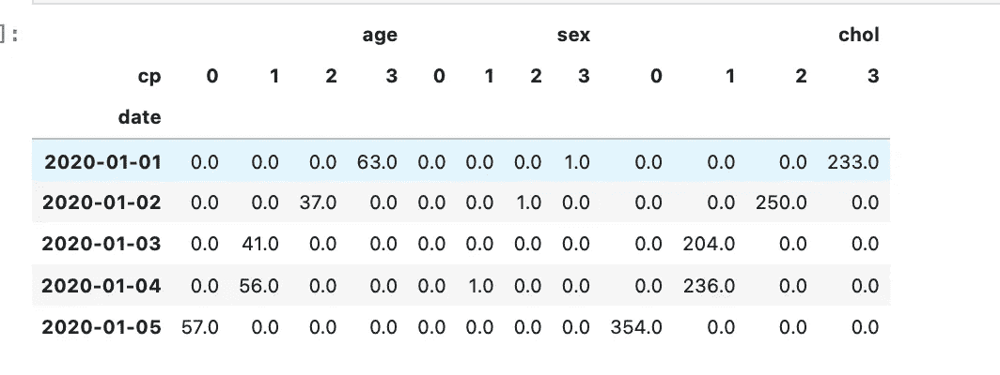

> 如果索引/列对不是唯一的，`[**pivot()**](https://pandas.pydata.org/docs/reference/api/pandas.pivot.html#pandas.pivot)`将抛出错误`ValueError: Index contains duplicate entries, cannot reshape`。在这种情况下，可以考虑使用`[**pivot_table()**](https://pandas.pydata.org/docs/reference/api/pandas.pivot_table.html#pandas.pivot_table)`，它是 pivot 的一种推广，可以处理一个索引/列对的重复值。

```
new_data.pivot_table(index = 'age' , columns= 'sex' , values = ['chol' , 'thall','oldpeak'] ).head()
```

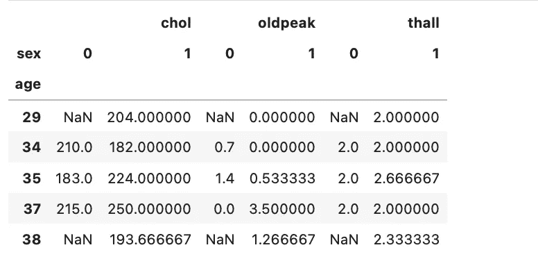

## 融化( )

melt()是另一个可用于以类似方式重塑数据集的函数，它采用以下参数。

```
new_data[['age' , 'sex' , 'cp']].melt(id_vars= ['age' , 'sex'] , var_name='Rest of the column').head()
```

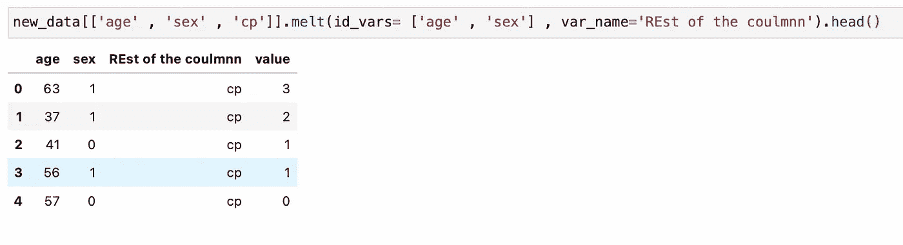

**重要:**在 melt()中，id_vars 是将被视为用于整形的索引值的参数，与 pivot()中的索引和列相同，value_vars 与 value 参数相同。

但是，在 melt 中，如果不提供 value_vars 参数，它将使用数据集中的每一列垂直创建堆栈。*(尝试剧情一次)*

## 数据聚合和分组操作


[张阳](https://unsplash.com/@iamchang?utm_source=medium&utm_medium=referral)在 [Unsplash](https://unsplash.com?utm_source=medium&utm_medium=referral) 上的照片

本文的这一部分是最有趣的部分，使用 groupby()和 agg()函数可以完成的事情绝对没有限制，特别是通过将它们组合在一起。

```
new_data.groupby(["sex" , "cp"]).count()
```

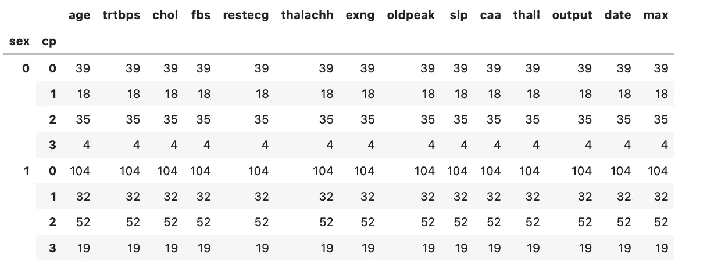

这里，我们使用 groupby()函数对大量数据进行分组，现在我们可以对整组数据应用各种函数。
groupby()操作包括拆分对象、应用函数和组合结果的一些组合。输出是一个 groupby 对象，其中包含有关组的信息。

像 max()、min()、mean()、first()、last()这样的函数可以快速应用于 GroupBy 对象

```
new_data.groupby(["sex" , "cp"]).max()
```

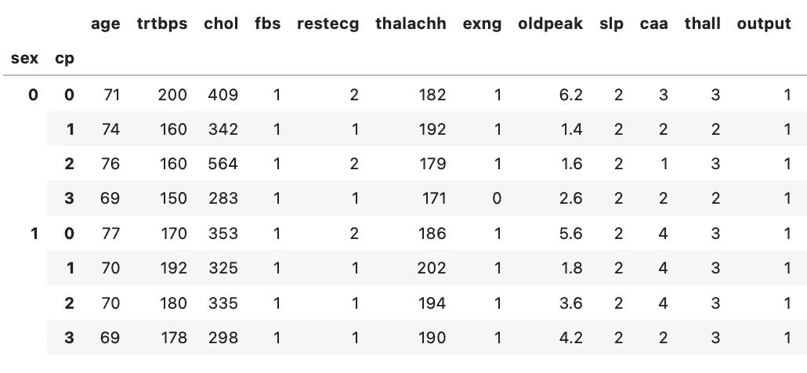

您在这里看到的输出基本上是按性别和年龄列分组时每个属性的最大值，这可以解释为

*   "*女性(性别= 0)出现下胸痛(cp = 0)的最大年龄是 71 岁*"
*   患有高度胸痛(cp = 3)的女性(性别= 0)的最大年龄是 69 岁

同样，您可以使用其余的功能，并很快获得这些有意义的见解。

您可以通过使用 groupby 子句后的过滤器来选择想要在输出中显示多少列，让我们只选择 *age* 和 *chol* 列来显示它们的最大值。
这很有用，如果您想查看最大值，但只查看特定列而不是所有列的最大值。

```
 new_data.groupby(["sex" , "cp"])[['age' , 'chol']].mean()
```

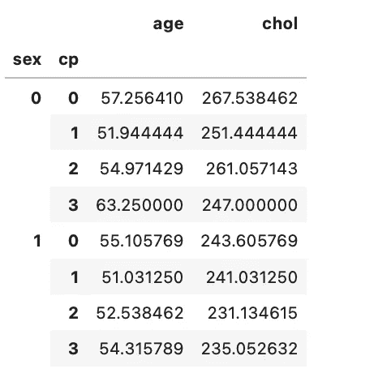

假设您希望仅查找女性患者的所有这些值，或者仅查找胸痛值为 3 的患者的所有这些值，以便对他们的药物治疗进行优先级排序，您可以通过筛选一个列来实现这一点，以便仅对特殊组而不是整个数据集应用 groupby 函数

```
new_data[new_data['cp'] == 3].groupby(['sex' , 'thall']).max()
```

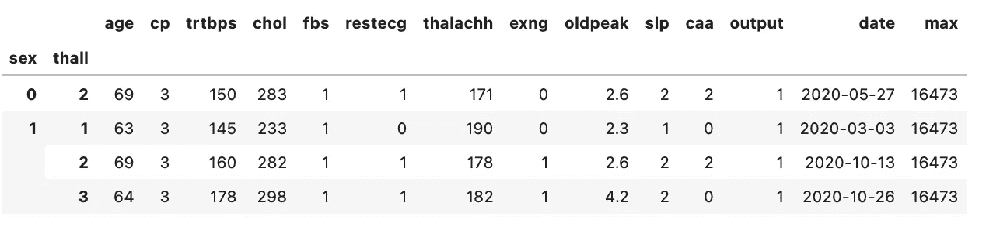

```
new_data[new_data['sex'] == 0].groupby(['sex' , 'thall']).max()
```

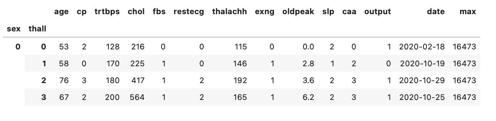

此外，如果您不想将这些用于 groupby 的列作为索引，并希望将它们视为 dataframe 中的一列，或者假设您已经完成了使用 groupby 函数对数据集的操作，现在您希望将它们作为最终数据集导出，您可以通过传递一个附加参数 as_index = False 来实现这一点，它们将不再是索引值，而是 dataframe 中的一列。非常酷…不是吗？

```
new_data[new_data['cp'] == 3].groupby(['sex' , 'thall'] , as_index = False).max()
```

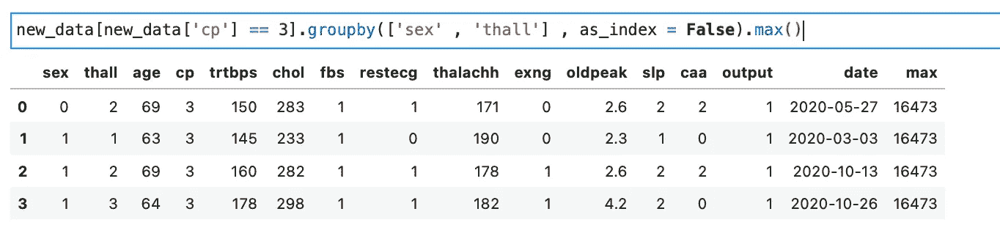

这只是使用 groupby 的几种方式，对于所有用途的分析，这个函数是多么强大，我怎么强调都不为过。

现在，让我们来谈谈聚合函数，它和 groupby 一样神奇，如果我们将它们结合起来，它会更加强大。
聚合函数，agg()用于一次聚合多个计算任务的函数。您还可以传递要应用于特定列的函数列表，它可以计算所有相应的值，返回一个多级索引数据帧。

```
new_data.groupby(['sex' , 'cp']).agg(max)
```

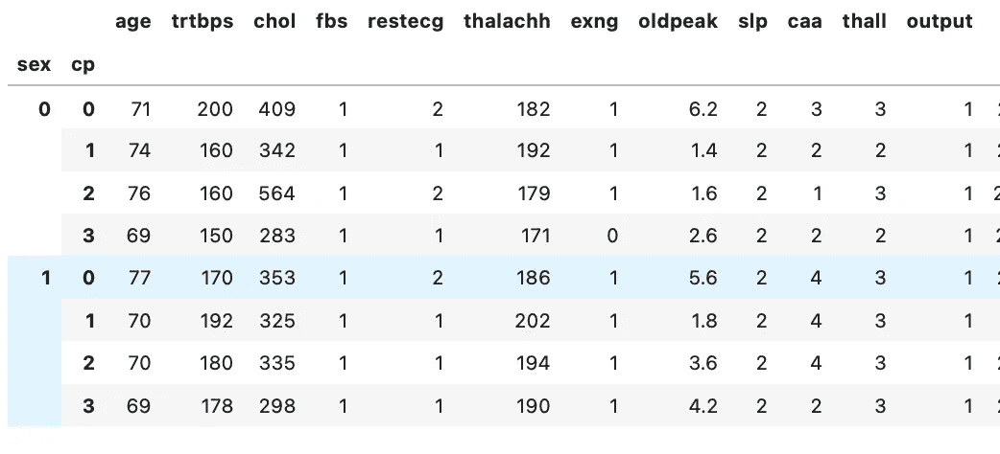

这是使用 agg()并传递一个函数来执行一些操作的最简单的方法，它将通过每一列传递该函数，并在 dataframe 中输出计算的值。但是等等，不也是像上个例子一样直接指定 max()函数就行了吗，那我们为什么还需要 agg()函数。

这就是 agg()函数真正出彩的地方，它向我们展示了它的真正威力，在这里，您可以使用(key : value)对一次在整个数据集中执行不同的操作。在这个功能键中:value 实际上是指(column : Function)相应地，

```
new_data.groupby(['sex', 'cp']).agg({'age': max , 'trtbps' : np.mean})
```

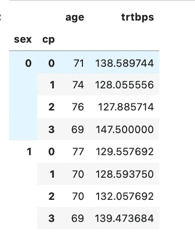

在上面的例子中，你可以看到我们能够同时为两个不同的列计算两个不同的值，你可以想象这在产生洞察力方面是多么强大。agg()函数接受一个字典或键值对列表来操作分组值。

您可以创建自己的 dict 或 list，将不同的函数映射到不同的列，并简单地将它们传递给 agg()函数，它将返回包含所有计算值的 dataframe。

```
agg_fucntion = {'age': [max , min , sum] , 'trtbps' : min}new_data.groupby(['sex', 'cp']).agg(agg_fucntion)
```

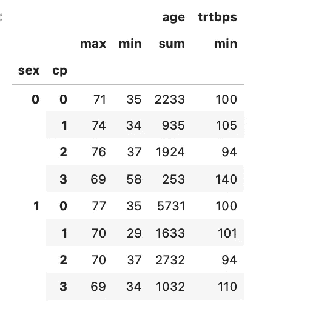

如您所见，我传递了一个要应用于列 *age* 的函数列表，以及一个要应用于 *trtbps* 的函数。产生的数据帧输出了预期的值，这一事实令人兴奋，它可以用于如此多的分析情况，并可以如此轻松地执行复杂的逻辑。

## 结论。


由 [Alexander Schimmeck](https://unsplash.com/@alschim?utm_source=medium&utm_medium=referral) 在 [Unsplash](https://unsplash.com?utm_source=medium&utm_medium=referral) 上拍摄

所以，是的，在 Python 中使用 Pandas，你可以了解到所有最常用的特性和函数，这些特性和函数在你的 EDA 过程中肯定会用到。

*   我们讨论了如何使用不同的数据类型，以及如何根据需要处理它们或改变它们的数据类型。
*   使用 melt()和 pivot()函数重塑数据集。理解 pivot 和 pivot_table 在不同情况下的用法。
*   我们研究了如何以最佳方式使用 groupby()和 agg()函数，以及如何使这些函数中的大部分可供我们使用。
*   当然还有很多事情要做，但是如果你有了如何使用它的概念和想法，以及这个函数最初是如何工作的，那么你就可以以多种方式使用它。

本系列的下一篇文章是使用 Pandas 的 ***绘图和可视化*** 。

## 其他文章。

*   [第 1 部分](https://datasciencestuff.medium.com/complete-guide-to-pandas-library-python-code-part-1-4-420cd5bd8249)和[第 3 部分](https://datasciencestuff.medium.com/complete-guide-to-pandas-library-python-code-part-3-4-6bc11f9465d0)在此链接，如果您还没有查看，请务必查看。