# 熊猫图书馆完整指南(Python 代码)——第 3/4 部分

> 原文：<https://medium.com/analytics-vidhya/complete-guide-to-pandas-library-python-code-part-3-4-6bc11f9465d0?source=collection_archive---------5----------------------->


由[粘土银行](https://unsplash.com/@claybanks?utm_source=medium&utm_medium=referral)在 [Unsplash](https://unsplash.com?utm_source=medium&utm_medium=referral) 上拍摄

## 介绍

欢迎来到熊猫系列的可视化部分。第 1 部分和第 2 部分介绍了 pandas 库本身的基础知识，以便开始您的 EDA 之旅，以及使用该库提供的最著名的技术进行数据辩论的步骤。

难怪任何分析的可视化部分都是最想不到的部分，我们可能有最有趣的见解要与人分享，但在决定选择可视化模式的类型以使我们的信息响亮而清晰时，很容易感到困惑。在本文中，我们将探索几个最广泛的基于 python 的库，即 [**Matplotlib**](https://matplotlib.org/stable/) 和 [**Seaborn**](http://seaborn.pydata.org/introduction.html) 。

Matplotlib 有一个名为 pyplot 的模块，它为我们提供了一个类似 MATLAB 的结构，我不确定这是什么意思，因为我个人从未使用过它，你也不必使用它，所以想象一下它有一个用户友好的界面，在那里你有很多选项可以轻松地尝试和构建视觉效果。
后来，Seaborn 构建在 matplotlib 库之上，具有更多功能和更好的美观性。

## 索引

*   Matplotlib
*   海生的
*   浏览数据集以可视化数值
*   探索数据集以可视化分类值

# Matplotlib


[eskay lim](https://unsplash.com/@eskaylim?utm_source=medium&utm_medium=referral) 在 [Unsplash](https://unsplash.com?utm_source=medium&utm_medium=referral) 上拍摄的照片

在本文中，我们将使用一个有趣的[数据集](https://www.kaggle.com/sidtwr/videogames-sales-dataset)并探索使用 matplotlib 和 seaborn 的多种可视化技术。

让我们从将数据集读入 jupyter 笔记本开始，进行基本的探索。

```
## Importing Essential Librariesimport pandas as pd
import numpy as npimport matplotlib.pyplot as plt
%matplotlib inlineimport seaborn as snsplt.rcParams['figure.figsize'] = [20,10]pd.options.display.max_rows = 1000
pd.options.display.max_columns = 1000
```

## 加载数据

```
data = pd.read_csv("Video_Games_Sales_as_at_22_Dec_2016.csv")
data.head()
```

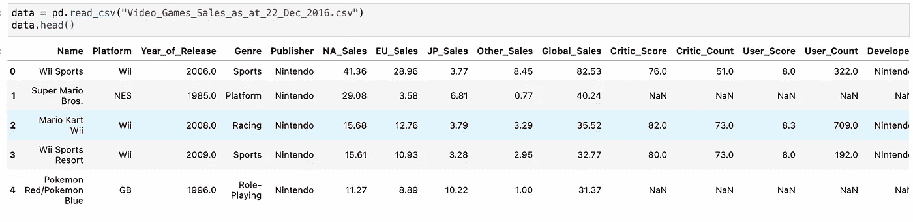

使用 pandas 可视化的第一种方法是对其系列和数据帧使用`plot`方法。它基本上是一个围绕`[**plt.plot(**](https://matplotlib.org/stable/api/_as_gen/matplotlib.axes.Axes.plot.html#matplotlib.axes.Axes.plot)).`的简单包装器

```
data.Name.value_counts().head(15).sort_values(ascending = True).plot(kind = 'barh' , figsize = (10,10))## **barh** is used for horizontal view, use **bar** for normal.
```

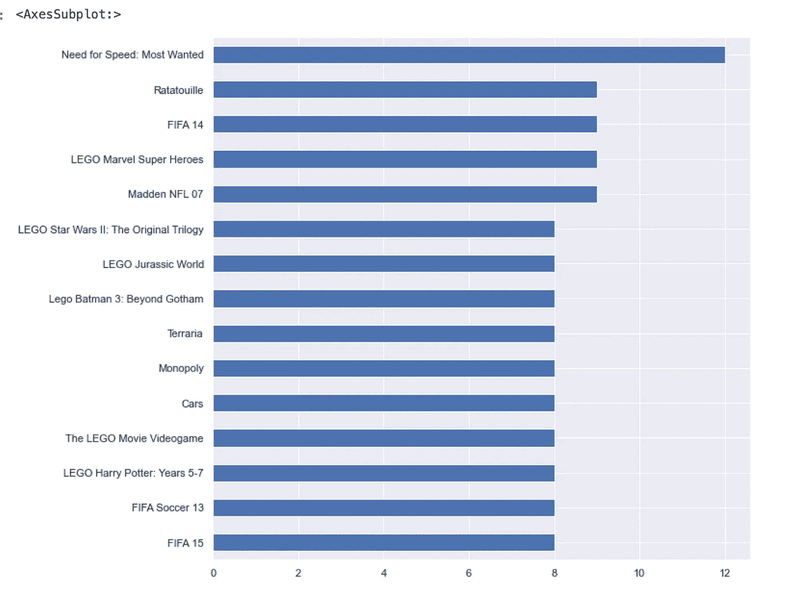

一个简单的计数图。

在上面的例子中，列 ***名称*** 是分类类型，为了绘制该数据，需要在它们周围有一些可量化的值，如列名称中的观察总数。在这里，我使用 value_counts()方法来计算名称中每个唯一类别出现的总次数。类似地，可以对任何分类列执行此操作，请注意，条形图是表示此类数据的常用方式。

```
data.groupby(['Platform' , 'Genre'] , as_index=False)[['NA_Sales', 'EU_Sales']].sum().sort_values(by = ['NA_Sales' , 'EU_Sales'], ascending = [0,0]).head(15).plot(kind = 'bar',xlabel = "Country")
```

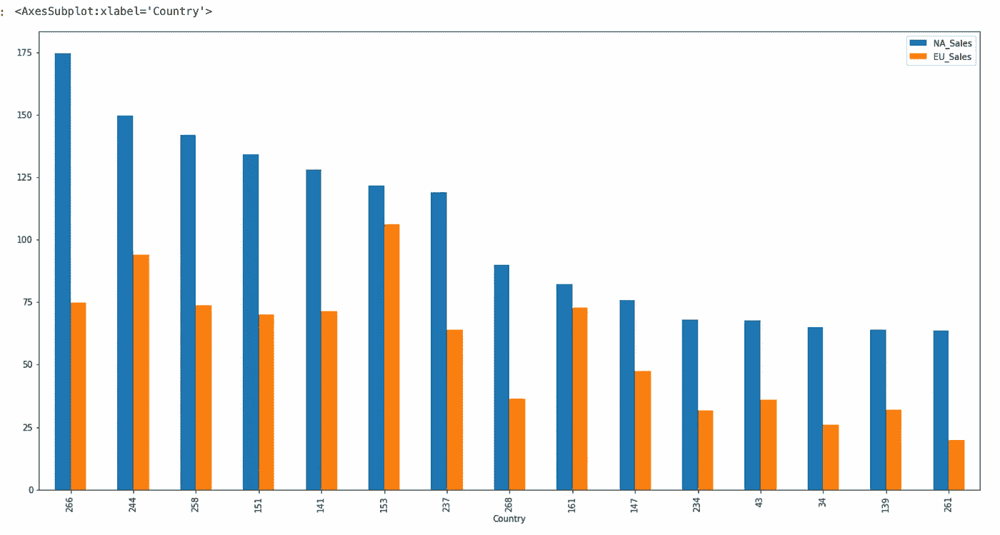

分组条形图

如果您阅读了本系列的 [*文章第 2 部分*](https://datasciencestuff.medium.com/complete-guide-to-pandas-library-python-code-part-2-4-4c0d9d9bd511) ，您将确切地知道这段代码在做什么。在这里，我们通过将两列 ***【平台】*** 和 ***流派分组来创建结果数据集的分组条形图。*** 我们围绕这些分类列的可量化值是 ***NA_sales*** 和 ***EU_sales*** 之和。
参数 *as_index* 用于将索引值转换为熊猫数据帧的列值，以便导出或简单用于绘图。

> 请记住，这里的目标是**而不是**理解该图表显示的信息，而是理解如何以及何时绘制这样的图表，因此，如果您很难解释结果，请继续关注所使用的属性和参数。

现在，我们可以从 matplotlib.pyplot 库中显式调用该函数，而不是使用 pandas 库中内置的 ***plot()*** 方法，并制作更多自定义图表。

让我们通过合并两个现有列来创建一个新特性，以理解我们的下一个图表。

```
df['NA_EU_sales'] = (df['NA_Sales'] + df['EU_Sales'])
df.head()
```

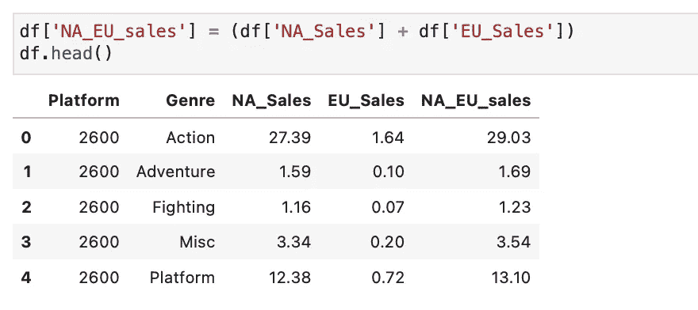

NA_EU_sales 表示北美和欧盟地区的总销售额。我们可以使用这个可量化的属性来绘制其他分类属性。

> **问题**:“所有游戏相对于北美和欧盟总销量的剧情类型”

```
plt.bar(x ='Genre' ,height='NA_EU_sales' , data=df)
plt.ylabel("Total Sales")
plt.xlabel("Platform")
plt.title("Total Sales in NA and EU by Platform")
```

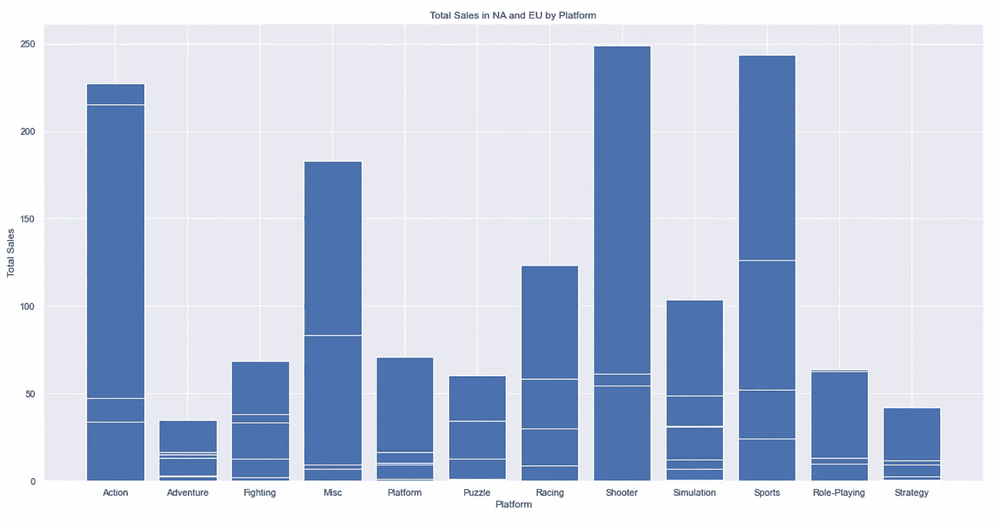

# 海生的

Seaborn 用于创建基于 matplotlib 库本身的更好的统计图，使用它的所有功能以及它自己的许多新特性。它还与 [pandas](https://pandas.pydata.org/) 数据结构紧密集成。

> 其绘图功能对包含整个数据集的数据框架和阵列进行操作，并在内部执行必要的语义映射和统计聚合，以生成信息丰富的绘图。其面向数据集的声明式 API 让您专注于绘图中不同元素的含义，而不是如何绘制它们的细节。

# 分布图

分布图对于理解数据集中属性的分布非常重要。在绘制之前，如果您有以下问题要回答，那么分布图就是前进的方向。

*   观察覆盖的范围是什么？
*   我的数据是不平衡的、偏斜的还是正态分布的？
*   数据集中有显著的异常值吗？

## 绘制单变量数据

单变量基本上意味着如果你只有一列可视化，那么下面的函数是最适合的。

```
sns.displot(data['User_Score'] , kde = True , bins = 10)
```

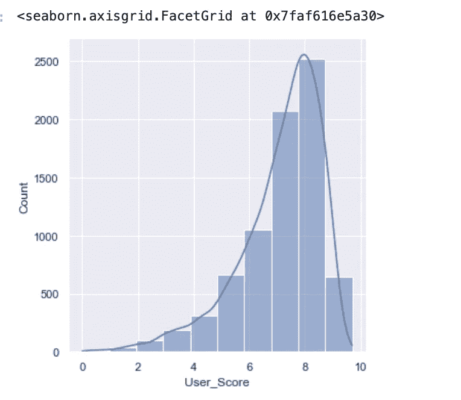

displot() / histplot()基本上是相同的，绘制横过 x 轴的直方图来显示数据的分布。在上面的图表中，我们可以看到用户的最高分是 8 分左右，然后是 7 分，这是表示快速洞察图表的最佳方式。

bin 是一个重要的参数，必须根据您对输出的直觉进行明智的设置，否则错误的 bin 值会改变整个图表的表示，例如让我们看看 bin=5 的图。

```
sns.displot(data['User_Score'] , kde = True , bins = 5)
```

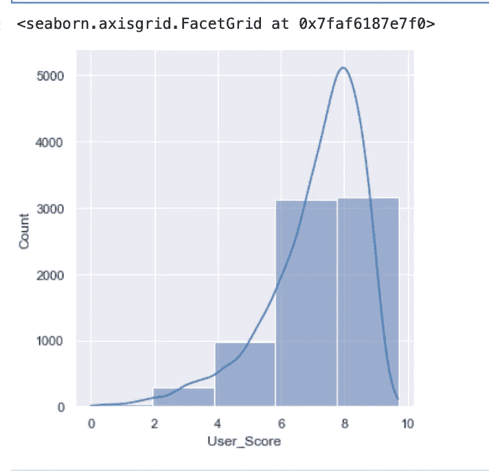

您可以清楚地看到，通过将箱数减少到 5，我们不清楚这些数据代表什么。我们可能会假设最大值在 6-10 之间，这可能会产生误导。

```
# loading new dataset withing seaborn package for better examples. df_car = sns.load_dataset("car_crashes")
df_car.head()
```

**Jointplot()**

```
sns.jointplot('total' ,'alcohol' , data = df_car , kind = 'reg')
```

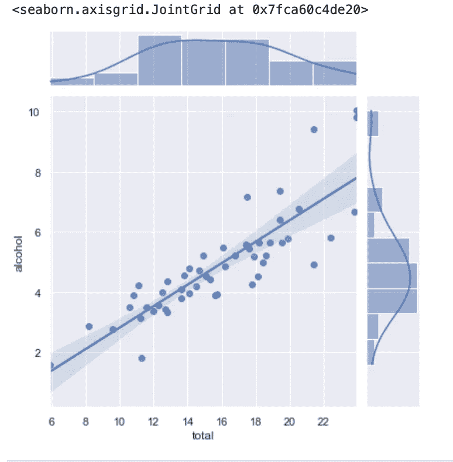

默认情况下，`[**jointplot()**](http://seaborn.pydata.org/generated/seaborn.jointplot.html#seaborn.jointplot)`使用`[**scatterplot()**](http://seaborn.pydata.org/generated/seaborn.scatterplot.html#seaborn.scatterplot)`表示二元分布，使用`[**histplot()**](http://seaborn.pydata.org/generated/seaborn.histplot.html#seaborn.histplot)`表示边际分布:

这里，如果您通过 ***kind = " reg "，*** 设置绘图类型，它会绘制一条穿过数据点的回归线，并更好地显示其中的关系。

**Pairplot()**

`[**pairplot()**](http://seaborn.pydata.org/generated/seaborn.pairplot.html#seaborn.pairplot)`函数最适合绘制数据集中每个属性之间的关系，它提供了联合分布和边缘分布的类似混合。
然而，`[**pairplot()**](http://seaborn.pydata.org/generated/seaborn.pairplot.html#seaborn.pairplot)`并不关注单一关系，而是使用“小倍数”方法来可视化数据集中所有变量的单变量分布及其所有成对关系:

```
sns.pairplot(df_car)
```

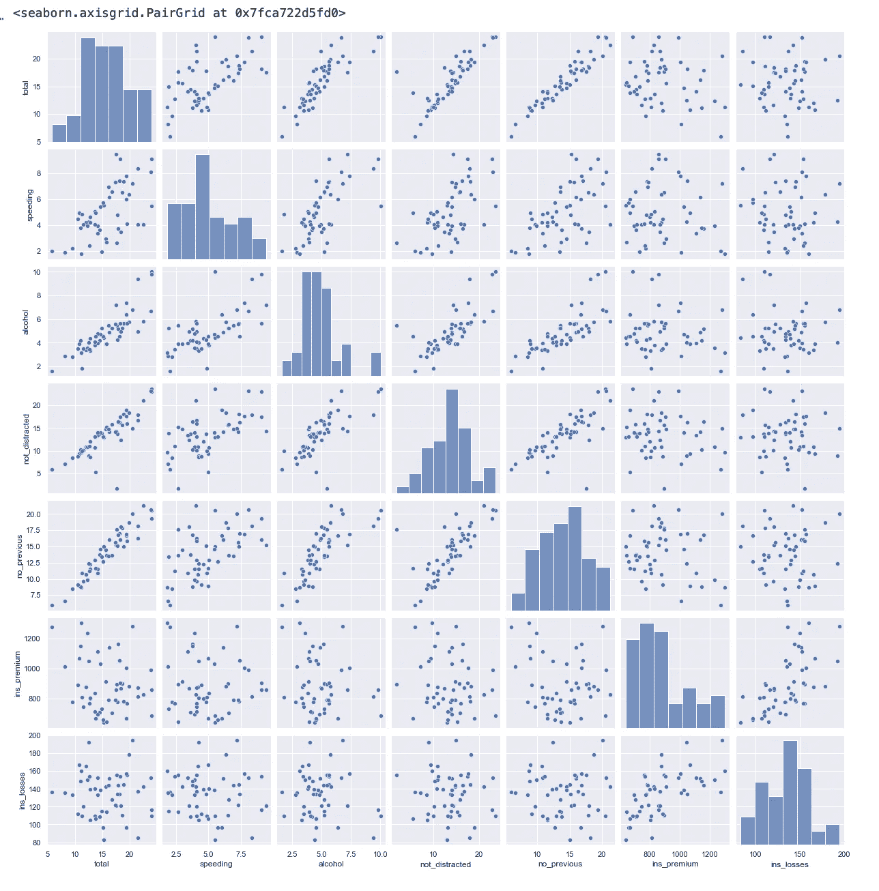

使用这个图，你可以很容易地看到，哪些属性有积极的，消极的或中性的关系。这对于理解属性之间的多重共线性也很有用。

# 分类图

好了，现在你知道了用什么来表示基于数字的数据和可视化分布，但是当你有分类值时，什么是最好的。它们自然不同于数值，因此 seaborn 有一些专用函数来最好地处理它们。

**柱状图()**

```
sns.barplot(x = 'Genre' , y = 'NA_EU_sales' , data=df , estimator= np.std)
```

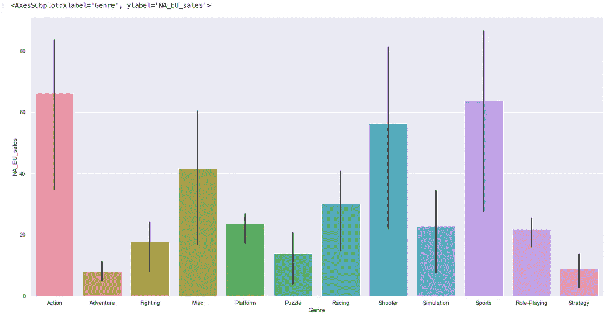

在 seaborn 中，`[**barplot()**](http://seaborn.pydata.org/generated/seaborn.barplot.html#seaborn.barplot)`函数对完整的数据集进行操作，并应用一个函数来获得估计值(默认情况下取平均值)。参数 *estimator = " np.std"* 基本上是计算标准差，您可以使用各种 out 指标，即平均值、最小值、最大值等。

**散点图()**

```
sns.scatterplot(x = 'User_Count' , y = 'User_Score' , data=data)
```

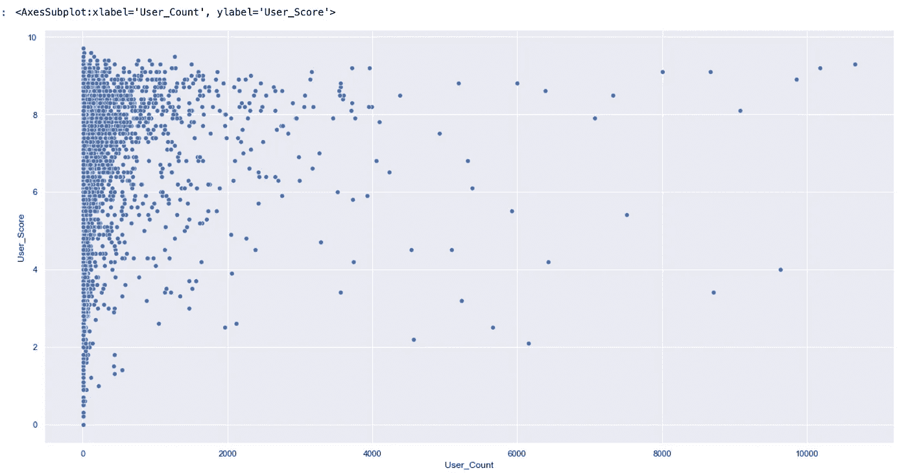

散点图在绘制多个属性之间的关系时非常有用，它显示了 2D 空间中所有数据点的分布，并使大多数数据所在的位置非常清晰。

**boxplot()**

假设您的数据集大小正在增加，您可能有大量不同的值，但您不知道如何对其进行分类。根据四分位数范围了解数据的大小对于识别数据集中的异常值非常有用，这也是箱线图最出彩的地方。

```
sns.boxplot(data= df.drop(['Year_of_Release' , 'Genre'], axis=1).head(50) , orient= 'h' ,palette="Set1")
```

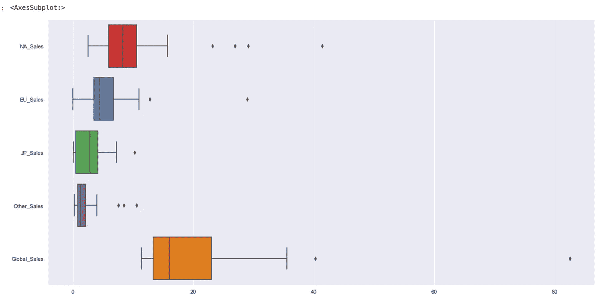

> 这种图显示了分布的三个四分位值以及极值。“触须”延伸到位于上下四分位数 1.5 IQRs 内的点，然后独立显示超出该范围的观察值。这意味着箱线图中的每个值对应于数据中的一个实际观察值。

**热图()**

```
df_car_corr = df_car.corr()
df_car_corr.head()sns.heatmap(df_car_corr , annot= True , cmap = "Blues")
```

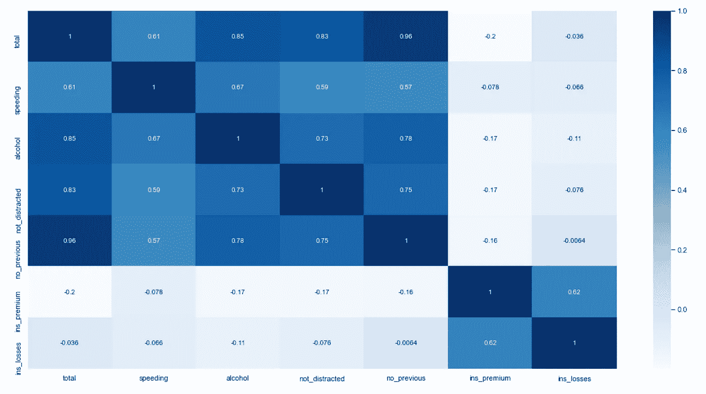

为了找到所有属性之间的相关性， *heatmap()* 是最好的代表图，显示从强到弱相关的变量。
这在机器学习过程中非常重要，你需要理解变量之间的相互关系。要解读这个图表，记住方框的阴影越深，关系越强。
*例如，我们看到 total 和 no_previous 的关联度非常高，其次是 b no _ 走神、酒精等。*

# 结论。

*   最后，请记住，这些使用 matplotlib 和 seaborn 库绘制图表的快速方法是可视化您在 EDA 中的发现并将信息转换为图形和仪表板的最佳方式。
*   此外，这些只是这里指定的几个选项，因为涵盖所有内容是不可能的，因为有太多的选项，这也是为什么每个库都有专门的文档页面。
*   本系列的第 4 部分将总结这些知识，我将分享一些关于使用 pandas 进行统计建模的信息。

## 其他文章。

*   [第 1 部分](https://datasciencestuff.medium.com/complete-guide-to-pandas-library-python-code-part-1-4-420cd5bd8249)和[第 2 部分](https://datasciencestuff.medium.com/complete-guide-to-pandas-library-python-code-part-2-4-4c0d9d9bd511)在这里链接，如果你还没有的话，请检查一下。