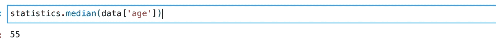
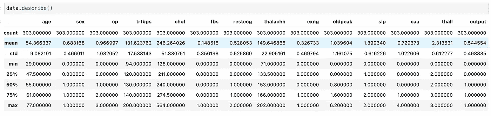

# 熊猫图书馆完整指南(Python 代码)——第 4/ 4 部分

> 原文：<https://medium.com/analytics-vidhya/complete-guide-to-pandas-library-python-code-part-4-4-4e5855dd30e2?source=collection_archive---------3----------------------->

## 基础统计学。

基本上，我们为了理解统计学而付出的所有努力只是为了让我们的数据有意义。作为数据科学项目的一部分，我们有责任在各种情况下探索和提取大量数据集的意义，这就是统计中不同的测量方法用于理解数据中的分布和变化的地方。让我们详细探讨一下这个问题。

## **索引**

1.  理解描述性分析
2.  描述性分析中的测量
3.  探索用于统计的 python 库
4.  使用图表实现可视化

# 什么是描述统计学。

[来源:](https://en.wikipedia.org/wiki/Descriptive_statistics) *A* ***描述性统计*** *是从一组信息中定量描述或概括特征的汇总统计。*


Giorgio Tomassetti 在 [Unsplash](https://unsplash.com?utm_source=medium&utm_medium=referral) 上拍摄的照片

因此，在开始时，有两个类别需要考虑，描述性统计和推断性统计。这些方法之间的区别因素是，如果您处于描述或可视化整个数据集的情况下，您可以使用数字或各种图表(如条形图、直方图、饼图或折线图等)来执行。您还可以检查整个数据集的形状，看它是对称的还是倾斜的。如果它是倾斜的，它是向左倾斜还是向右倾斜。所有这些重要的信息都属于描述统计学的范畴。

使用推断统计，您可以使用一个小样本的数据集对整个人口进行推断。为了确定基于样本推断的总体假设，我们使用概率分布来显示我们对假设的信心程度。人口普查数据的分析。

描述性统计中描述数据的常用方法有

*   **集中趋势的度量**使用*均值、中位数、众数和*
*   ***m* 可变性或分散性的度量**其中使用了*标准差(或方差)、变量的最小值和最大值、峰度和偏度。*

# 探索用于统计的 python 库

Python 自带内置的 [**统计**](https://docs.python.org/3/library/statistics.html) 库，在任何情况下都非常实用。然而，在查看了这个库中的一些基本函数之后，我们将在本文中专门探索**熊猫**来满足我们的统计需求。

让我们下载一个[数据集](https://www.kaggle.com/zhaoyingzhu/heartcsv)来练习所有这些统计函数，并使用上面提到的方法计算数值，然后实际操作。

## **集中趋势的度量**

集中趋势的**度量**是代表数据集中心点的单个值。这个值也可以称为数据集的“中心位置”。

> 均值()、中值()、众数()，

导入必要的库并加载数据集。

```
import pandas as pd
import statisticsdata = pd.read_csv("heart.csv" , sep= ',')
data.head()
```


最常用的集中趋势度量是平均值。它只不过是值的平均值，只有当我们的数据在本质上相当对称时，取数据集的平均值才是明智的。如果我们的数据集是倾斜的或者有一些严重的异常值(极端值)，那么使用平均值不是最明智的选择。

> 患有心脏病的人的平均年龄是多少？

```
# using Statistics library, we can use mean()statistics.mean(data['age'])
```


> 数据集中年龄列的中间值是多少？

为了回答这个问题，我们将使用称为 median()的第二个度量，这将返回整个数据集的中间值，如果数据集有偏差或有异常值，这将是最佳选择。



> 在我们的数据集中，哪个性别的人更多，最常见的年龄是多少？

嗯，这种类型的问题非常有趣，可以看到并理解数据集本身的分布，但是 **mode() i** s 主要用于分类值，因为它返回数据集中出现频率最高的值。假设您想了解数据是如何按性别分布的，mode 将是一个不错的选择。

```
data.age.value_counts().head(2)data.sex.value_counts().head(2)
```


正如你所看到的，如果你因为任何原因不能访问任何其他库，那么统计库在获取这些信息方面是非常有用的。

## 使用熊猫的统计

现在让我们看看如何使用 Pandas 库获得所有这些值。

在 Pandas 中，有几个建立在 [numpy](https://numpy.org/) 库之上的方法，这使得对数值和分类值进行统计分析变得非常简单。Pandas 通常使用两种类型的数据结构，称为 dataframe 和 series，在它们之上，您可以直接应用每个函数。

> 描述()

到目前为止，这是 pandas 中最有帮助的功能，可以一目了然地查看几乎每个重要的统计值。默认情况下，该功能仅给出**数值的统计汇总。**
对于分类，可以通过(include = ' object ')参数显式指定。

```
#for numerical by default
data.describe()#for categorical
data.describe(include = ‘object’)
```



该摘要包含以下结果:

*   `**Count**` **:** 列中值的总数。
*   `**Mean**` **:** 各列的平均值
*   `**std**` **:** 标准差
*   `**min**`**`**max**`**:**最小值和最大值**
*   **`**25%**` **、** `**50%**` **和** `**75%**` **:** 在该百分位下收集的值的数量**

**此外，假设您不希望对整个数据集应用 describe 函数，也可以通过使用 filter 方法对特定列应用 describe 函数。**

```
data[['age' , 'sex' , 'cp']].describe()
```

****

# **可视化数据**

**我们在 python 中有 **matplotlib** 和 **seaborn** 库用于可视化目的，这是非常广泛使用的，在这个例子中，我们将主要探索 seaborn，因为与 matplotlib 相比，它简单得多，在美学上也很漂亮。**

## **条形图**

**理想情况下用于显示分类标签或离散数值，并使用条形图显示频率详细信息。条形图还允许将数据集中各种类别的多个条形图并排或上下堆叠。**

```
import seaborn as sns
import matplotlib.pyplot as plt
sns.set_theme(style="whitegrid")# Initialize the matplotlib figure
f, ax = plt.subplots(figsize=(8, 8))sns.barplot(x="cp", y="age", data=data,
             color="b")
plt.title("Bar plot using SNS")
plt.xlabel("Chest Pain Value")
plt.ylabel("Age Range")
```

****

**图片来自作者**

## **箱线图**

```
# Initialize the matplotlib figure
f, ax = plt.subplots(figsize=(8, 8))sns.boxplot(x="cp", y="age",
            hue="sex", palette=["m", "g"],
            data=data)
sns.despine(offset=10, trim=True)
plt.title("Box plot usiong SNS")
plt.xlabel("Chest Pain Value")
plt.ylabel("Age Range")
```

****

**图片来自作者**

**为了从统计学角度理解和解释箱线图，请阅读以下要点。**

*   **盒子中间的线叫中线。
    当你的数据没有规格化，容易出现离群值的时候更有用。**
*   **pandas.describe()方法中的每一个统计细节都可以在这里看到，
    盒子的下端是 25%的四分位数，盒子的顶部是 75%的四分位数，这仅仅意味着 75%的数据点都包含在这个范围内。**
*   **你看到的顶端和底端是数据集中的最小值和最大值。**
*   **如果盒子的形状很小，这意味着我们的数据方差更小或者值更小**
*   **如果方框很大，这意味着数据点的数值很高，分布很广。**
*   **中线的位置可以说明大部分数据是位于较低端还是较高端，或者如果在中间则呈正态分布。**

## **散点图**

```
import seaborn as sns
import matplotlib.pyplot as pltf, ax = plt.subplots(figsize=(6.5, 6.5))
sns.despine(f, left=True, bottom=True)
sns.scatterplot(x="age", y="chol",
                hue="sex",
                sizes=(1, 8), linewidth=0,
                data=data, ax=ax )plt.title("Scatter plot to show relationship")
plt.xlabel("age")
plt.ylabel("Cholestrol level Range")
```

****

**图片来自作者**

**散点图非常有助于我们理解两个变量之间的关系，并获得统计值来证明它们。在这里，我们看到年龄和胆固醇水平这两个变量之间确实存在某种关系。**

**乍看之下，我们可以说这是一种正相关关系，这意味着随着年龄的增长，人们的胆固醇水平也会增加。**

****Rel 剧情****

```
sns.relplot(x="age", y="chol", size="cp", sizes=(15, 200), data=data);
```

****

**图片来自作者**

## ****热图****

**这可能是同时表示多个变量之间的关系和相关性的最佳图表。如果您正在处理具有许多数字列的数据集，并且需要了解用于机器学习建模的变量的共线性，这将特别有帮助。**

**示例和数据集直接来自 Seaborn 包。**

```
import matplotlib.pyplot as plt
import seaborn as sns
sns.set_theme()# Load the example flights dataset and convert to long-form
flights_long = sns.load_dataset("flights")
flights = flights_long.pivot("month", "year", "passengers")# Draw a heatmap with the numeric values in each cell
f, ax = plt.subplots(figsize=(9, 6))
sns.heatmap(flights, annot=True, fmt="d", linewidths=.5, ax=ax)
```

****

**图片来自作者**

# **结论**

****

**[Tetiana SHYSHKINA](https://unsplash.com/@shyshkina?utm_source=medium&utm_medium=referral) 在 [Unsplash](https://unsplash.com?utm_source=medium&utm_medium=referral) 上拍摄的照片**

**尽管统计分析是一个非常广泛的主题，并且执行它们的方法取决于数据集的类型，但是我希望上面的文章和我们讨论的内容能够对开始有所帮助。**

**我自己也在进一步学习和探索这些方法，以便更好地理解和掌握统计概念。**

**我希望你喜欢这个熊猫指南的 4 部分系列文章。在此之后阅读其他的，链接附在下面。**

# **其他文章。**

*   **[第 1 部分](/analytics-vidhya/complete-guide-to-pandas-library-python-code-part-1-4-420cd5bd8249)、[第 2 部分](https://datasciencestuff.medium.com/complete-guide-to-pandas-library-python-code-part-2-4-4c0d9d9bd511)和[第 3 部分](https://datasciencestuff.medium.com/complete-guide-to-pandas-library-python-code-part-3-4-6bc11f9465d0)在此链接，如果您还没有查看，请务必查看。**