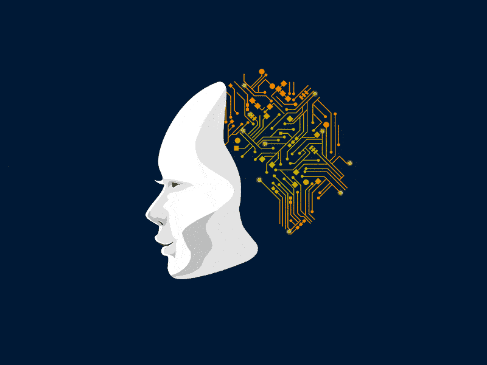
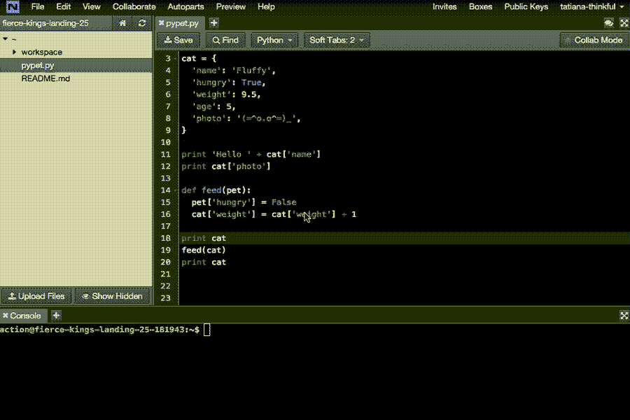
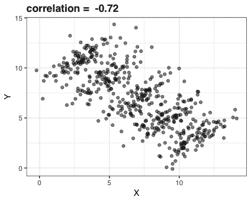
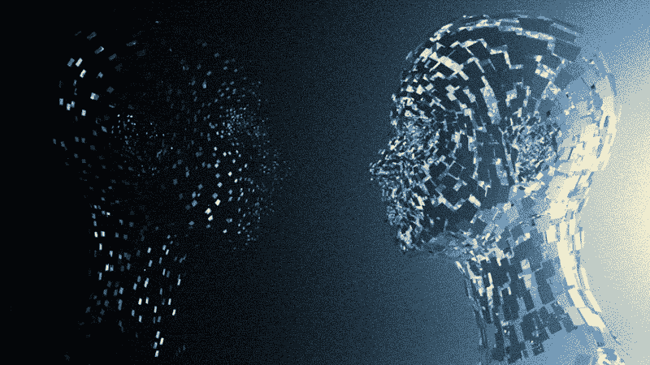
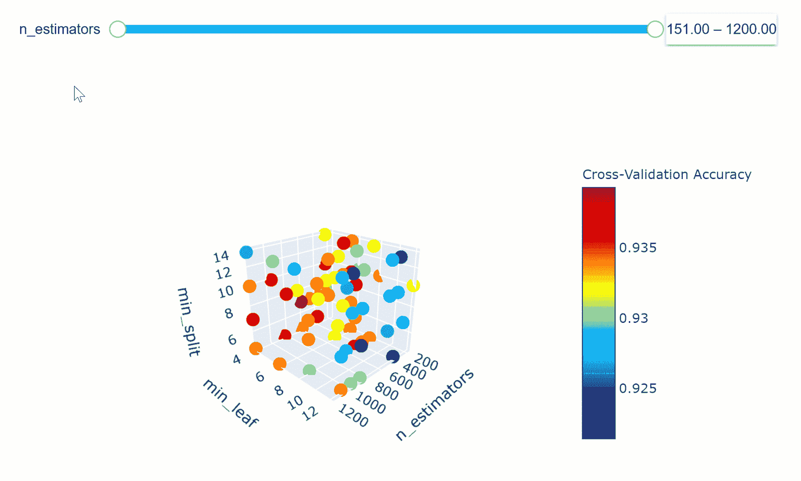
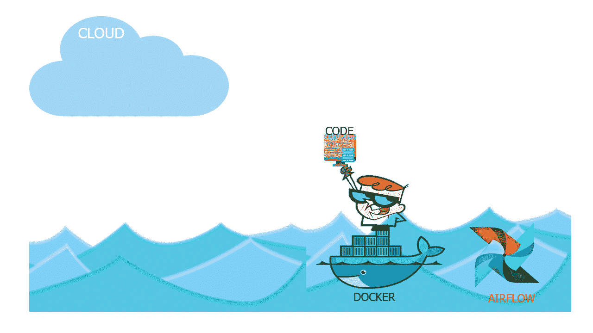
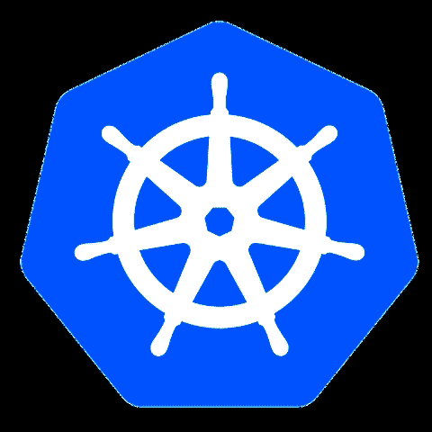

# 数据科学和人工智能的完整机器学习路线图

> 原文：<https://medium.com/analytics-vidhya/complete-machine-learning-roadmap-for-data-science-and-ai-b760db8738c5?source=collection_archive---------3----------------------->

在这个小博客中，我将涵盖从初学者到高级水平掌握机器学习的完整路线图。

众所周知，**机器学习**，**数据科学**，**人工智能**是时下的热门话题，但很少有人用简单的方式告诉你涵盖或学习一件事情的确切路径。

所以这就是为什么我涵盖了成为机器学习专家的所有途径。所以让我们开始吧。

你首先应该学习的是 python 你已经很好的掌握了**python**编程。

然后完成 **python** 学习 **EDA**

**探索性数据分析**

**探索性数据** **分析**是一种对数据集进行**分析以总结其主要特征的方法，通常采用**统计图形**和其他数据**可视化**的方法。我们可以说，这是一种以更有效的方式分析**或**可视化**数据的技术，从而使**更有意义。**

现在来看**特色工程**

**特色工程:**

**特征工程**是利用领域知识通过数据挖掘技术从原始数据中提取特征的过程。这些特征可以用来提高机器学习算法的性能。

在特征工程中你应该学习技术是:

1.  **处理缺失值**
2.  **处理异常值**
3.  **分类编码**
4.  **规范化和标准化**

现在进入**功能选择**

**功能选择:**

在**机器学习**和**统计中，** **特征选择**，也称为变量选择、属性选择或变量子集选择，是选择相关**特征**的子集用于模型构建的过程。简单地说，我们可以为我们的**机器学习模型**选择正确的特性。

您将在**特征选择**中涉及的主题是:

1.  **相关性**
2.  **正向淘汰**或**反向淘汰**
3.  **单变量选择**
4.  **随机森林重要性**
5.  **用决策树进行特征选择**

完成所有这些事情后，来到**机器学习**部分

**机器学习:**

**机器学习**是对通过经验和使用数据自动改进的计算机算法的研究。它被视为**人工智能的一部分。**

在**机器学习**中，我们必须解决两个问题，要么是**分类**要么是**回归问题**和**聚类。**

您将在**机器学习**中涉及的算法有:

1.  **线性回归**
2.  **山脊和套索回归**
3.  **逻辑回归**
4.  **决策树**
5.  **随机森林**
6.  **XGboost**
7.  **Adaboost**
8.  **梯度推进**
9.  **Catboost**
10.  **灯-Gbm**

对于**聚类**，你要学习下面的**算法:**

1.  **k 均值聚类**
2.  **层次聚类**
3.  **数据库扫描聚类**
4.  **剪影聚类**

现在来看**超参数调谐**

**超参数调谐:**

在**机器学习**中，**超参数优化**或者**调优**就是为一个**学习**算法选择一组最优**超参数**的问题。**超参数**是一个参数，其值用于控制**学习**过程。相比之下，其他参数(通常是节点权重)的值是学习来的。

在**超参数调谐**中学习**和**的技巧

1.  网格搜索-cv
2.  随机搜索-cv
3.  远视
4.  奥普图纳
5.  遗传算法

学习完所有这些技术后，现在是时候做一些真正的**项目**，然后在 **Docker** 和 **Kubernetes 的帮助下将这些**项目**容器化。**

**Docker :**

**Docker** 是一套平台即服务产品，使用操作系统级虚拟化来交付称为容器的软件包中的软件。容器是相互隔离的，捆绑了它们自己的软件、库和配置文件；他们可以通过明确定义的渠道相互交流。

**库伯内斯:**

**Kubernetes** 是一个开源的容器编排系统，用于自动化计算机应用**部署**、**扩展**和**管理**。它最初由**谷歌**设计，现在由**云原生计算**基金会维护。

然后学习**部署**技术如何**在云服务上部署**一个 **ml** 项目**比如:**

1.  **AWS**
2.  **天蓝色**
3.  **GCP**

这是从始至终通向**主机器学习**的完整路径，希望这篇小文章能帮助你实现你的目标。

祝你好运。