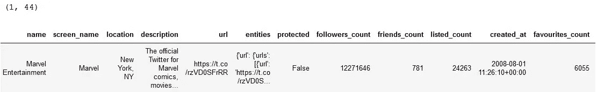
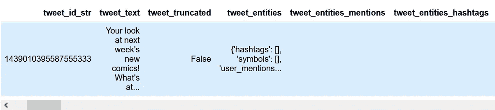
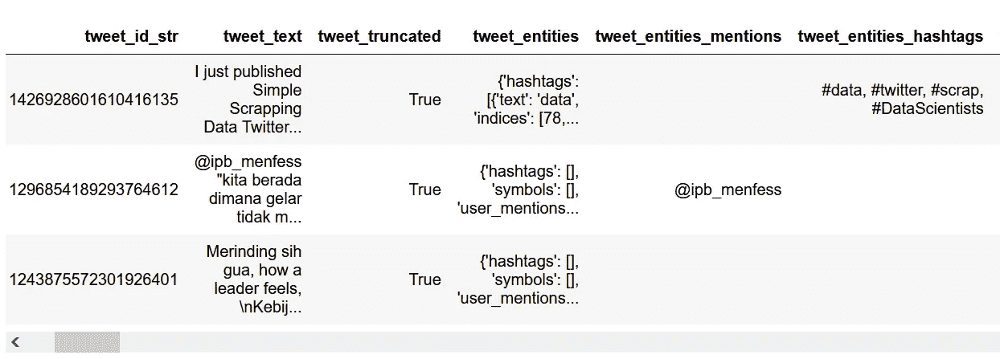
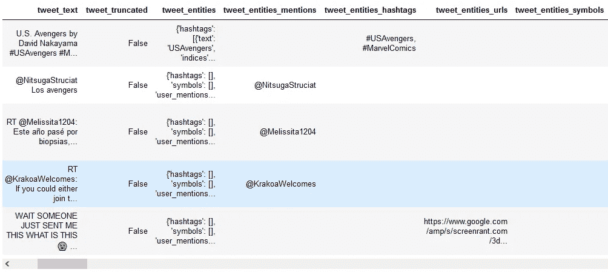

# 完全废弃 Twitter 数据(系列 Twitter 数据)

> 原文：<https://medium.com/analytics-vidhya/complete-scrapping-of-twitter-data-series-twitter-data-9d984bccab37?source=collection_archive---------0----------------------->


内容列表:
**介绍
效益
准备报废
报废数据**
**A .数据基于屏幕名称**
— 1。获取用户查找
— 2。获取用户时间线
— 3。获取收藏夹
— 4。获取关注者
— 5。获取关注/好友
**B .基于 TWITTER 帖子**
— 1 的数据。获取发布查询
— 2。获取用户转发的帖子
**C .基于自己账号的数据**
— 1。回家时间表
— 2。被转发
— 3。获取提到的
**D .基于列表**
— 1 的数据。获取列表帖子
— 2。获取订户列表
— 3。获取列表订阅
— 4。获取成员列表
**D .另一个数据**
— 1。获取热门推特
—2。获取搜索用户
— 3。获取搜索

# **简介**

我们都知道 Twitter 是一个很大的社交媒体。我们周围的许多人，好朋友、朋友、家人、艺术家、运动员、公司都使用 Twitter。你知道吗？使用 Twitter API，我们可以检索 Twitter 帐户上的许多信息，如发布时间、点赞数、转发数、关注数、描述和许多其他信息。在本节中，我们将只讨论可以从某人的 Twitter 帐户中获取哪些数据。也许在下一篇文章中，我们会讨论可视化、情感、网络和其他东西。

# **效益**

废弃 Twitter 账户数据的好处是什么，其中一个好处是我们可以利用数据看到某人的习惯模式、某人的推文情绪、某人的网络，以及我们可以从数据中提取的许多见解？

# **准备刮削**

我们将使用的工具是 python 笔记本，要访问 python 笔记本，可以使用本地计算机通过下载“Jupyter Notebook”或“Anaconda”来访问，其中已经有一个 Jupyter 笔记本。也可以像 google collab 或者 Kaggle notebook 一样使用云端。

> 谷歌合作:[https://colab.research.google.com/](https://colab.research.google.com/)
> 
> 卡格尔笔记本:[https://www.kaggle.com/code](https://www.kaggle.com/code)

在检索和分析第一批数据之前，有必要安装几个软件包，这次报废使用的主要软件包是**广告工具**。有关完整的文档，请参考以下链接:

 [## 广告工具- Python

### 作为一名在线营销人员，使用 Python 包来帮助实现许多重要任务的自动化，从而提高工作效率。

广告工具. readthedocs.io](https://advertools.readthedocs.io/en/master/) 

我们来编码，先安装一些包:

```
!pip install pandas 
!pip install numpy
!pip install advertools 
```

注意:安装可以在控制台和笔记本上完成，如果您在安装时使用控制台，请不要使用“！”写代码之前。接下来，导入上面的每个包:

```
import pandas as pd 
import numpy as np 
import advertools as adv
```

此外，对于报废流程，还需要访问 Twitter API 密钥，您可以在文档中找到它

[https://developer.twitter.com/en/docs/twitter-api](https://developer.twitter.com/en/docs/twitter-api)

或者你也可以在 youtube 或其他文章中看到一些教程，以获得更详细的步骤。如果你在获取 Twitter API 密匙时遇到困难，你可以通过访问下面的链接暂时使用我的 Twitter API 密匙

[](https://drive.google.com/file/d/19RPjWjbW-3ztVEelKAtc5RZzgWmXmNej/view?usp=sharing) [## 认识 Google Drive -一个存放所有文件的地方

### Google Drive 是一种免费的文件备份方式，可以从任何手机、平板电脑或电脑上轻松访问。开始…

drive.google.com](https://drive.google.com/file/d/19RPjWjbW-3ztVEelKAtc5RZzgWmXmNej/view?usp=sharing) 

```
auth_params = {
'app_key': "xxxxxxxxxxxxxxxxxxxxxxxx",
'app_secret': "xxxxxxxxxxxxxxxxxxxxxxxxxxxxxxxxxxxxxxxxxxxxxxxxxx" ,
'oauth_token': "xxxxxxxxxxxxxxxxxx-xxxxxxxxxxxxxxxxxxxxxxxxxxxxx",
'oauth_token_secret':"xxxxxxxxxxxxxxxxxxxxxxxxxxxxxxxxxxxxxxxx",
}
adv.twitter.set_auth_params(**auth_params)
```

# 废弃数据

## **A .基于屏幕名称的数据**

我们可以从已知的 twitter 账户中分析和检索数据。像来自奇迹，足球俱乐部，篮球俱乐部，前任，女朋友，朋友，只要我们知道他们的用户名。


对于上面的例子，“漫威娱乐”是“推特名称”，而“@漫威”是“屏幕名称”。报废流程需要的参数是“网名”，即“@漫威”。此外，从这些关键参数中可以分析出一些数据:

## **1。获取用户查询**


用户查找包含用户的描述，例如姓名、屏幕名称、位置、描述、URL、关注者总数、朋友总数、列表者总数、已创建的总状态、已喜欢的总状态等。其中本次收集数据得到 44 列/变量。开始编码。

```
lookup_user = adv.twitter.lookup_user(screen_name = 'Marvel')
print(lookup_user.shape)
lookup_user.head()
```



除了能够指定 screen_name 参数之外，还有几个参数用于自定义捕获的数据，以下参数是 include_entities、trim_user、map、include_exl_alt_text、include_card_uri 和 tweet_mode。

## 2.获取用户时间线


用户时间线是用户发布的推文，可以是推文本身、回复或转发的形式。使用的主要参数有几个，分别是**【用户名】**和**【计数】**。计数是我们将获取用户数据的推文数量。我们获得了几个列/变量，即发布推文的时间、**全文推文、用户名、提及次数、标签、收藏总数、转发总数、用户描述和其他**。本次报废共获得 **75 列/变量**。

```
timeline = adv.twitter.get_user_timeline(screen_name='Marvel',count=100)
print(timeline.shape)
timeline.head()
```


除了能够指定 screen_name 和 count 参数之外，还有几个参数用于定制所获取的数据，以下参数是 user_id、since_id、max_id、trim_user、exclude_replies、include_rts 和 tweet_mode。

## 3.获取收藏夹


如上图，获取用户收藏夹就是获取用户喜欢的推文，或者回复。对于参数变量和变量的获取与报废获取用户时间线相同。

```
get_favorites = adv.twitter.get_favorites(screen_name='Marvel', count=100)
print(get_favorites.shape)
get_favorites.head(3)
```


## 4.获得关注者


除了能够以 tweets 的形式检索数据，我们还可以以**用户信息**的形式检索数据，其中之一是 Twitter 关注者的用户信息。这里有两个废料:

*   **报废 id 追随者**，在数据检索中，只有 id，才能在相对较快的时间内检索到相对大量的数据。一个请求中生成的数据量是 5000 个数据。我们可以根据需要提出几个要求。但是，缺点是我们无法获得详细的用户屏幕名称信息。所需的主要参数是 screen_name，其他一些参数是 cursor、stringifiy_ids 和 count。

```
get_followers_ids = adv.twitter.get_followers_ids( screen_name="Marvel", count = 10000)print(len(get_followers_ids['ids']))
get_followers_ids
```

**输出:**
1000
{ ' previous _ cursor ':0，
' next _ cursor ':1710813885960930399，
' ids ':【1437949410021978117，
1437948541901713409，
14379479054200588

*   **废弃用户描述关注者，**在收集这些数据的过程中，我们得到了完整的数据，即*姓名、昵称、位置、描述、关注者数、好友数、列表数、其他*。然而，这种废弃的缺点是与废弃 id 相比，数据量相对较小，在 1 x 请求中获得的数据量是 100 个数据。这次报废使用的主要参数是 screen_name 和 count，一些附加参数是 user_id、cursor、skip_status、include_user_entities。获得的变量或列数据的数量是 48 列。

```
get_followers_list = adv.twitter.get_followers_list(screen_name= "Marvel" , count=100)
print(get_followers_list.shape)
get_followers_list.head()
```


## 5.获得关注/朋友


Get friend 就是检索下面用户的数据。如上图。这次报废得到的参数和变量和得到追随者是一样的。有 2 个骗局。

*   **报废 id 跟随**

```
get_friends_ids = adv.twitter.get_friends_ids( screen_name="Marvel", count =10000 )
print(len(get_friends_ids['ids']))
get_friends_ids
```

output:
781
{ ' previous _ cursor ':0，
'next_cursor': -1，
' ids ':【155709853，
1152753054782910464，
108670918487437217，
2401098489，
114897921

*   **报废用户描述关注者**

```
get_friends_list = adv.twitter.get_followers_list(screen_name= “Marvel” , count=200)
print(get_friends_list.shape)
get_friends_list.head(3)
```


## **B .基于推特帖子的数据**

通过获取一些信息，如时间线、喜欢、关注者、关注和查找，基于用户名分析 Twitter 之后。接下来，我们将基于 Twitter 帖子来分析 Twitter。我们可以使用之前废弃的 tweet_id 列中的数据访问 web 上的 Twitter 帖子。举个例子:

如果你有 tweet_id: 1426928601610416135。

因此，要访问 tweet，只需在以下 URL 中添加 tweet_id 即可

[https://twitter.com/anyuser/status/<tweet _ id>](https://twitter.com/anyuser/status/<tweet)

例句:https://twitter.com/anyuser/status/1438874044107948039

输出:


上面是使用 tweet_id 访问 Twitter 的 URL。接下来，让我们放弃一些从 Twitter 帖子实体获得的信息:

## 1.获取发布查找

通过了解 tweet_id，我们可以获得 tweet 的描述，例如 tweet_full_text、谁提到了、我使用了什么标签、转发次数、赞数、回复数等等。在这次废弃中，我们将得到 72 列。

```
lookup_status = adv.twitter.lookup_status(id = 1439010395587555333 )
print(lookup_status.shape)
lookup_status
```



## 2.获取用户转发的帖子

此外，我们还可以从我们拥有的 tweet_id 中抓取转发数据，即关于转发我们帖子的用户的信息，这些数据以两种类型的形式呈现，即 tweet_id 和用户描述列表。从概念上讲，基于 tweet_id 取消转发与基于用户名取消关注者是一样的。

*   **报废 id 转发**

```
retweet_id = adv.twitter.get_retweeters_ids(id=1439010395587555333)
print(len(retweet_id['ids']))
retweet_id
```

输出:
{'previous_cursor': 0，
'next_cursor': 0，
'ids': [816170048，
391409829，
1066800427423944705，
105450337651441217，
870775262694318080，

*   **报废用户描述转发者**

```
retweet = adv.twitter.get_retweets(id =1439010395587555333)
print(retweet.shape)
retweet.head(3)
```


## **C .基于自有账户的数据**

在 Twitter 上，我们也基于自己的帐户检索数据，我们的 scrapper 帐户由我们用来访问 Twitter API 密钥的开发人员帐户决定，如果您使用我的开发人员 API 密钥，那么将检索的数据就是我的数据。如果你想检索关于你自己的数据，你需要有你自己的开发者帐号，并使用你自己的 API 密匙。

## 1.获取主页时间表

这种报废是一种独特的报废，与其他类型的报废不同，因为每次报废都会根据我们在 Twitter 应用程序上的时间轴视图产生不同的数据。


```
home_timeline = adv.twitter.get_home_timeline()
print(home_timeline.shape)
home_timeline.head(3)
```


## 2.被转发

这是我的帖子数据，被其他人转发，记住不是我转发的状态。但是我的状态被另一个用户转发了。

```
retweet_ofme = adv.twitter.retweeted_of_me(count = 100 )
print(retweet_ofme.shape)
retweet_ofme.head()
```



## 3.被提及

提及时间线是必须提及我的推文数据。无论是推文，回复，还是转发引用。

```
mention_timeline = adv.twitter.get_mentions_timeline(count=100)
print(mention_timeline.shape)
mention_timeline.head()
```


## **D .基于列表的数据**

Twitter 列表允许您定制、组织和优先排序您在时间线中看到的推文。你可以选择加入其他人在 Twitter 上创建的列表，或者从你自己的帐户，你可以选择按组、主题或兴趣创建其他帐户的列表。查看列表时间线会向您显示来自该列表上的帐户的推文流。您还可以将您最喜爱的列表钉在您的家庭时间表的顶部，这样您就不会错过对您来说最重要的帐户的任何一条推文。

如何发现列表？在 iOS 和 Android 应用程序的 Twitter 主页时间线中，你可能会看到提示**发现新列表**。如果我们向您推荐您感兴趣的列表，只需点击**跟随**。在提示中，您也可以点击**显示更多**来浏览我们的列表发现页面。在那里，我们会向您显示更多我们认为您可能会关注的列表，您可以在页面顶部的搜索框中搜索其他列表。

我们还将向您展示您在家庭时间轴中关注的列表中的热门推文。


我们可以丢弃的下一个数据是一个列表。我们可以根据列表扫描一些数据。有两个主要参数可以用于废弃列表，即 id_list 和 user_name list。


id_list 可以在 Twitter 列表 URL 上找到，上图中 id_list 是 1296872799932473345，用户名 list 是@LearnedVector。知道这两个参数后，让我们编码。

## 1.获取列表帖子


抓取列表的状态。要使用的参数是 list_id。

```
list_statuses = adv.twitter.get_list_statuses(list_id=1214912982846590976)
print(list_statuses.shape)
list_statuses.head(3)
```


## 2.获取订户列表

```
list_subscribers = adv.twitter.get_list_subscribers(list_id =1214912982846590976)
print(list_subscribers.shape)
list_subscribers.head(3)
```


## 3.获取列表订阅

```
list_subscriptions = adv.twitter.get_list_subscriptions(user_id = 'benthecoder1')
print(list_subscriptions.shape)
list_subscriptions.head()
```


## 4.获取成员列表

```
list_members = adv.twitter.get_list_members(list_id=1214912982846590976)
print(list_members.shape)
list_members.head()
```


## **E .另一个数据**

## 1.获取热门 Twitter

趋势 twitter 在互联网上被广泛提及或讨论，尤其是在社交媒体 Twitter 上。每个地方都有不同的流行主题，每个国家和地区都有自己的流行趋势。因此，在我们删除 Twitter 趋势数据之前，我们必须确定我们将删除哪个区域以及该区域的 id。因此，让我们通过下面的代码来检查数据列表。

```
available = adv.twitter.get_available_trends()
print(available.shape)
available
```


有 8 列和 467 行，这 467 行包含全世界每个国家或某个地区的趋势位置。对于这次废弃，我们将废弃 id 为 23424846 的印度尼西亚国家数据。


```
trend = adv.twitter.get_place_trends(ids = 23424846 )
print(trend.shape)
trend
```


获得了 50 个热门趋势，以及几个包含趋势、位置、tweet_volume、local__rank 等的列。

## 2.获取搜索用户

搜索用户允许我们检索用户的搜索数据。例如，如果我们搜索“marvel ”,将会生成几个与“marvel”相关的帐户，如下所示:


```
search_user = adv.twitter.search_users(q = 'marvel', count=100)
print(search_user.shape)
search_user.head(3)
```


## 3.获取搜索

搜索方法将生成与生成的关键字相关的 tweets。

```
df = adv.twitter.search(q = "avengers", count = 100)
print(df.shape)
df.head()
```



关于搜索报废的详细推文可以在我的一篇文章中看到:

[](/analytics-vidhya/simple-scrapping-data-twitter-part-1-series-twitter-data-7a096c906103) [## 简单报废数据 Twitter(系列 Twitter 数据)

### Twitter 是一个免费的社交网络微博服务，允许注册会员发布简短的帖子…

medium.com](/analytics-vidhya/simple-scrapping-data-twitter-part-1-series-twitter-data-7a096c906103) 

感谢您阅读这篇文章。希望这篇文章能对数据开发有所帮助。别忘了跟着并给予很多掌声。下次见。

来源:

[https://广告工具. readthedocs . io/en/master/广告工具. twitter.html](https://advertools.readthedocs.io/en/master/advertools.twitter.html)