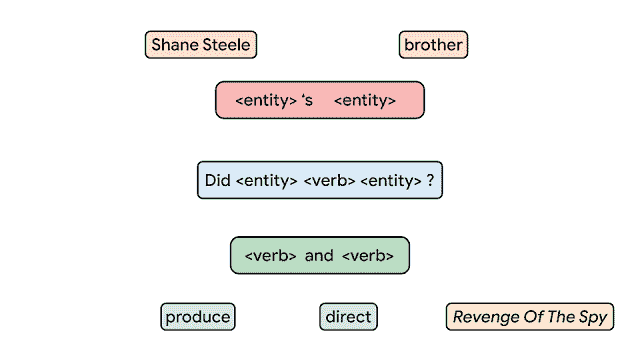
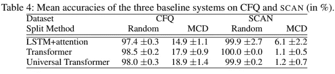
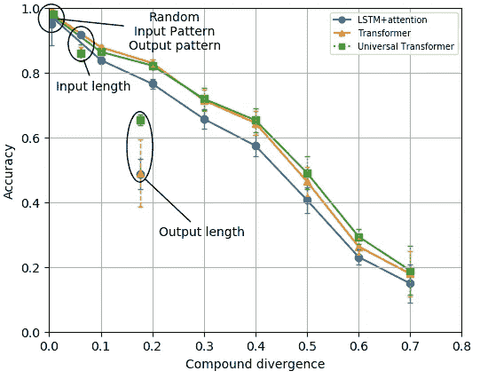
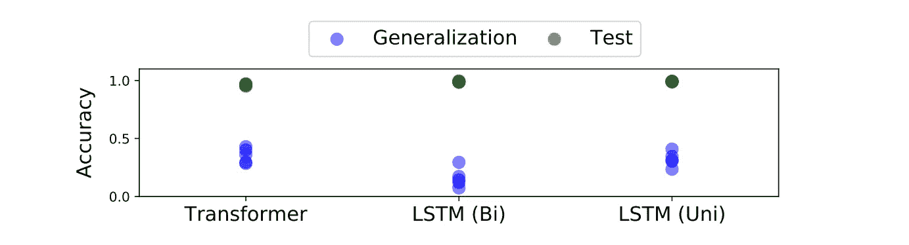
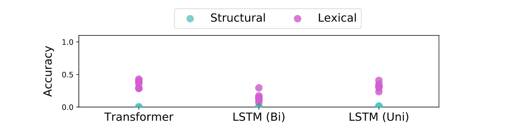

# 语义解析中的组合泛化:数据集

> 原文：<https://medium.com/analytics-vidhya/compositional-generalization-in-semantic-parsing-datasets-ff4ae4af5a3c?source=collection_archive---------8----------------------->

# 成分概括🤔

如果你告诉一个人🦓是一只斑马🐴是一匹马，然后展示一些用“马”的句子(例如“马是哺乳动物。”以及“一匹马有几条腿？”)人类也将能够立即理解类似的句子，并就马提出类似的问题。这是人类归纳以前看到的元素和结构的新组合的能力的一个例子，这被称为“组合归纳”。

虽然人类认为这是理所当然的，但不确定我们的 NLP 模型是否拥有同样的能力(剧透:根据下面列出的许多论文，它们在这方面相当糟糕)。

测量组合泛化并不容易，需要在所用数据集及其训练/测试分割的设计中仔细考虑。然而，由于一些(最近的)令人敬畏的工作，我们在这个问题上看到了更多的进展，希望有更多的进展。

下面我们将看看一些现有的数据集。

# 扫描(“没有系统性的概括”)

(ICML 莱克和巴罗尼，2018 年)

论文:[https://arxiv.org/pdf/1711.00350.pdf](https://arxiv.org/pdf/1711.00350.pdf)

这是第一个指出现有语义解析模型不善于归纳已经观察到的元素的新组合的研究。虽然使用的数据很简单，但这篇论文指出了当前系统中一个非常有趣的问题。出版后，这项工作激发了几个高质量的作品，提出了不同的问题解决方案，我们希望在未来涵盖。

在这项工作中，创建了一个由单词序列和简单指令序列(例如 JUMP)组成的数据集。使用简单的 CFG 生成输入序列，使用简单的规则生成相应的输出序列。在 SCAN 中，有*原始命令*(例如，文化、跳跃)以及修饰语和连词，它们有助于组合建立一个动作序列。两人给出了一个任务示例

*   *(* “左转两次”*，LTURN LTURN)。*

所以任务是将一个“自然语言”序列映射到一个指令序列。

作者实验了不同的基于 RNN 的 seq2seq 架构，有注意和无注意。

对扫描数据进行了三次实验。

首先，**随机分割**可用数据导致> 99%的准确性。仅使用一小部分训练样本仍然可以达到很高的测试精度。

然后，作者测试了这些模型是否可以推广到更长的序列长度。在训练中使用动作序列(输出)最短的例子，在测试中使用动作序列最长的例子。所有模型在这种分割上都失败了(达到 20.8%的准确度😮)，并且只求解动作序列最短的测试用例。

最后，作者还用**做实验，“推断”出一个原始人**。设置是这样的，在训练期间，某个命令仅被视为原始示例(例如*【跳转】* →跳转)，而所有其他命令被视为合成命令。具体来说，只测试了*“左转”*和*“跳跃”*，因为其他变化是等效的。实验显示的是*“左转”*变体仍然取得了好的结果(~90%)，而*“跳跃”*版本完全失败(~1%)🙊).这种差异可以用以下事实来解释:虽然命令*“左转”*仅被孤立地观察到(所有其他训练示例在输入中不包含该命令)，但其相应的动作 LTURN 在训练期间作为其他命令的一部分被观察到(例如*“向左走”和“向左跳”*)。在*“JUMP”*版本中，训练时根本没有观察到相应的命令跳转。

尽管模型知道*【跳】* →跳，并且理解各种带有其他动作的表情(例如*行走*和右转*)，但是模型无法理解这些上下文中的*【跳】*(例如*跳*和右转*)。**

# **Text2SQL 中的组合性**

**(Finegan-Dollak，ACL 2018)**

**论文:[https://arxiv.org/pdf/1806.09029.pdf](https://arxiv.org/pdf/1806.09029.pdf)**

**在这项工作中，作者专注于(1)查询复杂性，认为人类问题比自动生成的数据集中的问题需要更复杂的查询，以及(2)训练/测试分裂，作者认为标准分裂并不真正需要学习产生新的查询模板。**

**在他们对 Text2SQL 数据集的分析中，他们发现一些常用的模式数量有限，并且较大的数据集不一定具有成比例的更多查询模式。为了进一步研究这种影响，作者尝试了一种简单的基于模板的方法，该方法从训练数据中自动识别模式，并在测试过程中为一个示例分配这些模式中的一个并填充其槽。这种基于模板的基线在几个数据集上达到了 seq2seq 模型的竞争性能。这很麻烦，因为基于模板的基线不能通过设计推广到新的查询模式。然而，作者发现 seq2seq 确实表现出一些超越训练中观察到的模板的概括能力。**

**作者还试验了不同的训练/测试分割。在通常情况下，数据被分割，使得在训练中出现的测试中不会出现(问题，查询)对，作者提出了一种基于**纯查询模式的分割**。为了生成这种分离，他们首先在 SQL 查询中匿名化实体，并允许具有相同匿名化查询的示例只出现在训练或测试中。在几个常用的 Text2SQL 数据集上，这种分割被证明更具挑战性，经常导致性能大幅下降。这再次表明现有模型对查询模式记忆的依赖。**

**总之，这项工作表明，通常使用的语义分析评估方法可以忽略模型的组合概括能力，这在很大程度上可以简化为一个槽填充模型。**

# **组成自由基问题**

**(凯斯等人，ICLR，2020 年)**

**论文:【https://openreview.net/pdf?id=SygcCnNKwr **

****

**原子短语和复合短语的构成。[出处。](https://ai.googleblog.com/2020/03/measuring-compositional-generalization.html)**

**虽然关于 SCAN 的工作提供了标准 seq2seq 模型无法概括未知成分的初步证据，但 SCAN 的设置非常简单，数据仅使用了语言的纳米部分。在这项工作中，作者的目标是一个更有趣的通用语义解析设置，用于知识图上的问题回答。虽然 SCAN 测试了*“左转”*和*“跳跃”*场景，但这项工作遵循了一种更系统的方法，即基于最大化复合发散同时最小化原子发散来生成分裂。**

## **基于分布的组合性评估**

**这项工作背后的主要思想是创建具有训练/测试分割的数据集/基准，其最小化在训练期间看到的化合物和在测试期间看到的化合物之间的重叠，同时确保在训练期间已经观察到在测试期间构建这些化合物短语的所有成分(原子)。**

**原子短语可以被认为是那些其意义不能被进一步划分为一些组成元素的组合的短语。比如*“马”*这个词就直接指的是动物🐴并且不能被进一步分解。其他短语，如*【年龄】*(指一个谓语*年龄(X，Y)* )，疑问句(像*<实体>*的<谓语>是什么)也被认为是原子。相反，复合词是由这些原子组成的短语。比如*“马的年龄是多少”*组成以上三个原子。**

**为了测试 seq2seq 模型的组成概括，测试序列分裂被定义为使得原子分布之间的散度应最小化，而组成短语分布之间的散度(复合散度)应最大化。当在训练期间已经观察到所有原子时，系统不会遭受会导致明显性能损失的词汇外问题。然而，最小化测试和训练之间共享化合物的数量测试了模型以新的、未观察到的方式合成已经观察到的原子的能力。**

## **数据集**

**作者生成了一个大型的基于 Freebase 的语义解析数据集，并提供了三个不同的训练测试分裂，这些分裂最大化了复合发散，同时最小化了原子发散。数据集是自动生成的，但是从例子来看，问题看起来很自然。**

**按照语义解析标准，数据集非常大，有 239357 个问题，228149 个查询和 34921 个查询模式。输入和输出都以不同的格式提供，其中实体通过它们的名称、id 或简单的占位符来引用。这意味着你不必担心运行实体链接\_(ツ)_/。**

**问题用英语回答:**

*   ***“奥古斯汀·阿尔莫多瓦高管是否制造了死亡瀑布”***

**还提供了各种版本的输入问题，例如为实体使用占位符:**

*   ***“M0 高管是否产生了 M1”***

**SPARQL 中给出了查询:**

*   ***"SELECT count(*)其中{ ns:m . 04 lhs 01 ns:film . producer . films _ executive _ produced ns:m . 0 GX 0 PLF } "***

**还给出 SPARQL 查询的占位符版本:**

*   ***“SELECT count(*)其中{ M0 ns:film . producer . films _ executive _ produced M1 }”***

**当运行实验时，作者使用实体被占位符代替的版本。**

**数据集是使用一组规则自动生成的。首先，生成自然语言问题及其对应的逻辑形式。然后，逻辑形式被映射到它的 SPARQL 查询。逻辑形式使用ℰℒ描述逻辑的变体( [ℰℒ DL](https://en.wikipedia.org/wiki/Description_logic) 只允许交集和存在量词)。规则应用形成 DAG，并且该 DAG 的对应于复合物的子图被用于测量复合物散度。**

## **实验**

**作者在 CFQ 和 SCAN 上用三种模型进行了实验:LSTM+注意力、变形金刚和万能变形金刚。当使用随机分割时(通常如此)，所有三个模型都达到非常高的性能(95%以上)。然而，当使用 MCD splits 训练模型时，结果戏剧性地**下降到 20%以下！！！**😮**

****

**论文的测试结果。**

**作者得出结论，通常到处用于语义解析的正常模型实际上在看到已经看到的事物的新组合时相当糟糕。**

****

**当复合散度变化时，不同基线对 CFQ 的影响。**

**可以说，这些结果是意料之中的，因为训练和测试数据的分布差异很大，甚至不应该期望模型处理这样的差异。**

**另一方面，这并不重要，因为我们希望语义解析器能够产生新的元素组合。**

# **目标最大复合发散分裂**

**(肖等人，2020 年)**

**论文:【https://arxiv.org/pdf/2010.12725.pdf】T4**

**CFQ 的 MCD 标准提供了一个合理的划分，而 CFQ 的划分方法依赖于由一套规则产生的输入和输出。这限制了他们的 MCD 标准仅适用于合成数据。在这项工作中，Shaw 等人提出了一个简单的 MCD 修改，仅使用目标表示(逻辑形式)来计算复合散度。这允许在没有任何附加注释的情况下，也为已经存在的、手动创建的示例找到 TMCD 分割。**

**该指标可用于分割现有数据集(此处使用了 GeoQuery 和 Spider)。作者创建了最大化 TMCD 的分裂，同时确保所有原子在训练期间至少被观察一次。**

**对于 GeoQuery 数据集，作者使用 FunQL 版本，并将所有谓词和实体符号作为原子。复合符号是 FunQL 树中父符号和子符号的组合。请注意，复合不必是完整的(子)树。对于 SQL，作者将单个标记作为原子，并通过查询的 CFG 解析来定义复合标记。**

**作者提出的另一点是，许多专注于组合泛化的工作仅在 SCAN 上进行评估，并且由于为提高组合泛化而做出的折衷，它们在现有标准语义解析数据集(如 GeoQuery)上的性能可能不佳。**

**最后，作者提出了一种语义解析方法，该方法使用了预训练的 T5 seq2seq 转换器以及一个自动归纳的基于语法的语义解析器，我们将在下一篇文章中介绍。**

# **齿轮**

**(金和林曾，EMNLP 2020)**

**论文:[https://arxiv.org/pdf/2010.05465.pdf](https://arxiv.org/pdf/2010.05465.pdf)**

**在这里，作者创建了一个语义分析数据集，允许明确测量五种语言动机类型的概括。这与 CFQ 不同，他只是最大化了复合散度。虽然 COGS 涵盖了以前作品中使用的一些情况(原语的一般化)，但是类别的范围更加广泛。**

**数据集包含与 lambda 表达式配对的句子。句子是使用 PCFG 自动生成的。**

**数据集中包含以下概化类别:**

****1。泛化为原语和其他语法角色:****

**这里有两种类型的例子:**

****一种)。**只对原语(原子)进行训练，对包含这些原语的句子进行测试。普通名词映射到一元谓词(例如*“马”* → *λx.horse(x)* )，专有名词映射到常数(例如*“rocinate”*→*rocinate*)动词映射到 n 元谓词(文中例子:*“like”*→*λx .λy .λe . like . agent(e，y) ∧ like)。***

**只有在训练期间才能观察到这种孤立的映射。在测试过程中，这些原语与其他常量和谓词一起用在一个完整的句子中。**

**请注意，这与 SCAN 的第三个实验非常相似，在第三个实验中，测试了对孤立出现的图元的推广。**

****b)。**把一个词从宾语换成主语。例如，如果在训练中观察到*“马吃了胡萝卜”*(此处*“马”*为主语)，那么在测试集中，不会出现*“马”*作为主语的例子，而会出现*“马”*作为直接宾语的例子(例如*“堂吉诃德骑着马”*)。**

****2。不同句法角色的修饰短语****

**例如，当一个名词短语(NP)被一个介词短语(PP)修饰时，我们得到一个新的 NP，它可以用在与原始 NP 相同的句法角色中。例如*【马】(NP)和[【马】【在场上】]* (NP 由一个 NP 和一个 PP 组成)，都可以在句子中用作宾语或主语。**

**在训练过程中，COGS 使用带有 PP 修饰名词短语的句子作为宾语，而在测试过程中，PP 修饰名词短语作为主语。**

****3。更深层次的递归****

**人类语言允许在其他短语中嵌套短语，这允许构建无限数量的表达式。比如，一个句子可以有一层嵌套:*“唐吉诃德知道马吃了草”*，但这个可以更深入:*“唐吉诃德知道桑丘·潘萨知道马吃了草”*。**

**在 COGS 中，在训练期间最多只使用两层嵌套，而在这一类别的测试示例中，严格地说使用了三层或更多层。这允许测量模型推断具有某种递归类型的更长句子的能力。请注意，这有点类似于 SCAN 的第二个实验，其中较短的序列用于训练，随后在较长的序列上测试该模型。**

****4。动词交替****

**有些动词可以用及物形式(*“堂吉诃德喂马”*)，也可以用被动形式(*“马被喂了”*)。该模式和其他模式被包括在 COGS 数据集中:特定动词在训练集中仅以一种方式(例如，主动)使用，而在测试集中仅以另一种方式(例如，被动)使用。**

****5。动词类别****

**在讨论最后一个问题之前，我们先来看看…**

> *****一个小迂回进入动词和语义:*****
> 
> **一些语言知识更丰富的读者可能已经知道这一点，并且可以自信地跳过这一步。对于其他人来说，这里有一个简短的术语回顾来帮助理解第五类是什么。**
> 
> ***动词可以是* ***及物*** *，表示动词有主语和宾语(如*“Rocinante[subj]🐴吃草🌿”*)。但动词也可以是* ***不及物*** *，表示没有宾语(如*“Rocinante【subj】ate】*)。***
> 
> **现在让我们回顾一下语义角色。主语和宾语是语法角色，虽然它们通常与我们对谁对谁做什么的理解相关，但它们并不总是正确的。为了恰当地描述某人正在对谁做什么，这将是所描述的动作的字面“意义”，我们可以更好地使用语义角色。此外，语义角色还提供了关于动作效果的更细粒度的信息。**
> 
> ***主要的* ***语义角色*** *(又称主位关系)我们在这里最感兴趣的是(1)* ***施事*** *，(2)* ***主位*** *和(3)* ***受事*** *，尽管还有其他几个涵盖了它们自己的那片语义施事是句子中执行动作的实体(例如*“马[施事]吃了草。”*)。主题和患者角色都是正在经历所执行动作的接受者，区别在于患者的状态发生了变化(例如*“马吃了草【患者】”*)，而主题没有发生变化(例如*“马喜欢草【主题】”*)。***
> 
> ***回到动词。在不及物动词中，有非作格动词和非宾格动词。**)。***

**对于最后一类“动词类”，作者指出语法角色不足以预测正确的论元结构。例如，虽然非作格动词和非宾格动词在句法上都表现为不及物动词，但动词的主语在第一种情况下是施事，在第二种情况下是主语或受事，这也会反映在构建的逻辑形式中。**

**为了测试语义分析模型的泛化能力，作者包括了这样的情况，即某个 NP 只在训练中出现在一个角色中，而在测试中出现在另一个角色中。比如某个 NP 被观察为施事主语(如*《Rocinante》*《Rocinante 吃了草》中的*)。*)但在概括集合中，出现了一个主题主语(如*“Rocinante”消失了*👻*。”*)**

## *数据集*

*使用 PCFG 自动生成数据集，并且每个自然语言句子经过自动处理步骤以生成逻辑形式。*

*问题-逻辑形式对的一个例子是:*

*   **《一只猫笑了》* → *猫(x) ∧ smile.agent(y，x)**

*训练集、开发集和测试集分别包含 24155、3000 和 3000 个示例。训练集中最后的 155 个例子是原语。泛化集是用于测量组成泛化的测试集，使用不同的 PCFG 生成，包含 21000 个示例。*

## *结果呢*

*在实验中测试了基于变压器和 LSTM 的 seq2seq 模型。*

*正如预期的那样，随机测试结果(使用 3000 个示例测试集)接近完美。*

*然而，在泛化集(包含挑战性案例的 21k 示例测试集)上的性能平均来说相当差，不同泛化案例的数量不同，运行之间的差异也很大。总的来说，标准 seq2seq 模型失败得很惨:*

**

*作者还进行了错误分析，比较了*词汇*和*结构*概括。词汇泛化的例子是在训练中观察到的结构中出现某个论元(原语)，但该论元在该结构中的某个角色中的组合是新颖的。结构概括是指创造新的句子结构的情况。*

*这些模型在词汇概括方面要好得多:*

**

*这表明，虽然这并不容易，但模型能够重用观察到的结构，但基本上不能适应看不见的结构。*

# *结论*

*这些是一些关于构图概括的有趣的作品。*

*我们涵盖了开发新数据集的工作，并表明现有的标准 seq2seq 模型在推广到新的结构方面很差，甚至在已经观察到的结构中使用已经观察到的元素。*