# Python Lambda 函数综合指南

> 原文：<https://medium.com/analytics-vidhya/comprehensive-guide-to-python-lambda-functions-822a46618e98?source=collection_archive---------22----------------------->


蒂姆·凯里在 [Unsplash](https://unsplash.com/s/photos/fast-speed?utm_source=unsplash&utm_medium=referral&utm_content=creditCopyText) 上的照片

解释什么是 python 中的 lambda 函数，以及如何专业地使用它。

lambda 函数是只使用一次的匿名函数。形式是:

**λ参数:表达式**

它可以接受任意数量(甚至 0)的参数，但必须有一个表达式。不要用圆括号将参数括起来，用逗号分隔即可。

我把这个故事分成了 18 个部分。

1.  一起定义和调用

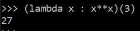

代码 1

2.将 lambda 函数赋给变量

只有在必要时才使用这种方法。

你可以写:

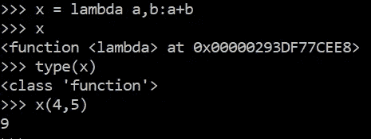

代码 2

而不是:

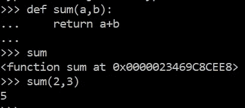

代码 3

还要注意，在代码 2 中，当我执行第 2 行时，lambda 函数的名称没有显示出来。(但不用于正常功能)

3.从另一个函数返回一个 lambda 函数

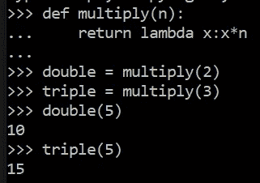

代码 4

4.λ函数作为高阶函数

lambda 函数可以将普通函数或 lambda 函数作为参数。

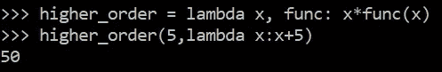

代码 5

5.仅用于交互式解释器的功能

如果你在 python 交互式解释器中使用下划线，你可以得到最后一个表达式。


代码 6

6.Lambda 函数是单个表达式

在上面的例子中，如果没有定义 lambda 函数，而是定义了一个普通的函数，那么它不会被算作一个表达式，所以下划线不会等于它。这是因为图像代码 6 的第一行是表达式。

7.不要在 lambda 函数中使用语句

不要使用传递、返回、断言、提高…它应该遵循开始时显示的形式。

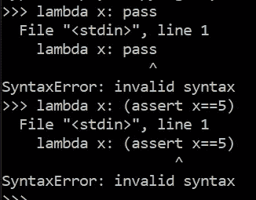

代码 7

8.Lambda 函数不支持类型提示

类型提示阐明了预期的参数和返回类型。

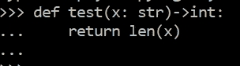

代码 8

9.像用 def 定义的普通函数一样，lambda 函数支持不同的参数传递方式。例如:

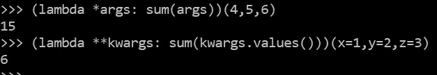

代码 9

10.内置函数映射的用法()

它将一个函数应用于 iterable 的每一项，并返回一个迭代器，该迭代器可以使用内置的 list()函数转换为一个列表。

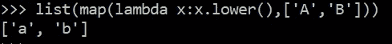

代码 10

不总是使用它是一个好主意，像这里，因为我们可以使用列表理解。

11.使用内置函数过滤器()

它将布尔返回类型的函数应用于 iterable 的每一项，并返回一个包含这些项的迭代程序，从而产生真正的输出。

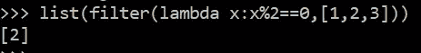

代码 11

这个特殊的例子也可以用列表理解来完成。

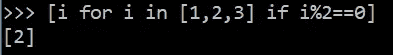

代码 12

13.使用内置函数 sort()

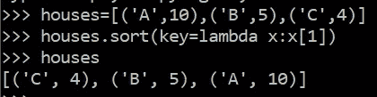

代码 13

我们将 sort()方法的关键参数设置为 lambda 函数，排序基于它的返回值进行(这是每个元组中的第二项)。另一个例子:

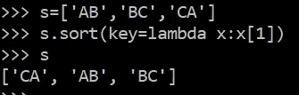

代码 14

14.dis 模块

在进入解释器之前，python 代码被转换成字节码，字节码是一种为解释器高效执行而设计的指令集形式。python 中的 dis 模块为您提供了人类可读的字节码格式。我们将它用于 normal 和 lambda 函数，来看看到底发生了什么。

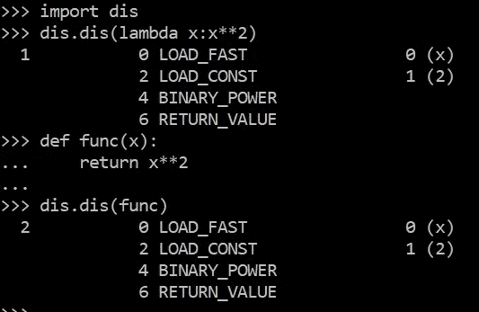

代码 15

正如你所看到的，我们得到了相同的结果。

14.回溯误差

让我们比较一下正常函数和 lambda 函数的回溯误差。

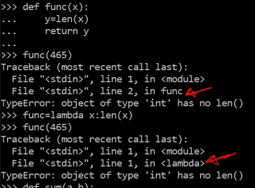

代码 16

就像我提到的第二张图片。

14.装饰者

如果你熟悉 python 中的修饰，你应该知道我们不能在 lambda 函数中使用这种语法，我们可以把它传递给 decorator。

```
# assume decorator has been defined
print(decorator(lambda x: x*2)) 
```

15.关闭

如果你熟悉 python 中的闭包，知道我们可以用 lambda 作为闭包。

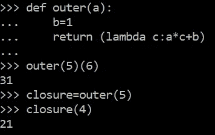

代码 17

结尾有一个关于闭包的链接可能会有帮助。

16。出乎意料但合理的结果

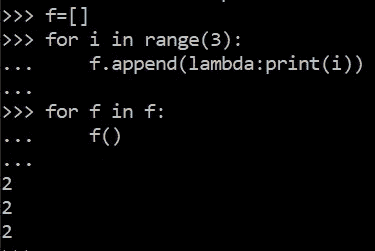

代码 18

for 循环内部的 lambda 是一个闭包，它接受运行时绑定的 **i** 、**自由变量**。运行时，调用函数 f 时， **i** 的值为 2。换句话说，lambda 内部循环实际上使用了相同的 **i** ，它的最后一个值是 2，所以三个函数都将输出 2。

最后一个关于全局变量、局部变量和自由变量的链接可能会有所帮助。

你可以这样解决问题:

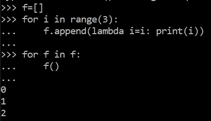

代码 19

17.使用内置函数 reduce from module functools

这将两个参数的函数从左到右累积应用于序列中的项，从而将序列缩减为单个值。比如 reduce(lambda x，y: x+y，[1，2，3])计算((1+2)+3)。如果存在 initial，它将被放在计算中序列项的前面，并在序列为空时用作默认值。

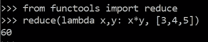

代码 20

18.使用 timeit 模块中的 timeit 函数

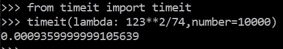

代码 21

这里它调用 lambda 函数 10000 次，并显示所用的时间。

感谢阅读。祝你平安。如果你喜欢它，请按拍手图标。

对编程、AI、数据科学感兴趣的可以关注。

[](https://www.codesansar.com/python-programming/closures.htm) [## Python 中的闭包及其示例和特征

### 在 Python 中，将自由变量附加到函数上的技术被称为闭包。Python 完成…

www.codesansar.com](https://www.codesansar.com/python-programming/closures.htm) [](https://www.codesansar.com/python-programming/local-global-free-variables-example.htm) [## Python 中的全局、局部和自由变量及示例

### Python 根据变量的创建和使用位置定义了三种类型的变量。他们是全球性的…

www.codesansar.com](https://www.codesansar.com/python-programming/local-global-free-variables-example.htm)