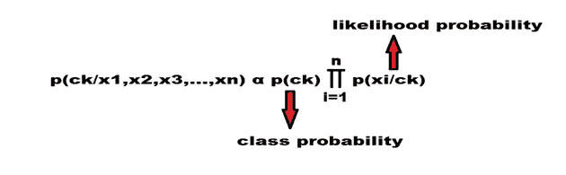

# ML 算法的计算复杂度

> 原文：<https://medium.com/analytics-vidhya/computational-complexity-of-ml-algorithms-1bdc88af1c7a?source=collection_archive---------7----------------------->

时间和空间复杂度在选择机器学习算法时起着非常重要的作用

**空间复杂度**:算法的空间复杂度表示对于不同的输入大小，算法工作所使用或需要的总空间。简单来说就是完成任务所需的空间。

**时间复杂度**:时间复杂度是算法在输入大小下完成任务的操作次数。简单地说，就是完成这项任务所需的时间。

在这个博客中，我们将看到 ml 算法的训练和运行时间复杂性。

# **k 近邻(KNN)**

**假设**:KNN 算法假设相近的事物存在于附近。换句话说，相似的东西彼此靠近。

“物以类聚，人以群分”

由于 knn 没有明确的训练阶段，所以 knn 在训练阶段不学习任何判别函数，它只是计算距离和排序数据。这也是 knn 也被称为懒惰学习者的原因。在测试阶段，给定一个查询点(xq ),它计算与数据集中所有点的距离，然后选择 k 个最近邻，然后根据多数投票给定类别标签。

**KNN**

Knn 有两种方法:

**1]强力 knn \规则 knn**

**2】KD 树 knn**

现在在这里，

n=数据集中的数据点数

d =尺寸

k=最近邻居数量

**1】蛮力 knn:**

列车时间复杂度:O(knd)

列车空间复杂度:O(nd)

测试\运行时间复杂度:O(knd)

测试\运行空间复杂度:O(nd)

**2】KD 树 knn:**

列车时间复杂度:O(n d log(n))

列车空间复杂度:O(nd)

测试\运行时间复杂度:O(k log(n) d)

测试\运行空间复杂度:O(nd)

# **朴素贝叶斯:**

**假设**:特性是有条件的相互独立。

让我们上 k 节课。c1，c2，c3，…，ck，我们有“n”个数据点。x1，x2，x3，…，xn

在训练阶段，我们计算所有的可能性和类概率

现在在测试阶段，给定一个查询点 xq，无论哪个类对该查询点具有最大概率，那么该查询点(xq)都属于该类。

n=数据集中的数据点数

d =尺寸

c=班级数量

列车时间复杂度:O(n d c)

列车空间复杂度:O(d c)

测试\运行时间复杂度:O(直流)

测试\运行空间复杂度:O(直流)

# **逻辑回归:**

假设:类几乎/完全线性可分

在逻辑回归中，我们使用 sigmoid 函数。

**乙状结肠功能**

其中 f(x)是 sigmoid 函数。sigmoid 函数值介于 0 和 1 之间。我们使用 sigmoid 函数，因为它不容易出现异常值，并且具有非常好的概率解释。

它在训练阶段学习判别函数。在训练阶段，我们学习与每个特征相关的权重。在测试阶段，假设 xq 是我们的查询点

列车时间复杂度:O(nd)

列车空间复杂度:O(nd)

测试\运行时间复杂度:O(d)

测试\运行空间复杂度:O(d)

# **线性回归:**

**假设:**输入变量和输出变量之间存在线性关系。

这里，它也在训练阶段学习辨别功能。在训练阶段，我们学习与每个特征相关的权重。

列车时间复杂度:O(nd)

列车空间复杂度:O(nd)

测试\运行时间复杂度:O(d)

测试\运行空间复杂度:O(d)

# **支持向量机(SVM):**

假设:类几乎/完全线性可分

在这里，我们使用最大化超平面的方法。我们将学习对应于每个数据点的 alpha (α)值，然后使用 alpha > 0 的数据点作为支持向量。所以只有点才是支持向量，这就是为什么它被命名为支持向量机

如果数据点不是线性可分的，那么我们使用核技巧，就像特征变换一样，我们隐式地将数据点转换到更高维度，然后我们可以线性地分离数据点

K=支持向量的数量

因此，在训练时间，我们计算支持向量和相应的阿尔法值。所以在测试的时候设 xq 是查询点

列车时间复杂度:O(n**2 d**2)

列车空间复杂度:O(n d)

测试\运行时间复杂度:O( k d)

测试\运行空间复杂度:O( k d)

# **决策树:**

在决策树的训练阶段，我们建立决策树。这里，我们根据具有最高信息增益的特征或者具有最高熵或基尼系数减少的特征来选择特征。

列车时间复杂度:O(n logn d)

列车空间复杂度:O(节点数)

测试\运行时间复杂度:O(log n)

测试\运行空间复杂度:O(节点数)

树的深度=对数 n

节点数= 2n- 1

让 n=8

让 n=4

**集合模型:**

在机器学习中，集成基本上意味着当我们将多个模型组合在一起/一起使用成一个更强大的模型时。

**1】打包:**也称为引导聚合

即随机森林

**随机森林:**

在随机森林中，我们希望决策树具有低偏差和方差，这意味着我们希望我们的树过拟合。

即，将具有高方差的全深度或高深度的决策树。

k =树的数量

列车时间复杂度:O(k n logn d)

列车空间复杂度:O(节点数 k)

测试\运行时间复杂度:O(k logn)

测试\运行空间复杂度:O(节点数 k)

**2】增压:**

**I**e .梯度增强、adaboost、xgboost

**梯度推进决策树(GBDT):**

在 gbdt 中，我们希望我们的模型是高偏差和低方差的，这意味着我们希望决策树是欠拟合的。

即决策树浅深度

m =树木数量

Gamma m =决策树中每个叶子的输出值

列车时间复杂度:O(M n logn d)

列车空间复杂度:O(#节点 M+γM)

测试\运行时间复杂度:O(M logn)

测试\运行空间复杂度:O(# nodes * M + gamma m)

一般来说，gbdt 比随机森林花费更多的时间，因为在 gbdt 中，我们基于前一棵树的误差或残差来构建下一棵树，所以与随机森林相比，它不能被并行化。

参考:

 [## 应用课程

### 我们知道转行是多么具有挑战性。我们的应用人工智能/机器学习课程被设计为整体学习…

www.appliedaicourse.com](https://www.appliedaicourse.com/)