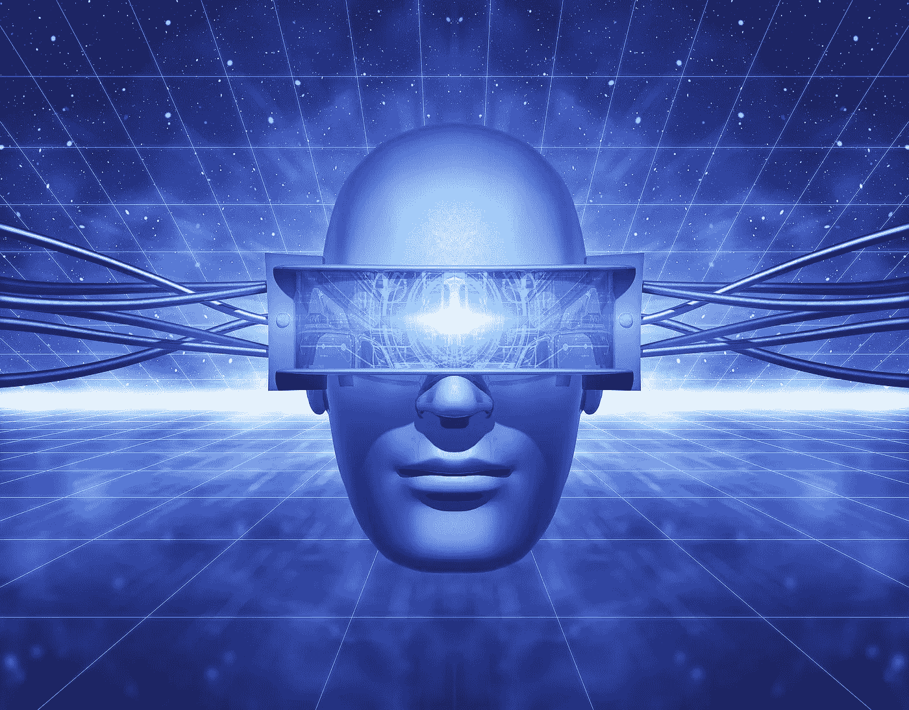
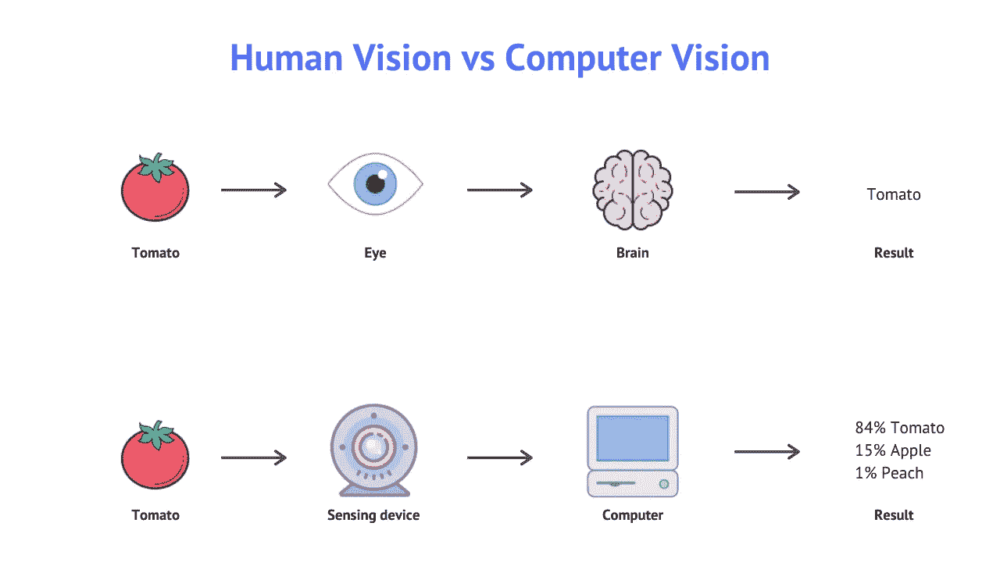
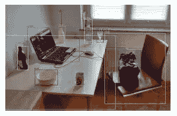
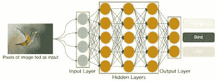
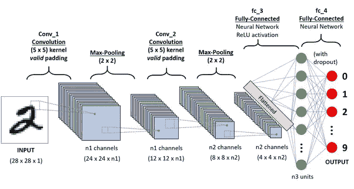
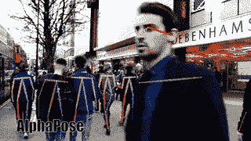
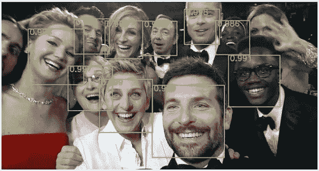

# 计算机视觉:简短的初学者指南。

> 原文：<https://medium.com/analytics-vidhya/computer-vision-a-short-beginners-guide-eb506ba92923?source=collection_archive---------9----------------------->

# 内容:

1.  概观
2.  CV 是如何工作的？
3.  CV 的应用
4.  CV 中需要的数学
5.  如何学习 CV-我的道路…

# 1.概述:

通俗地说，计算机视觉(CV)是计算机科学的一个分支，旨在将人类视觉的工作方式复制到计算机上。给计算机/机器人/机器视觉。

计算机视觉允许计算机从图像、视频和现实生活中发现的对象中识别和提取数据/信息。计算机很难理解视觉数据。人类根据我们的经历和记忆来理解我们看到的东西。从我们出生的那天起，我们就一直在训练我们的大脑，这使得计算机在解释视觉信息时处于劣势。这就是计算机视觉的天才之处。在人工智能、神经网络、深度学习、并行计算和机器学习的支持下，**计算机视觉帮助弥合计算机*看到*和计算机*理解他们所看到的*之间的差距。**

PC: hqsoftwarelab

# 2.那么计算机视觉是如何工作的呢？

计算机视觉做的很简单，就是理解图像。这也意味着视频，因为它在技术上是图像(帧)的集合。理解一幅图像是一个相当复杂和冗长的问题。更确切地说，人们在图像理解需求中识别某些任务，并且只做那些。

在图像理解中有几个任务:一些是在各种其他情况下使用的低级任务，而一些是高级任务。一些低级任务包括:

*   图像清洗
*   图象分割法
*   直方图分析
*   图像颜色空间转换
*   图像变换
*   图像边缘检测和轮廓，直线近似等。

一些高级任务(通常使用低级任务)包括:

*   目标检测
*   物体识别
*   目标分割和定位
*   目标跟踪
*   特征抽出
*   特征，颜色校正
*   特征重建、近似等。

所有的计算机视觉问题都有一个相似的理解场景的方法。我们通过观察不同的颜色，然后阴影，笔画等来识别不同的图像和里面的东西，我们仍然使用相同的方法，但使用了更有效的技术。因此，选择了各种方法，例如:在闭路电视镜头中，你需要跟踪移动的物体，然后你只需要比较每一帧，看看像素值在变化。现在的闭路电视都是静止的摄像机，背景总是保持不变，像素值保持不变，只有移动的物体才会有可变的像素值。这被识别为对象。

但是现代方法是如何工作的呢？目前，这是通过一种称为卷积神经网络的神经网络来实现的。这是一种特定类型的网络，可以识别图像中的特征。这些网络是被称为传统层的东西的顺序排列。

这是神经网络最简单的可视化。你可以观察我们是如何安排每一层的，以及它们是如何相互连接的。

*这是一个卷积神经网络看起来的深度，你在一侧有一个输入，每一层都从图像中提取特征，在输出上，我们有图像的标签。*

# 3.计算机视觉的应用:

有很多行业和领域可以实施 CV。在这里，我已经提到了几个 CV 被广泛使用的重要和成功的领域。

1.  谷歌镜头。
2.  机器人技术。
3.  制造业(缺陷检测、装配线等)
4.  安全系统。
5.  虚拟现实/增强现实
6.  智能手机
7.  自动化车辆。
8.  医学成像(MRI 重建、自动病理学、机器人辅助手术等)

这些只是计算机视觉全部应用中非常小的一部分。

# 4.计算机视觉背后的数学

计算机视觉入门要求您熟悉数学，例如:

*   **线性代数:**矩阵、向量、奇异值分解。尤其是怎么用。
*   **数值优化:**一阶优化方法，二阶优化方法。
*   **概率统计:**随机变量，概率分布函数，贝叶斯定理。

# **5。如何学习 CV**——我做了什么…

第一步是我理解了计算机视觉的基础和背后的数学。

从简单的对象检测开始，特征过滤，面部检测，面部动画，机器学习项目的艺术。

首先，下载 OpenCV 并尝试一些示例代码，如静态图像匹配、对象检测和分类等，以掌握代码。互联网上有一篇文章，很遗憾，我没有保存下来，但你可以很容易地找到它。这是一个有趣的项目，它使用一个摄像头(可以是你的手机，膝盖或任何摄像头)来检测人们的脸，并在数据库中检查他们的面部特征，一旦匹配成功，它会自动在 excel 表中登记出席情况。这是我用 CV 做的第一个最酷的项目。

不管你学的是什么科目，一旦你获得了实践经验，你就会有信心，你会有更多创新的想法，你会感觉很棒。

**快速&有效路径:**

*1。参加在线课程，以获得专业知识或提高知识。*

*2。理解编程模式和原则，例如面向对象的编程。*

*3。使用机器库和框架。*

*4。阅读实用的 ML/DL 书籍*

*5。了解云服务，如 GCP、AWS 等*

*6。了解深度学习基础知识*

*7。熟能生巧:实验&玩吧。*

> 请随时联系我，获得机器人学、CV & ML 方面的指导和帮助。期待和你一起学习。
> 
> **感谢阅读，**

## 电子邮件:harilakshmanrb@gmail.com