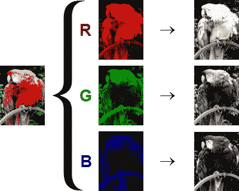
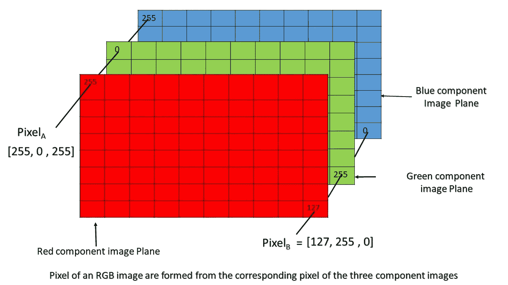
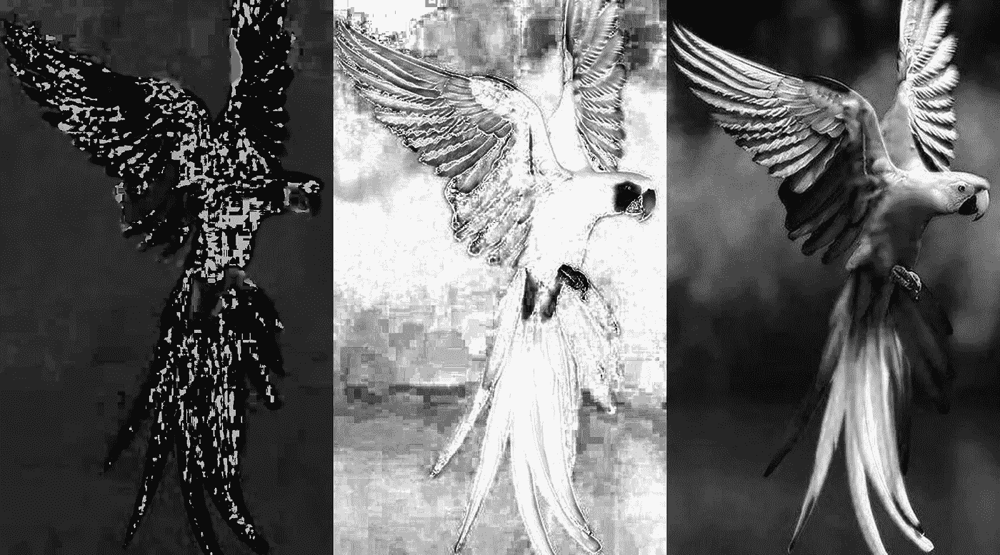

# 计算机视觉和深度学习-第 1 部分

> 原文：<https://medium.com/analytics-vidhya/computer-vision-and-deep-learning-part-1-a8aa41a587eb?source=collection_archive---------19----------------------->

# 介绍

在这个关于机器人的系列中，我首先针对深度学习的计算机视觉。有人可能会问为什么要先从这个话题入手？这个问题的答案是，建立对编写代码的良好理解，并了解机器如何感知周围的世界。摄像头是一种非常常见的传感器，机器人使用它来感知环境，然后执行操作。为此，我们需要了解计算机视觉的内容、位置和方式。在介绍完这个主题后，我将解释为什么我们需要用深度学习来丰富这个特殊领域。所以让我们开始吧！

# 计算机视觉

图 1 —原始图像的 RGB 分色。灰色图像显示每种颜色对构建图像的贡献(白色越多，贡献越大)。图片来源:wikimedia.com

我们在智能手机中最常用的相机以二进制数字(0 和 1)的形式解释环境。奇怪！不是吗？是的，让我解释一下。为此，我将以 RGB 图像为例。RGB 表示红色、绿色和蓝色。也就是说，图像是三种颜色的有意义的组合(参考图像 1)。假设我的手机里有一张普通的红色图片，这意味着我给红色打了 1 分，给绿色和蓝色打了 0 分。你可能会问红色有深浅之分吗？你将如何代表他们？于是，把 1 分成 256 等份的概念就来了。也就是现在我来解释一下 256 级中红色的黑暗。有人可能会问，256 这个数字是从哪里来的，为什么只有 256 个部分，而不是任何其他数字？好的，为了这个，让我们来看看表达一个字节的计算机内存的概念。一个字节等于 8 位。将一个字节专用于红色意味着将 8 个比特专用于该颜色。因此，最深的红色看起来像 11111111(二进制数表示为 256)，最暗的红色看起来像 00000001(二进制数为 1)。如果 2(每个位可以保存 0 或 1)的 8 次方(专用于红色的位数)，我们得到 256。因此，绿色和蓝色有一个专用字节来表示每种颜色的强度。如果我们想在图像中获得更多的信息，我们可以为每种颜色使用 16 位左右的数据。灰色图像是相似的。他们只有一个频道。那里的像素值代表黑色和白色之间的阴影。

8x10 图像中的每个小方框代表一个像素。当 R、G 和 B 的像素被组合时，它给出彩色图像的一个像素的值。因此，彩色图像的像素 A 将由[R，G，B]给出。图片来源:geeksforgeeks.org

到目前为止，我们所说的都是在一个像素内进行的。像素？那是什么？如上图所示，像素是图像的基本组成部分。例如，你看到一张 8×8 的图片。这意味着该图像中有 64 个像素，每个像素由 3 种颜色的组合表示。也就是说，每个像素将由 3 个字节的内存来表示。8x8 图像的 64x3 =字节！我们都喜欢拍高清照片，想想 1080p，也就是 1920 x 1080 像素！或者 210 万像素。通过我们对 8x8 图像进行的计算，您可以想象高清晰度图像的内存量有多大。

为从机器人获取周围图像选择正确的分辨率至关重要。因为更多信息(高清晰度图像)和板载处理器的存储空间使用之间的持续权衡。由于相机是一个高耗电的传感器，我们需要注意给机器人供电的电池。

图 3:左边是 RGB 格式的图像，右边是 HSV 格式的图像。图片来源:[zedge.net](https://www.zedge.net/wallpaper/80f65253-ef93-3a2b-b0f7-bdd472cb14d9)

图像 4:上面图像的色调、饱和度和值组成部分。

我给出的 RGB 图像的例子很简单。其他图像格式有 HSV(色相、饱和度、明度)、HSL(色相、饱和度、明度)、CMY(青色、品红色、黄色)、CMYK(CMY 加黑色)、YIQ(Y = 0.30 r+0.59g+0.11 b
I = 0.60 r-0.28g-0.32 b
Q = 0.21 r-0.52g+0.31 b)。使用何种图像格式取决于应用程序。比如在户外操作机器人，不能依赖 RGB 图像格式。改变阳光亮度会毁掉整个应用程序。在这种情况下，我们依赖于 HSV 图像格式。

在室外和室内机器人应用中，经常使用 RGBD 摄像机。这里的 d 代表深度。这是摄像机看到的物体与摄像机之间的距离。这些数据以点云的形式存储。由于包含了作为深度的第三维，数据现在是 3D 的。人们也使用立体视觉来计算深度。通常，像 Kinect 这样的 RGBD 相机很贵，我想建造一个预算友好的机器人，使用立体(意味着不止一个)视觉是常见的。校准立体摄像机以计算深度是一个重要的方面。

# OpenCV

图片来源:【Opencv.org 

知道了如何准备 RGB 图像的基础知识，我们需要了解机器人的大脑如何理解这些信息。捕捉图像和“知道”图像中的内容是两个非常不同的主题。相机所能做的只是在当前的分辨率下捕捉图像。相机不知道捕捉的图像是关于什么的。为了解释图像的细节，机器人的大脑必须做一些事情。Tadaa！这就需要一个帮助大脑理解的模块，OpenCV 中使用的模块。OpenCV 本质上帮助我们在图像上执行各种基本操作，并经常提供在 ROS 中传输图像的工具(我们将在后续教程中详细讨论)。

人们需要理解图像处理和计算机视觉是处理图像的两种不同方式。当我们执行图像处理时，我们通过调整锐度、平滑、拉伸等参数来增强图像。在这里，我们对图像执行基本的变换，为进一步的使用做准备。然而，当我们执行计算机视觉时，它是关于提取图像中的信息。我们使用机器学习相关工具来更好地理解图像的主题。

在下一篇教程中，我会用 python 中的一些代码来帮助你更好地理解 Opencv。一旦我们熟悉了 Opencv 是什么，我们将跳到深度学习部分。在那之前，继续学习！