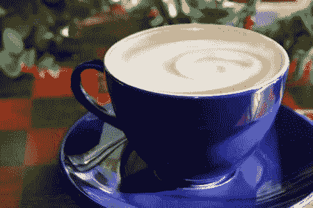

# 计算机视觉和深度学习-第二部分

> 原文：<https://medium.com/analytics-vidhya/computer-vision-and-deep-learning-part-2-586b6a0d3220?source=collection_archive---------12----------------------->

# 介绍

在前一篇文章中，我已经给出了一个关于图像的大致概念。一旦你理解了图像的基础，就该理解如何使用它了。

对于人类来说，视觉在日常生活中起着重要的作用。同样，机器人也需要图像形式的环境信息。如果您已经阅读了本系列的前一篇文章，您可能会遇到一些彩色图像及其不同的图像格式。当我们简单地“处理”图像时，例如调整锐度、拉伸等参数，我们正在进行图像处理(更像是为进一步的应用准备图像)。而提取“什么是图像的主题”信息是计算机视觉的目标。我想首先向读者介绍我们可以使用 OpenCV 执行的与图像处理相关的基本操作。我在中间引入图像处理概念的原因是，当我们稍后处理更高级别的问题语句时，您需要将这些基本操作保持在手边。

# 图像处理—基本操作

提示:不要复制粘贴，尝试复制我将向您提供和解释的代码。在命令行上使用 pip install OpenCV-python 来安装 OpenCV。

## 更改色彩空间:

正如我们所讨论的，改变色彩空间，即 BGR 到 HSV，HSL 或任何其他图像格式是应用相关的。对于现实应用中的颜色检测，我们通常将 BGR 转换为 HSV，因为 HSV 对光照变化不敏感。在下面的代码中，我们的目标是根据物体的颜色来检测物体。请记住，检测和跟踪是两个不同的概念。在检测中，该算法将只检测颜色，而不跟踪时间。也就是说，它不会关心前一帧中的对象是否与当前帧对象相同。而跟踪器确保它在随后的帧中检测和跟踪相同的对象。



主图。观察反射如何改变颜色阴影。图片来源:[pinterest.com](https://www.pinterest.com/pin/439523244855312201/)

```
import cv2
import numpy as npcv_image =cv2.imread("/home/rupali/tutorials/blue_mug.jpg")
#cv2.imread command is used to read an image by providing complete path to the imagehsv = cv2.cvtColor(cv_image, cv2.COLOR_BGR2HSV)
#cv2.cvtColor command converts image colorspace. Here we have provided the image to be converted and required color spcae conversion (from BGR to HSV)lower_blue = np.array([100,50,50])
upper_blue = np.array([140,255,255])
# In the above two lines we have provided range for H(110-130), S(50-255), V(50-255) for only blue color to be selected.mask = cv2.inRange(hsv, lower_blue, upper_blue) 
# Take hsv as input image and use these limits for extractionresult = cv2.bitwise_and(cv_image, cv_image, mask= mask)
# here we have performed bitwise and operation with the cv_image(source 1) and the mask(white patch will appear in the desired color location). The another cv_image (source 2) is used  to bitwise_and that black and white image with the colored image.cv2.imshow('main_image',cv_image)
cv2.imshow('Mask prepared',mask)
cv2.imshow('Result',result)  
cv2.waitKey(10000)
```


左:蒙版图像右:最终输出。

# 调整图像大小和图像阈值:

如上所述，基本图像处理操作的作用是为进一步使用准备图像。调整给定图像的大小和将彩色图像转换为二进制(黑色或白色)是一些常见的做法。与 3 通道图像相比，二进制图像更容易处理。

## 调整图像大小:

```
import cv2
import numpy as npcv_image= cv2.imread('/home/rupali/tutorials/tiger.jpg')
#read the image using cv2.imread by providing full pathresize_image = cv2.resize(cv_image,None, fx=0.5,fy=0.5,interpolation=cv2.INTER_CUBIC)
#resize cv_image by scaling x by 0.5 and y by 0.5 , You can fix the output size by changing None to the desired dimesion(try (10,10)). Interpolation means sampling up or down technique to be used for expanding or shrinking the imagecv2.imshow('original_image',cv_image)
cv2.imshow('resize_image',resize_image)
cv2.waitKey(10000)
```

## 调整结果大小:


将图像的高度和宽度分别调整 0.5 和 0.5。原图像演职员表:【Pinterest.com 

# 图像阈值:

阈值的概念非常简单。阈值意味着一个极限，我们用一个例子来理解这个。假设在满分为 100 分的测试中，40 分是门槛，即如果你的分数大于或等于 40 分，你就是“通过”。如果不到 40，我们认为你“失败”。在图像处理中，“通过”(即高于阈值)不一定意味着固定的颜色。它可以是黑色的也可以是白色的，取决于我们对什么感兴趣。在 OpenCV 中，我们提供了许多技术来执行阈值处理。还有像 cv2 这样的基本滤镜。THRESH_BINARY 以及 cv2 这样的复杂过滤器。OTSU 谷。那么，简单的过滤器就能完成任务，为什么我们还需要复杂的过滤器呢？答案是噪声、可变光条件和正确阈值的选择。如果考试的试卷太难，得不到 40 分怎么办？学生发现很难跨越规定的门槛，那么将 40 定为门槛是明智的选择吗？复杂滤波器就是建立在这些基本思想之上的。在开始编写代码之前，我想先介绍一下直方图的概念。奇怪的一堆沙子！不是吗？


让我们试着在同一个例子的帮助下阅读图表。获得 50 分的学生在人群中是最高的(这里是 18 分)。而得分低至 15 分或高达 90 分的学生数量很少(这里是每人 1 分)。如果我们将这一概念应用于一幅图像，我们将了解构成图像中大多数人口的像素数量(而不是学生数量)。上图是单峰曲线，即只有一个峰值的曲线。如果有两个峰值，我们称之为双峰图。

## 阈值代码:

```
import cv2 
import numpy as np
from matplotlib import pyplot as pltcv_image = cv2.imread("/home/rupali/tutorials/tiger.jpg",0)
#Read the main image, ) signifies in balck and white scaleret, one = cv2.threshold(cv_image, 127, 255,cv2.THRESH_BINARY)
#basic binary filter, provided lower and upper limit of assigning "pass"#concept of adaptive comes in light when remember exam question paper was too tough? What threshold value to select should depend on neighborhood pixel's intensity valuestwo =cv2.adaptiveThreshold(cv_image, 255, cv2.ADAPTIVE_THRESH_MEAN_C, cv2.THRESH_BINARY,11,2)
#Syntax cv2.adaptiveThreshold(source_image, maximum value, adaptive method to be used, threshold type, blocksize, constant)
# maximum value- highest intensity value a pixel can contain, how threshold will be calculated depends on adaptive method used,
#threshold value (for adap mean)= (mean of neighborhood(size given by block size)- constant)three =cv2.adaptiveThreshold(cv_image, 255,cv2.ADAPTIVE_THRESH_GAUSSIAN_C,cv2.THRESH_BINARY,11,2)
#Same syntax as above. threshold value(for gaussian) = weighted sum of neighborhood value - constantlabels = ['Original Image(In gray scale)', 'Global Thresholding','Adaptive Mean Thresholding','Adaptive Gaussian Thresholding']
images = [cv_image, one, two, three]for i in range(4):
    plt.subplot(2,2,i+1),plt.imshow(images[i],'gray')
    plt.title(labels[i])
    plt.xticks([]),plt.yticks([])
    print(i)
plt.show()cv2.waitKey(10000)
```

## 结果:


图像阈值结果。观察经典阈值和自适应阈值之间的差异。检查自适应阈值中保留的细节。

## 阈值处理的复杂方法——Ostu 阈值:

如所讨论的，当图像是双峰(直方图中的两个峰值)时，阈值的选择变得困难。在这种情况下，cv2。THRESH_OSTU 派上用场了。有关数学细节，请参考[奥斯特的阈值](https://opencv-python-tutroals.readthedocs.io/en/latest/py_tutorials/py_imgproc/py_thresholding/py_thresholding.html)。

**带直方图的输入图像:**


双峰图像。强度为 18 的像素形成最高峰值(数量为 12047)，强度为 207 的像素形成最高峰值(数量为 4289)。图片来源: [kisscc0](https://www.kisscc0.com/photo/crowd-light-majorelle-blue-yellow-purple-crowd-lig-jrziqe/)

直方图的代码:

```
import cv2
import numpy as np
from matplotlib import pyplot as pltcv_image=cv2.imread("/home/rupali/tutorials/ostu5.jpg",0)plt.hist(cv_image.ravel(),256,[0,256]); plt.show()
```

Ostu 阈值代码:

```
import cv2
import numpy as np
from matplotlib import pyplot as pltcv_image= cv2.imread("/home/rupali/tutorials/ostu5.jpg",0)one =cv2.adaptiveThreshold(cv_image,255,cv2.ADAPTIVE_THRESH_MEAN_C, cv2.THRESH_BINARY,11,2)
ret2, two = cv2.threshold(cv_image,0,255,cv2.THRESH_BINARY+cv2.THRESH_OTSU)
blur = cv2.GaussianBlur(cv_image,(5,5),0)
ret3,three = cv2.threshold(blur, 0,255,cv2.THRESH_BINARY+cv2.THRESH_OTSU)images = [cv_image, 0, one,
          cv_image, 0, two,
          blur, 0, three]titles = ['Original Image','Histogram','Adaptive Mean Thresholding',
          'Original Image','Histogram',"Otsu's Thresholding",
          'Gaussian filtered Image','Histogram',"Otsu's Thresholding of Gaussian Blur Image"]for i in xrange(3):
    plt.subplot(3,3,i*3+1),plt.imshow(images[i*3],'gray')
    plt.title(titles[i*3]), plt.xticks([]), plt.yticks([])
    plt.subplot(3,3,i*3+2),plt.hist(images[i*3].ravel(),256)
    plt.title(titles[i*3+1]), plt.xticks([]), plt.yticks([])
    plt.subplot(3,3,i*3+3),plt.imshow(images[i*3+2],'gray')
    plt.title(titles[i*3+2]), plt.xticks([]), plt.yticks([])
plt.show()cv2.waitKey(1000)
```


仔细观察最低的直方图。模糊有助于去除噪声(相邻像素强度的急剧变化)。如果输入图像只有两种灰度，您将得到两个尖锐的峰，而不是上面显示的谷。

仔细观察最低的直方图。模糊有助于去除噪声(相邻像素强度的急剧变化)。如果输入图像只有两种灰度，你会得到两个尖锐的峰，而不是上面显示的谷。

Ostu 的 threshold 代码中的 ret3 变量是函数用来执行 Threshold 的阈值。在这种情况下，阈值是 104。

# 结论:

因此，今天我们了解了如何执行遮罩(对于任何颜色)，调整图像大小，执行阈值即二进制阈值，自适应均值，自适应高斯，奥氏阈值和模糊图像的需要。我必须承认这对一个新手来说是很难理解的。我欣赏你的努力！在本系列的下一篇文章中，我将在我们攻击深度学习部分之前介绍几个更基本的图像处理概念。在那之前，继续学习！