# 计算机视觉和深度学习——第四部分

> 原文：<https://medium.com/analytics-vidhya/computer-vision-and-deep-learning-part-4-dbaf250b8c54?source=collection_archive---------2----------------------->

# 简介:

欢迎回到计算机视觉和深度学习系列。在过去的几篇文章中，你已经了解了什么是图像，如何执行一些基本的操作，如调整图像大小，改变它的颜色空间和渐变知识，以确定图像的边界。也就是说，到目前为止，我们执行的所有操作都需要机器对主题的零知识来玩图像。

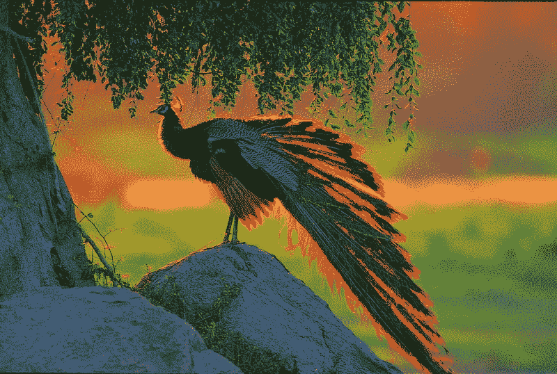

图 4.1 美丽孔雀图片来源:[访问](http://santa-banta-wallpapers.blogspot.com/2014/03/peacock-bird-hd-wallpapers.html)

我所说的主题是指(参见图 4.1)一只**孔雀**站在**树下的**岩石**上的知识。**当人们看到图像时，这些是人们会在图像中观察到的最初几个元素。人类识别图像中内容的能力与人类的智力有关。为了给机器提供这种识别能力，我们需要人工智能。但在我将这些帖子完全引向人工智能之前，我想分享一些与 2D 功能框架相关的精彩算法，这些算法是由极客们超时理解图像而引入的。同样的问题可以用简单的方法解决，为什么要用复杂的方法呢？人工智能应用程序计算量很大，因此尽可能避免使用它，你的生活会更轻松。

# 2D 特色框架:

如题所示，我们将研究 2D 图像的特征。这种方法在处理对象识别和对象跟踪时非常方便。回想一下，我们在[之前的文章](/analytics-vidhya/computer-vision-and-deep-learning-part-3-862173b3e249)中学到了渐变。当你在任何一个方向导航时，像素强度的急剧变化告诉我们边缘的存在。

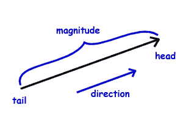

图 4.2 矢量表示。图片来源:[访问](https://www.ducksters.com/science/physics/vector_math.php)

为了存储和进一步操作，该数据(梯度细节)以矢量的形式存储。向量的方向告诉我们图像中像素强度变化的方向，向量的长度告诉我们强度变化的幅度。

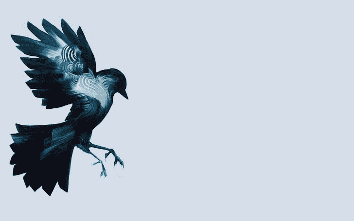

图 4.3 关键区域和特征说明。图片来源:[访问](https://www.wallpaperflare.com/vector-illustration-of-blue-and-white-bird-birds-artwork-simple-background-wallpaper-hxeua)

考虑图 4.3，正如人们所观察到的，像素强度的主要变化在图像的左侧。图像的中心和右侧具有恒定的像素强度。因此，我们可以得出结论，图像的关键区域是左侧。将被进一步使用的图像的组成部分被称为特征。在显示的图像中，鸟的翅膀、尾巴、头、喙或腿是我们可能需要在后面的部分中提取或匹配的特征。

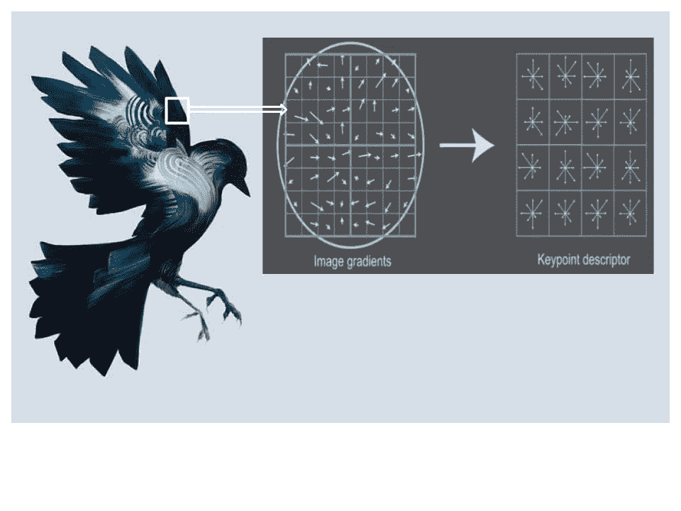

图 4.4 考虑了图像的 8×8 像素部分，并且这个 8×8 的方框被进一步分成 4 个块，每个块的尺寸为 4×4。在每个 4x4 块内，图像梯度以向量的形式表示。通过搜索最独特或明显的特征，在图像中找到关键点。这里，通过组合 4 个相邻向量来形成关键点描述符。关键点描述符显示图像该部分梯度变化的方向和幅度。关键点周围的区域被归一化，并且为关键点区域计算局部描述符。局部描述符是描述关键点视觉外观的数字向量。图片来源:[访问](https://ai.stanford.edu/~syyeung/cvweb/tutorial2.html)

**2D 特征框架的主要子部分是**:

1.  特征检测
2.  特征匹配

如果你在较低的水平上看图像，即没有聚焦在图像的主体上，图像的突出特征将是角落、边缘和具有最小像素强度变化的一致部分。其中，最重要的是一个角落。猜猜为什么？如果你猜对了，因为它是两条边的交点。矩形(图像是矩形)中的每个角都有独特的强度变化模式(您可以将左下角的形式想象为大写字母 l(L，即图像中从右到左和从上到下导航的剧烈强度变化)，右下角为大写字母 L 的镜像，上面两个以类似方式)。角点是指由于相邻的边而在两个方向上具有严重梯度变化的点。因此，Opencv 提供了一些非常酷的方法来检测图像中的角点。让我们把它们列出来

# **特征检测方法:**

a)哈里斯角点检测

b) Shi-Tomasi 角点检测

c) ORB(定向快速旋转简报)

d)角点检测的快速算法

e) SIFT(尺度不变特征变换)——专利(付费使用)

f) SURF(加速的强大功能)—专利(付费使用)

(SIFT 和 SURF 已获得专利，不能用于免费商业用途，因此我们将跳过这两种方法的演示)


图 4.5 用于角点检测算法实现的图像。图片来源:[访问](https://www.gocollette.com/en-ca/traveling-well/2019/1/the-beautiful-birds-of-costa-rica)

# 哈里斯角点检测:

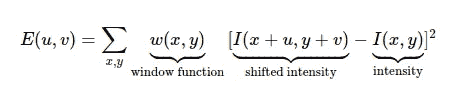

哈里斯角点检测背后的主要等式

让我们理解这个等式是什么意思。E(u，v)是一个需要被最大化以检测拐角的函数。该等式基本上找到了( *u* ， *v* )在所有方向上的位移的强度差异。例如，如果我们取 u 为 2，v 为 3，我们将不断改变(x，y)值，并计算像素强度的平方差。强度差相乘的窗口函数是内核(如果你不理解内核，请参考前面的)，这里是矩形或高斯窗口，它为下面的像素赋予权重。

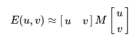

方程的泰勒展开式

使用泰勒展开求解 E(u，v)方程，以获得上面的方程，其中 M 代表

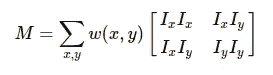

这里 Ix 和 Iy 代表 x 和 y 方向上的图像导数

等式的主要部分是 R

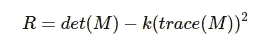

r 决定下面的像素是包含角点、边缘还是普通图像。

如果我们把 L1 和 L2 看作矩阵 M 的特征值，det(M )=特征值的乘积(L1×L2)和 trace(M)=特征值的和(L1+L2)。根据该方法，R 的值决定了待测区域的内容。如果

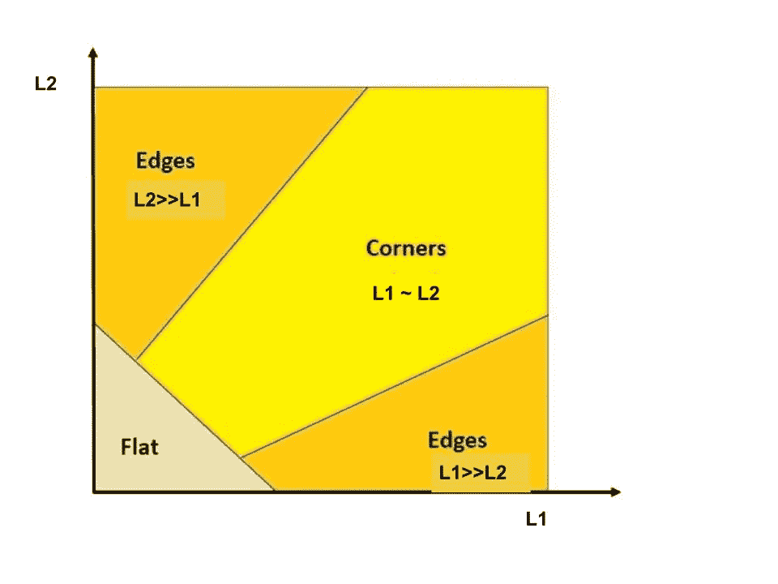

图 4.6 哈里斯角点检测的图示

1.  R 值很小，所考虑的地区是平坦的(L1 和 L2 很小)
2.  r 为负，所考虑的区域包含边缘(当 L1 与 L2 相比太大时，反之亦然)
3.  r 较大，区域包含拐角(L1 和 L2 较大且可比较)

## 哈里斯角检测代码:

```
import cv2
import numpy as np#read the original image
cv_image = cv2.imread("/home/rupali/tutorials/blue_flower.jpg")#convert into gray scale
gray_image = cv2.cvtColor(cv_image, cv2.COLOR_BGR2GRAY)#convert image pixel data into float32, to avoid further size not compatible clashes
gray_image = np.float32(gray_image)#syntax cv2.corenrHarris(input_image, block size for neighborhood pixels to be considered, sobel operator size, border type)
result_image = cv2.cornerHarris(gray_image, blockSize=2, ksize= 3, k =0.04)#dilate to highlight corners
result_image = cv2.dilate(result_image, None)#reverting back to original image using optimal threshold 
cv_image[result_image > 0.01* result_image.max()]=[0,0, 255]cv2.imshow("haris", cv_image)
cv2.waitKey()
```


哈里斯角点检测结果

# Shi-Tomasi 角点检测方法:

这种角点检测方法类似于 Harris。Shi-Tomasi 在他的研究论文 **Good Features to Track** 中提出寻找图像中 N 个最强的角点。得分函数如下所示

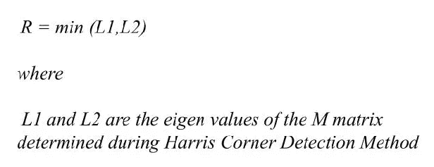

实际上，施托马西比哈里斯更有效率。我们可以形象地把这种方法想象成

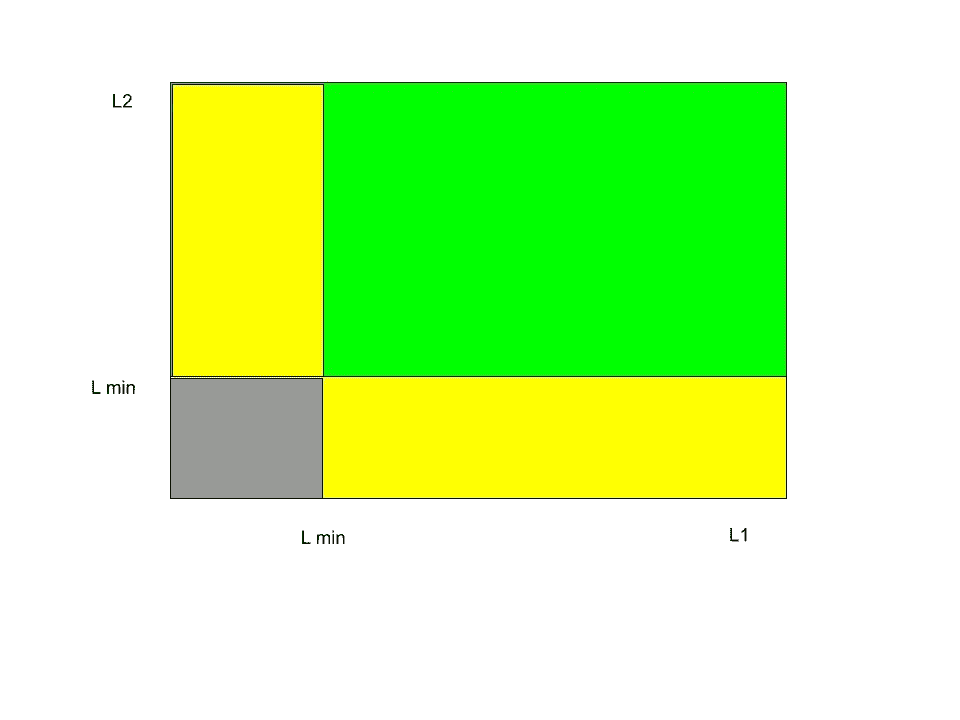

寻找最强 N 角点的 Shi-Tomasi 方法

```
import numpy as np
import cv2#input imagecv_img = cv2.imread('/home/rupali/tutorials/bird.jpg')
cv_gray = cv2.cvtColor(cv_img,cv2.COLOR_BGR2GRAY)#syntax cv2.goodFeaturesToTrack(input_image, max_corner_to_detect, qualityLevel, minDistance)corners = cv2.goodFeaturesToTrack(cv_gray,maxCorners=25, qualityLevel=0.01,minDistance=10)
corners = np.float32(corners)for item in corners:
    x,y = item[0]
    cv2.circle(cv_img,(x,y),3,(0,0,255),-1)cv2.imshow("image", cv_img)
cv2.imwrite("shi_result.jpg", cv_img)
cv2.waitKey()
```

## 结果:


N=25 时的 Shi-Tomasi 结果

# ORB(定向快速旋转简报):

该方法是 SIFT 和 SURF 的有效替代方法。ORB 的出现主要是因为 SIFT 和 SURF 获得了专利，因此需要一种有效的开源方法来开发 ORB。ORB 使用 FAST 检测关键点，使用 BRIEF 计算图像描述符。

```
import numpy as np
import cv2
#input image
cv_img = cv2.imread('/home/rupali/tutorials/bird.jpg')
cv_gray = cv2.cvtColor(cv_img,cv2.COLOR_BGR2GRAY)orb = cv2.ORB_create(nfeatures=200)
key_point, descriptors = orb.detectAndCompute(cv_gray, None)keypoint_image = cv2.drawKeypoints(cv_img, key_point, None,color=(0,0,255), flags=0)cv2.imshow("ORB", keypoint_image)
cv2.imwrite("orb.jpg", keypoint_image)
cv2.waitKey()
```


特征数量= 200 的 ORB 结果

## 角点检测的快速算法；

上面讨论的角点检测技术很好，但是对于实时应用来说不够快。作为对此的解决方案，FAST(Features from Accelerated Segment Test)算法是由 Edward Rosten 和 Tom Drummond 于 2006 年在他们的论文《用于高速角点检测的机器学习》中提出的(后来在 2010 年对其进行了修订)。

加速分段测试的特征总结如下:

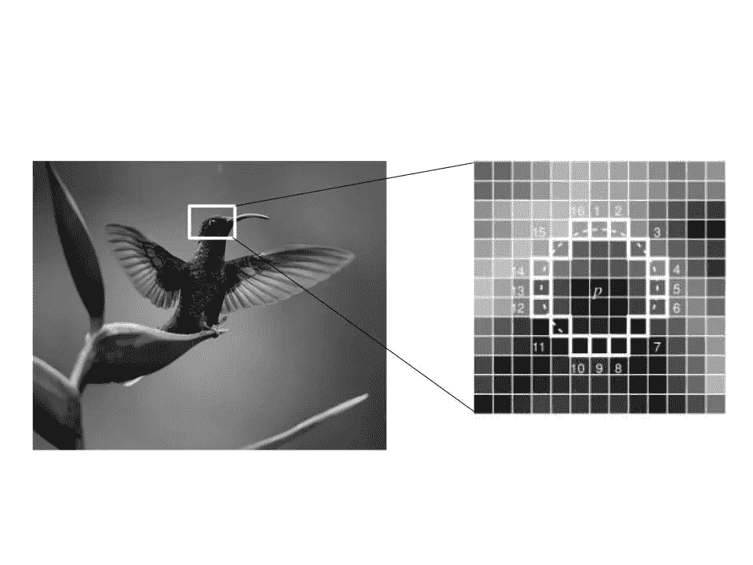

快速算法解释

1.  在图像中选择一个像素 p，该像素是否被识别为兴趣点。让它的强度是 Ip。
2.  选择合适的阈值 t
3.  考虑在测试像素周围有一个 16 像素的圆圈(见下图)。
4.  现在，如果在圆(16 个像素)中存在一组 n 个相邻像素，它们都比 Ip+t 亮，或者都比 Ip t 暗，则像素 p 就是一个角点(在上图中显示为白色虚线)。n 被选为 12。
5.  提出了一个**高速测试**排除大量非弯道。该测试仅检查 1、9、5 和 13 处的四个像素(首先测试 1 和 9 是否太亮或太暗。如果是，则检查 5 和 13)。如果 p 是一个角点，则其中至少有三个必须比 Ip+t 亮或比 Ip t 暗，如果两者都不是，则 p 不可能是一个角点。然后，通过检查圆圈中的所有像素，可以将完整片段测试标准应用于通过的候选。

在必须在图像的相同区域中执行多个特征的检测的情况下，FAST 不会执行得很好。为此，使用非最大抑制。

在非最大抑制中，为所有检测到的特征点计算得分函数 V。

1.  v 是 p(考虑中的主像素)和 16 个周围像素值之间的绝对差值的和。
2.  考虑两个相邻的关键点，并计算它们的 V 值。
3.  丢弃 V 值较低的那个。

简而言之，FAST 比许多现有的特征检测器更快，但是在存在高水平噪声的情况下表现不佳。主要是因为像素值会因为高水平的噪声而改变。

```
import numpy as np
import cv2
#input image
cv_img = cv2.imread('/home/rupali/tutorials/bird.jpg')
cv_gray = cv2.cvtColor(cv_img,cv2.COLOR_BGR2GRAY)fast = cv2.FastFeatureDetector_create()
fast.setNonmaxSuppression(False)keypoint = fast.detect(cv_gray, None)
keypoint_image = cv2.drawKeypoints(cv_img, keypoint, None, color=(0,0,255))cv2.imshow("FAST", keypoint_image)
cv2.imwrite("fast.jpg", keypoint_image)
cv2.waitKey()
```

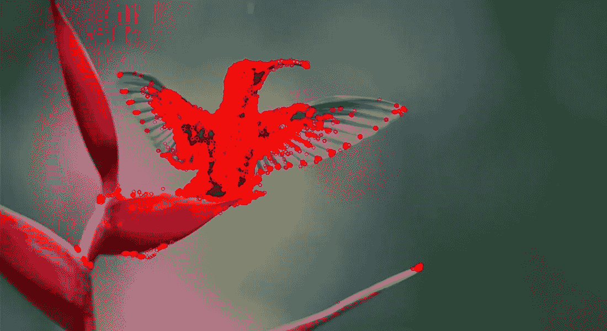

快速角点检测器结果

# 特征匹配

Opencv 文档提到了两种特征匹配方法。即强力匹配器和 FLANN 匹配器。

## 强力匹配器:

蛮力匹配器很简单。它采用第一组中一个特征的描述符，并使用某种距离计算(多种距离计算方法)与第二组中的所有其他特征进行匹配。并且返回最接近的一个。

```
import cv2cv_img1 = cv2.imread('/home/rupali/tutorials/bird.jpg', 0)
cv_img2 = cv2.imread('/home/rupali/tutorials/bird_rotated.jpg', 0)orb = cv2.ORB_create(nfeatures=500)
kp1, des1 = orb.detectAndCompute(cv_img1, None)
kp2, des2 = orb.detectAndCompute(cv_img2, None)# matcher takes normType, which is set to cv2.NORM_L2 for SIFT and SURF, cv2.NORM_HAMMING for ORB, FAST and BRIEF
bf = cv2.BFMatcher(cv2.NORM_HAMMING, crossCheck=True)
matches = bf.match(des1, des2)
matches = sorted(matches, key=lambda x: x.distance)# draw first 50 matches
match_img = cv2.drawMatches(cv_img1, kp1, cv_img2, kp2, matches[:50], None)
cv2.imshow('Matches', match_img)
cv2.imwrite("Match.jpg", match_img)
cv2.waitKey()
```

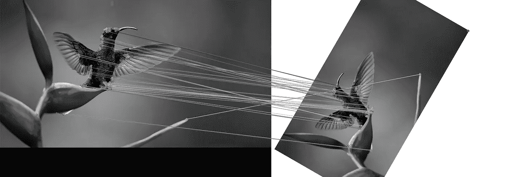

原始图像和 300 度旋转图像之间的暴力图像特征匹配器

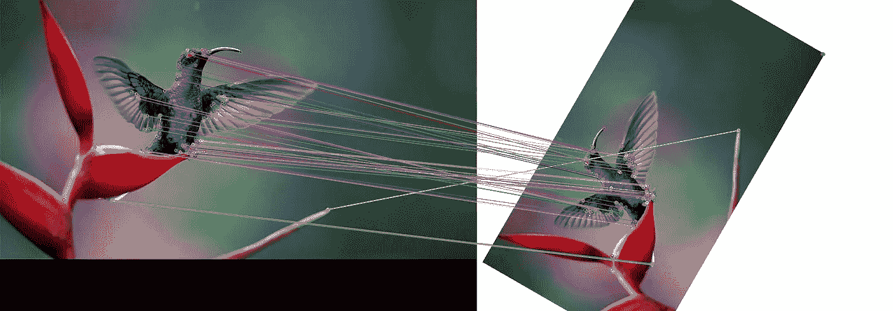

即使在彩色空间也有明显的良好性能

## 弗兰匹配器:

FLANN 使用 SIFT 检测器来获取关键点。为了避免 SIFT、SURF 的使用，我们将通过使用 ORB 检测器和通过校正扭曲的图像来实现匹配操作。

```
import cv2
import numpy as npdef get_corrected_img(cv_img1, cv_img2):
    MIN_MATCHES = 50orb = cv2.ORB_create(nfeatures=500)
    kp1, des1 = orb.detectAndCompute(cv_img1, None)
    kp2, des2 = orb.detectAndCompute(cv_img2, None)index_params = dict(algorithm=6,
                        table_number=6,
                        key_size=12,
                        multi_probe_level=2)
    search_params = {}
    flann = cv2.FlannBasedMatcher(index_params, search_params)
    matches = flann.knnMatch(des1, des2, k=2)# As per Lowe's ratio test to filter good matches
    good_matches = []
    for m, n in matches:
        if m.distance < 0.75 * n.distance:
            good_matches.append(m)if len(good_matches) > MIN_MATCHES:
        src_points = np.float32([kp1[m.queryIdx].pt for m in good_matches]).reshape(-1, 1, 2)
        dst_points = np.float32([kp2[m.trainIdx].pt for m in good_matches]).reshape(-1, 1, 2)
        m, mask = cv2.findHomography(src_points, dst_points, cv2.RANSAC, 5.0)
        corrected_img = cv2.warpPerspective(cv_img1, m, (cv_img2.shape[1], cv_img2.shape[0]))return corrected_img
    return img2if __name__ == "__main__":cv_im1 = cv2.imread('/home/rupali/tutorials/bird.jpg')
    cv_im2 = cv2.imread('/home/rupali/tutorials/bird_rotated.jpg')img = get_corrected_img(cv_im2, cv_im1)
    cv2.imshow('Corrected image', img)
    cv2.imwrite("corrected_image.jpg", img)

    cv2.waitKey()
```

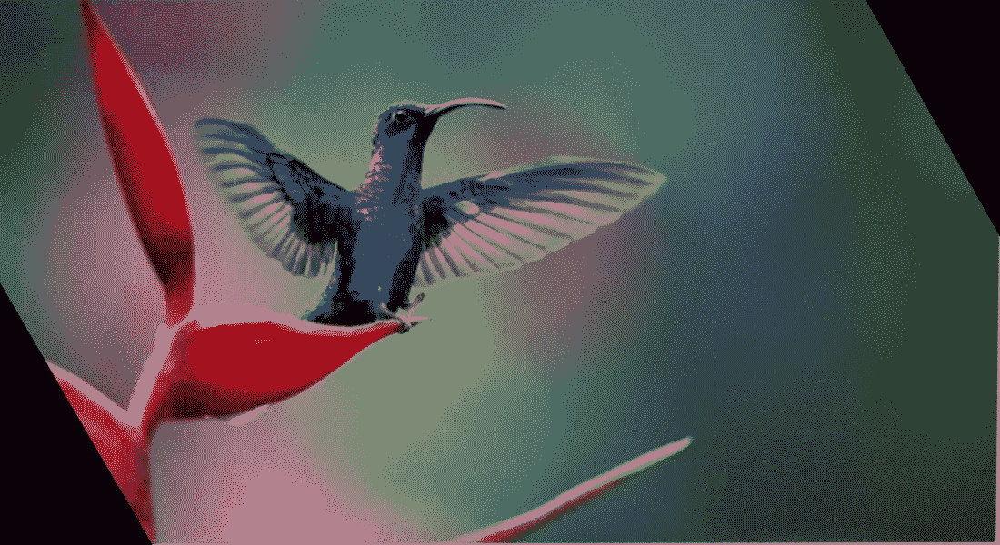

根据基础图像的方向呈现 300 度旋转图像。

# 结论:

这就是核心 opencv 应用程序！提醒一下，讨论仅限于 opencv 最有用的特性。在接下来的文章中，我将从机器学习开始，解释为什么我决定继续进行深度学习。会很有趣的！在那之前，敬请关注，继续学习！