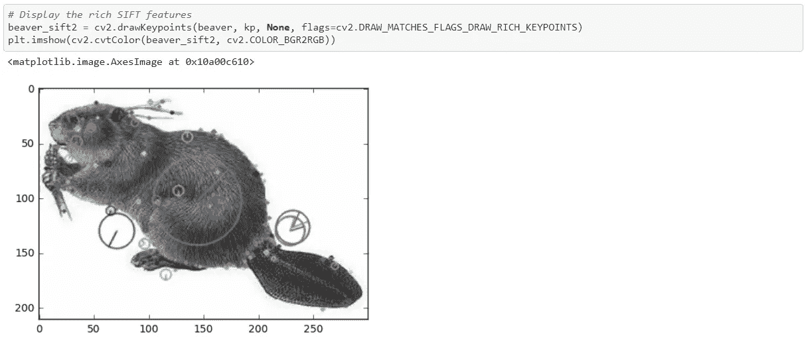

# 用 OpenCV 实现计算机视觉和图像处理

> 原文：<https://medium.com/analytics-vidhya/computer-vision-and-image-processing-with-opencv-8868876618c3?source=collection_archive---------5----------------------->

[***OpenCV***](https://opencv.org/)**“开源计算机视觉库”是一个开源库，包含了数百种计算机视觉算法。使用 OpenCV，你几乎可以完成任何可以想象的计算机视觉任务！**

**现实生活中的问题需要你一起利用多个构建模块来实现预期的结果。所以，你只需要了解需要哪些模块和功能就能得到你想要的！**

**在接下来的几分钟里，我们将快速探究 OpenCV 开箱即用的功能！**

**

*Tanvi Penumudy 2020 —玫瑰绘画:OpenCV 增强前后*

# *涵盖的内容*

1.  ****安装和导入****
2.  ****入门****
3.  ****边缘检测****
4.  ****特征提取****
5.  ****特征匹配****
6.  ****转换****
7.  ****人脸检测****
8.  ****使用视频****
9.  ****其他资源和参考资料****

# ***安装和导入***

## ***装置***

****可以在你的* ***本地机器*** *上通过* ***Python 命令提示******

```
***pip install opencv-python***
```

****参考*[***opencv-python PyPI***](https://pypi.org/project/opencv-python/)**进行故障排除*****

## ****导入 OpenCV****

```
******import** **cv2** *# OpenCV-Python*****
```

> ****就这么简单！****

# ****入门指南****

## *******打开/显示一幅图像*******

************************

## *******修改像素& ROI*******

*   ****您可以使用 Numpy 索引访问/修改单像素或 *ROI(感兴趣区域)*。****
*   ****与矩阵索引一样，`img[a, b]`是指第`a`行和第`b`列。****

********

> ******代码实现:**[https://github . com/tanvipenumudy/Winter-实习-Internity/blob/main/Day % 2005/Day-5% 20 note book-1% 20(OpenCV % 20 basics)。ipynb](https://github.com/tanvipenumudy/Winter-Internship-Internity/blob/main/Day%2005/Day-5%20Notebook-1%20(OpenCV%20Basics).ipynb)****

# ****边缘检测****

****我们现在将使用 ***Sobel 算子*** `cv2.Sobel()`和 ***Canny 边缘检测器*** `cv2.Canny()`检测边缘****

**********

## *****用 Sobel 算子进行边缘检测*****

*****`dst = cv2.Sobel(src, ddepth, dx, dy, ksize=3, scale=1.0)`*****

*   *****`src` : *输入图像******
*   ****`ddepth` : *输出图像深度*****
*   ****`dx` : *导数 x 的阶次*****
*   ****`dy`:*y 的导数的阶*****
*   ****`ksize` : *扩展 Sobel 核的大小；它必须是 1、3、5 或 7*****
*   ****`scale` : *计算出的导数值的可选比例因子*****

****************

## ****Canny 边缘检测****

****`edges = cv2.Canny(image, threshold1, threshold2, apatureSize=3, L2gradient=False)`****

*   ****`image` : *8 位灰度输入图像*****
*   ****`threshold1` / `threshold2` : *迟滞程序的阈值*****
*   ****`apertureSize` : *孔径尺寸为* `*Sobel()*` *操作符*****
*   ****`L2gradient` : *一面旗帜。* `*True*` *要用 L2，要用 L1。*****

****************

> ******代码实现:**[https://github . com/tanvipenumudy/Winter-Internity/blob/main/Day % 2005/Day-5% 20 note book-2% 20(Edge % 20 detection)。ipynb](https://github.com/tanvipenumudy/Winter-Internship-Internity/blob/main/Day%2005/Day-5%20Notebook-2%20(Edge%20Detection).ipynb)****

# ****特征抽出****

****我们现在将看到如何提取 ***SIFT*** *(尺度不变特征变换)*并用 OpenCV-Python 匹配两幅图像的 *SIFT 特征*。****

****************

## ****从图像中提取 SIFT 特征****

*****您需要首先将图像转换成灰度图像*****

****************

# ****特征匹配****

## ****SIFT 特征匹配****

************************

## *******显示比赛*******

********

> ******代码实现:**[https://github . com/tanvipenumudy/Winter-Internity/blob/main/Day % 2005/Day-5% 20 note book-3% 20(Feature % 20 extraction % 20% 26% 20 matching)。ipynb](https://github.com/tanvipenumudy/Winter-Internship-Internity/blob/main/Day%2005/Day-5%20Notebook-3%20(Feature%20Extraction%20%26%20Matching).ipynb)****

# ****转换****

****现在让我们看看如何对图像进行基本操作，如*缩放、平移、旋转、仿射变换和单应性(透视变换)*****

## ****缩放比例****

********

## ****翻译****

********

## ****旋转****

********

## ****仿射变换****

********

## ****单应性****

********

> ******代码实现:**[https://github . com/tanvipenumudy/Winter-Internity/blob/main/Day % 2005/Day-5% 20 note book-4% 20(转换)。ipynb](https://github.com/tanvipenumudy/Winter-Internship-Internity/blob/main/Day%2005/Day-5%20Notebook-4%20(Transformations).ipynb)****

# ****人脸检测****

****使用'***Haarcascades '***的人脸检测是一种基于机器学习的方法，其中用一组输入数据来训练*级联函数*。OpenCV 已经包含了大量的内置分类器*用于*的面部、眼睛、微笑*等。*****

******************

******代码实现:***[*https://github . com/tanvipenumudy/Winter-实习-Internity/blob/main/Day % 2005/Day-5% 20 note book-5% 20(Face % 20 detection)。ipynb*](https://github.com/tanvipenumudy/Winter-Internship-Internity/blob/main/Day%2005/Day-5%20Notebook-5%20(Face%20Detection).ipynb)***

# ***使用视频***

***OpenCV 库可用于对视频 执行多种 ***操作，除了我们在前面章节看到的图像。******

## ***从摄像机捕捉视频***

***为了捕捉视频，我们需要创建一个`VideoCapture object`。VideoCapture 具有设备索引或视频文件的名称。设备索引只是指定哪个摄像机的数字。如果我们通过 **0** 那么它就是为 ***第一个摄像机*** ， **1** 为 ***第二个摄像机*** 等等。我们逐帧捕捉视频*。****

```
**cv2.VideoCapture(0) *# Means first camera or webcam*
cv2.VideoCapture(1) *# Means second camera or webcam*
cv2.VideoCapture("file name.mp4") *# Means video file***
```

## ****播放文件中的视频****

****这是相同的捕捉从相机，只是改变相机索引与视频文件名。此外，在显示画面时，为`cv2.waitKey()`使用适当的时间。****

## ****保存视频****

****所以我们捕捉一段视频，逐帧处理，然后保存这段视频。对于图片，很简单，用`cv2.imwrite()`就可以了。****

> ****这里需要多做一点工作！****

****您还可以使用***cap . get***方法访问该视频的一些功能，其中 ***propId*** 是一个从 ***0 到 18*** 的数字。每个数字代表视频的一个*属性，完整的细节可以在这里看到 [***属性标识符***](http://docs.opencv.org/modules/highgui/doc/reading_and_writing_images_and_video.html#videocapture-get) ***。********

> ***今天就到这里吧！我知道一下子很难接受。但是你坚持到了最后！恭喜你。***

****还有，别忘了通过****——***[***OpenCV 文档***](https://docs.opencv.org/master/)***

# ***其他资源和参考***

> ***OpenCV 已经存在了一段时间，如果您仍然有兴趣充分利用这个库，还有很多其他的好资源。***

*   ***[*https://opencv-python-tutro als . readthedocs . io/en/latest/py _ tutorials/py _ GUI/py _ video _ display/py _ video _ display . html*](https://opencv-python-tutroals.readthedocs.io/en/latest/py_tutorials/py_gui/py_video_display/py_video_display.html)***
*   ***[*https://github.com/dalgu90/opencv-tutorial*](https://github.com/dalgu90/opencv-tutorial)***
*   ***[*https://towards data science . com/computer-vision-for-初学者-part-1-7cca775f58ef*](https://towardsdatascience.com/computer-vision-for-beginners-part-1-7cca775f58ef)***

******要了解完整的实现，请查看我的 GitHub 库—******

***[](https://github.com/tanvipenumudy/Winter-Internship-Internity/tree/main/Day%2005) [## tanvipenumudy/Winter-实习-实习

### 存储库跟踪每天分配的工作-tanvipenumudy/Winter-实习-实习

github.com](https://github.com/tanvipenumudy/Winter-Internship-Internity/tree/main/Day%2005) 

***本文精选 GitHub Gists—***

*   [*https://gist . github . com/tanvipenumudy/3e 70 b 917371 c 521 a9 a72 f 267007 eff 58*](https://gist.github.com/tanvipenumudy/3e70b917371c521a9a72f267007eff58)
*   [*https://gist . github . com/tanvipenumudy/bfb 60186 CFA 9 b 61 c 865 fff 8d 9 ed 66490*](https://gist.github.com/tanvipenumudy/bfb60186cfa9b61c865fff8d9ed66490)
*   [*https://gist . github . com/tanvipenumudy/81 f 7 fcf 0407557 bb 6 f 377 c 64 CD D1 f 80 a*](https://gist.github.com/tanvipenumudy/81f7fcf0407557bb6f377c64cdd1f80a)***