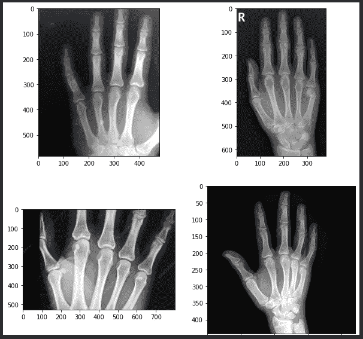
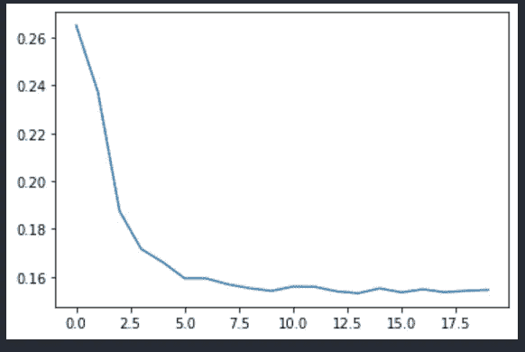
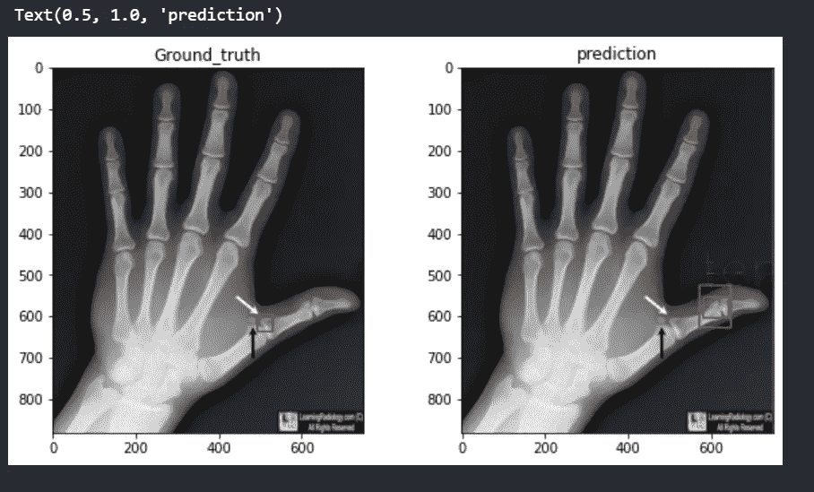
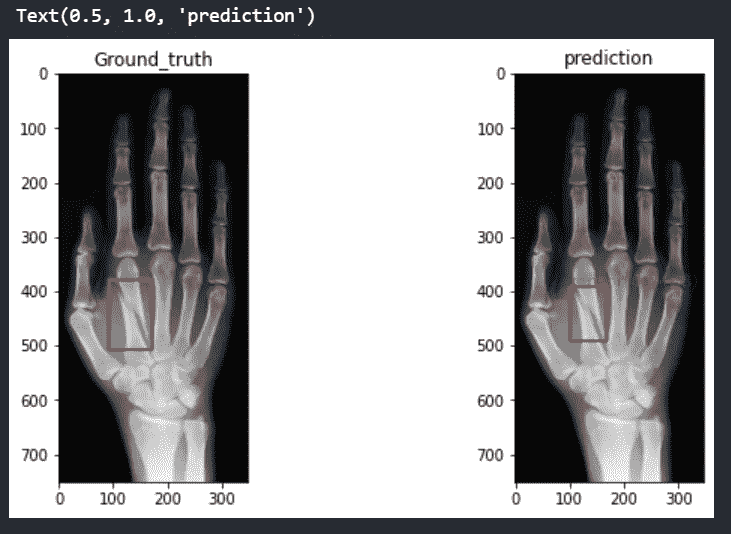
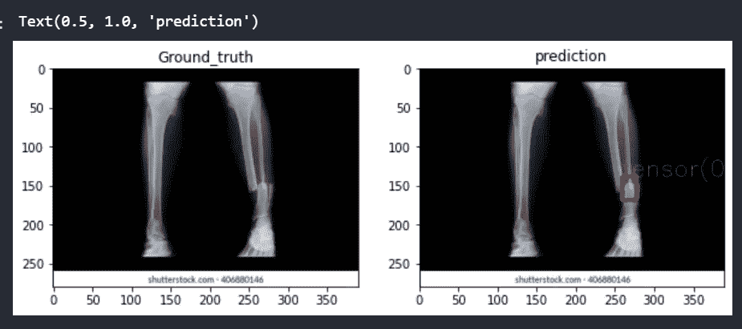
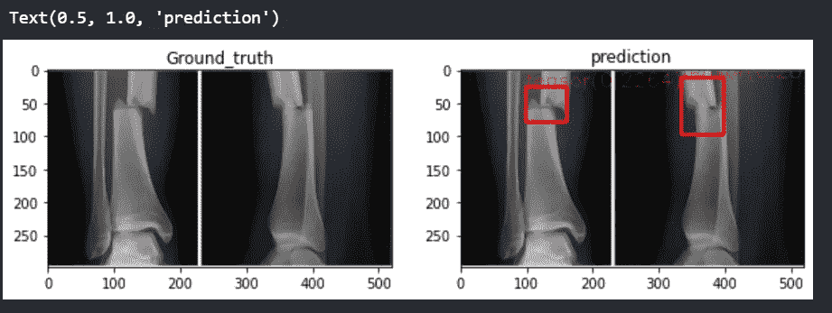

# 医疗保健中的计算机视觉:骨折检测

> 原文：<https://medium.com/analytics-vidhya/computer-vision-in-healthcare-detection-of-fractures-3313fe6452fc?source=collection_archive---------11----------------------->

自从机器学习出现以来，世界已经进化了很多，以适应几乎所有领域的人工智能系统。医疗保健领域取得巨大进步的主要领域之一，机器学习帮助解决了一些关键问题。从分析 x 射线到检测重要器官中的肿瘤，计算机视觉在医疗保健领域帮助很大。在本文中，我们将了解如何利用物体检测来分析人手骨折。如果你看到一张 x 光片，有时你可能无法正确地检测出骨折，除非你是一名训练有素的内科医生或医生。因此，让我们看看我们是否可以尝试使用深度学习方法来检测它们。

**检测器:**

对于这个实验，我使用了一个名为“ [detecto](https://pypi.org/project/detecto/) 的 python 库，它是一个包装器，用几行代码实现了对象检测算法。这个库的后端是用 PyTorch 编写的，目前只有 FasterRCNN 可用于检测和训练目的。请阅读各种博客，了解关于不同对象检测模型及其差异的更多信息。

我从 [kaggle](https://www.kaggle.com/harshaarya/fracture) 取回了这个实验的数据集。让我们看看一些图像，看看我们是否能在这些图像中发现裂缝。

老实说，肉眼看不到任何裂缝，可能需要一段时间才能发现。但是通过利用深度学习方法，我们实际上可以高效快速地轻松检测到骨折，而无需花费时间和疲劳我们的眼睛。

数据集的注释是 Pascal VOC 格式，可以转换为 csv 格式，用于训练模型。一旦我们转换了注释，我们就可以开始用 4 行代码训练模型，如下所示。

在上面的要点中，首先我将 XML 注释转换成 csv 格式，以便库可以使用。然后用训练和验证图像创建数据集。最后一步是为数据集创建一个数据加载器，为模型定义类并训练它，没有任何麻烦。简单的一个对吗？我还绘制了训练时发生的损失，以监控模型是否在学习。

损失与时代

正如我们在上面看到的，模型训练得很好，观察到损失随着每个时期的增加而下降。好吧，那么，让我们去分析不同图像上的模型。

下面是我通过将阈值保持在 0.4 来推断模型时收集的一些结果。我们可以很容易地看到，该模型已经训练好，它能够准确地捕捉断裂位置。可以使用训练数据的增加来进一步微调该模型，并且我们可以保持更高程度的置信度得分，而不是 0.4。

因此，我有一个小小的想法，如果这个模型可以进一步检查其他骨折的 x 射线图像，例如:无论是腿，手臂或我们身体的任何其他骨骼区域。我有这个想法是因为所有的 x 射线都有相似的特征集，比如它们都是灰度的，骨骼有强烈的明亮区域，而背景是黑色的，所以我认为它也可以对其他 x 射线起作用。为什么我们不能自己检查一次。

下面是小腿区域骨折的图像，这里肉眼很容易检测到，我们的模型也能够检测到，没有任何问题

下图是手臂中部骨折的 x 光照片。它再次被模型捕捉到

但这里的限制是，我将阈值保持在一个较小的数字，在本例中为 0.2。添加更多数据并选择另一种算法可能会产生更好的结果。你可以看看这个[笔记本](https://www.kaggle.com/vishnunkumar/detect-fracture-detection)关于它是如何实现的，请给出建议。

所以，伙计们，感谢你们阅读这篇文章，我希望它对你们来说是一篇好文章。

在疫情期间保持安全，让我们很快克服这一点。