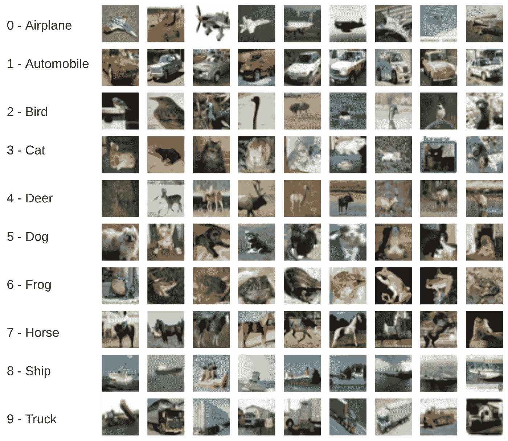
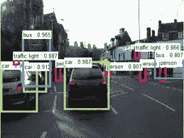

# 人工智能领域中的计算机视觉及其发展

> 原文：<https://medium.com/analytics-vidhya/computer-vision-in-the-field-of-ai-and-its-growth-3dcd633626c3?source=collection_archive---------25----------------------->

当前人工智能领域的发展在我们周围制造了许多嗡嗡声……每个人都对人工智能这个术语、它创造的头条新闻、以及它提供的应用感到兴奋。人工智能现在被视为超级力量，其开发者被视为超级英雄(不完全是，但有时是)。

那么这个 AI 是什么，计算机视觉跟它有什么关系。人工智能的定义不是很清楚。研究人员和科学家正在研究它。但是现在我们可以把人工智能看作是自动化的东西。任何自动完成的事情都是人工智能的一部分。但是这是什么呢？？

任何事物都包括图像、文本、数字、语音和声音，而后者 4 适合文本处理或一些机器学习算法。图像需要特别小心，并用于开发各种实时应用程序。

这就是计算机视觉(CV)出现的原因。根据定义，计算机视觉研究机器如何从图像或视频中获得更好的理解。CV 在短时间内的积累引起了很多人的关注。

从将数字彩色图像转换为黑白图像到自动驾驶汽车，计算机视觉已经被广泛应用。怎么可能呢？导致这种激增的因素是什么？？。你会在下面找到它。

# 成长的原因

导致计算机视觉发展的重要原因首先是它所解决的问题。

## 使用案例:

1)图像彩色化:将彩色图像转换成灰度图像很简单，但是反过来的过程呢？即将灰度图像转换成彩色图像。很酷不是吗？

灰度图像到 BGR 图像

2)图像分类:识别图像的类型给定一幅图像，我们可以训练一个可以预测图像类别的模型。该应用程序广泛用于各种应用程序，如分类图像和查找特定类别的图像。

图像分类

3)目标检测:目标检测是图像分类与定位的广泛应用。对象检测将图像的每个片段或集合视为对象，并返回图像中对象的类型和位置。

对象检测检测图像中的各种类别

4)更多。

## 开放源码

开源也是计算机视觉应用增长和使用背后的一个原因。现在，各种各样的公司已经开始外包他们的软件，这样任何想要创建强大和有影响力的产品和应用程序的人都可以使用它，而不需要支付大量的费用。这鼓励了许多开发者和创新者为开源做出贡献，为语言带来了更多的进步。

**Open CV** 就是这样一个框架。其主要针对实时计算机视觉应用。20 年前由英特尔发布的 Open CV 已经成为让每个人都能使用计算机视觉的重要工具。背后的主要原因是使它开源。Open CV 很容易与 **Python，C++等**集成。

## 开发者社区

当一个框架或软件是开源的，通常会有更多的用户尝试和测试这个框架。自从开源以来，框架已经成为人工智能领域的一个热点。开发者社区也相当庞大。为开发者社区增加数据和计算的可用性也是使更多开发者能够使用计算机视觉贡献和构建应用的原因，这在**云计算的帮助下成为可能。**

因此，计算机视觉可以在解决问题中发挥巨大的作用，有效地利用资源并得出有效的解决方案就在我们手中。

下面是一个关于计算机视觉实时应用的博客。一定要退房。

 [## 反无人机的探测与跟踪

### 概观

medium.com](/srmscro/detection-and-tracking-for-anti-drone-d0894a5907b)