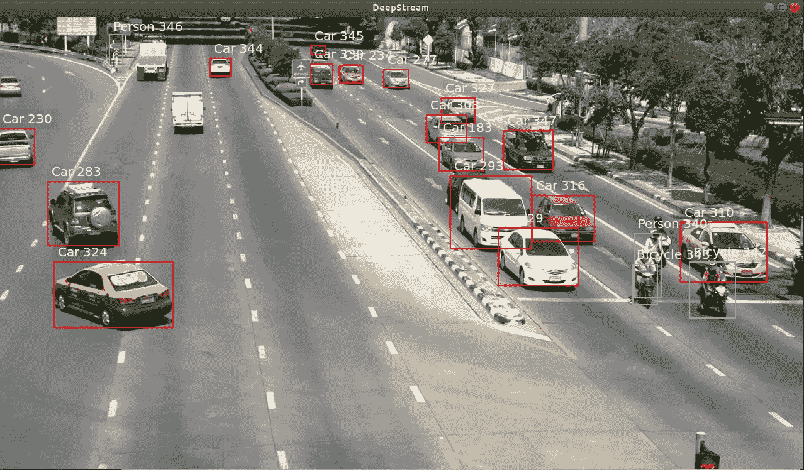
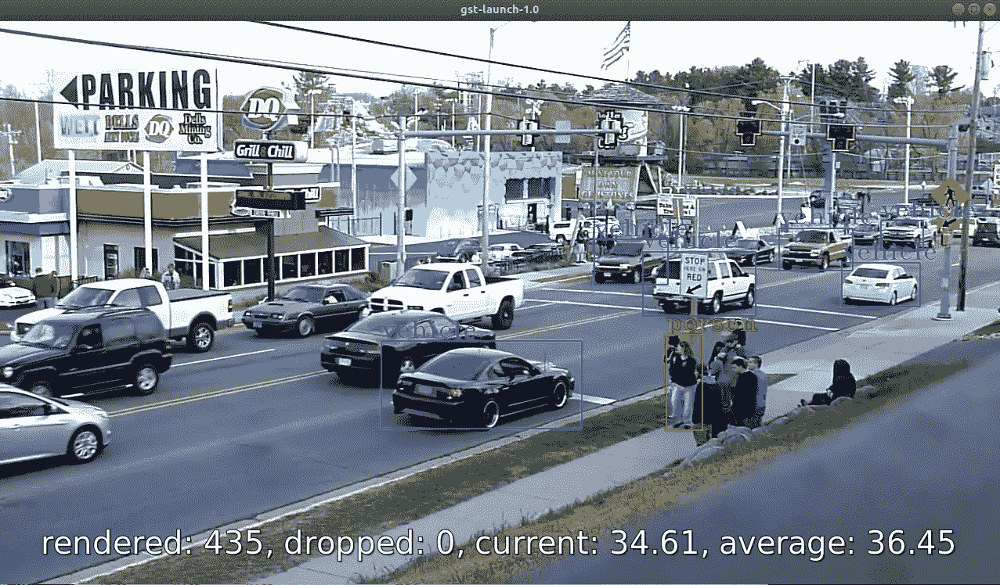
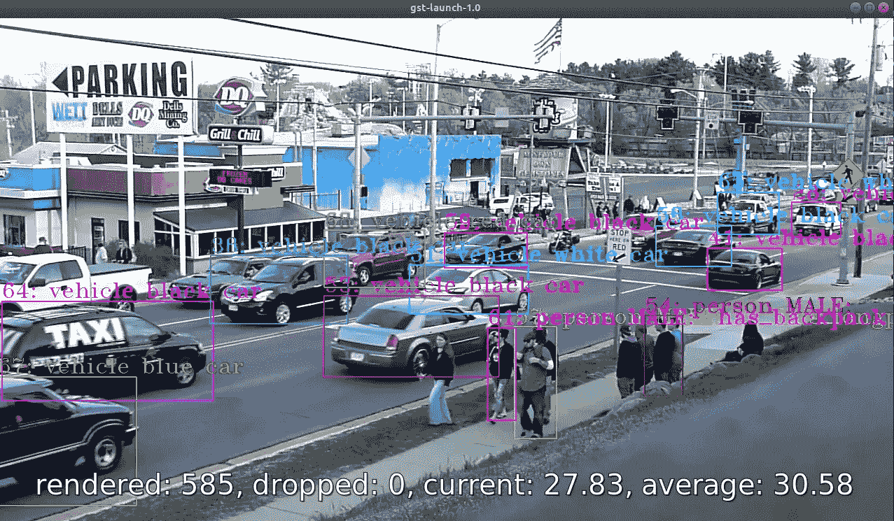
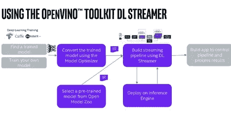
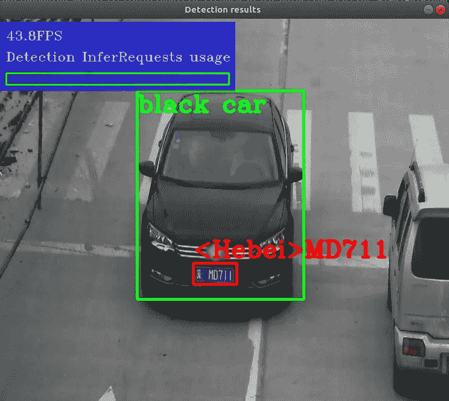
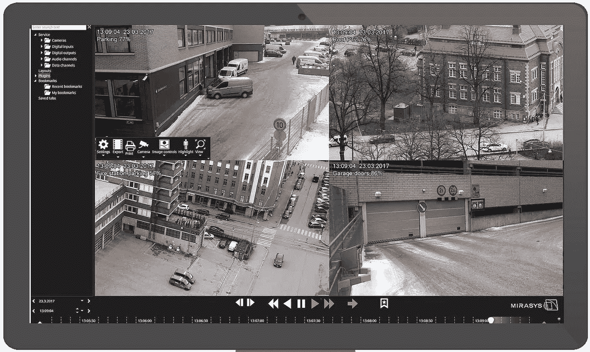

# CPU 上的计算机视觉

> 原文：<https://medium.com/analytics-vidhya/computer-vision-on-cpu-c0beb301185a?source=collection_archive---------5----------------------->



Y ear-2021 年，世界正遭受致命的疫情，各国都在进出封锁。每一个商业、贸易、市场都经历了近期的低谷。其中之一是芯片行业，随着全世界都接受在家工作(WFH)成为新常态，电子产品的需求和销售飙升，伴随着全球物流和全国范围的停工，供需之间出现了巨大的缺口。芯片现在是继空气、水、火和土之后的第五种生命元素。芯片被用于日常设备中，这多亏了物联网设备，甚至连面包机都是通过 Alexa 操作的。GPU 也被称为人工智能计算的心脏，是一种非常罕见和昂贵的商品，GPU 短缺的另一个原因是加密货币——比特币和 ethrium 在过去 10 个月里增长了大约 800%，迫使更多的 GPU 进入采矿世界。过去花费数百美元的 GPU 现在远高于数千美元的价格范围，这使得初学者很难投资于它，因为知道在 8-10 个月内价格会再次下降。

所以当道路未知时，一个人如何开始一段旅程，幸运的是，GPU 不是唯一可以执行计算机视觉任务的设备。英特尔一直在不懈地努力将人工智能计算核心纳入其 CPU 产品线，如果你有 2017 年或更早的英特尔 CPU，你可能可以在其上运行推理，而不需要专用的 GPU。显然，当你从专用 GPU 转向 CPU 时，会有一个权衡，例如复杂的设置、陡峭的学习曲线以及大量的耐心和性能。我们将讨论整个过程，最后，您可以决定是否值得花钱或投入时间来学习新技能，也许会获得更好的表现。声明:我们只处理计算机视觉的推理部分，而不是训练部分，训练仍然需要 GPU。

本文将简单地列出这个过程，而不会深入讨论相关的包和库。为了在 5 分钟内得到快速的结果，跳转到我的 [git-hub repo](https://github.com/deep28vish/Computer_Vision_on_CPU) 。不需要预先的编码技能。要了解 GPU 中的推理，请查看[这个](https://github.com/deep28vish/DeepStream)。计算机视觉是一个非常庞大的主题，不可能在本文中涵盖每个方面，相反，本文只是处理这项工作的最后一部分，即在视频上运行推理。您可能听说过 TF、Pytorch 和其他框架，它们将为您提供从头开始设计自己的 CNN 模型、对其进行训练、优化和运行推理的完整权限。但是它们不容易扩展，并且需要 python/c++编码技能才能运行。这里，我们将只对转换为 IR(中间表示)格式的预训练权重进行推理。为此，我们将使用一个非常古老和可靠的基于管道的多媒体框架，称为 [GStreamer](https://gstreamer.freedesktop.org) 。这个框架使用类似于乐高积木的元素，以特定的方式排列它们，你就有了一个运行的管道。这里的管道是指一组元素，它们以某种方式排列，接受一些输入并产生一些输出。我们的工作将是使用这个乐高以及一些由英特尔定制设计的乐高，并安排他们，使他们采取视频输入运行推理，并产生输出。上面提到的 [git-hub repo](https://github.com/deep28vish/Computer_Vision_on_CPU) 包含了很多这样的管道，可以用 shell 脚本执行。sh 扩展名，或者您可以直接复制粘贴下面提到的管道。两者的目的是一样的。sh 文件给你一个更好的理解，一旦你打开它，看到单独的乐高块。在任何时候，如果您需要对自己的. mp4 文件进行推理，请将该文件移动到此目录，打开相关的。sh 文件，并在位置选项卡下更改文件名，添加新的文件名。


迄今为止，人工智能已经与 GPU 及其性能统计紧密联系在一起，虽然拥有 GPU 很好，但不是强制性的。英特尔一直致力于其核心架构，以在 CPU-core 本身上运行推理，如果您需要可扩展性，有各种插件可用于插入和运行推理，例如— [英特尔 NCS](https://software.intel.com/content/www/us/en/develop/hardware/neural-compute-stick.html) ，它可以插入边缘设备，如 raspberry pie、Arm 设备、英特尔 NUC。这给你按需推断。如果你正在寻找更强大的东西，并有空间给 PCIe 插槽，你可以寻找 [IEI 的野马-F100-A10](https://www.ieiworld.com/mustang-v100/en/) 。这将多次扩展您的模型，即使无法完成任务，您也可以选择服务器级[英特尔金牌](https://www.google.com/url?sa=t&rct=j&q=&esrc=s&source=web&cd=&cad=rja&uact=8&ved=2ahUKEwjbzv-Z2PnwAhWL4jgGHdnuBTwQFjALegQIERAD&url=https%3A%2F%2Fwww.intel.com%2Fcontent%2Fwww%2Fus%2Fen%2Fproducts%2Fprocessors%2Fxeon%2Fscalable%2Fgold-processors.html&usg=AOvVaw0sjzQQm6OwxufCfeOQaVWU)处理器，这些处理器经过了大量优化，可以运行多个计算机视觉模型实例。

ets begin:Pre-requests:Ubuntu 18.04 LTS，Min。硬盘- 15GB，最低。内存— 4 GB，英特尔处理器。

Git-Hub — [计算机视觉中央处理器](https://github.com/deep28vish/Computer_Vision_on_CPU)

我们将从第一个 [docker](https://docker-curriculum.com) 开始，因为 docker 给你一个完全独立的操场来运行你的实验，而且它是 100%可复制的。如果你没有听说过 docker，不要担心，把[这个](https://github.com/deep28vish/Computer_Vision_on_CPU)回购放在手边，我会一路解释。截至 2021 年，几乎所有主要的软件/SDK/包/工具都以 docker 映像的形式出现。可以从[这里](https://docs.docker.com/engine/install/ubuntu/)下载。要安装 docker，请点击这个或上面提到的 git 链接。Docker 让你为你感兴趣的包创建一个隔离的环境。典型的方法是我们下载我们需要的包的 docker 映像，然后创建一个具有唯一名称的容器。您可以从同一个图像创建多个容器。这些映像还允许您在操作系统中挂载现有的文件夹。为了开始我们的探索，我们将在“Documents”文件夹中克隆 [git-hub repo](https://github.com/deep28vish/Computer_Vision_on_CPU) 。之后，我们需要下载 docker 映像并运行 docker 容器，这两者都可以通过使用。请记住，这个 docker 映像是每个工具和库都预装的，您不需要安装任何东西。

```
sudo docker run -it -e DISPLAY=$DISPLAY — network=host -d — name opv1 -v $HOME/Documents/Computer_Vision_on_CPU/:/home/ — privileged — user root openvino/ubuntu18_data_dev 
```

这将下载所需的映像并创建一个名为“opv1”的容器，同时我们将 GitHub-repo 从 documents 文件夹挂载到容器的 home 文件夹中。在进入容器之前，我们需要向主机授予一些权限，以便我们的容器可以显示视频输出。为此，我们将使用`xhost +`。现在我们可以安全地通过

```
sudo docker exec -it — workdir /home — user root opv1 bash
```


通过键入`ls`,我们可以看到所有文件和文件夹的列表，我们的模型有 3 个组件，这是推理所必需的。xml，。为了我们的需要，我把它们分离出来，方便地放在文件夹里。您还可以看到以 v1、v2、v3 结尾的文件。这样做是因为我们的方法是基于 GST 管道之上的，这个管道有其插件/元素，负责所有的视频处理任务。其中之一是显示输出，根据您使用的英特尔 CPU 版本，您可能会面临一些兼容性问题。要检查哪种显示元素(又名 SINK)适用于您的机器，请尝试使用

```
gst-launch-1.0 -v videotestsrc pattern=snow ! video/x-raw,width=1280,height=720 ! xvimagesink
```

如果没有看到雪花图案视频输出，请将最后一个元素“xvimagesink”替换为“ximagesink”或“autovideosink”。上面的任何一个都可以，它们都有相应的版本号。假设你通过使用“ximagesink”看到显示输出，这意味着你必须在剩余的教程中坚持使用 V2。我们已经准备好看到结果了。第一次是在视频上运行唯一的检测，在我们使用的这个模型中，我们有 3 个检测类别，即人、自行车、车辆。让我们看看如何运行它。

```
./only_detection_v1.sh
```

是的，就是这么简单。sh 文件中已经预先构建了整个管道，您只需要通过键入上面的命令来运行它，您将只使用为您工作的版本号。当您点击 enter 键时，您将会看到一些关于模型名称、路径和管道中使用的文件的详细信息。它还将显示如下所示的管道:



```
gst-launch-1.0 filesrc location=traffic_cam_intel.mp4 ! decodebin ! gvadetect model=model_intel/person-vehicle-bike-detection-crossroad-0078/FP32/person-vehicle-bike-detection-crossroad-0078.xml model-proc=model_proc/person-vehicle-bike-detection-crossroad-0078.json device=CPU threshold=0.75 inference-interval=1 nireq=4 ! queue ! gvawatermark ! videoconvert ! gvafpscounter ! fpsdisplaysink video-sink=xvimagesink sync=false
```

对于对象检测+跟踪类型:

```
./only_detection_track_v1.sh 
```

这将给出管道为:

```
gst-launch-1.0 filesrc location=traffic_cam_intel.mp4 ! decodebin ! gvadetect model=model_intel/person-vehicle-bike-detection-crossroad-0078/FP32/person-vehicle-bike-detection-crossroad-0078.xml model-proc=model_proc/person-vehicle-bike-detection-crossroad-0078.json device=CPU threshold=0.75 inference-interval=1 nireq=4 ! queue ! gvatrack tracking-type=short-term ! queue ! queue ! gvawatermark ! videoconvert ! gvafpscounter ! fpsdisplaysink video-sink=xvimagesink sync=false
```

对于对象检测+跟踪+分类 x2:

```
./only_detection_track_person_car_classify_two_v1.sh
```

这个有检测+跟踪+人员属性分类+车辆属性分类，其商品及服务税管道看起来像:



```
gst-launch-1.0 filesrc location=traffic_cam_intel.mp4 ! decodebin ! gvadetect model=model_intel/person-vehicle-bike-detection-crossroad-0078/FP32/person-vehicle-bike-detection-crossroad-0078.xml model-proc=model_proc/person-vehicle-bike-detection-crossroad-0078.json device=CPU threshold=0.75 inference-interval=1 nireq=4 ! queue ! gvatrack tracking-type=short-term ! queue ! gvaclassify model=model_intel/person-attributes-recognition-crossroad-0230/FP32/person-attributes-recognition-crossroad-0230.xml model-proc=model_proc/person-attributes-recognition-crossroad-0230.json reclassify-interval=1 device=CPU object-class=person ! queue ! gvaclassify model=model_intel/vehicle-attributes-recognition-barrier-0039/FP32/vehicle-attributes-recognition-barrier-0039.xml model-proc=model_proc/vehicle-attributes-recognition-barrier-0039.json reclassify-interval=10 device=CPU object-class=vehicle ! queue ! gvawatermark ! videoconvert ! gvafpscounter ! fpsdisplaysink video-sink=xvimagesink sync=false
```

让我们分解管道，了解这里发生了什么:filesrc 是一个定位我们想要使用的. mp4 的元素，您可以自由地使用自己的视频，只需更改管道中的名称。`gvadetect`是一个英特尔构建的元素，它需要一个模型地址来运行推理，因为我们现在有来自 filesrc 的视频，它将在这里进行检测。车辆、人、自行车等被跟踪的对象需要被跟踪，这由`gvatrack`完成，它为每个对象分配一个唯一的 ID。现在跟踪之后，我们需要对人进行分类，这将通过使用`gvaclassify`来完成，这也需要存储在 model_intel 文件夹中的分类模型的地址。车辆分类也是如此。在我们获得所有数据后，我们需要在视频上绘制相关的边界框。这是由`gvawatermark`完成的，如果没有这个，你将不会在视频上看到任何图形。因为我们也支持最佳性能，我们需要看到视频上的 FPS 数字以及外壳，所以我们分别使用`gvafpscounter` & `fpsdisplaysink`。点击了解更多关于 gva 元素[的信息。](https://github.com/openvinotoolkit/dlstreamer_gst/wiki/Elements)



像`decodbin`、`queue`、`videoconvert`这样的剩余元素是将视频从一个元素传递到另一个元素以及播放和理解视频管理部分/调整其大小/流传输它所必需的。点击了解商品及服务税元素[。一旦您的推断生效，您现在可能会关注 CPU 的使用情况，很有可能它会徘徊在 98–100%之间。这是因为`gvadetect` & `gvaclassify`正在使用其默认设置来利用未优化的 CPU 内核。使用相同类型的优化版本:`./adv_detection_tracking_classification.sh`这将使用 gvadetect 元素的一些额外的指令集来运行管道。](https://gstreamer.freedesktop.org/documentation/application-development/basics/elements.html?gi-language=c)

```
gst-launch-1.0 filesrc location=traffic_cam_intel.mp4 ! qtdemux ! avdec_h264 max_threads=4 ! gvadetect model=model_intel/person-vehicle-bike-detection-crossroad-0078/FP32/person-vehicle-bike-detection-crossroad-0078.xml model-proc=model_proc/person-vehicle-bike-detection-crossroad-0078.json threshold=0.75 inference-interval=1 model-instance-id=detect cpu-throughput-streams=4 nireq=1 ie-config=CPU_BIND_THREAD=NO,CPU_THREADS_NUM=16 ! queue ! gvatrack tracking-type=short-term ! queue ! gvaclassify model=model_intel/person-attributes-recognition-crossroad-0230/FP32/person-attributes-recognition-crossroad-0230.xml model-proc=model_proc/person-attributes-recognition-crossroad-0230.json reclassify-interval=1 device=CPU object-class=person ! queue ! gvaclassify model=model_intel/vehicle-attributes-recognition-barrier-0039/FP32/vehicle-attributes-recognition-barrier-0039.xml model-proc=model_proc/vehicle-attributes-recognition-barrier-0039.json reclassify-interval=10 device=CPU object-class=vehicle ! queue ! gvawatermark ! videoconvert ! gvafpscounter ! fpsdisplaysink video-sink=xvimagesink sync=false
```

特别是:

```
inference-interval=1 model-instance-id=detect cpu-throughput-streams=4 nireq=1 ie-config=CPU_BIND_THREAD=NO,CPU_THREADS_NUM=16
```

现在，您必须为 CPU-throughput-streams & CPU _ THREADS _ NUM 尝试不同的值，目前它们是为 6 核计算机配置的，使用率下降到大约 80%。对于 CPU-through-put-streams，请尝试 2 的倍数的不同值，对于 CPU_THREADS_NUM，请尝试 8 的倍数的不同值。这将有助于更好的核心绩效管理。为了在 60+范围内获得更好的 FPS，我们将转向 INT8 模型权重，与我们从一开始就使用的 FP32/FP26 相比，这需要更少的计算能力。INT8 的所有权重都已经存在，我们只需更改 gvadetect -Run 的路径:`./adv_detection_tracking_classification_liste.sh`

```
gst-launch-1.0 filesrc location=traffic_cam_intel.mp4 ! qtdemux ! avdec_h264 max_threads=4 ! gvadetect model=model_intel/person-vehicle-bike-detection-crossroad-0078/FP16-INT8/person-vehicle-bike-detection-crossroad-0078.xml model-proc=model_proc/person-vehicle-bike-detection-crossroad-0078.json threshold=0.75 inference-interval=10 model-instance-id=detect cpu-throughput-streams=4 nireq=1 ie-config=CPU_BIND_THREAD=NO,CPU_THREADS_NUM=16 ! queue ! gvatrack tracking-type=short-term ! queue ! gvaclassify model=model_intel/person-attributes-recognition-crossroad-0230/FP16-INT8/person-attributes-recognition-crossroad-0230.xml model-proc=model_proc/person-attributes-recognition-crossroad-0230.json reclassify-interval=10 device=CPU object-class=person ! queue ! gvaclassify model=model_intel/vehicle-attributes-recognition-barrier-0039/FP32/vehicle-attributes-recognition-barrier-0039.xml model-proc=model_proc/vehicle-attributes-recognition-barrier-0039.json reclassify-interval=10 device=CPU object-class=vehicle ! queue ! gvawatermark ! videoconvert ! gvafpscounter ! fpsdisplaysink video-sink=xvimagesink sync=false
```

通过使用上述管道，您将看到 FPS 性能的显著提高和 CPU 内核利用率的平衡。在 [GitHub repo](https://github.com/deep28vish/Computer_Vision_on_CPU) 中提到了一些额外的管道，可以让你实时地在你的 IP camera feed 中运行推理。如果您想以 mp4 格式存储推理视频，您可以通过以下管道来实现:

```
gst-launch-1.0 filesrc location=traffic_cam_intel.mp4 ! decodebin ! gvadetect model=model_intel/person-vehicle-bike-detection-crossroad-0078/FP32/person-vehicle-bike-detection-crossroad-0078.xml model-proc=model_proc/person-vehicle-bike-detection-crossroad-0078.json device=CPU threshold=0.75 inference-interval=1 nireq=4 ! queue ! gvawatermark ! videoconvert ! x264enc ! mp4mux ! filesink location=traffic_cam_intel_output.mp4
```

这是我在这里给出的几个工作示例，你有很多可能性，比如通过 UDP/RTSP 转发推理视频，附加一个数据库来记录所有的包围盒数据以及跟踪 id。您可以根据自己的喜好定制管道。

一个典型的例子是 ANPR(自动车牌识别)，这个例子已经存在于你正在运行的 docker 容器中，要使它工作，你只需运行。sh 文件，地址是:

```
root@kuk:/home#/opt/intel/openvino/deployment_tools/demo/demo_security_barrier_camera.sh
```

这将启动管道，因为我们已经没有相关的权重，下载将开始，一分钟后你会在你的屏幕上看到这个图像:



现在，您可以清楚地看到，借助简单易用的英特尔管道，我们可以拥有各种各样的应用。`gvapython`是一个可以与您当前的管道集成的元素，允许您对输出图像和元数据(检测边界框、跟踪 ID、类)进行后处理。你可以用它来制作你自己的模型来跟踪汽车/行人。

可以通过该管道轻松实现的一些用例有:

*   游荡检测:你可以从闭路电视中定义一个区域，并使用 gvapython 检查是否有人/车违反了该区域的限制。这是一个简单的 if，else 逻辑，使用这个代码片段你可以附上你的电子邮件 ID，现在你有了一个非常简单的基于 AI-CPU 的程序，如果有人违反了预定义的区域，它会用电子邮件向你发送图像。
*   禁止停车检测:同样的概念可以应用于此，相反，我们必须只过滤我们定义的 ROI(感兴趣区域)中的车辆。只要有任何车辆进入禁止区域，我们就会收到一封电子邮件，我们还可以包括上述管道中显示的车辆属性分类，结合 ANPR，我们可以将停在禁止停车区的汽车的品牌、型号、颜色和车牌等信息堆积起来。
*   火灾/烟雾探测:这基于相同的概念，你必须建立一个独家的 CNN 模型，并在一些架构上对其进行训练，例如 yolov3，训练后，你可以将 yolov3 重量转换为 IR 格式，这将简单地插入我们现有的管道。gvametapublish & gvametaconvert 将帮助您向您选择的数据库发送警报。
*   速度检测:gvatrack 元素跟踪检测到的对象，对象可以是你的识别模型被训练寻找的任何东西。跟踪有助于我们唯一地识别每一个探测到的物体。现在，因为我们有一个跟踪号码，我们可以用它来确定车速。由于我们也有一个车辆的 BBox，这个 BBox 可以减少到帧中的 1 个点，并分配跟踪号。所以我们看到的不是整辆车，而是代表一辆车的单个像素。由于相机是固定的，我们将采用现实世界中距离的近似值，即从某个固定点 A 到某个固定点 B 的距离为 1 米，我们的单像素汽车在 10 帧内从点 A 到点 B，假设我们的相机以 30FPS 的速度记录，我们可以说，车辆穿越 1 米需要 1/3 秒，相当于车辆的速度大约为 3m/s ~ 10km/h。这是一个非常粗略的估计，但不会与实际速度相差太远。根据你调整变量的精确程度，你可以很容易地达到 90%以上的精确度。
*   人/车计数器:这种模型在各种处理人群、医院、商场、音乐会、体育场、停车场等等的地方都有应用。这也是基于探测和跟踪物体的原理，你可以画一条虚拟线，一旦探测到的物体越过这条线，我们就把计数器加 1，同样的逻辑反过来应用，就会得到一个计数器。这将为您提供进出设施的人数，以及停车场的车辆。

举几个例子，你总是可以自由地发挥创造力，根据自己的需要设计自己的用例，比如机场摄像头可以进行武器检测，工厂车间可以进行头盔检测，快餐可以进行手套检测等等。所有这些都可以很容易地实施，并用于少量摄像机，我们也没有记录任何东西，我们刚刚看到实时/存储的馈送分析，我们可以建立逻辑和实施警报生成系统。



考虑智能城市、工厂、大学、体育场、多层停车场、酒店的情况..诸如此类。这些地方通常配备有 100 或 1000 个摄像头，通过简单的管道处理如此多的摄像头将成为一项极其复杂的任务。这项艰巨的任务由[Mira sys](https://www.mirasys.com)-[data vision Company](https://www.google.com/url?sa=t&rct=j&q=&esrc=s&source=web&cd=&cad=rja&uact=8&ved=2ahUKEwjUr_Kt2vnwAhUBQH0KHTGzATkQFjABegQIAhAD&url=http%3A%2F%2Fwww.mirasysindia.com%2F&usg=AOvVaw2hKeJO6s7po44-7Qxf6ymc)管理和监督，他们提供了一个完整的包，用于安全地处理、记录和检索来自 1000 多个摄像头的视频馈送，界面简单易用。有了 50 多个准备部署的用例，监控和及时响应任何警报变得容易多了。您可以自由地在一台摄像机上运行多个用例，或者在多台摄像机上运行单个用例。所有用例都可以集成并视为一个平台，以控制监控的各个方面。

在这里了解更多关于 GPU 上的计算机视觉[的信息，如果你刚刚开始，想要迈出第一步，并编写脚本来理解这一切，请遵循—](https://vdeepvision.medium.com/computer-vision-ai-in-production-using-nvida-deepstream-6c90d3daa8a5)[tensor flow Windows 中的对象检测(30 行以下)](/@deep12vish/tensorflow-object-detection-in-windows-under-30-lines-d6776586c4ab)。