# 计算机视觉(第 1 部分):构建一个基于性别和肤色的个人侧写应用程序(opencv，tensorflow-keras vs Auto-ml)

> 原文：<https://medium.com/analytics-vidhya/computer-vision-part-1-build-a-person-profiler-application-based-on-gender-and-complexion-using-738f1b631c82?source=collection_archive---------20----------------------->

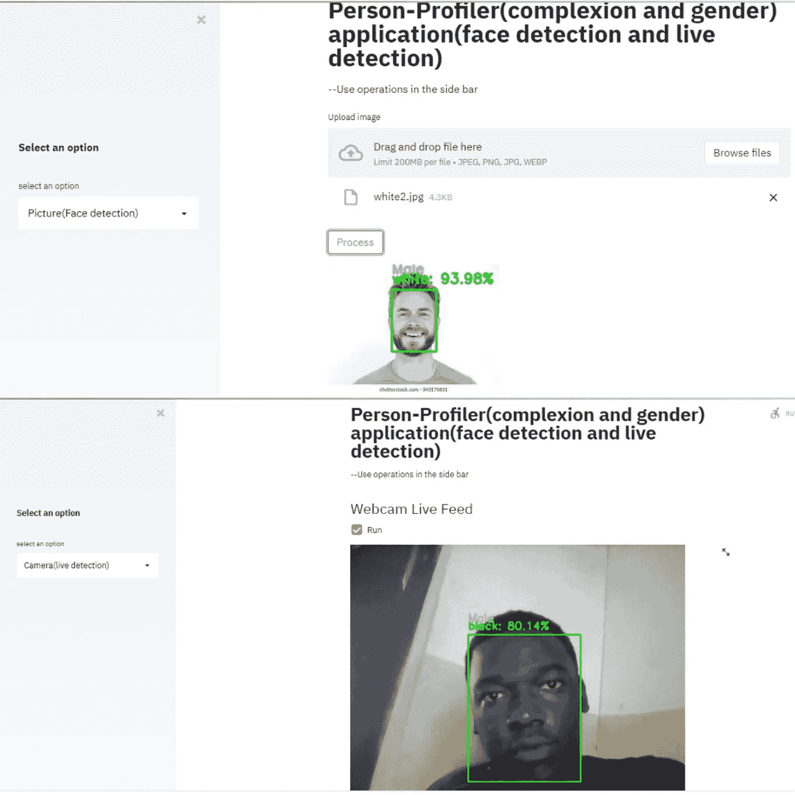

person-profiler 简化了应用程序

目标:我们将构建一个简单的计算机视觉(person-profiler)应用程序，基于面部识别来检测一个人的肤色。它将在 jupyter 笔记本电脑上从计算机上的图像本地目录进行培训。我们也将使用 AutoML 建立相同的模型，并比较精确度。

图像数据集描述:包含 67 张男性和女性的黑、白、黄脸图像。

链接至第 2 部分(解释用于性别模型的预训练模型):

[https://juniorboyboy 2 . medium . com/computer-vision-part-2-build-a-person-profiler-application-based-on-gender-and-肤色-learn-c01014d8ccbe](https://juniorboyboy2.medium.com/computer-vision-part-2-build-a-person-profiler-application-based-on-gender-and-complexion-learn-c01014d8ccbe)

# 大纲:

1.导入库、mobilenetv2 并指定神经层

2.绘制一些图像

3.使用 keras 传导神经网络(手动调整)进行训练，并保存训练好模型

4.用混淆矩阵评估训练模型

5.使用 AutoML(deepauto_viml)训练相同的肤色模型，并与手动调整模型进行精度比较

**什么是计算机视觉？**

据 ibm 称；计算机视觉是人工智能(AI)的一个领域，它使计算机和系统能够从数字图像、视频和其他视觉输入中获取有意义的信息，并根据这些信息采取行动或提出建议。

1.  **导入库，mobilenetv2，指定神经层**

使用的主要库有:

(i) opencv:用于通过网络摄像头和其他图像处理来访问经过训练的模型。

㈡tensor flow . keras:定义回旋层和训练肤色模型的库

(iii) numpy:用于数学计算，并将图像转换成数组

(iv) matplotlib:在本地目录中绘制图像。

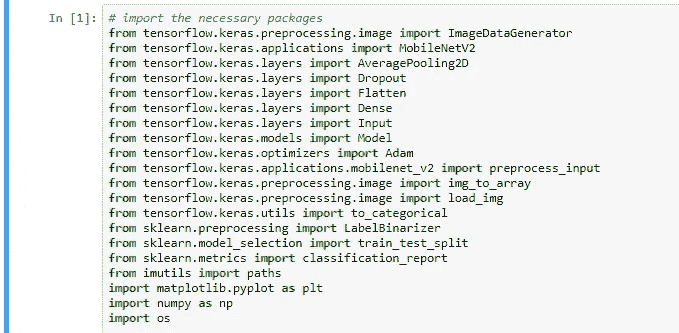

导入库

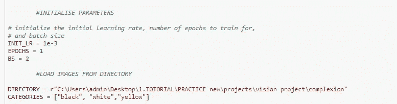

从本地目录加载图像

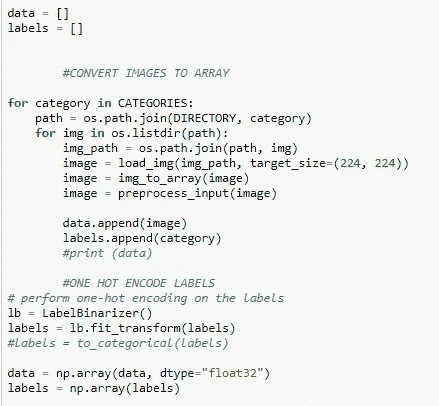

用标签二进制化器对类进行编码

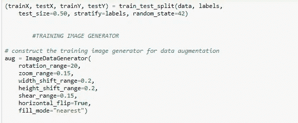

将数据集拆分为训练数据和测试数据

MobileNetV2 是一个预训练模型，可选择加载在 ImageNet 上预训练的权重，与原始 MobileNet 非常相似，只是它使用具有瓶颈功能的反向残差块。它的参数数量比最初的 MobileNet 少得多。MobileNets 支持任何大于 32 x 32 的输入尺寸，图像尺寸越大，性能越好。

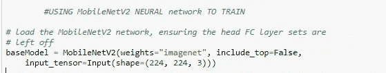

使用 MobileVnet2 预训练模型

使用 keras 基本模型指定 CNN 图层

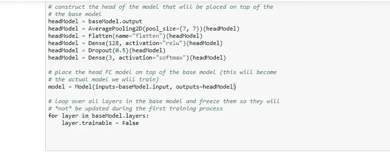

在 keras cnn 层中使用 MobileVnet2 预训练模型

**2 绘制一些图像**

用 matplotlib 绘制本地目录中的图像

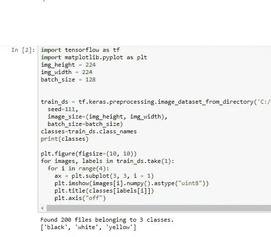

绘制一些图像

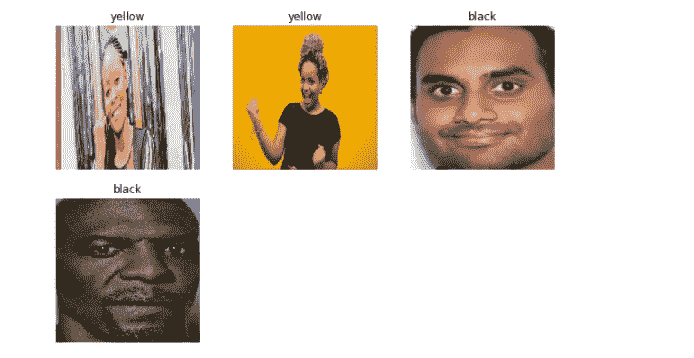

**3。使用 keras 卷积神经网络(手动调整)进行训练，并保存训练好的模型**

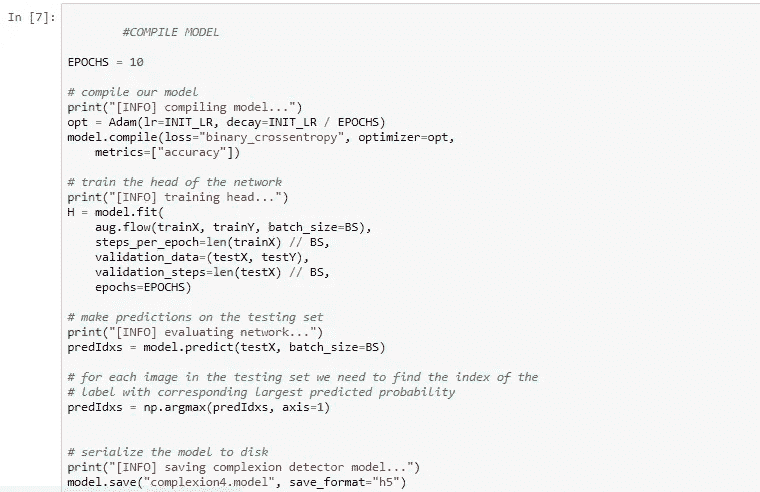

保存肤色模型

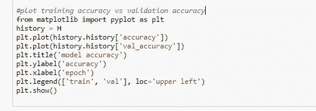

情节训练历史

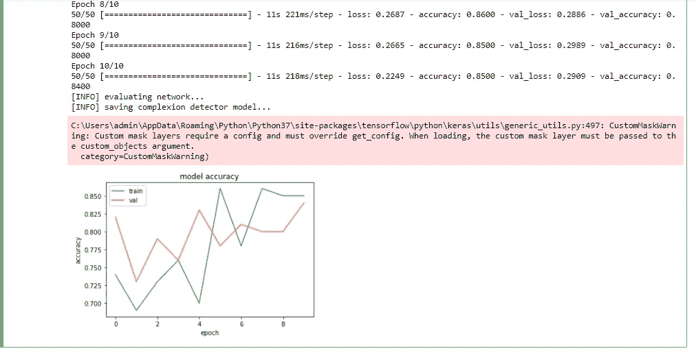

**4。用混淆矩阵**评估训练好的模型

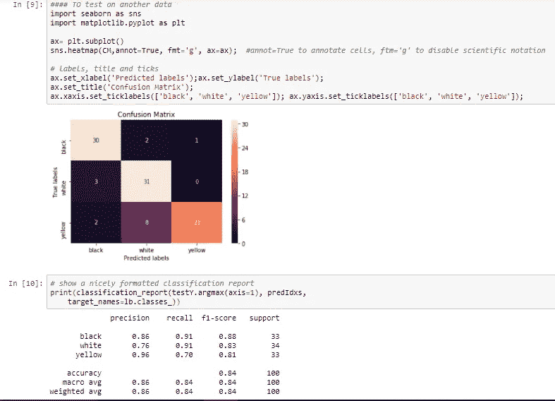

评估模型的混淆矩阵

**5。使用 AutoML(deepauto_viml)训练相同的肤色模型，并与手动调整模型进行精度比较。**

什么是 Automl？

这是[将](https://en.wikipedia.org/wiki/Automation)[机器学习](https://en.wikipedia.org/wiki/Machine_learning)应用于现实世界问题的任务自动化的过程，它自动化了机器学习模型的选择、组合和参数化。机器学习过程的自动化使其更加用户友好，并且通常比手工编码的算法提供更快、更准确的输出。

automl 库的一些示例有:

㈠自动 Sklearn

Auto-SKLearn 是建立在 scikit-learn 基础上的自动化机器学习软件包。Auto-SKLearn 将机器学习用户从算法选择和超参数调整中解放出来。它包括特征工程方法，如一个热点，数字特征标准化和主成分分析。该模型使用 SKLearn 估计量来处理分类和回归问题。

㈡密件箱

MLBox 是一个强大的自动化机器学习 python 库。根据官方文件，它提供了以下功能:

*   快速读取和分布式数据预处理/清理/格式化
*   高度可靠的功能选择和泄漏检测，以及精确的超参数优化
*   用于分类和回归的最新预测模型(深度学习、堆叠、LightGBM 等)
*   使用模型解释进行预测
    MLBox 已经在 Kaggle 上进行测试，表现出良好的性能。(参见 Kaggle“两个适马连接:租赁列表查询”|排名:85/2488)
*   管道

㈢TPOT

TPOT 是一个基于树的管道优化工具，它使用遗传算法来优化机器学习管道。TPOT 建立在 scikit-learn 之上，使用自己的回归器和分类器方法。TPOT 探索了数千条可能的管道，并找到了最符合数据的一条。

(四)H2O

H2O 是由 H2O.ai 开发的开源分布式内存中机器学习平台，H2O 同时支持 R 和 Python。它支持最广泛使用的统计和机器学习算法，包括梯度增强机器、广义线性模型、深度学习等。

㈤自动 Keras

Auto-Keras 是由 DATA Lab 开发的用于自动机器学习(AutoML)的开源软件库。Auto-Keras 建立在深度学习框架 Keras 之上，提供了自动搜索深度学习模型的架构和超参数的功能。

TransmogrifAI

现在我们来看一个杀手级库 Salesforce 在 2018 年发布的 TransmogrifAI。

Salesforce 的旗舰 ML 平台 Einstein 也是由 TransmogrifAI 提供动力。TransmogrifAI 是一个端到端的 AutoML 库，用于运行在 Apache Spark 之上的 Scala 中编写的结构化数据。它自动进行功能分析、功能选择、功能验证、模型选择等。TransmogrifAI 在下列情况下特别有用:

*   通过最少的手动调整快速训练高质量的机器学习模型
*   构建模块化、可重用、强类型的机器学习工作流

更多阅读:[https://www . Alibaba cloud . com/blog/6-top-automl-frameworks-for-machine-learning-applications-may-2019 _ 595317](https://www.alibabacloud.com/blog/6-top-automl-frameworks-for-machine-learning-applications-may-2019_595317)

Deep _ autoviml

Deep_Autoviml 在这个项目中用于 automl。Deep_autoviml 是一个 AutoML 库，用于使用 tensorflow 和 keras 使用单行代码构建深度学习模型。它是一个新的深度学习库，类似于 Auto-Keras

它将自动执行以下操作:

*   加载各种各样的高性能 DNN 架构，如深度和宽度、深度和交叉模型等。
*   使用名为 Storm-Tuner 的 hypertuner 为每个模型架构选择最佳 hyper params
*   选择最佳模型并添加用于特征变换的预处理层，并进行选择性特征工程
*   对于 NLP 任务:它选择一个 BERT 或使用模型以及文本处理器
*   训练最佳模型并使用训练好的模型运行预测
*   您可以自动保存模型及其预处理层，并将其加载到其他地方，或者使用云提供商上的 tf.serving 来提供它

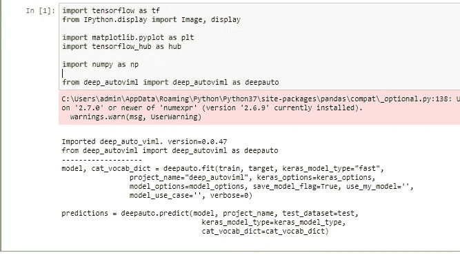

导入 deep_autoviml 的 automl 库

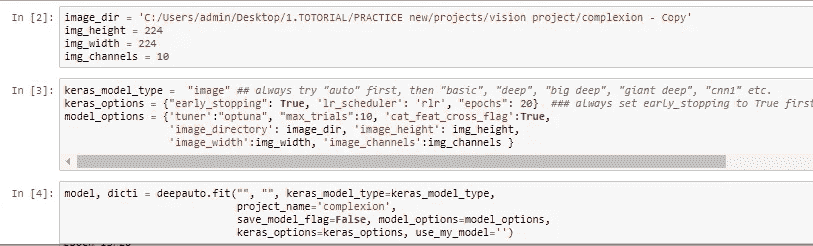

指定图像目录，以及图像的高度、宽度、通道和列。

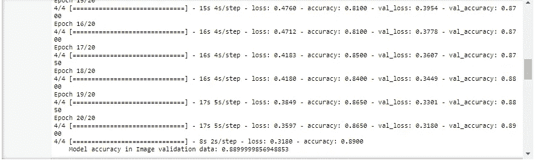

Deep_Autoviml 训练精度

因此，使用 automl 的精度为 0.88，使用手动超参数方法的精度为 0.84。

# 6.结论

本项目演示了如何使用 keras 通过手动超参数调整来训练简单的肤色检测模型，并使用 deep_autoviml 将精确度与 automl 模型进行比较，automl 模型具有更高的精确度，因此推荐使用。

**作家**:奥卢耶德·塞贡。(小)

**查看我的 github 上的代码:**

jupyter 笔记本中已训练肤色模型的代码:

 [## person _ profiler _ source _ code/colony _ training _ final . ipynb at main…

### 源代码用于培训个人侧写计算机视觉应用程序…

github.com](https://github.com/juniorboycoder/Person_profiler_source_code/blob/main/complexion_training_final.ipynb) 

jupyter notebook 中使用 automl(deepauto_viml)训练肤色模型的代码:

 [## person _ profiler _ source _ code/composity automl . ipynb at main…

### 用于训练个人特征分析器计算机视觉应用的源代码

github.com](https://github.com/juniorboycoder/Person_profiler_source_code/blob/main/complexion%20automl.ipynb) 

**使用的资源(参考资料)和进一步阅读:**

 [## Python 的 AutoML 库，你应该知道。

### AutoML 提供了为特定数据集自动发现好的机器学习模型管道的工具…

www.globaltechcouncil.org](https://www.globaltechcouncil.org/machine-learning/automl-libraries-for-python-you-should-know/)  [## GitHub - AutoViML/deep_autoviml:用一行代码构建 tensorflow keras 模型管道…

### 用一行代码构建 tensorflow keras 模型管道。由拉姆·塞沙德里创作。合作者欢迎…

github.com](https://github.com/AutoViML/deep_autoviml)  [## 8 个自动化机器学习管道的 AutoML 库

### 各种 AutoML 框架概述

medium.com](/swlh/8-automl-libraries-to-automate-machine-learning-pipeline-3da0af08f636)  [## 每个数据科学家都应该知道的 4 个 Python AutoML 库

### 让你的生活更轻松

towardsdatascience.com](https://towardsdatascience.com/4-python-automl-libraries-every-data-scientist-should-know-680ff5d6ad08) 

**领英简介**:[https://www . LinkedIn . com/in/oluyede-segun-ade deji-Jr-a 5550 b 167/](https://www.linkedin.com/in/oluyede-segun-adedeji-jr-a5550b167/)

https://twitter.com/oluyedejun1 的推特简介:[T4](https://twitter.com/oluyedejun1)

**标签**:# computer vision # OPENCV # PYTHON # AUTOML # tensor flow # KERAS