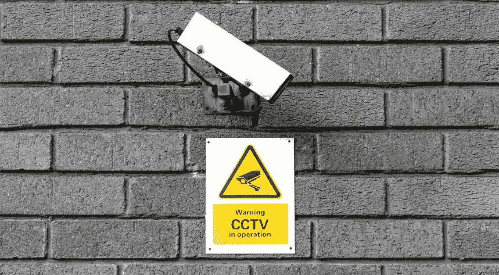
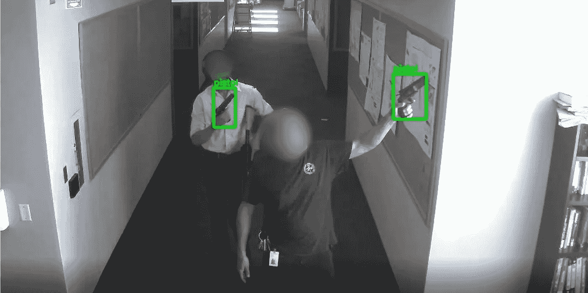
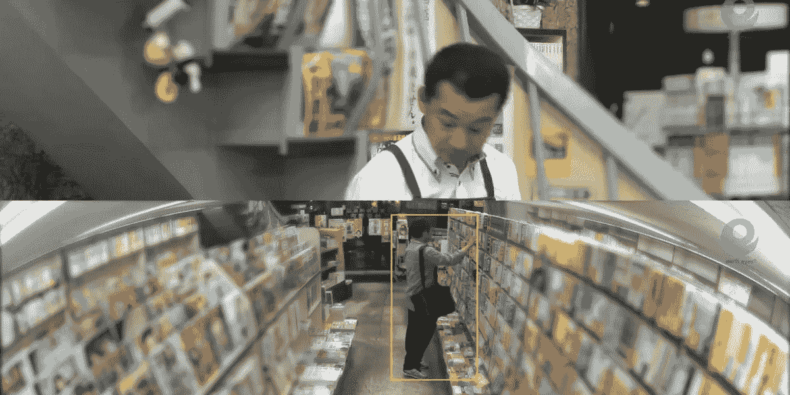
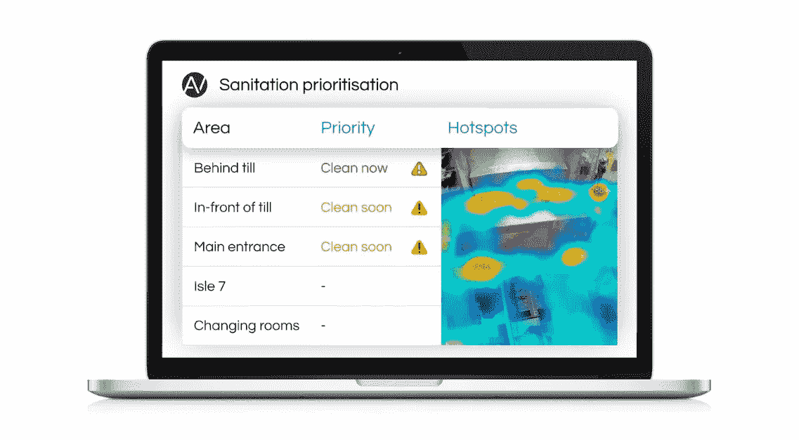
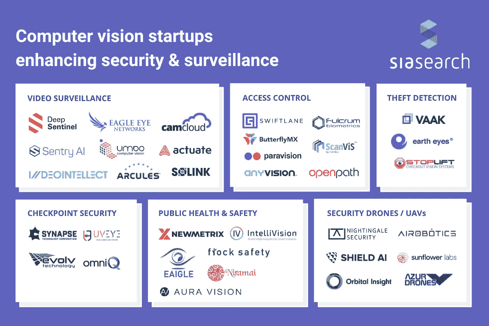

# 计算机视觉初创公司增强安全性和监控

> 原文：<https://medium.com/analytics-vidhya/computer-vision-startups-enhancing-security-surveillance-b5b502a29b40?source=collection_archive---------6----------------------->

从常见的闭路电视摄像头到自主安保无人机，视觉监控设备无处不在。这些安全系统不断产生大量的镜头，其中许多一旦被捕获就闲置不用。人类几乎不可能监控多个实时安全源并采取主动行动。

这就是人工智能的用武之地——计算机视觉技术利用丰富的视觉数据来识别哪些数据是有用的，哪些数据可以忽略，哪些数据需要立即关注。

在这篇文章中，我们 SiaSearch 汇集了最有前途的用于安全的[人工智能应用，以及每个应用中最具创新性的计算机视觉初创公司。](https://www.siasearch.io/security-surveillance)

# 视频监控

与人类不同，基于计算机视觉的安全系统能够不间断地观看安全录像，监控视野中的每个人，识别模式和任何可疑活动。近年来，大量创业公司已经开始提供人工智能视频监控。

[Umbo](https://umbocv.ai/) 是一家总部位于台湾和旧金山的初创公司，为企业提供基于云的视频安全系统。Umbo 的智能安全摄像头结合专有的基于计算机视觉的软件，可以自动检测和识别可疑事件，如入侵、尾随和翻墙。

[Deep Sentinel](https://www.deepsentinel.com/) 已经为家庭安全构建了类似的解决方案。每当检测到威胁时，Deep Sentinel 会将实时视频流式传输给真实的人类安全人员，以便通过麦克风进行远程干预。

为了应对大规模枪击事件的上升， [Actuate](https://actuate.ai/) (以前称为 Aegis AI)与现有的摄像头集成，自动识别任何挥舞枪支的人。一旦该模型识别出一种武器，它就会向安全小组和执法部门发出警报。

安讯联合创始人兼首席技术官 Ben Ziomek 表示:“我们可以在扣动扳机之前检测到武器。"在某些情况下，我们可以在任何子弹发射之前启动安全响应."

Actuate 中的火器检测

# 访问控制

许多计算机视觉初创公司提供创新的解决方案，以限制或允许进入某些区域或设施。

例如，总部位于旧金山的 Swiftlane 使用面部识别来允许或拒绝进入办公室、公寓和其他物理空间。该解决方案采用深度学习和计算机视觉技术，使用移动电话或视频对讲机提供单点登录。注册后，用户只需看一眼面部识别终端，就可以打开他们有权进入的区域的门。

同样， [Paravision](https://www.paravision.ai/) 的平台旨在供全球安全设备制造商、解决方案提供商、系统集成商和金融服务公司在错误可能带来严重负面后果的情况下使用。

# 检查站安全

计算机视觉技术在安全检查点检测和识别威胁方面也取得了长足的进步。

例如，硅谷的 [Synapse 技术](https://www.synapsetechnology.com/)可以自动进行安全筛选，使全球的检查站能够捕捉更多的威胁，同时降低运营成本，增加吞吐量。他们的平台 Syntech ONE 集成了机场、法院、联邦大楼等新的和现有的检查站机器。

Evolv Technology 的 Edge 系统结合了摄像头、面部识别和毫米波技术，用于扫描通过机场便携式安检门的人。机器学习模型会自动检查威胁，包括爆炸物和枪支，同时忽略非危险物品。

检查车辆对检查站安全小组来说是一个挑战。底盘难以接近，是敌人隐藏爆炸物、武器和毒品等非法材料的理想场所。 [UVeye](http://www.uveye.com/) 是一家以色列初创公司，提供自动车下检查扫描仪，在扫描过往车辆时捕捉高分辨率图像。使用先进的深度学习算法，扫描仪能够在几秒钟内检测并标记异常。

# 盗窃检测

计算机视觉还可以帮助零售商在盗窃和威胁发生时做出反应。基于麻省理工学院的人工智能实验室， [StopLift](https://www.stoplift.com/) 分析安全视频和 POS 数据，以区分结账时的合法和欺诈行为。通过将先进的计算机视觉算法应用于现有的摄像头，StopLift 的 ScanItAll 系统可以跟踪通过收银台的商品，将它们与 POS 关联起来，并标记任何可疑的活动。

由日本电信公司 [NTT 东方](https://www.ntt-east.co.jp/en/)和初创公司地球之眼[开发的 AI Guardman](https://business.ntt-east.co.jp/service/ai-guardman/) 是一种自动安全摄像头，旨在当场捕捉商店扒手。基于卡内基梅隆大学开发的开源技术，AI Guardman 扫描便利店和超市摄像头的实时视频流，跟踪里面的每一位顾客。当检测到威胁时，系统会实时向商店员工发送警报。

*AI 卫士的盗窃检测*

# 公共健康与安全

计算机视觉技术的进步也可以用来解决常见的公共安全问题，从降低犯罪率到减缓传染病的传播。

总部位于亚特兰大的创业公司 [Flock Safety](https://www.flocksafety.com/) 旨在通过使用计算机视觉来改善社区的公共安全，从而将美国的犯罪率降低 25%。他们的自动车牌阅读器(ALPR)软件 FlockOS 将字符识别与计算机视觉和机器学习相结合，为美国 1200 多个城市的犯罪预防当局提供实时见解。它使用获得专利的 Vehicle Fingerprint 技术，即使车辆被改装或车牌丢失或被遮盖，也能识别车辆。

此外，在新冠肺炎疫情事件之后，许多公共设施已经为现有的安全摄像头配备了基于人工智能的软件，可以跟踪健康指南的遵守情况。

降低店内感染的风险是实体零售商的首要任务。零售分析平台 [Aura Vision](https://auravision.ai/) 提供一套以 COVID 为核心的解决方案来提高店内安全，从监控口罩合规性的功能到热图，以可视化自上次清洁以来的高流量区域。

*Aura Vision 基于计算机视觉的卫生优先排序*

# 国土安全部

计算机视觉不仅证明了其在私有财产和公共场所的物理安全方面的实用价值，还在国家范围内展示了价值，其应用范围从环境监测到军事系统。

[Shield AI](https://shield.ai/) 是一家与联邦、州和地方部门和机构合作开发下一代监控系统的公司。他们的第一款产品 Nova 是一款 Hivemind 驱动的无人机，可以搜索建筑物，同时播放视频和生成地图。

最后， [Orbital Insight](https://orbitalinsight.com/) 专门将计算机视觉应用于地理分析。该公司使用卫星、无人机、气球、无人机镜头和手机的地理定位数据来分析人类活动，并为企业和政府提供关键的行为见解，解决安全问题。

*信息图:计算机视觉初创公司加强安全&监控*

# 安全行业的可视化数据管理

在安全领域，挑战不是数据采集，而是有效的数据管理。大多数安全摄像机记录对相关业务或计算机视觉功能没有用处，导致极高的冗余和低信息密度。

[SiaSearch](https://www.siasearch.io/) 让选择高质量训练数据子集变得容易，帮助你以更低的成本构建更好的 ML 模型。

借助 SiaSearch 的轻量级 API，用户可以:

*   自动索引、构建和评估由安全摄像头和传感器捕获的原始数据
*   可视化数据并分析模型性能
*   搜索和访问所有事件和属性的所有安全录像
*   识别罕见的边缘案例并管理训练数据集

**有兴趣了解更多信息吗？** [**联系 SiaSearch 获取免费概念验证**](https://www.siasearch.io/request-a-demo) **。**