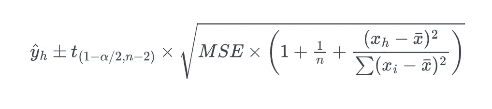
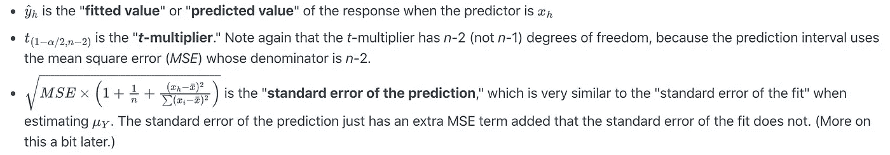
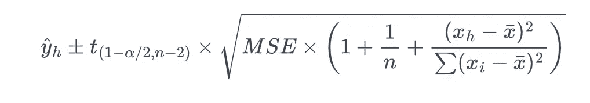
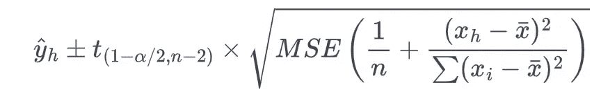
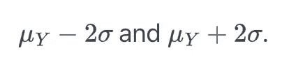
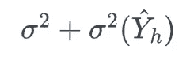
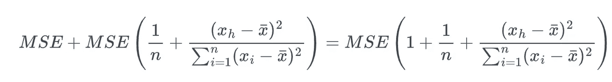
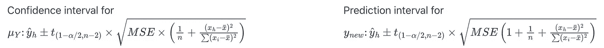

# 置信区间与预测区间

> 原文：<https://medium.com/analytics-vidhya/confidence-interval-vs-prediction-interval-2f9e36f752e3?source=collection_archive---------3----------------------->

# 1.介绍

作为一名数据科学家或统计学家，我们肯定遇到过几次**置信度和预测区间**，我们经常会混淆这两个术语，认为它们是相同的，但它们并不相同。我们将看到这两个区间是如何不同的，它们为预测的不同方面提供了估计值。

当我们谈论时间序列预测的统计模型时，我们有五个误差来源:

1.  随机个体误差
2.  参数的随机估计(例如每个自回归项的系数)
3.  不确定的超参数(如自回归项的数量)
4.  不确定模型是否适合历史数据
5.  即使给出了第四条，也不确定这个模型是否仍然正确。

# **2。置信区间**

**置信区间**是一个**频数**概念提供对模型估计参数的统计不确定性的一个估计。模型参数被假定为非随机但未知的。由于置信区间是从数据中计算出来的，而数据是随机的，所以我们得到的区间也是随机的。

95%的置信区间将包含概率为 0.95 的真参数。也就是说，对于来自总体的大量重复样本，这些区间的 95%将包含真实参数。

它通常根据来自上述**源#3** 的不确定度来估计来自**源#2** 的不确定度。

# **3。预测区间**

预测区间是与有待观察的随机变量相关联的区间，随机变量的指定概率位于该区间内。换句话说，预测区间是针对未来观测值的，它表明未来观测值位于该区间的概率是多少，或者未来值的可能范围是多少。

**例如，**

*   2022 年 GDP 预测的 80%预测区间意味着 2022 年的实际 GDP 应该位于概率为 0.8 的区间内。
*   下一季度的通胀有 90%的概率位于[1%，2.5%]区间。

理想情况下，预测间隔应该考虑到所有五个误差源。预测间隔通常是我们拥有多少数据、这些数据中有多少变化、我们预测多远以及使用哪种预测方法的函数。

由于预测区间提供了未来观测值的可能范围，而不仅仅是点预测，因此它应该始终包含在我们的预测中。预测区间可以出现在**贝叶斯统计或**频率统计中。

由于置信区间仅考虑来自源#2 的误差，而预测区间考虑所有五个误差源，平均值的置信区间将总是比预测区间**窄**。

## 3.1 预测区间的注意事项

预测的预测区间众所周知是 [**通常太窄**](http://robjhyndman.com/hyndsight/narrow-pi/) 。例如，一项研究发现，在 95%的情况下包含真实结果的预测间隔只有 71%到 87%的情况是正确的。有几个原因，但主要原因是没有充分考虑模型建立和选择过程中的不确定性。大多数建立预测区间的方法实际上都是在模型正确的前提下估计一系列值。由于我们的模型只是现实的简化，我们比模型完全正确时更容易失败。

一般来说，预测周期越长，预测区间的准确率越高。随着我们对未来时期的预测，预测区间变得越来越宽，以这种方式明确包含在区间中的随机性开始主导最初错误模型的不准确性。对于更长的预测期，标准预测区间倾向于按照宣传的那样执行，而对于更短的预测期，标准预测区间则过于乐观。

# 4.线性回归中的预测区间

在本节中，我们讨论当预测值为 ***x_h*** 时，新响应 ***y_new*** 的预测区间公式。一般公式总是:

**样本估计值(*t*-乘数×标准误差)**

数学形式的公式是:

线性回归的预测区间公式

其中:

上述公式只有在满足***【线】*** 条件 *—* **线性度**、**独立误差**、**正态误差**、**等误差方差** —的情况下才能使用。与置信区间公式的情况不同，预测区间的公式强烈地**依赖于误差项**正态分布**的条件。**

# **5。置信度和预测区间公式**

**线性回归**中**预测**和**置信区间**的公式推导不在本博客讨论范围内，我们直接使用公式。

现在，让我们来看看 ***y_new*** 的预测区间公式:

预测区间的公式

要查看它与 ***μ_Y*** 的置信区间公式相比如何:

置信区间公式

从上面的公式可以看出， ***y_new*** 的预测的**标准误差中有一个额外的 ***MSE*** 项，而 ***μ_Y*** 的拟合**的**标准误差中没有，影响预测区间宽度的因素与影响宽度的因素**相同****

让我们试着理解一下预测区间，看看是什么原因导致了额外的 ***MSE*** 项。这样做的话，让我们先从一个比较简单的问题开始。想想如果已知在 ***x_h*** 的响应*μ_ Y 的平均值，我们如何预测在特定 ***x_h*** 的新响应 ***y_new*** 也就是说，假设已知在 ***x_h*** =40 时的平均皮肤癌死亡率为百万分之 150(方差为 400)。俄亥俄州哥伦布市的皮肤癌死亡率预测是多少？*

*由于 ***μ_Y*** = 150 和 ***σ*** = 400 是已知的，所以我们可以利用“**经验法则**”来说明 95%的正态分布数据都在均值的 2 个标准差以内。换句话说，95%的观察值都在以下区间内:*

**

*将 95%规则应用于我们的示例，其中 ***μ_Y*** =150 并且 ***σ*** =20，我们得到:*

*150–2(20)= 110 和 150 + 2(20) = 190。*

*即皮肤癌死亡率(***y _ new)***at***x _ h***= 40 是每 1000 万人死亡 110 ~ 190 人之间的某个值。问题是我们的计算使用了***【μ_ Y】***和***【σ】***，这些是我们通常不知道的人口值。现实开始了:*

*   *平均值*μY*通常是未知的。合理的做法是用预测响应 ***yhat*** 来估计它。用 ***yhat*** 估算 ***μ_Y*** 的成本就是 ***yhat*** 的方差。也就是说，不同的样本会产生不同的预测 ***yhat*** ，所以我们必须考虑到 ***yhat*** 的方差。*
*   *方差σ通常是未知的。合乎逻辑的做法是用 ***MSE*** 来估计。*

*因为我们必须估计这些未知量，所以新响应预测的变化取决于两个因素:*

1.  *由于用 ***yhat_h*** 估计均值 ***μ_Y*** 而产生的变化，我们表示为“***【σ(Yhat _ h)***”，这个量的估计就是出现在置信区间公式中的拟合的标准差的平方。*
2.  *响应 ***y*** 中的变化，我们表示为“***【σ***”，这是均方差 ***MSE*** 的估计。*

*将两个方差分量相加，我们得到:*

**

*估计如下:*

**

*以上项就是 ***y_new 的**预测区间**公式中出现的预测的**方差(标准差的平方)**。****

*让我们再比较一下这两个区间:*

**

## *5.1 两个公式之间差异的实际影响*

*   *由于预测区间有额外的 ***MSE*** 项，a(1***α***)* 100%置信区间将总是比相应的预测区间**窄**。*
*   *通过计算预测值的样本均值的区间( ***xh=xbar*** )并增加样本量 ***n*** ，置信区间的标准差可以接近 0，但由于额外的 ***MSE*** 项，预测区间的标准差无法接近 0。*

# *6.结论*

*我们讨论了**置信区间**和**预测区间**如何不同，它们如何为预测的不同方面提供估计，它们如何解释不同的误差或不确定性来源，在**线性回归**的情况下这两个区间的公式之间的差异，以及**置信区间如何比预测区间**窄。我们还谈到了为什么通过考虑所有的误差源来精确计算预测间隔要困难得多，预测间隔随着我们对未来时期的预测而变得更宽，并且我们经常会高估预测间隔。*

*如有任何反馈或疑问，请随时联系我的[***【LinkedIn】***](https://www.linkedin.com/in/naquib-alam-93804435/)*。**

# **7.参考**

1.  **[https://robjhyndman.com/hyndsight/intervals/](https://robjhyndman.com/hyndsight/intervals/)**
2.  **[http://freerangestats . info/blog/2016/12/07/ARIMA-prediction-intervals](http://freerangestats.info/blog/2016/12/07/arima-prediction-intervals)**
3.  **[https://online.stat.psu.edu/stat501/lesson/3/3.3](https://online.stat.psu.edu/stat501/lesson/3/3.3)**