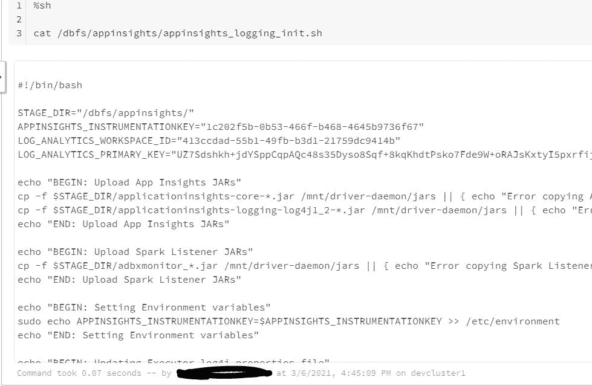
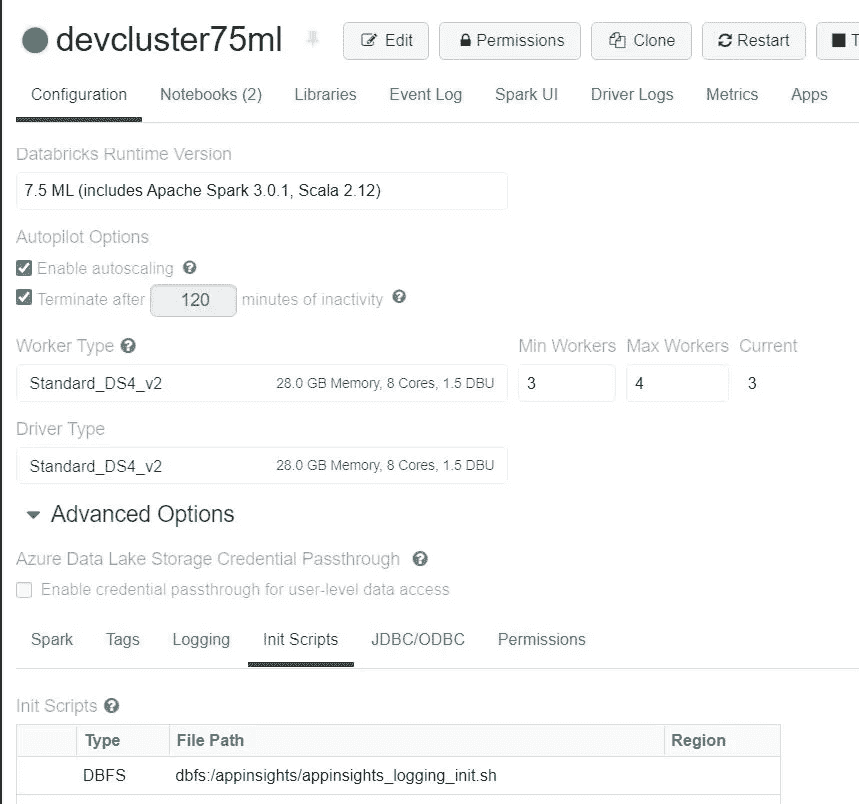
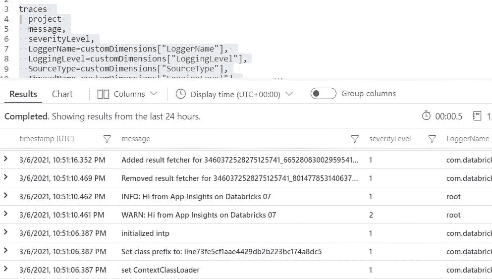
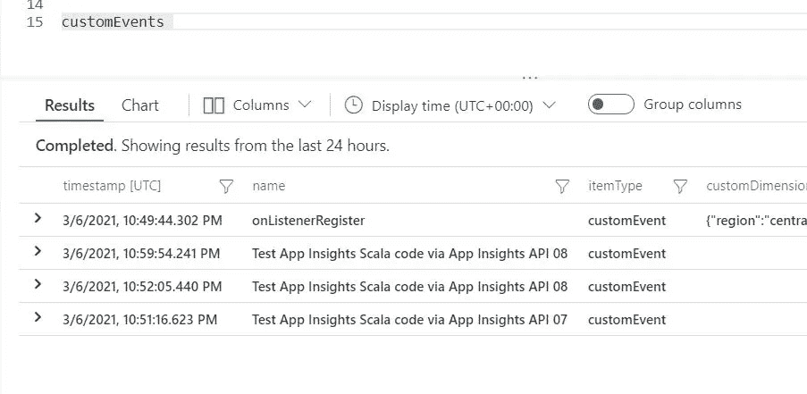

# 配置 Azure 数据块以向应用洞察发送事件—简化

> 原文：<https://medium.com/analytics-vidhya/configure-azure-data-bricks-to-send-events-to-application-insights-simplified-c6effbc3ed6a?source=collection_archive---------4----------------------->

# 在 Azure 数据块中配置日志分析和应用洞察

# 用例

*   Azure data bricks 与 Azure monitor 进行了本机集成
*   但是挑战在于得到运行时错误
*   能够发送自定义日志或事件的应用程序代码
*   记录运行时异常的跟踪日志
*   帮助解决运行时的用法错误

# 先决条件

*   Azure 帐户
*   Azure 数据块
*   Azure 应用洞察
*   创建日志分析
*   获取工作区 ID 和密钥
*   获取应用洞察密钥
*   从这个 github Repo 中获取内容:[https://github . com/analytic Jeremy/Azure-data bricks-Monitoring](https://github.com/AnalyticJeremy/Azure-Databricks-Monitoring)
*   我还下载了 jar 文件和脚本
*   文件可在回购中获得

# 密码

*   首先用 databricks 运行时版本 7.5 创建另一个集群
*   该集群用于创建 shell 脚本，而不是使用命令行上传。
*   不需要库
*   创建一个新的 scala 笔记本来创建 app insight init 脚本
*   检查 Stage_dir 目录
*   获取工作区 ID 和密钥
*   转到日志分析工作区
*   选择高级设置->连接的源->代理管理
*   复制 ID 和密钥
*   要获取应用洞察工具密钥，请访问应用洞察资源
*   向下滚动到属性
*   复制检测密钥
*   对于 scipt，请确保目录和格式匹配
*   语法问题的微小变化可能会导致集群无法启动
*   替换脚本下面的密钥和 ID

```
APPINSIGHTS_INSTRUMENTATIONKEY="xxxxxx-xxxxxxx-xxxxxxx" LOG_ANALYTICS_WORKSPACE_ID="xxxxxx-xxxxxxx-xxxxxxx" LOG_ANALYTICS_PRIMARY_KEY="xxxxxx-xxxxxxx-xxxxxxx"%python
dbutils.fs.put("dbfs:/appinsights/appinsights_logging_init.sh","""
#!/bin/bash

STAGE_DIR="/dbfs/appinsights/"
APPINSIGHTS_INSTRUMENTATIONKEY="xxxxxx-xxxxxxx-xxxxxxx"
LOG_ANALYTICS_WORKSPACE_ID="xxxxxx-xxxxxxx-xxxxxxx"
LOG_ANALYTICS_PRIMARY_KEY="xxxxxx-xxxxxxx-xxxxxxx"

echo "BEGIN: Upload App Insights JARs"
cp -f $STAGE_DIR/applicationinsights-core-*.jar /mnt/driver-daemon/jars || { echo "Error copying AppInsights core library file"; exit 1;}
cp -f $STAGE_DIR/applicationinsights-logging-log4j1_2-*.jar /mnt/driver-daemon/jars || { echo "Error copying AppInsights Log4J library file"; exit 1;}
echo "END: Upload App Insights JARs"

echo "BEGIN: Upload Spark Listener JARs"
cp -f $STAGE_DIR/adbxmonitor_*.jar /mnt/driver-daemon/jars || { echo "Error copying Spark Listener library file"; exit 1;}
echo "END: Upload Spark Listener JARs"

echo "BEGIN: Setting Environment variables"
sudo echo APPINSIGHTS_INSTRUMENTATIONKEY=$APPINSIGHTS_INSTRUMENTATIONKEY >> /etc/environment
echo "END: Setting Environment variables"

echo "BEGIN: Updating Executor log4j properties file"
sed -i 's/log4j.rootCategory=INFO, console/log4j.rootCategory=INFO, console, aiAppender/g' /home/ubuntu/databricks/spark/dbconf/log4j/executor/log4j.properties
echo "log4j.appender.aiAppender=com.microsoft.applicationinsights.log4j.v1_2.ApplicationInsightsAppender" >> /home/ubuntu/databricks/spark/dbconf/log4j/executor/log4j.properties
# echo "log4j.appender.aiAppender.DatePattern='.'yyyy-MM-dd" >> /home/ubuntu/databricks/spark/dbconf/log4j/executor/log4j.properties
echo "log4j.appender.aiAppender.layout=org.apache.log4j.PatternLayout" >> /home/ubuntu/databricks/spark/dbconf/log4j/executor/log4j.properties
echo "log4j.appender.aiAppender.layout.ConversionPattern=[%p] %d %c %M - %m%n" >> /home/ubuntu/databricks/spark/dbconf/log4j/executor/log4j.properties
echo "END: Updating Executor log4j properties file"

echo "BEGIN: Updating Driver log4j properties file"
sed -i 's/log4j.rootCategory=INFO, publicFile/log4j.rootCategory=INFO, publicFile, aiAppender/g' /home/ubuntu/databricks/spark/dbconf/log4j/driver/log4j.properties
echo "log4j.appender.aiAppender=com.microsoft.applicationinsights.log4j.v1_2.ApplicationInsightsAppender" >> /home/ubuntu/databricks/spark/dbconf/log4j/driver/log4j.properties
# echo "log4j.appender.aiAppender.DatePattern='.'yyyy-MM-dd" >> /home/ubuntu/databricks/spark/dbconf/log4j/driver/log4j.properties
echo "log4j.appender.aiAppender.layout=org.apache.log4j.PatternLayout" >> /home/ubuntu/databricks/spark/dbconf/log4j/driver/log4j.properties
echo "log4j.appender.aiAppender.layout.ConversionPattern=[%p] %d %c %M - %m%n" >> /home/ubuntu/databricks/spark/dbconf/log4j/driver/log4j.properties
echo "END: Updating Driver log4j properties file"

echo "BEGIN: Updating Azure Log Analytics properties file"
sed -i "s/^exit 101$/exit 0/" /usr/sbin/policy-rc.d
wget https://raw.githubusercontent.com/Microsoft/OMS-Agent-for-Linux/master/installer/scripts/onboard_agent.sh && sh onboard_agent.sh -w $LOG_ANALYTICS_WORKSPACE_ID -s $LOG_ANALYTICS_PRIMARY_KEY
sudo su omsagent -c 'python /opt/microsoft/omsconfig/Scripts/PerformRequiredConfigurationChecks.py'
/opt/microsoft/omsagent/bin/service_control restart $LOG_ANALYTICS_WORKSPACE_ID
echo "END: Updating Azure Log Analytics properties file"

echo "BEGIN: Modify Spark config settings"
cat << 'EOF' > /databricks/driver/conf/adbxmonitor-spark-driver-defaults.conf
[driver] {
  "spark.extraListeners" = "com.microsoft.adbxmonitor.adbxlistener.AdbxListener"
}
EOF
echo "END: Modify Spark config settings"
""", True)%sh cat /dbfs/appinsights/appinsights_logging_init.sh
```



# 创建 Azure 数据块集群

*   创建新的集群
*   选择 databricks 运行时为 7.5
*   保留所有默认设置
*   转到高级设置
*   选择初始化脚本
*   将此添加为位置

```
dbfs:/appinsights/appinsights_logging_init.sh
```

*   启动集群，并等待它启动
*   一旦开始，我们就好了。



# 要测试的笔记本代码

*   一旦集群启动
*   创建一个 scala 笔记本
*   看看仪器钥匙

```
%sh echo $APPINSIGHTS_INSTRUMENTATIONKEYimport org.apache.log4j.LogManager

val log = LogManager.getRootLogger
// val log = org.apache.log4j.LogManager.getLogger("aiAppender")

log.warn("WARN: Hi from App Insights on Databricks 07")
log.info("INFO: Hi from App Insights on Databricks 07")
```

*   现在转到应用洞察
*   转到日志
*   编写下面的查询

```
traces 
| project 
  message,
  severityLevel,
  LoggerName=customDimensions["LoggerName"], 
  LoggingLevel=customDimensions["LoggingLevel"],
  SourceType=customDimensions["SourceType"],
  ThreadName=customDimensions["LoggingLevel"],
  SparkTimestamp=customDimensions["TimeStamp"],
  timestamp 
| order by timestamp desc
```



```
import com.microsoft.applicationinsights.TelemetryClient
import com.microsoft.applicationinsights.TelemetryConfiguration

val configuration = com.microsoft.applicationinsights.TelemetryConfiguration.createDefault()
configuration.setInstrumentationKey(System.getenv("APPINSIGHTS_INSTRUMENTATIONKEY"))

val telemetryClient = new TelemetryClient(configuration)
telemetryClient.trackEvent("Test App Insights Scala code via App Insights API 08")
telemetryClient.flush()
```

*   现在转到应用洞察
*   转到日志
*   编写下面的查询

```
customEvents
```



*最初发表于*[T5【https://github.com】](https://github.com/balakreshnan/Accenture/blob/master/AppInsights/applogadb.md)*。*