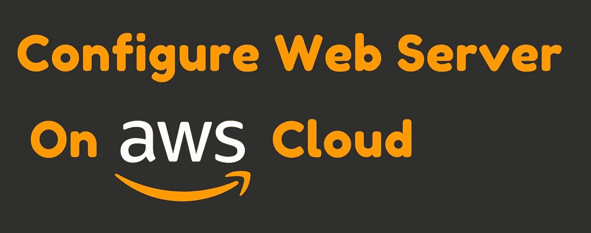
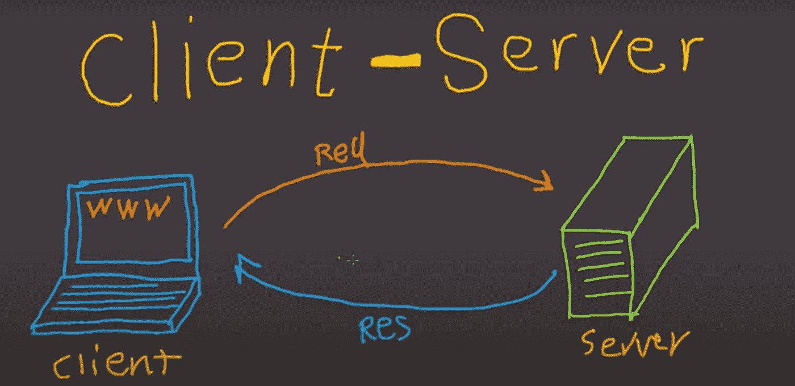
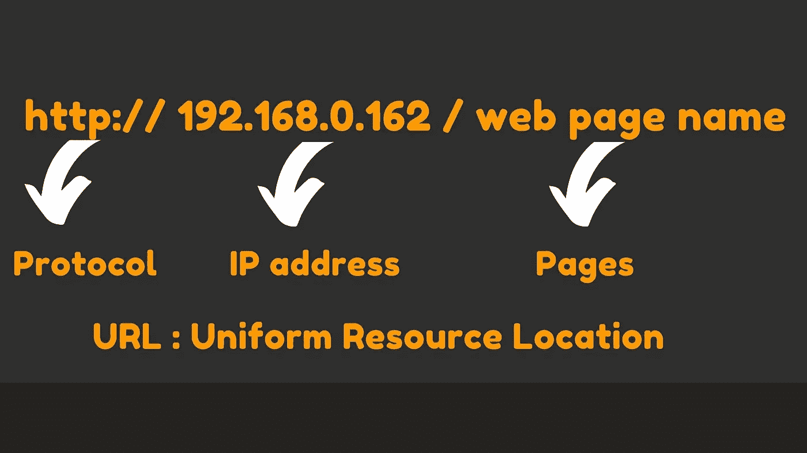

# 在 AWS 云上配置 Web 服务器

> 原文：<https://medium.com/analytics-vidhya/configure-web-server-on-aws-cloud-cf7436d2d883?source=collection_archive---------1----------------------->

在这篇博客中，我将在 AWS 实例上配置 apache & Nginx web 服务器。这实际上没有先决条件。

## **什么是云计算？**

云计算是通过互联网按需交付 IT 资源，采用随用随付的价格。无需购买、拥有和维护物理数据中心和服务器，您可以根据需要从 Amazon Web Services (AWS)等云提供商那里访问计算能力、存储和数据库等技术服务。

## 什么是 Web 服务器？

**网络服务器**是存储网络内容的计算机。基本上，web 服务器用于托管网站，但也存在其他 web 服务器，如游戏、存储、FTP、电子邮件等。

## 什么是客户机-服务器模型？

客户机-服务器模型是**两台计算机之间的关系，其中一台客户机向另一台服务器发出服务请求**

这是关于云计算、Web 服务器和客户机-服务器模型的简要概述。

> **现在，我们将通过 AWS 实例配置 web 服务器。**

Web 服务器只是一个概念名称，我们在市场上有不同的工具，但我们使用两个著名的工具来配置 web 服务器。

*   **阿帕奇:HTTPD**
*   **NGINX**

> ***如果我们要配置世界上任何一台服务器主要遵循三个步骤:***

***第一步:*** 安装软件

***第二步:*** 配置文件

***第三步:*** 执行/启动服务

我们配置的文件也就是**的*配置文件。***

如果您使用网络服务器来放置您的网页，并要求网络服务器将这些网页提供给客户端，即 ***虚拟主机。***

现在，我们将使用 **Apache: HTTPD** 在 AWS 实例(ec2)上配置 Web 服务器

第一步: **#rpm -q httpd** (检查软件是否安装)

第二步: **#dnf/yum 安装 httpd** (在实例上安装软件)

> ***我们已经在 ec2 实例上安装了软件移动到另一个步骤。***

第三步: **#cd /var/www/html** (文档根)

第四步:***#格迪特 index.html***(把内容放在这里)

这是默认情况下他们创建的文件夹。当客户来到 web 服务器时，他们从这个文件夹中检索页面。

> 现在，我们的最后一步是启动服务。

第五步: ***#systemctl 启动 httpd*** (启动服务)

第六步:***# system CTL status httpd***(检查服务是否启动)

当客户端想要访问网页时，他们需要一个 IP 地址，当客户端请求 web 服务器时，他们需要三样东西。

> 当任何来自外部世界的人(客户端)想要通过网络数据包连接到 web 服务器时，在 web 服务器中他们有一个安全防护，他们有自己的规则，他们允许或不允许，即 ***防火墙。***

现在，我们可以为防火墙编写自己的规则，或者禁用防火墙一段时间(仅用于测试目的)。

CMD: ***#systemctl 停止防火墙 d*** (停止操作系统的内部防火墙)

最后，我们已经配置了我们的 web 服务器。客户端将访问 web 服务器。

> **客户端有两种方式连接 web 服务器:**

*   **CLI 模式(命令行浏览器)**
*   **GUI(网络浏览器:Chrome，Firefox)**

1.  对于 **CLI 模式**，他们需要使用 *#curl* cmd，不会执行，他们只读取 HTML 页面:

*[***HTTP://{***](http://HTTP://{ip}//index.html)***Public _***[***IP }//index . html***](http://HTTP://{ip}//index.html)*

*2.对于 **GUI 模式**，他们将 URL 放入网络浏览器。*

> ****为了这个实用你还可以看视频更好的理解:****

*最后，我们用 Apache: HTTPD 配置了 Web 服务器。*

*现在，我们将使用 Nginx 在 AWS 实例(ec2)上配置 Web 服务器。*

*与 Apace Web 服务器相同的流程:*

*第一步:***# yum install-y https://dl . fedora project . org/pub/epel/epel-release-latest-7 . no arch . rpm****(创建 epel release 的 yum repo)**

*第二步:***# yum Install-y Epel-Release****(Install Epel Release)**

*第三步:***# yum update-y****(会更新实例的 yum)**

*第四步: ***#yum 安装 nginx -y*** *(安装 nginx 软件)**

*第五步:***# nginx-v****(检查 Nginx 版本)**

*到目前为止，我们已经在 ec2 实例上安装了软件。*

*第六步:***# gedit/usr/share/nginx/html/index . html***(文档根)*

*这是默认情况下他们创建的文件夹。当客户来到 web 服务器时，他们从这个文件夹中检索页面。*

> ****现在，我们的最后一步是启动服务。****

*第七步: ***#systemctl 启动 nginx*** *(启动服务)**

*步骤 8: ***#systemctl 启用/禁用 nginx*** *(启用/禁用服务)**

*第九步: ***#systemctl 状态 nginx*** *(检查服务是否启动)**

*现在，客户端将通过公共 IP 访问网页。*

> ****为了这个实用你还可以看视频更好的理解:****

*最后，我们通过使用**NGINX**&**Apache HTTPD**在 AWS ec2 实例上配置了 ***Web 服务器。****

*谢谢你..！！*