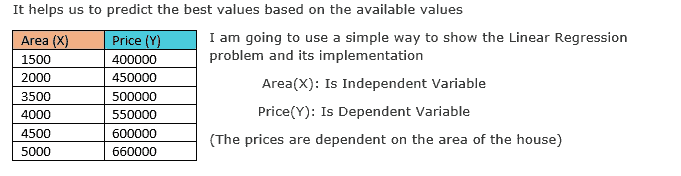
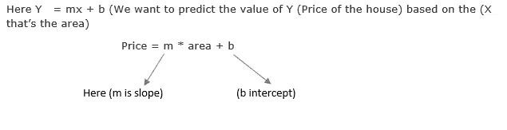
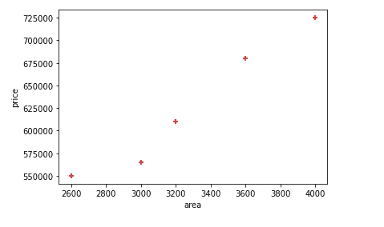
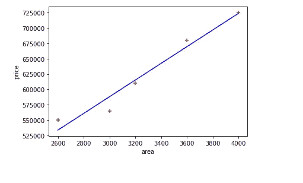
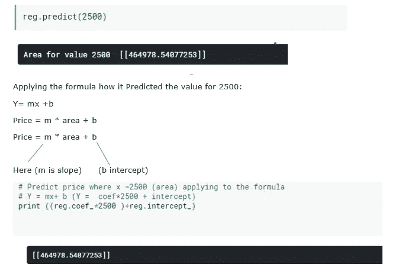
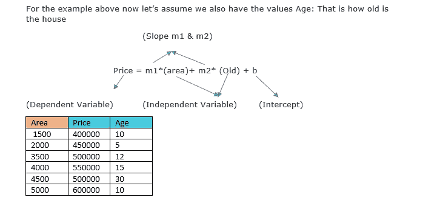
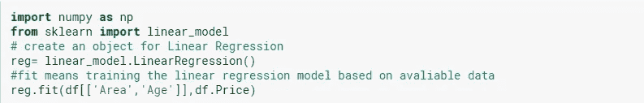
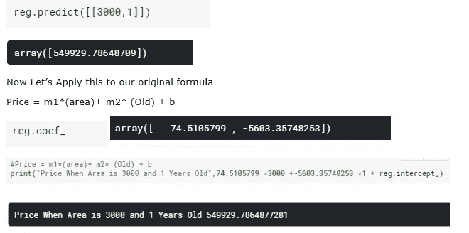

# 迷茫？线性与多元回归及其实现

> 原文：<https://medium.com/analytics-vidhya/confused-between-linear-multiple-regression-and-its-implementation-3f20b9dc25ca?source=collection_archive---------24----------------------->


在这篇博文中，我将重点介绍线性回归、多元线性回归或多元回归。

***线性回归*** :线性回归是一种常用的、广泛用于预测分析的统计技术。这些回归估计用于解释一个因变量和一个或多个自变量之间的关系。

***变量之间的关系是基于下面的等式:***

Y= mx + b

***有什么帮助:***

它帮助我们根据可用值预测最佳值



**实施:**

*第一步:导入库*

```
import pandas as pd
import numpy as np
import matplotlib.pyplot as plt
from sklearn import linear_model
df = read_csv('../input/linear2/Linear2.csv')
```

*步骤 2:使用 matplotlib 绘制数值*

```
import matplotlib.pyplot as plt
%matplotlib inline
plt.xlabel('area)
plt.ylabel('price')
plt.scatter(df.area,df.price,color='red',marker ='+')
```



价格取决于房子的面积

***(X 区域):*** 是自变量

***价格(Y):*** 是因变量红色标记'+'代表上表中的实际值

> *第三步:对上述数据应用线性回归模型*

```
#create an object for Linear Regression
reg = linear_model.LinearRegression()
#fit the data into the model
reg.fit(df[['area']],df.price)
```

第四步:现在让我们得到最好的线

```
%matplotlib inline
plt.xlabel('area)
plt.ylabel('price')
plt.scatter(df.area,df.price,color='red',marker ='+')
plt.plot(df.area,reg.predict[['area']]),color='blue')
```



线性回归最佳拟合线

*第五步:如果 Area = 2500* 我们来预测一下数值



***多元回归:*** 多元线性回归是根据两个或两个以上的自变量预测一个因变量的值的模型。

对于上面的例子，现在让我们假设我们也有年龄值:也就是房子的年龄



**面积，年龄(X):是自变量，价格(Y):是因变量**

*****实现:*****

****

**现在让我们预测房子的价值，面积:3000，年龄:1**

****

***现在如果你看一下原始数据设定房子的价值用* ***面积 3500 是 50 万*** *但是当我们预测房子的价值时，用* ***面积 3000 是 549929.7877 这比 3500 少*** *作为房子的年龄也有助于确定房子的价值在哪里***

*****我刚刚试着解释了简单和多元线性回归及其实现，以及线性回归的公式是如何工作的*****