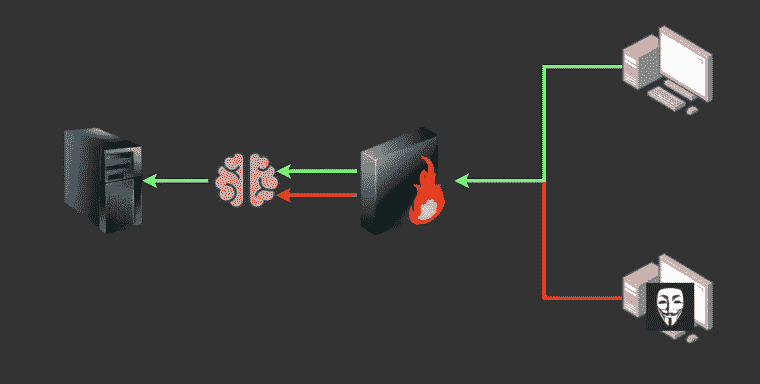
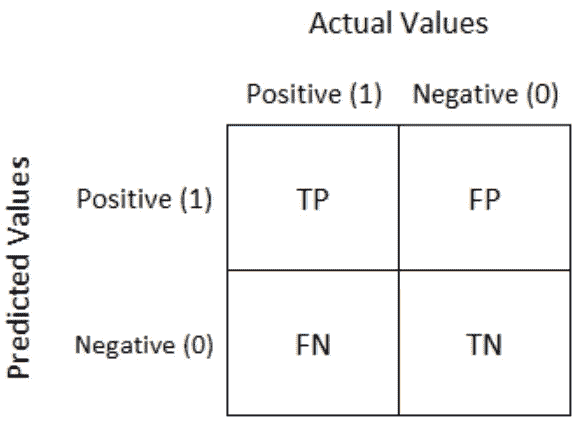
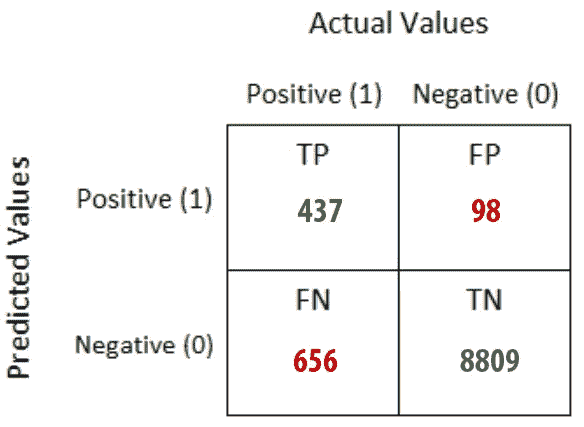

# 混淆矩阵——案例研究

> 原文：<https://medium.com/analytics-vidhya/confusion-matrix-case-study-1cdbef7498d0?source=collection_archive---------6----------------------->

下面的文章将帮助你克服由于分类问题中的混淆矩阵而产生的混乱。

如今，机器学习和人工智能几乎应用于该行业的每个领域。评估我们的模型和构建它们一样重要。让我们试着从一个网络安全风险分析师的角度来理解混淆矩阵——一种评估方法及其属性。

考虑一个场景，我们必须检测攻击我们私人服务器的匿名系统。我们在防火墙和服务器之间安装了一个机器学习系统。因此，我们基本上是使用机器学习来检测能够通过防火墙的恶意系统，也就是说，我们应该对通过防火墙的系统进行分类，看它是恶意的还是非恶意的。

案例场景

因此，场景问题是任何匿名和潜在的恶意系统是否能够破坏系统。

让我们提出一个无效假设—

> 检测到服务器遭到入侵

现在我们必须确定这个假设是被拒绝，还是我们没有拒绝这个假设。

假设一天内服务器的总点击数为 10，000 次，包括我们公司各个部门的所有员工和试图窃取您的数据或侵入您系统的恶意用户。

我们的机器学习模型已经分类如下:—

*系统总点击数:10000*

*   *被归类为非恶意的点击量:9465*
*   *归类为恶意的点击量:535*

经过进一步的调查，我们发现——

*   在被归类为非恶意的 9465 次点击中，有 8809 次实际上是非恶意的。
*   *在被归类为恶意的 535 次点击中，有 437 次实际上是恶意的*

这就是众所周知的地面真相。

现在，将评估我们模型的预测与它的基础事实。我们的机器学习模型正在执行二元分类，我们可以使用许多指标和图表来收集对我们模型性能的见解。这些评估指标之一是混淆矩阵。

混淆矩阵是允许算法性能可视化的表格。让我们看看混乱矩阵是什么样子的——

混淆矩阵

**是一个 2X2 的网格。列代表地面实况的类别，而行代表预测的类别。混淆矩阵是一种总结分类算法性能的技术。有 4 个单元格— TP、FP、FN 和 TN。**

***让我们将这个表与我们的应用程序联系起来……***

我们模型的混淆矩阵

让我们深入这个矩阵…

*   在 10，000 条记录中，我们的模型预测 535 条记录是恶意的(类别 1)，其中 437 条记录实际上是恶意的(类别 1)。
*   在 10，000 条记录中，我们的模型预测 9465 条为非恶意(0 类)，其中 8809 条实际上是非恶意的(0 类)。

## TP —真阳性

True Positive 是被正确分类为恶意(类别 1)的记录总数

## TN—真实否定

True Negative 是被正确分类为非恶意(0 级)的记录总数

## FP —误报

False Positives 是实际上是恶意(类别 1)但被模型分类为非恶意(类别 0)的记录总数。

> 这就是所谓的第一类错误—

第一类错误是拒绝真零假设。这意味着我们拒绝“检测到违规”的假设，即使服务器上确实存在违规。

## FN —假阴性

False Negatives 是实际上非恶意(类别 0)但被模型分类为恶意(类别 1)的记录总数。

> 这被称为类型 2 错误

第二类错误是不拒绝假零假设。这意味着即使服务器上没有漏洞，我们也无法拒绝“检测到漏洞”的假设。

# 哪种错误可能更危险，为什么？

> 让我们来看看这两个公司拥有哪些潜在威胁…

在 **Type II** 错误中，我们将公司的一个系统(非恶意)归类为恶意。在这种情况下，我们可以进一步调查该系统的用户，以发现该系统实际上是无恶意的，我们可能会放弃这种担忧。

但是在**类型 I** 错误的情况下，我们将恶意系统归类为非恶意系统。这意味着这个恶意系统绕过了我们的安全系统，可能会导致系统中的数据泄漏和破坏。因此，尽可能降低这个误差是非常重要的，因为它非常危险。

这一次到此为止！谢谢大家！

 [## Prathamesh Mistry - MLOPS 暑期实习生-Linux world Informatics Pvt Ltd | LinkedIn

### 查看 Prathamesh Mistry 在世界上最大的职业社区 LinkedIn 上的个人资料。Prathamesh 列出了 4 项工作…

www.linkedin.com](https://www.linkedin.com/in/prathamesh-mistry/)