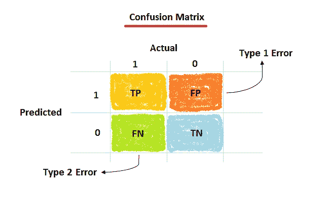

# 机器学习中的混淆矩阵

> 原文：<https://medium.com/analytics-vidhya/confusion-matrix-in-machine-learning-91b6e2b3f9af?source=collection_archive---------8----------------------->

## 监督学习中的分类度量

混乱矩阵。作者的照片

为什么这个度量标准被命名为混淆矩阵？在我看来，矩阵术语指的是行和列，混淆术语指的是机器没有 100%准确分类的思想。让我们在本文中更深入地了解一下混淆矩阵。这是一个综合的分类指标，用于可视化…