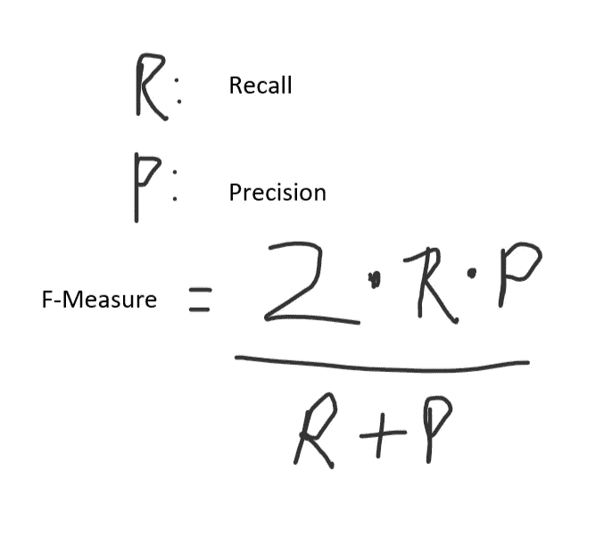

# 机器学习中的混淆矩阵

> 原文：<https://medium.com/analytics-vidhya/confusion-matrix-in-machine-learning-beeb75946dab?source=collection_archive---------32----------------------->

所以，首先。什么是混淆矩阵？

*   简单地说，混淆矩阵是对机器学习问题的性能测量。

> 因此，我们在这个博客中的主要目的是了解什么是混淆矩阵，以及如何计算它。

那么混乱矩阵看起来是什么样的呢-

在混淆矩阵的帮助下，我们可以得到关于我们的模型的关键结果(召回率、精确度等等)。

注意:为了更好地理解，我举了一个 2 类问题的例子。说+，-

首先让我们了解一下 TP，FP，FN，TN-

TP —真正:你的模型预测+而实际是它的+。

FP —假阳性:你的模型预测+但实际上它是-。

FN —假阴性:你的模型预测了—但实际上它的+。

TN-真否定:你的模型预测了-实际上它-。

描述各种结果的图片。

让我们从一个简单的例子开始计算部分

根据示例，我们将计算召回率、精确度和准确度-

> ***回忆***

所以，回忆= 2/3 = 0.66667

*   在所有的积极类中，我们正确预测了多少。它应该尽可能高。

> ***精密***

因此，精度= 2/3 = 0.6667

*   在我们正确预测的所有积极类中，有多少实际上是积极的。

> ***准确度***

准确度= 5/7

仅仅意味着我们正确预测了多少。应该是尽可能的高。

> **F-measure**

因此，F-measure = 0.6667

*   F-Measure 是查全率和查准率的调和平均值。
*   同时测量查全率和查准率。

所以，我希望我能把困惑矩阵的基础知识传递给你。

如果你喜欢这个职位，你可以激励我一些👏。

让我们在其他文章中见面。