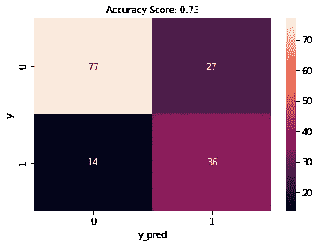
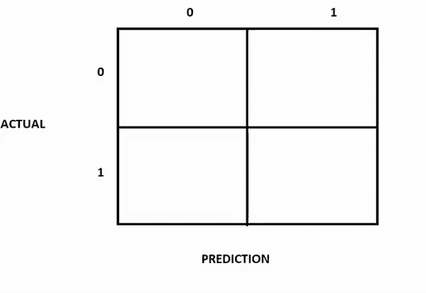
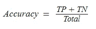
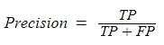
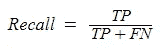
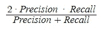

# 混乱矩阵不混乱！

> 原文：<https://medium.com/analytics-vidhya/confusion-matrix-is-not-confusing-66a530dabd39?source=collection_archive---------17----------------------->

你想成为一名数据科学家，并参加了面试。他们要求你在面试中评估这个来自糖尿病数据的混淆矩阵。你会怎么说？

让我们一步一步来看下面的 GIF，那是我做的。我们的预测可以是**负**或**正**，而实际值可以是**真**或**假**。

1.  将预测——这是我们的第二个值——替换为:
    0 = >负，1 = >正
    预测。
2.  如果患者不是糖尿病患者，并且我们预测患者不是糖尿病患者( **N** )，对吗？然后我们做了一个真实的预测。 **(TN)**
    如果患者患有糖尿病，并且我们已经预测患者患有糖尿病(P)，那么我们再次做出真实预测**。(TP)**
3.  现在我们只剩下**假**值。
    如果患者是糖尿病患者，而我们预测患者不是糖尿病患者(N)，那么我们做出了错误的预测。 **(FN)** 如果患者不是糖尿病患者，而我们已经预测到患者是糖尿病患者(P)，我们再次做出了错误的预测。 **(FP)**

True(T)和 False(F)是实际值(y)。—正(P)和负(N)是预测值。

现在让我们再次检查我们的不混乱的混乱矩阵！

真实预测:77 TN，36 TP
错误预测:14 FN，27 FP

计算评估指标:

精度:
77+36/77+36+14+27
= 0.73376..

精度:36 / 36+27 = 0.5714..

回忆:36 / 36+14 = 0.72

F1 得分:0.64

仅此而已！

*感谢阅读！如果你有任何反馈，请不要忘记评论。:)*