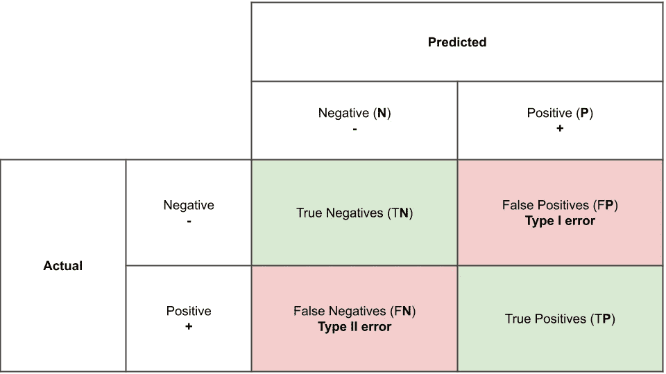
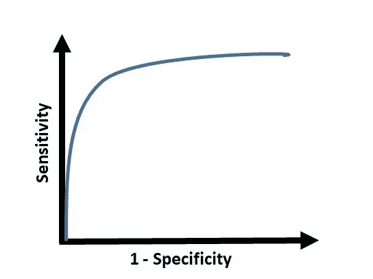

# 确定性的混淆矩阵

> 原文：<https://medium.com/analytics-vidhya/confusion-matrix-to-certainty-8982f4d8d0ee?source=collection_archive---------19----------------------->

作为分析师或数据科学家，每当我们想要查看我们的分类模型的性能时，我们总是测量它的准确性。然而，除了测量模型的准确性之外，我们还必须依赖各种其他指标，如精确度、召回率等。为了详细了解这些术语，让我们试着通过一个用例来分解和理解它们。

目前，全世界都在应对疫情，全世界的人都在接受检测。在各种新闻文章或报道中，我们听到这些测试的准确性，以及很少结果是假阳性或假阴性。为了理解这些术语的含义，让我们来看看它们的定义

**i .真阳性**——不幸的是，一个人实际上是阳性的，并且被检测为阳性

**二世。真阴性** —此人呈阴性且其测试结果也呈阴性的情况

**三世。假阳性**——一个人实际上是阴性，但被检测为阳性的情况

**四。假阴性**——一个人实际上是阳性，但他的测试结果却是阴性(最危险！！)

下表有助于您直观地理解这一点

让我们假设在一天之内，一个特定的检测中心进行了 1000 次检测，其中 10 例为阳性，15 例为 FPs，25 例为 FNs，950 例为真正的阴性

现在，

准确率= (950+10)/(950+15+25+10) = 96%

现在我们说该检测试剂盒/方法有 96%有效，这是一个好的迹象。但是我们仍然遗漏了 2.5%的实际传播病毒的病例，并且错误地隔离了 COVID 病房中 1.5%的人，这对他们来说是危险的。

这就是测试的精确度和召回率(在我们的例子中是预测模型)变得非常重要的地方。

**什么是精准和召回？**

precision = TP/(TP+FP)= 10/(10+15)= 40%(阳性预测中的正确阳性预测总数)
这意味着 100 人中只有 40 人实际上应该被隔离，我们将其余 60 人留在 COVID 病房中会对他们造成危险。

recall = TP/(TP+FN)= 10/(10+25)=～28.6%(实际阳性中的正确阳性预测总数)
这意味着您只隔离了 100 名阳性患者中的 29 人，而这 100 人中有 71 人可以在公共场所自由传播病毒

**听起来吓人吧！！**

这就是为什么精确度和召回率对于衡量任何模型和测试的性能都是同等重要的指标的原因。

**结论**

灵敏度是回忆的另一个词，

**特异性**被定义为 TN/(TN+FP)，它是真实预测的阴性与实际阴性的比率

