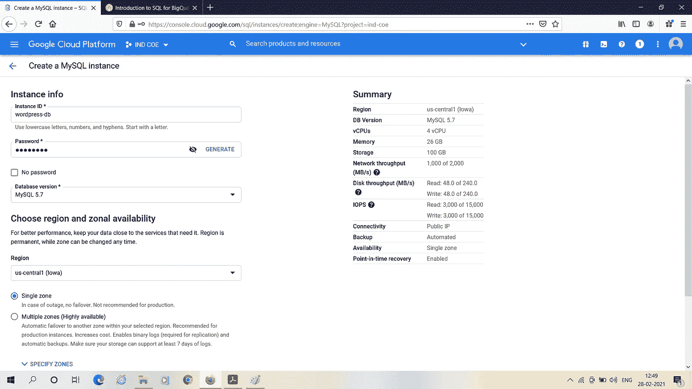

# 在 GCP 上连接计算引擎和云 SQL

> 原文：<https://medium.com/analytics-vidhya/connecting-compute-engine-with-cloud-sql-on-gcp-92644618801c?source=collection_archive---------8----------------------->

计算引擎(Compute Engine)是谷歌在 GCP(如你所知，谷歌云平台)上提供的计算基础设施。它允许用户根据自己的需求动态创建虚拟机。

云 SQL 是 GCP 上提供的托管关系存储，主要存储关系数据。

在这个项目中，我建立了两者之间的联系。

## **可能需要这种连接的原因:**

嗯，虽然同样的事情可能有很多原因，但我想探究所有这些原因的一个潜在点-

虚拟机是虚拟环境，我们可以在其中开发我们需要的不同项目。数据库是我们大多数应用程序的巨大需求，无论是网页、网站还是任何用途的任何应用程序，因为大多数应用程序都需要存储和管理数据。因此，将两者联系起来非常有帮助。

**先决条件:**

1.  GCP 账户
2.  对 GCP 控制台和 SSH 命令有一些初步了解将是一个优势。

**步骤:**

在左侧菜单中，找到 SQL 并单击它。

接下来单击创建实例，如下图所示:

然后会出现如下页面，你必须从这个项目的选项中选择 MySQL。

然后，在下面出现的表格中填写“whatever”作为密码:

并点击保存。

然后，您必须从左侧的选项中选择概述。正如您在下面看到的，您必须从“连接到此实例”中选择“使用云外壳连接”。

将出现一个授权弹出窗口，接受它。

几秒钟后，它会要求输入密码，给出密码，然后回车。然后你可以看到 mysql 的提示是可见的。您的下一个任务是复制粘贴并输入下面的代码:

创建数据库；

(没理由选 wordpress 这个名字，随便取的，喜欢的话可以用别的词。)

现在，在下面的图片中输入代码:

下一个任务是创建一个计算引擎实例。从左侧菜单中选择计算引擎，然后创建一个新实例。

点击创建。稍等几秒钟，实例就准备好了。然后对着它嘘。

复制您在上面看到的 IP 地址供以后使用。现在，输入下面的命令:

$sudo apt-get 更新

$sudo apt-get -y 安装 apache2 默认-mysql-client php 7.0

然后，转到 SQL 连接选项卡，点击“添加网络”并复制粘贴我要求复制的 IP 地址。(如下所示)

转到 Cloud SQL，复制粘贴您创建的 SQL 数据库的公共 IP 地址，如下所示。

转到您的 SSH 实例，编写如下图所示的代码，在-h 后面加上上面复制的 IP 地址。

然后嘣！您在前面看到的正是您在其中创建数据库的 MySQL 提示符。

不相信自己？没问题。

键入 SHOW DATABASES 你自己检查一下。

正如你所看到的，数据库列表包含你在云 SQL 控制台中创建的 wordpress。

现在是时候记住并删除您在计算引擎和云 SQL 上创建的实例了，这样您就不会产生任何不必要的费用。

谢谢你一直读到最后。下次见！