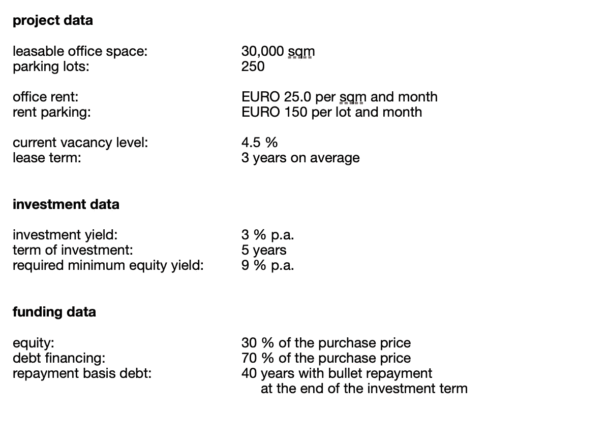
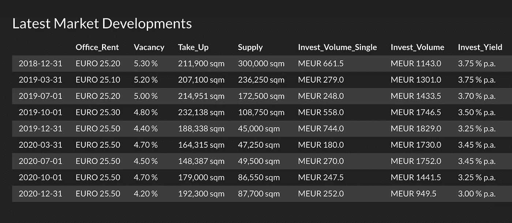
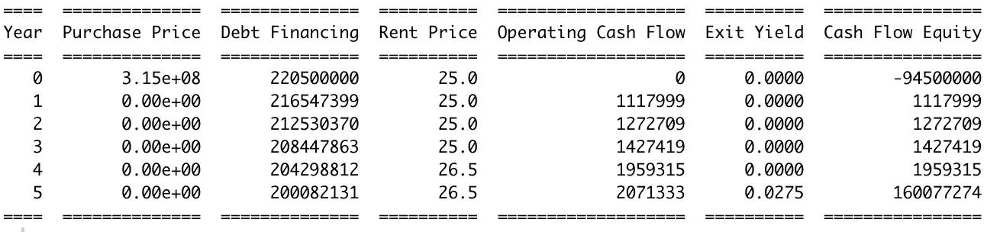
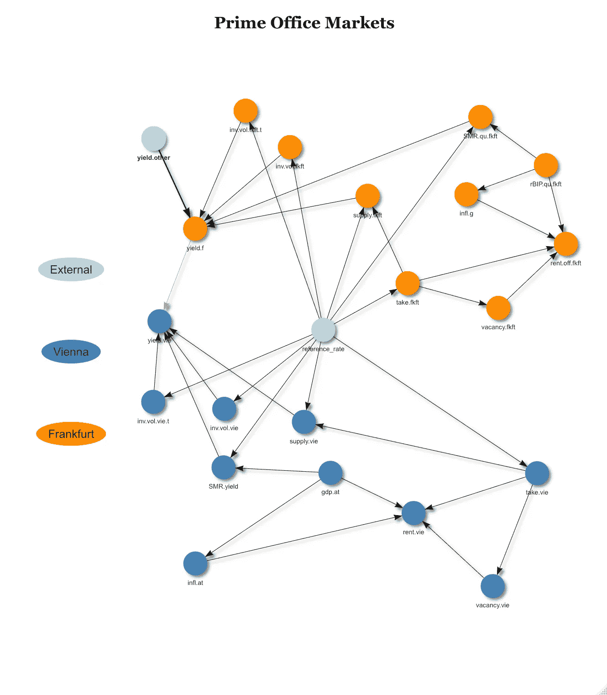
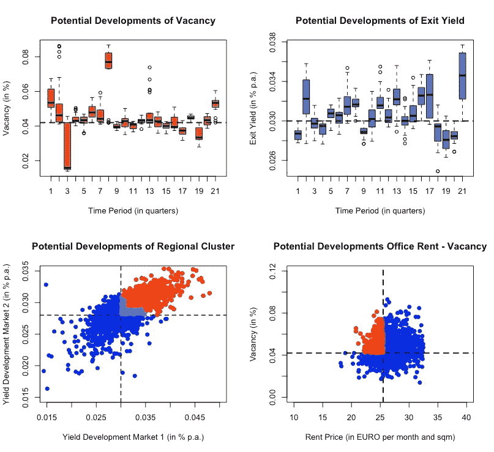
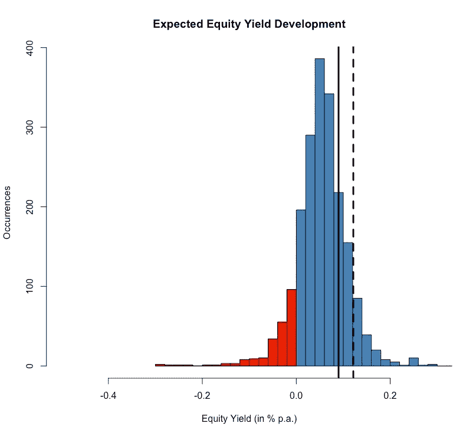
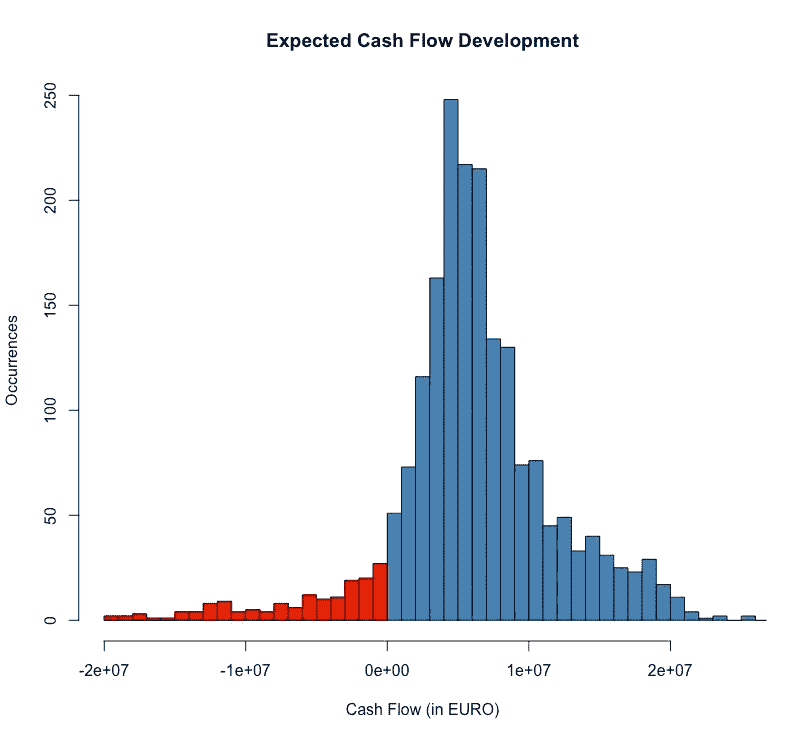
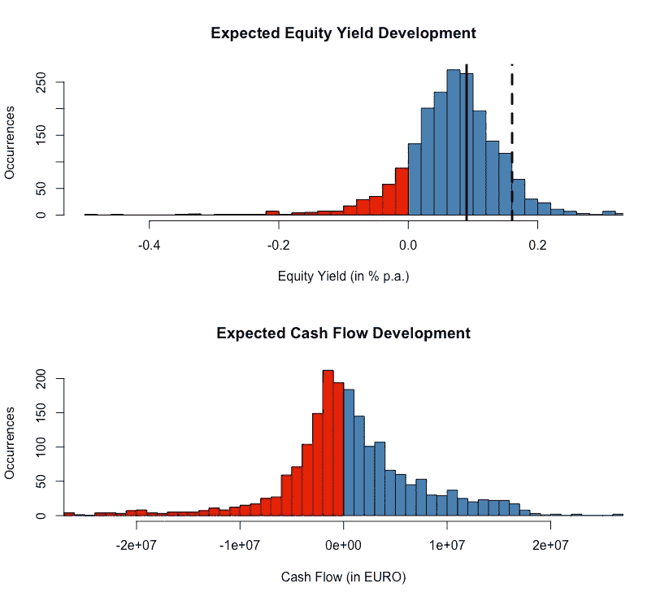

# 用预测分析工具连接房地产市场和投资组合

> 原文：<https://medium.com/analytics-vidhya/connecting-real-estate-markets-and-portfolios-with-predictive-analytics-tools-27760eb651cb?source=collection_archive---------6----------------------->

# 介绍

在上一篇文章和视频中，我们讨论了商业房地产市场的行为，如何应对不确定性，如何预测这些市场的潜在变化，如何应对中长期市场发展，以及隐藏的市场集群如何抵消投资组合多元化战略。

现在，我们开始**将**那些**外部市场数据**及其各自的分析结果与**内部投资组合数据**结合起来。

首先，我们看一下更传统的评估方法，然后我们深入了解高级预测分析方法，以便看到为不确定性下的决策建立**有效基础的决定性步骤**。

为了简单起见，我们只关注一个投资项目。

# 投资资产

例如，正在考虑在当地市场购买一栋办公楼，其项目关键参数**如下:**

按作者分类的表格

基于这一框架，潜在的购买价格将保持在 315 欧元左右。基于 70 %的预期杠杆率，投入的权益资本总计为 94.5 欧元，要求的最低权益收益率为 9 %

对这个特定的**房地产市场**的最新发展的一瞥展现了以下画面:

按作者分类的应用程序/表格

# 传统评估方法

鉴于投资框架和最新的市场情况，重点放在这项投资可以实现的预期股本收益率。

从更乐观的角度来看，租金价格预计将进一步上涨至每平方米每月 26.5 欧元，投资收益率将进一步下降至每年 2.75 %

因此，在整个投资期限内，**预期权益收益率**总计为**12.1%**，高于最低要求。下面是基本现金流计算的摘录:

按作者分类的表格

在更悲观的情况下，租金价格降至每月每平方米 24.5 欧元，投资收益率保持在每年 3 %。这导致预期的股权收益率仅为每年 3.2 %。这并不令人兴奋，但仍是一个积极的结果。

基于最新的市场发展和对该房地产市场的预期，乐观的**场景**是**给定的偏好**和**投资被置于“开始”**。毕竟，一些关键参数仍然可以调整，例如增加债务杠杆，以获得更稳定的股票收益率前景。

当然，这里展示的场景并不详尽。为了更清楚地了解该投资项目的前景，有必要进行更深入的敏感性分析。

然而，像这样的传统方法暴露了在市场发展、投资者要求、风险考虑，特别是投资机会方面给决策者提供正确信息基础的缺点。

举几个这样的缺点:

*   首先，分析中没有**没有反映市场动态**。敏感性分析肯定不能提供这种将市场行为与项目/投资组合数据和观点联系起来的平滑结构。
*   重点介绍典型房地产市场的**参数**是**太窄**无法全面概述。
*   **集群风险**行为**未被考虑**，尽管它对风险敞口有巨大影响。
*   一个项目/投资组合的所有输入参数都是由市场参数基于它们的关联性和条件依赖性同时驱动的。**在这里或那里改变**一个、两个或三个参数**以检查不同的场景**不会起作用**。**
*   **那些分析的**结果**没有被**量化为“有多大把握得到这样一个场景”。换句话说，哪个可能性更大，例如，一个市场的租金增加而投资收益减少，或者一个市场的租金减少而投资收益稳定？这在传统的方法中肯定是没有体现的。****

**因此，需要工具来考虑所有这些因素，并改善决策者的信息基础。**

# **高级预测分析工具**

1.  *****一般来说*****

**实际上，高级分析工具，尤其是高级预测分析工具具有各种特征和不同的细微差别，当然总是取决于手头的任务。**

**使它们成为如此伟大的技术的是这样一个事实，即这些方法具有高度的适应性，它们非常迅速地融入了市场行为即将发生的变化，并且它们可以根据悬而未决的问题或特定的情况进行定制。**

**换句话说，它们提供了一个**非常有效的工具包，为决策者提供了尽可能好的支持**，以了解风险敞口，在其他人之前发现市场机会，从而帮助决策者根据其风险策略/风险偏好在适当的时候占据市场位置。**

*****2。市场层面—外部数据*****

**在我们计划的办公楼投资中，这种适应性方法可能意味着首先通过 network dynamics 应用程序进入本地市场。**

**事实上，这种方法表明，这个房地产市场不仅相对较小，而且与另一个更大的市场中心密切相关，对我们观察到的市场行为有一定的影响。**

**鉴于此，我们面临着一个**区域市场集群**。这种集群行为的结果将在进一步的分析过程中实施，这也意味着我们不能再孤立地看待我们的特定市场。**

**以下是图表模型，显示了这些房地产市场的相互联系及其各自的房地产市场参数以及其他重要的输入参数:**

****

**作者图片**

**这些新信息让我们能够更好地模拟潜在的市场发展。在另一个步骤中，市场中**上升的不确定性**(例如，由于对后 COVID 环境的不确定性)通过统计建模在分析方法中**实现**。**

**以下是一些选定市场特征的模拟结果:**

****

**作者图片**

*****3。项目/组合级别—内部数据*****

**从这里开始，真正令人兴奋的部分开始了:**在一个项目、一个投资组合或整个实体的风险/绩效指标结构中，以其实现概率加权的潜在市场发展结果被放弃。****

**换句话说，**外部数据和内部数据结合！****

**在我们的例子中，我们感兴趣的是对办公室资产的投资将如何在以下方面产生结果**

*   **股本收益率和**
*   **当前流动性**

**下面是**股权收益率**的结果:**

****

**作者图片**

**蓝色区域代表正股本收益率。红色区域表示权益损失。黑线显示要求的最低权益收益率为每年 9.0 %，而黑色虚线显示最初计算的权益收益率为每年 12.1 %，这是在上述传统方法的乐观情景中得出的。**

**事实证明，这种乐观的情景“超出”了可能性。在这个投资项目中，只有 9 %的机会达到这个结果，甚至做得更好。**

**甚至有 78 %的可能性达不到要求的最低股本收益率。**

**投资股票亏损的几率高达 11 %。不过，遭受 5 %以上损失的可能性只有 2.5 %。**

**从这个角度来看，潜在投资似乎不再那么光明。最终“走”将取决于投资者的风险偏好和最终最低收益率要求。**

**现在，让我们来看看投资期限内目标资产提供的**当前流动性**(即包括财务费用但不包括资产出售所得的经营现金流)的结果:**

****

**作者图片**

**实际上，当前流动性的结果与上述乐观方法的初始评估相匹配，预期值约为 6。**

**尽管潜在结果的范围(见图表)要宽泛得多，并且反映了当前市场的不安全性。随之而来的是高达 8.5%的**流动性短缺**风险。**

*****4。总评*****

**总的来说，该项目的股权风险似乎比流动性风险更重要。其中的部分原因在于本分析中包含的市场动态。不要忘记，平均租期为 3 年，这在一定程度上缓冲了任何市场发展。**

**部分原因在于资产的初始投资参数。虽然投资收益率处于市场收益率水平，但资产的平均租金价格略低于市场，项目目前的空置率略高于市场。**

**在传统的评估中，我们考虑了增加债务杠杆的可能性，以获得更稳定的股权收益前景。事实上，在这一传统框架内，杠杆从 70 %增加到 80 %会将权益收益率从每年 12.1 %提高到每年 16 %**

**不幸的是，**高级预测分析方法并不那么亲切**。投资参数的简单调整无法逃脱市场规则。请看下图，该图显示了同一项目的股本收益率和当前流动性状况，但杠杆率为 80 %(而非 70 %):**

****

**作者图片**

**达到新计算的 16 %的股权收益率的可能性仍然很小，只有 8 %。最低股本收益率的情况有所改善，但遭受损失的风险也增加了。**

**然而，这里的**更关键的**话题是流动性状况。遭遇**流动性缺口的**风险从可控的 8.5 %上升至 50 %！随着杠杆率的提高，金融债务也随之增加，这正在产生负面影响。******

**可以看出，为了提高资产的性能指标，对一个参数的轻微调整对其他一些风险指标产生了非常(动态)的负面影响。顺便说一下，从概率的角度来看，性能指标并没有真正提高。**

# **结论**

**虽然我们在这里只是触及了表面，但现在应该很明显的是**高级分析方法以更有效的方式支持决策者**。**

**外部**市场数据自动连接到内部**项目和/或投资组合**数据**。**

**在这种情况下，市场模式、集群行为和不断变化的市场行为被**顺利纳入**各自管理信息系统**的风险/绩效指标中**。**

**可以根据手头的问题以非常灵活的方式调整风险/绩效指标的网格。当然，为了能够为给定的问题初始化最佳解决方案，大量**深厚的业务专业知识**是**所必需的**。这确保了为任何给定的问题开发最有效的解决方案。**

**先进的分析工具之所以如此有效，是因为**结果是量化的(就概率而言)、客观化的和透明的**，然后可以**与**风险和**投资政策**以及预先约定的**实体的风险偏好**作为一般指导方针。**

**这**决定性地缩短了决策方式**，**降低了决策者的风险**，**以最灵活的方式支持高管揭示隐藏的风险，并在竞争之前发现市场机会**。**

**简而言之，它**支持决策者在适当的时间**采取合适的市场定位，同时实施基于先进技术的管理信息系统的成本是可评估的。**