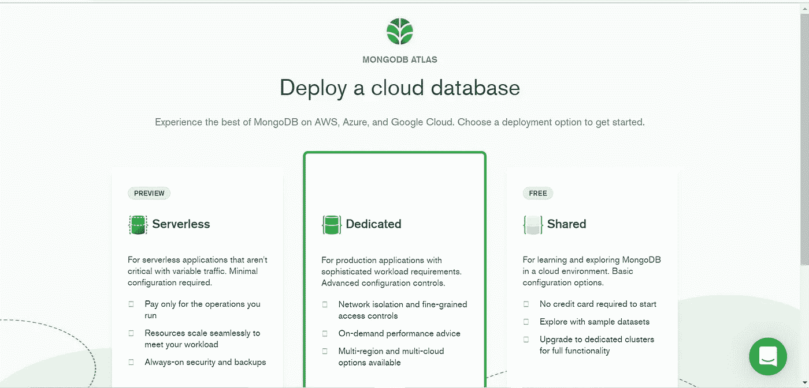

# 使用 Python-PyMongo 连接到 MongoDB Atlas

> 原文：<https://medium.com/analytics-vidhya/connecting-to-mongodb-atlas-with-python-pymongo-5b25dab3ac53?source=collection_archive---------0----------------------->

在本文中，我们将使用 python 连接到一个简单的 MongoDB 数据库。我们将对数据执行简单的操作，如:

*   添加
*   更新
*   删除
*   一次添加多条记录

这篇文章的视频版本可以在[这里](https://youtu.be/M5zCRDPQbQE)找到。

# **MongoDB 图集**

> 报名 **MongoDB 图集**这里:[数据库访问|图集:MongoDB 图集](https://www.mongodb.com/atlas-signup-from-mlab)


Img 来源:[报名 MongoDB 图集|云 MongoDB 托管| MongoDB](https://www.mongodb.com/atlas-signup-from-mlab)

> 选择一个**展开选项**:



Img 来源:[报名 MongoDB 图集|云 MongoDB 托管| MongoDB](https://www.mongodb.com/atlas-signup-from-mlab)

> 选择所需的**云提供商**和最近的**地区**:


作者 Img

> 在数据库访问选项卡中，转到“**添加新的数据库用户**”:


作者 Img

> 创建要测试的集群:


作者 Img

> 您可以加载现有的样本数据集，也可以创建和添加您自己的数据。点击**添加我自己的数据**按钮:


作者 Img

> 将打开此对话框，您必须在其中为新数据库输入新的数据库名称和集合名称:


作者 Img

> 您将能够看到此屏幕:


作者 Img

> 现在转到**网络访问**来连接您的集群。在此添加您的 **IP 地址**，因为您的数据库用户已经创建:


作者 Img

> 完成后，您可以选择**连接方式**。点击**连接您的应用**:


作者 Img

> 分别选择**驱动**和**版本**为" **Python 和 3.6"** 或更高版本:


作者 Img

> 您将得到类似于以下内容的字符串:

```
mongodb+srv://SoumiBardhan:<password>[@cluster](http://twitter.com/cluster)-test.fndbj.mongodb.net/myFirstDatabase?retryWrites=true&w=majority
```

> 复制并保存在某个地方。现在，您可以连接到您的数据库。首先在您的系统上创建一个新的 python 文件`test_mongo_connection.py`。导入 pymongo，它是 python 驱动程序，可以让我们连接到 MongoDB 数据库。

```
import pymongo
from pymongo import MongoClient
```

> 使用 URL 连接集群。在此 URL 中替换您的用户名和密码。

```
cluster = MongoClient("mongodb+srv://<USERNAME>:<PASSWORD>@cluster-test.fndbj.mongodb.net/UserData?retryWrites=true&w=majority")
```

> 通过提供您之前创建的数据库的名称，创建一个新的**数据库** `db`。通过提供您创建的**集合**名称来初始化集合。

```
db = cluster["UserData"]collection = db["Flask_mongo"]
```

> 现在让我们看看如何插入一些数据。您可以通过在 python 文件中添加以下语句来实现:

```
collection.insert_one({"_id":0, "user_name":"Soumi"})
collection.insert_one({"_id":100, "user_name":"Ravi"})
```

> 您还可以添加更多字段。接下来，用`python3 test_mongo_connection.py`执行文件。

您将能够在仪表板上看到更新的数据。


作者 Img

> 现在，让我们看看如何删除帖子:

```
collection.delete_one({"_id":0, "user_name":"Soumi"})
```

> 这篇文章将被删除，你将能够从数据库中查看。
> 
> 您也可以像这样一起添加多个帖子:

```
post1 = {"_id":"0", "user_name":"Soumi"}post2 = {"_id":"100", "user_name":"Ravi"}collection.insert_many([post1,post2])
```

> 更新具有特定 ID 的帖子:

```
collection.find_one_and_update({"_id":"0"}, {"$set" : {"user_name" : updated_user_name}}, upsert = 0 )
```

> 因此，根据需求，你可能需要**将你当前的 IP** 列入白名单，因为它会随着时间而变化。


作者 Img

在本文中，我们连接了一个 MongoDB 数据库，并执行了一些基本操作。在下一篇文章中，我们使用 Flask 和 MongoDB 制作了一个简单的用户登录系统。

# 参考

*   [PyMongo 3.12.0 文档— PyMongo 3.12.0 文档](https://pymongo.readthedocs.io/en/stable/index.html)
*   [MongoDB 图集:云文档数据库| MongoDB](https://www.mongodb.com/cloud/atlas/lp/try2-in?utm_source=bing&utm_campaign=mdb_bs_apac_india_search_core_brand_atlas_desktop&utm_term=mongodb%20atlas&utm_medium=cpc_paid_search&utm_ad=e&utm_ad_campaign_id=415204524&msclkid=fa888df91f3f192f6eebeca92fe7e575)