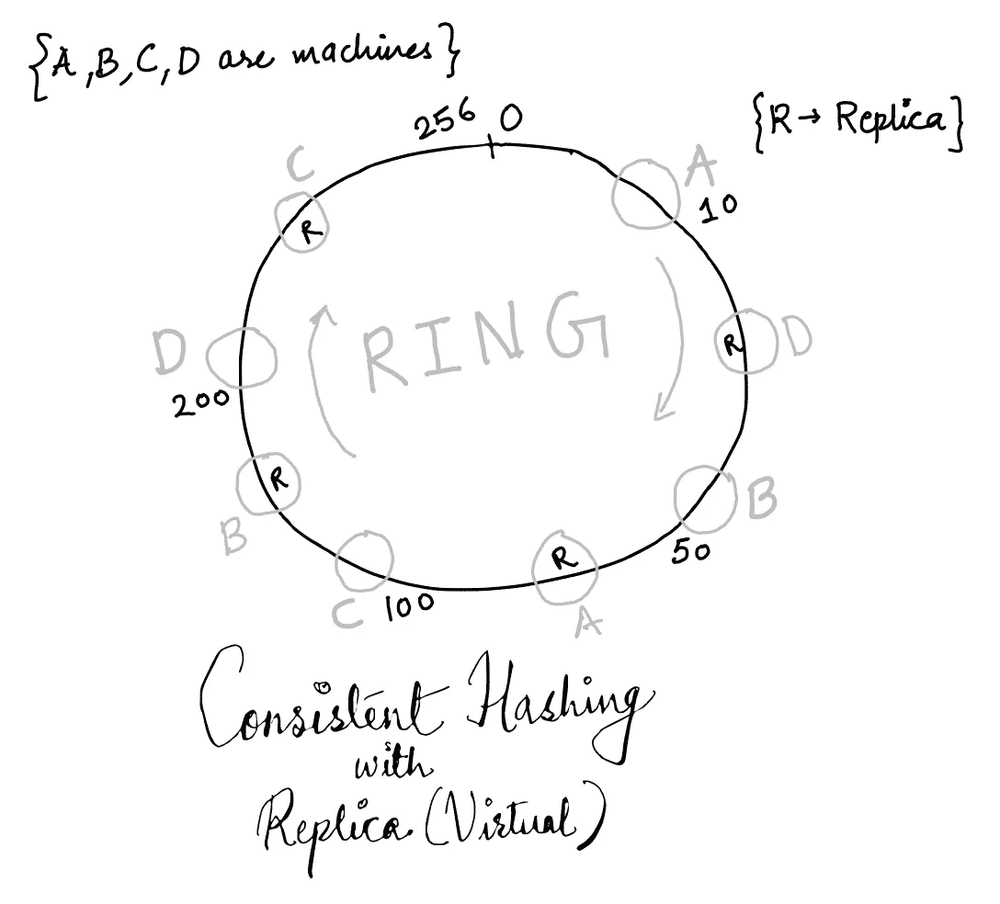

# 一致散列法

> 原文：<https://medium.com/analytics-vidhya/consistent-hashing-f94a6c6d511?source=collection_archive---------11----------------------->


由[马库斯·斯皮斯克](https://unsplash.com/@markusspiske?utm_source=medium&utm_medium=referral)在 [Unsplash](https://unsplash.com?utm_source=medium&utm_medium=referral) 上拍摄的照片

## **哈希基础……⭐️**

哈希是设计和开发分布式系统时使用的最基本、最强大的技术之一。散列意味着将一个任意的*键*(一个对象)*(通常是*)转换成一个整数，称为 *hashcode* 。

```
int hashCode = hashMe(key)
```

散列需要一个*强*散列函数，它接受一个键并返回一个整数。所谓*强*，我的意思是这个函数必须能够在输出范围内均匀分布各种键，这样*碰撞*就很少了。一个*冲突*意味着不止一个键被分配了相同的整数。令人欣慰的是，这个问题已经解决了，有许多众所周知的很好的散列算法，例如 MD5，SHA，brunh 等。

哈希技术广泛应用于简单程序、web 应用程序和大规模分布式系统中，用于快速查找关键字。

## **缓存…📝**

从磁盘或通过网络读取需要时间，并且会增加应用程序的延迟。为了消除这种延迟，通常将结果存储在内存中(在哈希表中),以便更快地查找。它确实可以加速许多操作，降低成本，还可以减少下游系统的负载。尽管在进行缓存时会遇到不同的挑战。例如，我们必须解决如下一些挑战-

*   如何让缓存保持最新？
*   提供陈旧数据可以吗？
*   当托管缓存的机器死亡时会发生什么？
*   如果数据变大，而您无法将数据完全加载到内存中，该怎么办？

嗯，所有这些挑战总是会存在的，我们作为工程师必须找到一个平衡点，并知道我们所做的权衡的风险。

当分布在机器上时，缓存可以水平扩展。

## **分布式缓存…😱**

因此，您加载到内存中的数据集变得非常庞大，无法在一台机器上加载，因此您必须将数据分散到多台机器上。但是你如何传播它呢？

例如，您想要在内存中存储用户信息，并且您有一百万个用户。因此，您启动了多台机器，并为每台机器分配了一组用户。想象一下你会有一张像这样的地图-

```
#where 0,1,2 represents machineId and u{int} represents UserId(key)
0 -> [u1, u2, u3, u4]
1 -> [u5, u6, u7, u8]
2 -> [u9, u10]}
```

如何将机器分配给用户？一个基本的技术可以是只做模运算，然后找到 machineId。

```
machineId = key % (number of machines)
```

因此，如果用户 Id 是 56，并且您有 3 台机器，您将把用户放在带有`id = (56%3) = 2`的机器上。如果用户 Id 是 90，那么您将使用带有`id = (90%3) = 0`的机器，以此类推…

这个简单的散列技术是可行的，但是…

*   如您所见，我们的哈希函数取决于机器的数量，当我们想要添加更多机器或删除一些机器时，它会为每个用户更改哈希。所以现在，您需要在您的机器集群中洗牌。因此，每当一台机器死机或者你想升级的时候，你就必须不停地按键。这可能非常昂贵，而且随着集群规模的增长，这种情况会更加频繁。
*   另一个问题是，密钥不是均匀分布的，这意味着您可能最终拥有一台机器比其他机器拥有更多的密钥。因此，这台机器将服务于大多数请求 ***(热缓存)*** 。例如，如果大多数用户标识可以被“机器数量”整除，那么它们将会出现在带有`id=0`的机器上，而其他机器将会闲置。

因此，这种技术不是水平可伸缩的。

## **一致散列法…👊**

这种技术*减少了*向外扩展或向内扩展时的键重组，这在以前的方法中是一个大问题。现代分布式数据库和缓存解决方案使用一致的散列法，例如 DynamoDb、Redis 等。

**它是如何工作的？🤔**

想象一个环形编队，在这个环上你分散你的机器。您的散列函数生成一个范围`0...H`内的整数。每个整数映射到环上的一个点。对于每个缓存*(机器)*你将在环上分配一个点。比如说。`cache1 -> 5` `cache2 -> 100`等等…

1.  对于给定的键，找到散列整数`int hashIndex = hashFunc(key)`
2.  这个`hashIndex`映射到环上的一个点。
3.  从这一点，顺时针方向移动，找到下一台可用的机器。
4.  这台机器将容纳`key`


**添加一台机器……➕**

当您添加一台机器时，您只需从新机器之前存在的机器上移动一些密钥，其余的密钥保留在以前的设置中。

**移除机器… ➖**

当一台机器死亡时，存在于该机器上的所有密钥将转移到环上的下一台机器。其余的键不会被重组。

因此，在最大时间内，如果添加或移除机器，仅移动`k/n`键，其中`k = number of keys`和`n=number of machines`

到目前为止，我们解决了向外扩展或向内扩展时重组键的问题。但是非均匀密钥分布的另一个问题仍然会发生，因为密钥只是随机分布的。

这个*热*缓存的问题，可以用副本来解决。因此，我们将缓存映射到环上的多个点，而不是映射到环上的单个点。所以现在每个缓存映射到环上的多个点。`cache1 -> 5, 153, 200` `cache2 -> 100, 240`以此类推。这也意味着，每个缓存将保存属于环的不同部分的`keys`。



副本的数量越多，分布就越均匀。

🍻干杯，

Kaivalya Apte💻

软件工程师@Twilio