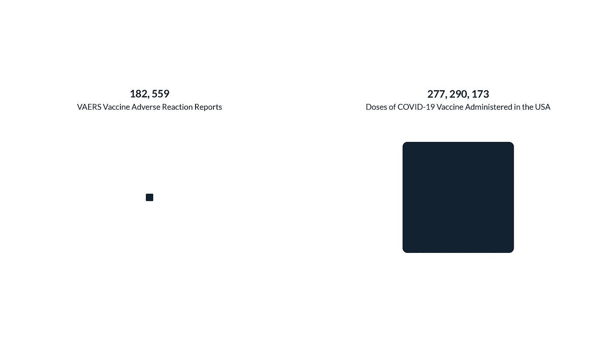
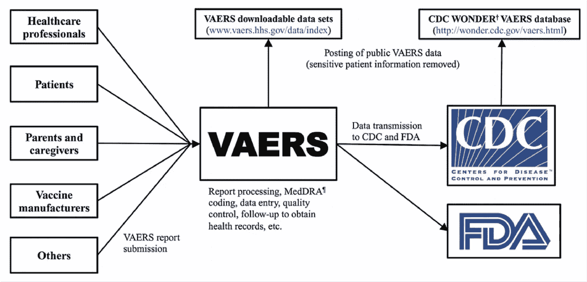
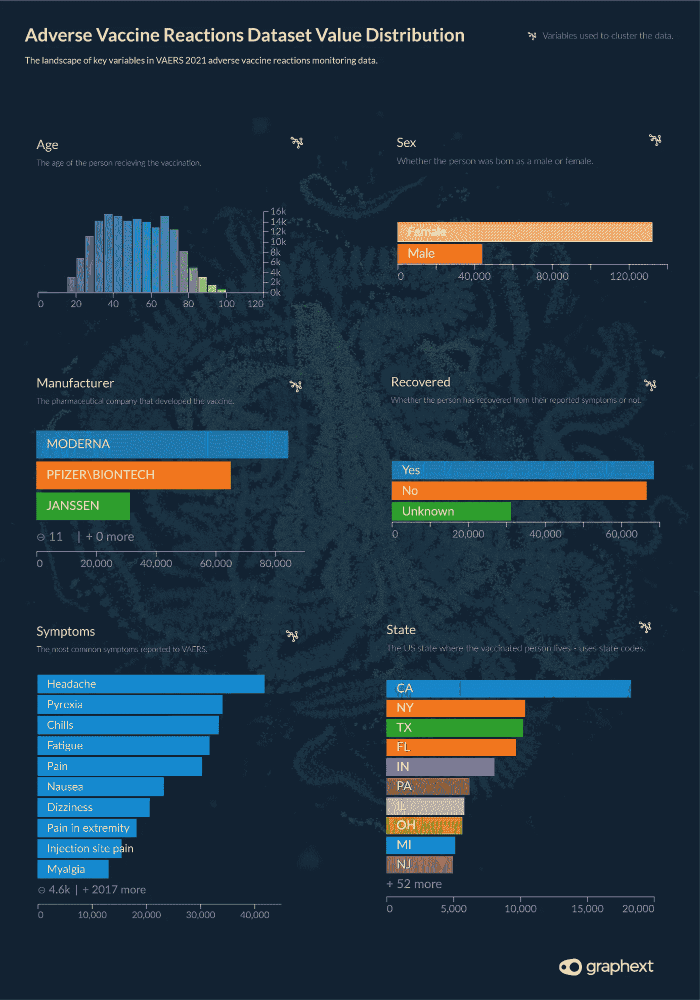
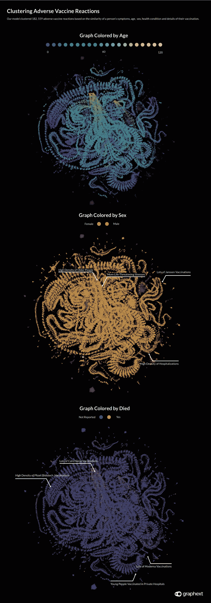
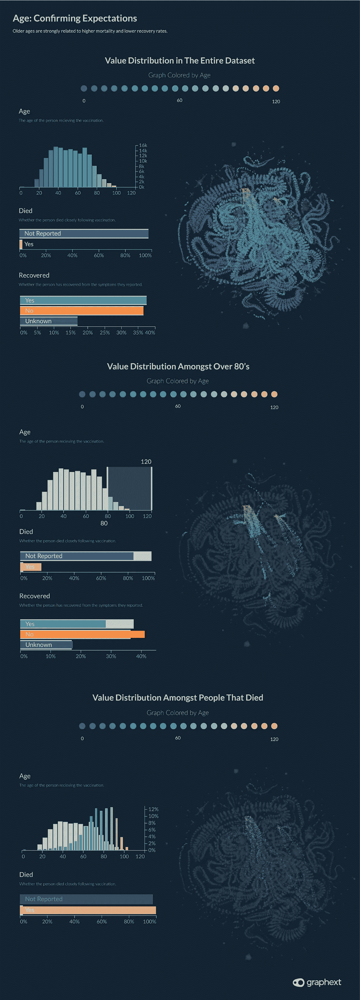
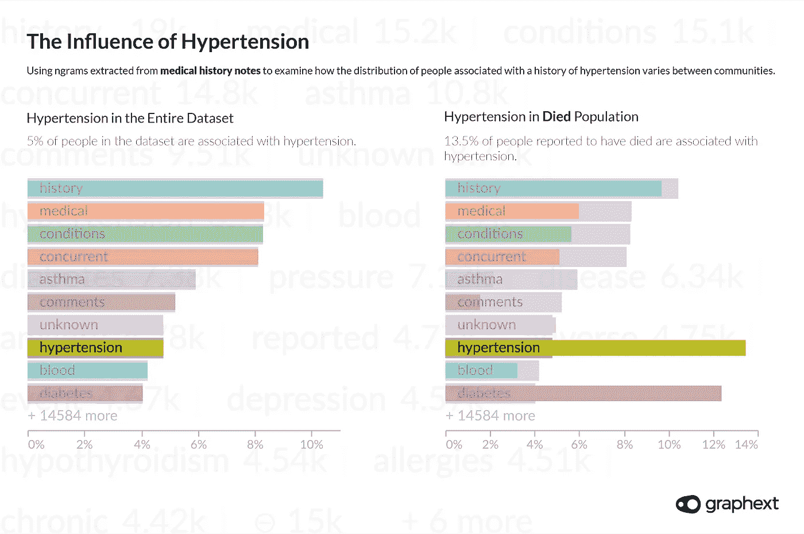
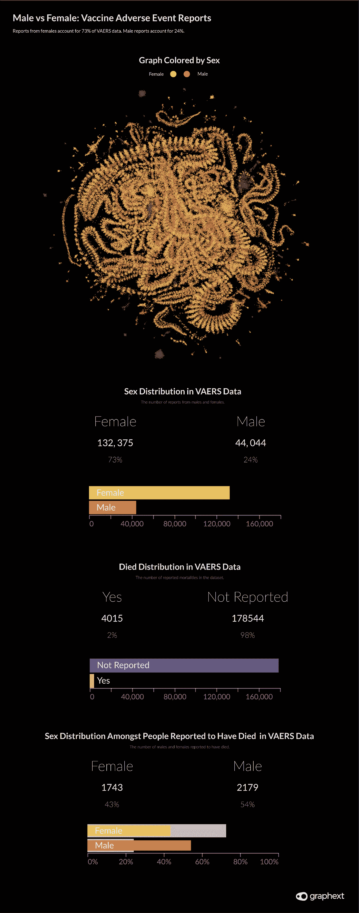
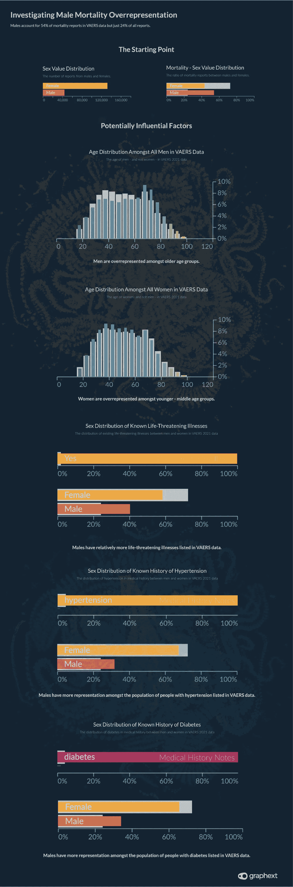

# 阴谋、复杂性和聚集性:新冠肺炎疫苗不良反应的调查报告

> 原文：<https://medium.com/analytics-vidhya/conspiracies-complexity-and-clustering-investigating-reports-of-adverse-covid-19-vaccine-effects-a5b0f2ac35ad?source=collection_archive---------20----------------------->

*疫苗不良事件报告系统(VAERS)是一项由美国政府资助的疫苗反应监测服务，我们的团队对疫苗不良事件报告系统()的数据进行建模，着手调查与新冠肺炎疫苗接种计划在美国的大规模推广有关的不良健康影响报告。* ‍

截至 5 月中旬，美国已经为**接种了 2 . 77 亿次新冠肺炎疫苗**——几乎占全球剂量的 18%。最近一波 **VAERS 数据**，持续到【2021 年 5 月 7 日，记录了 **182，559 份来自美国人口的疫苗不良反应报告**。这使得美国公民每接种 1，519 剂新冠肺炎疫苗，就有 1 份 VAERS 疫苗不良反应报告。考虑到不良反应报告可能像头痛或手臂酸痛一样无害，这个比例似乎相当合理…对吗？‍

2021 年 5 月 15 日:VAERS 报告与美国疫苗剂量的比较。‍

# 给我一些背景

但是，在这里忽略上下文是不可能的，或许也是不负责任的。随着疫情病毒继续影响世界各地的人们，有相当一部分人仍然对疫苗项目的效果持怀疑态度。没有科学证据支持的毫无根据的说法在社交媒体上迅速传播。说服某人担心很容易，但让他们放心却不那么容易。

因此，有了一组疫苗不良反应的数据，很明显的诱惑是找出一系列结论，表明怀疑者是否有任何基础来坚持他们的信念。这种规模的数据集似乎揭示了新冠肺炎疫苗如何影响人类的“真相”。但是在免疫学和疫苗研究的世界里，事情没有这么简单。‍

> *“该系统(VAERS)的设计不是为了确定报告的不良事件是否是由疫苗引起的，而是作为一个早期预警系统，帮助 CDC 和 FDA 确定进一步研究的领域。”*
> 
> *‍* **疾控中心代表与 Graphext** 相对应

‍The 这里的关键点是 VAERS 数据不是科学证据。虽然 VAERS 是由美国政府的两个部门 **CDC(疾病控制和预防中心)**和 **FDA(食品和药物管理局)**共同管理的，但其专门使用报告来收集数据仅作为“早期预警系统”来标记进一步研究的领域。

‍

VAERS 数据流。图片由 Shimabukuro 等人提供(2015)

‍

CDC 的一名代表告诉 Graphext，由于 VAERS 被动地依赖患者和医疗保健提供商来报告不良疫苗事件，**仅使用 VAERS 的数据无法得出任何结论** —尽管在某些情况下，法律要求医疗保健提供商向 VAERS 报告。‍

> *我们采访过的免疫学家强调，为了确定疫苗不良事件理论的统计学意义，需要比较接种疫苗的人群和未接种疫苗的人群。* ‍

这是有道理的。为了验证关于疫苗副作用的理论，需要实验室条件来进行测试，以确定接种和未接种人群之间**差异的统计显著性。VAERS 的数据必须理解为美国公众报告的疫苗不良事件的记录。这与实验室条件相差甚远，也无法与未接种疫苗或无症状的人进行比较。‍**

# VAERS 的数据里有什么

VAERS 的数据定期在他们的数据门户网站上更新，每年发布一次，详细记录了接种疫苗后个人、其护理者或医疗服务提供者报告的疫苗不良事件。VAERS 成立于 1990 年，记录一个人感觉到的**症状**，他们是否**死亡**，他们是否**住院**或**从他们的症状中恢复**以及关于他们**现有健康状况**的信息。‍

> *VAERS 数据专门记录了来自报告疫苗不良事件的人的信息。*

‍

> *我们根据疫苗不良事件报告的相似性对 VAERS 数据进行了聚类。为相似性建模的因素包括报告者的人口统计学特征、他们遭受的症状和事件的严重性。* ‍

# 价值分布:VAERS 数据 2021 波

*疫苗不良事件报告范围为 2020 年 11 月—2021 年 5 月 7 日* ‍

变量图表:VAERS 2021 数据的数值分布。

# 集群+ NLP:构建项目

接下来开始分析数据，我们的团队建立了一个**聚类模型**，根据报告者的人口统计信息、他们遭受的症状和事件的严重性的相似性对不良事件报告进行分组。设定两个目标变量——***死亡*** 和 ***康复***——我们的目的是揭示**与**有相似结果**的报道之间的**联系。根据 VAERS 作为“早期预警”系统的目的，我们使用 Graphext 对 VAERS 数据进行聚类的目的是**指出需要进一步研究的领域**。‍****

但是在这里仅仅聚类还不足以解释数据集的复杂性。VAERS 包括 6 个文本栏； ***其他用药、过敏史、病史记录、症状描述、既往接种疫苗*** 和 ***当前疾病。所有这些文本列都包含了潜在的有用信息，但是除非经过处理和解析，否则在我们的分析中基本上是无用的。为了缓解这个问题，该团队打开了 Graphext 的代码编辑器，并添加了 NLP 步骤来从这些列中提取关键字，在某些情况下还提取形容词和名词。***

‍ *要了解更多关于我们如何构建这个项目的信息，包括我们用来从数据中提取语言特征的方法的分步指南——*[***查看这个项目背后的方法论。***](https://www.graphext.com/post/the-method-behind-our-investigation-of-reports-of-adverse-covid-19-vaccine-events) ‍

图表:用显著变量着色的 VAERS 数据；年龄，性别和死亡时间。‍

# 年龄:确认期望

第一次使用颜色映射检查图表来显示整个报告网络中的值的分布，我们的团队立即发现了变量*的影响。如上面第一张图表所示，一个人的年龄对他们在网络中的位置以及他们死亡的可能性有很大的影响。*

*疫情已经揭示了老年人的脆弱性。我们的直觉告诉我们，老一代人更有可能在死亡或没有从症状中恢复的人群中占据过多的比例。排除 20 岁以下的美国人——他们在撰写本文时不太可能接种疫苗——VAERS 数据集中的年龄分布与美国总体人口中的年龄分布相似。然而，正如我们假设的那样，老一代人在报告没有从症状中恢复或已经去世的人群中有更大的代表性。‍*

> *在 VAERS 的数据中，60 岁以上的人占了记录死亡人数的 79.7%，但仅占数据集的 29%。 ‍*

*这是意料之中的吗？差不多吧。在 VAERS 的数据中，60 岁以上的人占死亡人数的 79.7%，但只占数据集的 29%。毫无疑问，这是一个过高的比例，但它很可能没有受到疫苗接种的影响，而是更有可能代表一个已知的事实，即老年人患更多的疾病，健康状况不佳，总体上更有可能死亡。‍*

**

*图表和可变图表:年龄越大，死亡率越高，恢复率越低。‍*

# *高血压*

*将我们的注意力转向不良疫苗报告的更多具体特征，我们开始检查由我们的 NLP 步骤从与数据集中的人相关联的病史记录中提取的**关键词。***

*高血压——通常被称为高血压——被**记录了 8731 次**，这意味着大约 5%的数据集有高血压史。接下来，我们对数据集进行过滤，只显示据报道已经死亡的人的值——总共 182，559 人中的 4015 人——并再次将我们的注意力转向“病史注释”列中关键词的相对分布。‍*

> *有高血压病史的人占整个数据集的 5%,但却占报道死亡人数的 13.5%。 ‍*

*这一次高血压的出现更加明显。在 4015 名据报道已经死亡的样本人群中，13.5%的人在他们的病史记录中与高血压有关。这里的数据似乎表明，在接种疫苗后遭受最严重事件的人群中，高血压患者的比例过高。还应该注意的是，由于高血压患者对新冠肺炎的易感性增加——如果这种过度表达被进一步的研究证实——那么疫苗接种的益处仍然大于风险。*

**

*可变图表:从病史笔记中提取语言特征以表明考虑死亡率时高血压是有影响的。‍*

# *男性与女性:报告的分布*

*在美国，男女比例差不多是 50 / 50。但是在 VAERS 的数据中， **73%的疫苗不良事件报告是由女性**或代表女性做出的。令我们团队感到奇怪的是，我们将这一发现告诉了与之交谈的免疫学家。他们强调了几个可能在这里起作用的混淆因素。*

*在美国，不仅有更多的女性接种了疫苗，而且与男性同龄人相比，女性的预期寿命也更长。年龄较大的群体中妇女人数过多，可能导致更多的弱势妇女更有可能遭受疫苗不良反应。其他因素可能包括男性不太可能报告症状。‍*

> **73%的 VAERS 报告来自女性。**

**

*图表和变量图:VAERS 数据在男性和女性之间的分布。‍*

# *Rates‍男性死亡率*

> **尽管只占数据的 24%，男性却占了死亡人数的 54%。* ‍*

*尽管只占数据的 24%,但在数据报告的 4015 例死亡中，男性占了 54%。这一比例相当高。看看这里起作用的影响因素，很可能以下几点会影响这种分布。‍*

*   *在向 VAERS 汇报的年龄较大的群体中，男性比例过高。*
*   *在 VAERS 的数据中，患有危及生命疾病的人口中，男性比例过高。*
*   *在病史记录中，患有高血压和/或糖尿病的 VAERS 社区中，男性的比例也过高。*
*   *男性不太可能向 VAERS 报告不太严重的症状。*

*‍*

> **“新冠肺炎(和其他)疫苗的疫苗安全性监测仍在继续，任何与特定地理位置或风险人群相关的安全性问题都将得到适当调查。”**
> 
> **‍* **CDC 代表与 Graphext** 交谈*

*我们采访的学者强调，在对新冠肺炎疫苗接种后的男性死亡率做出任何确定的结论之前，有必要对这一发现进行验证。不同疫苗制造商报告的男性死亡人数分布相当均匀，这似乎有悖常理。*

*可能需要进一步调查这一统计数据来解释它。我们的团队知道，这涉及到将未接种疫苗人群的结果与接种疫苗人群的结果进行比较——这仅仅使用 VAERS 的数据是不可能的。*

*但当我们联系疾病预防控制中心，以了解他们是否知道这一发现或对其进行调查时，他们避免发表具体评论，而是表示，“对新冠肺炎(和其他)疫苗的疫苗安全监测仍在继续，任何与特定地理位置或风险人群相关的安全问题都将得到适当调查。”*

*‍*

**

*可变图表:影响男性死亡率的因素。‍*

# *肯塔基州和波多黎各的死亡率*

*通过查看据报道已经死亡的人的地理分布，我们发现与肯塔基州相比，所有州之间的死亡率有一个至关重要的差异。*

*与其他州相比，肯塔基州的治愈率较低，死亡率较高。数据表明，尽管肯塔基州的条目仅占数据集的 1%，但肯塔基州的死亡人数占所有报告死亡人数的 3%。这一统计数据比所有州的平均死亡率高出 154.3%。同样，在肯塔基州，记录在案的未从症状中恢复的人的比例比同一统计数据的全州平均水平高出 22.4%。‍*

> *与其他州相比，肯塔基州和波多黎各的治愈率较低，死亡率较高。 ‍*

*在波多黎各，同样的数据比所有州的平均值高出 375%。虽然在我们看来，这些发现值得进一步研究，但重要的是要注意这里的绝对数字。相对于 VAERS 数据集中的 182，559 份疫苗不良事件报告和撰写本文时美国提供的 2.77 亿剂疫苗，肯塔基州报告的 52 例死亡和波多黎各的 32 例死亡似乎没有最初出现的影响大。‍*

**要了解我们如何对 VAERS 数据进行分析的更多信息，请查看我们在本次调查中使用的方法***。虽然对 VAERS 数据的分析不能提供关于新冠肺炎疫苗对特定社区中报告的症状的影响的结论，但我们希望如果您有任何问题或希望继续与我们建立的项目合作，请与我们联系。* ‍**

# **项目概述**

## **目标**

**调查疫苗不良事件报告之间的关系和相似性。**

## **数据**

**[**VAERS 2021 波—5 月 7 日出口**](https://vaers.hhs.gov/data.html)**

## **关键变量**

**年龄——症状——死亡**

## **分析类型**

**模型—群集**

## **相关行业**

**健康—制药—生物学**

## **探索自我**

**[**💉VAERS 数据| COVID 疫苗不良事件研究**](https://app.graphext.com/projects/UHJvamVjdC0zMDUwNw==/v/graph?colorMap=Died&areaMap=null)**

**‍**