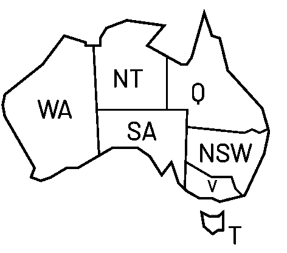
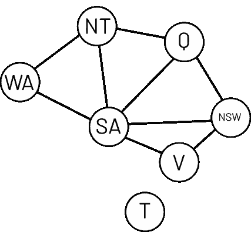
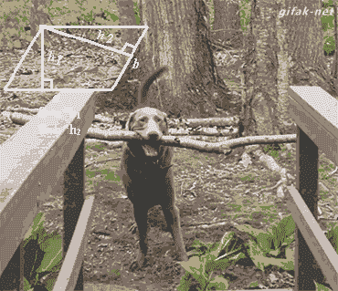

# 人工智能基础:约束满足问题介绍

> 原文：<https://medium.com/analytics-vidhya/constraints-satisfaction-problems-fcca0ff8d2b5?source=collection_archive---------4----------------------->

照片由 [Ondrej Machart](https://unsplash.com/@ondrejmachart?utm_source=medium&utm_medium=referral) 在 [Unsplash](https://unsplash.com?utm_source=medium&utm_medium=referral) 上拍摄

A 任何想要认真研究人工智能的人都要从研究约束满足问题开始。在本文中，我将向您介绍 CSP:我将解释它们是什么，它们如何对您有用，以及如何通过一个直接来自袋鼠国家🦘.的实际例子来解决它们

如今，CSP 被用于许多领域，例如生物学(DNA 测序)、约束数据库、诊断、自然语言识别等等。

## 什么是约束满足问题？

约束满足问题(CSP)代表一类问题，其中该问题中的对象之间存在一些限制。

从形式上讲，CSP 由三个部分组成:
1。一组变量(V = {V1…Vn})
2。每个变量一个域(D = {D1 … Dn})
3。一组约束(C)

## 解决方法

像每个问题一样，CSP 也可以有解决方案；但是我们需要定义“解决方案的概念”。所以，让我们从状态开始:

CSP 中的**状态**是对一些或所有变量的**赋值**；我们在第一种情况下将**定义为部分赋值**(不是每个变量都有赋值)，在另一种情况下将**定义为完全赋值**。我们还将**一致赋值**定义为一个满足所有约束的赋值。

> CSP(或目标状态)的**解决方案**是一个完整且一致的任务。

## CSP:以🦘为例

如果你以前不知道，澳大利亚有这 7 个地区

最后可以看到一个例子。这就是著名的“澳大利亚地图着色问题”，可以描述如下:

> 你必须用三种颜色{红、蓝、绿}给澳大利亚的每个地区上色，这样相邻的地区就不会有相同的颜色。

好吧，乍一看这可能太简单了，但是让我们来定义 CSP:
1。V = {WA，NT，Q，NSW，V，SA，T}
2。D = {green，red，blue}，*在这个问题中所有变量都有相同的域
3。* C = { "相邻区域不能有相同的颜色" }

## 约束图

约束图

为了更好地理解这个问题，我们可以做的第一件事是定义**约束图**，这对查看变量之间的关系很有用。
约束图是一个无向图，其中我们为每个变量(来自原始 CSP)放置一个节点，如果节点所代表的变量之间存在约束，则在两个节点之间放置一条边。

好了，现在我们可以考虑为我们的问题找到一些解决方案了。

我们。现在。

## 生成和测试算法

你听说过**蛮力**黑客攻击吗？在这里，是同样的原理。该策略为每个变量生成一个*完整的*赋值，检查该赋值是否是一个解，检查每个约束是否得到满足。如果是，这个策略已经找到了解决方案，如果不是，重新开始。这不是最佳策略，因为有很多无用的工作。让我们想一个更聪明的解决方案。

## 追踪

这种策略包括在单个变量的每次赋值之后检查约束——而不是像生成-测试策略那样在每个变量赋值之后。因此，如果违反了一些约束，这种策略会回溯到先前的选择(取消分配)并尝试另一个分配。

在澳大利亚问题中，我们可以有这样的行为:
策略从空赋值开始，选择 WA 作为第一选择(从哪里开始并不重要)。WA 有三种可能性(红色、蓝色或绿色)。
策略选择一个赋值，并执行约束检查。如果违反了约束，它会还原(或回溯)该赋值，并尝试另一个赋值。相当简单！

当算法找不到解时:

关于 CSP 还有很多要说的，如果你喜欢这篇文章，并且对该类型的更多文章感兴趣，我请你点击**按钮让我知道。如果你愿意，你可以在[电报](https://t.me/scartfruscepiglprimer)上给我你的反馈！**

