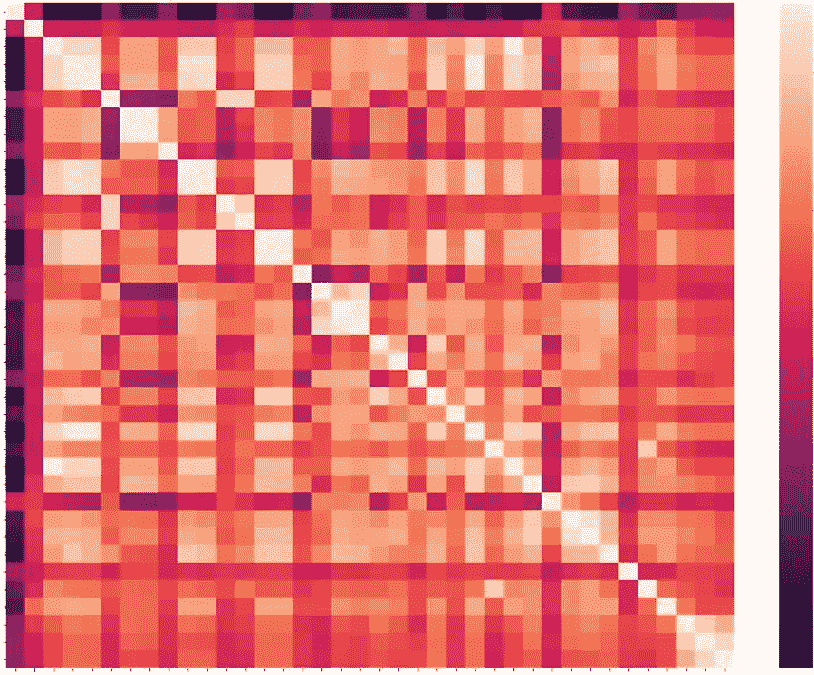
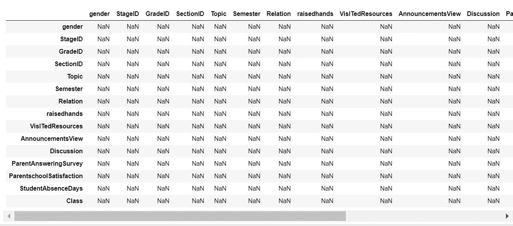
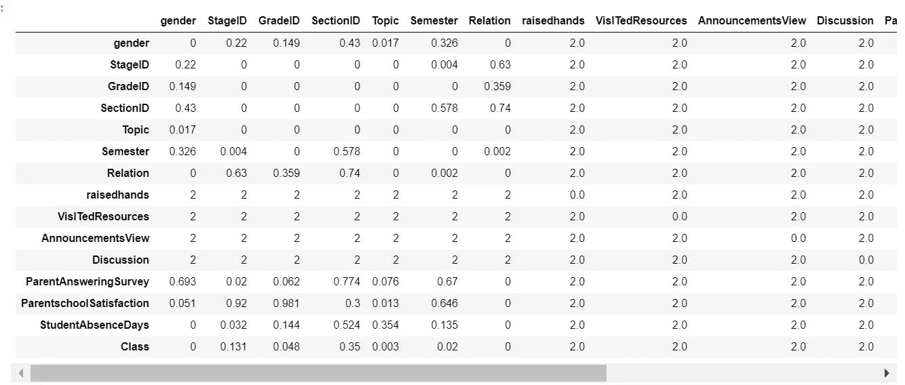
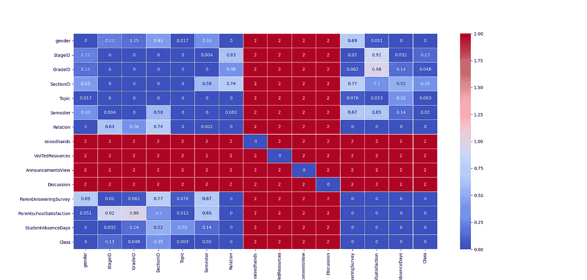

# 构建独立性卡方检验的热图

> 原文：<https://medium.com/analytics-vidhya/constructing-heat-map-for-chi-square-test-of-independence-6d78aa2b140f?source=collection_archive---------2----------------------->

## 如何在 Python 中构建卡方检验 p 值的相关矩阵类型热图



热图

C 在机器学习中，卡方检验可用于检查分类变量之间的变量关联。基于测试结果，我们可以排除那些与响应变量没有很强关联的变量。或者，我们也可以检查独立变量之间的关联，并可以删除那些相互关联很强的变量。这个概念和皮尔逊的相关系数测试是一样的，但是区别是很明显的。

## 相关性与卡方检验

皮尔逊相关系数用于说明两个连续变量之间的关系，如受教育年限和收入。独立性卡方检验确定两个分类变量之间是否存在关联，即变量是否独立或相关，例如某个国家的所有人的教育水平和婚姻状况是否相关。

## 为什么要使用卡方 p 值的热图

在本文中，我将不讨论卡方检验及其性质，在互联网上有足够的关于卡方检验的资料。这篇文章是关于我们如何为独立性的卡方检验制作一个相关矩阵类型的热图。我最近遇到了这个问题，在将一些分类变量输入决策树算法之前，我必须丢弃它们。

> **然而，无论是在 R 语言中还是在 Python 语言中，我都找不到任何函数可以为卡方检验 p 值生成类似矩阵的热图，就像我们得到的相关性检验一样。**

然而，两种语言都有使用卡方测试来测试变量关联的方法，但是考虑到列数(超过 100 个分类变量)，逐个检查每个变量是很麻烦的。

## 不要混淆“可变重要性”和卡方检验

因为分类变量属于分类问题，所以大多数人不关心卡方检验，更喜欢决策树默认的“变量重要性”函数，该函数在决策树算法中可用，如随机森林。

> **请不要将决策树变量重要性函数与独立性的卡方检验相混淆，因为决策树变量重要性是根据每个节点分裂处的基尼系数计算的。而卡方检验是一种类似相关性的统计检验，但用于分类变量。**

## 卡方检验先决条件

在运行卡方测试之前，有一些先决条件

您的数据必须满足以下要求:

1.  两个分类变量。
2.  每个变量有两个或多个类别(组)。
3.  观察的独立性。

*   各组受试者之间没有关系。
*   分类变量不以任何方式“配对”(例如测试前/测试后观察)。

4.相对较大的样本量。

*   每个小区的预期频率至少为 1。
*   大多数(80%)单元的预期频率至少应为 5。

## 用 Python 构建热图

以下代码可用于构建卡方检验 p 值的热图。

出于演示目的，数据集取自[https://www.kaggle.com/aljarah/xAPI-Edu-Data?select=xAPI-Edu-Data.csv](https://www.kaggle.com/aljarah/xAPI-Edu-Data?select=xAPI-Edu-Data.csv) 。它有 16 个分类变量和一个响应变量“类别”。数据集描述可以在上面的链接中找到。我们没有加载所有的独立变量。

```
import pandas as pd
import numpy as np
import os 
from sklearn.feature_selection import chi2
from scipy import stats
import seaborn as sns
import matplotlib.pylab as plt# Loading file
studentdf = pd.read_csv(“xAPI-Edu-Data.csv”,low_memory=’False’) ## Extracting column names 
column_names=studentdf.columns# Assiging column names to row indexs 
chisqmatrix=pd.DataFrame(studentdf,columns=column_names,index=column_names) 
```



nxn 行和列的矩阵

上面我们已经构建了一个 n 列 n 行的矩阵。该矩阵用于填充卡方检验的 p 值。

```
# Setting counters to zero
outercnt=0
innercnt=0for icol in column_names: # Outer loop
 for jcol in column_names: # inner loop
 # Converting to cross tab as for CHi-square test we have
 # to first convert variables into contigency table
 mycrosstab=pd.crosstab(studentdf[icol],studentdf[jcol])
 #Getting p-value and other usefull information
 stat,p,dof,expected=stats.chi2_contingency(mycrosstab)
 # Rounding very small p-values to zero
 chisqmatrix.iloc[outercnt,innercnt]=round(p,5) # As mentioned above Expected frequencies should be at 
 # least 5 for the majority (80%) of the cells.
 # Here we are checking expected frequency of each group cntexpected=expected[expected<5].size #Getting percentage 
  perexpected=((expected.size-cntexpected)/expected.size)*100
```

如果两个变量之间频率组的预期频率小于 5(20%)，我们将在目测热图时忽略这两个变量之间的 p 值。在这里，我们不是忽略变量，而是不相信它们之间的 p 值，因为频率很低，所以理想情况下，我们将保留这两个变量。我在这里给这些变量赋了一个不同的数值，值是“2”。

```
if perexpected<20:
 chisqmatrix.iloc[outercnt,innercnt]=2 #Assigning 2

 if icol==jcol:
 chisqmatrix.iloc[outercnt,innercnt]=0.00
 innercnt=innercnt+1
 outercnt=outercnt+1
 innercnt=0
```



p 值矩阵

上面我们可以看到基于卡方检验的 p 值矩阵



p 值的热图

上面我们可以看到一个类似热图的关联矩阵。“类别”是一个响应变量。

## 无效假设和交替假设

卡方检验的零假设( *H* 0)和替代假设( *H* 1)可以表示如下

*H*0:“*变量 1* 独立于*变量 2*”
H1:“*变量 1* 不独立于*变量 2* ”

我们使用 *α* = 0.05，这将是 95%的置信区间。根据上述热图，我们可以得出以下结论

## 基于 p 值的推断

1.  由于“性别”和“关系”之间的 p 值小于我们选择的显著性水平( *α* = 0.05)，我们可以拒绝零假设。我们可以得出结论，有足够的证据表明性别和关系之间的联系。
2.  由于“secionId”和“class”之间的 p 值大于我们选择的显著性水平( *α* = 0.05)，我们不能拒绝零假设。我们可以得出结论，没有足够的证据表明性别和关系之间的联系。

根据上面的热图得出结论，我们可以从最终变量列表中排除“StageId”和“SectionId ”,因为它们对响应变量没有意义。

## 如何避免预期频率低于 20%的情况

上面的值“2”被分配给那些预期频率低于 20%的变量，因此我们不能对这些变量做出任何决定，为了安全起见，我们可以保留它们。当数据中有太多级别时，就会出现这种情况。避免这种情况的一种变通方法是通过在同一个类别变量中组合不同的级别来组合级别。比如“举手”有一个介于 1 和 100 之间的值，所以我们可以通过给每个类别分配 10 个值来将其减少到 10 个不同的类别。
本文提到的代码没有经过优化。人们可以根据自己的需要改进和定制代码。