# 使用 Python 中的事件订阅 API 和 Slack 应用程序消费 Slack 事件

> 原文：<https://medium.com/analytics-vidhya/consuming-slack-events-with-event-subscription-api-and-slack-app-in-python-681cab354571?source=collection_archive---------7----------------------->

Slack 是一个通用的平台，每个组织都使用它在员工之间进行交流。

**等等，slack 只用于员工之间的交流吗？**

答案，在我看来是否定的，因为 slack 提供了各种 API、入局 webHooks、Bots 创建等。这使得它有多种用途。我们可以将任何其他服务绑定到 Slack。不仅如此，Slack 还可以用作服务间通信的缓冲区。

如果您希望构建一个事件驱动的服务，每当 Slack 通道中发生变化时运行您的业务逻辑。变化可以是任何事情，比如收到新消息，对消息的任何反应，比如表情符号，或者任何事情。这只是我在 **SAP Labs India，**的实习生项目的一部分，在那里我的微服务需要处理 Slack。听起来很有趣，对吧？那么，如何用 Slack 绑定你的云服务呢？有什么办法吗？在轮询中不浪费网络调用的情况下，我们能得到松弛信道的更新吗？

答案是肯定的，这一切都可以借助 Slack Events API 和 Slack App/bot 在 Slack 中完成。

* *注 Slack bot 也是一款 Slack 应用，旨在与用户互动。所以不要搞混我在哪里写了 slack App/bot。为了便于理解，您可以假设两者相同。*

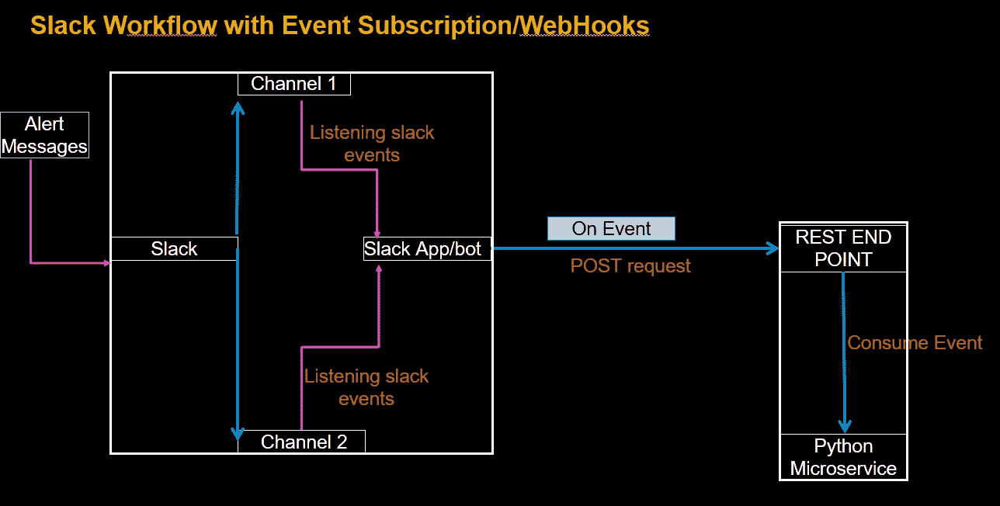

让我带你看一下使用 Slack Events API 和 Slack App/bot 创建的过程。我们将分两步进行，如下所示:

**1。创建 Slack 应用程序/机器人并订阅事件。**

**2。从我们的 python 服务中消费这些事件。**

> **步骤 1:创建 Slack App/bot 并订阅事件:**

我们希望我们的服务在我们的 Slack 工作空间发生任何变化时都能得到通知。对吗？我们也必须把这一切告诉斯莱克。但是我们如何做到这一点呢？Slack App/bot 就是这样做的。所以让我们创造一个 yoooo…..

1.  [https://api.slack.com/](https://api.slack.com/)在右上方你会看到**你的应用**选项

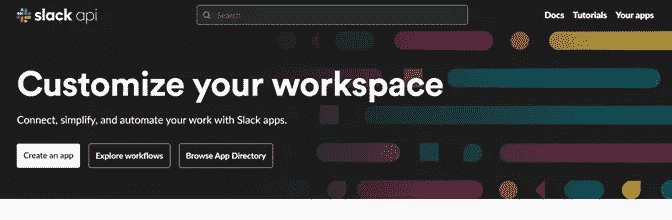

2.点击你的应用程序，你可以看到你创建的所有应用程序。

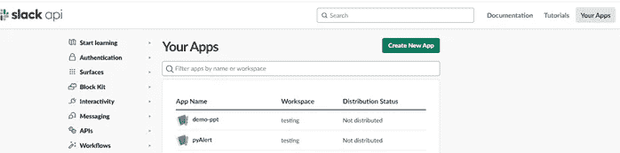

3.点击创建应用程序选项。

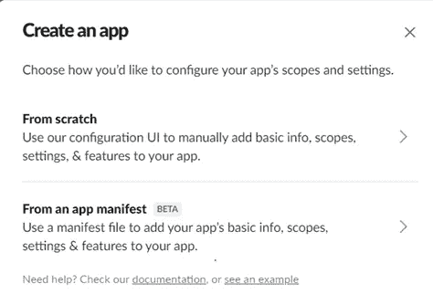

4.点击从头开始，给你的应用程序命名，并选择工作区。点击创建应用程序。

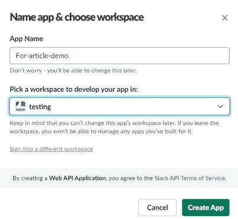

5.现在，您的应用程序已经创建，就像我们已经雇用了一个人，但我们需要给他分配一份工作。所以让我们来分配它。你一定会看到和下图一样的屏幕。

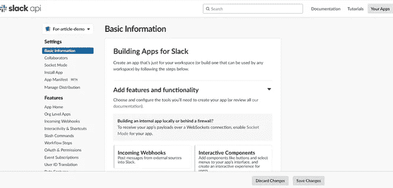

在最左栏的顶部，你会看到你的应用程序名称，在我的例子中是 **For-article-demo。**

6.从“功能”下最左侧的列中选择事件订阅。

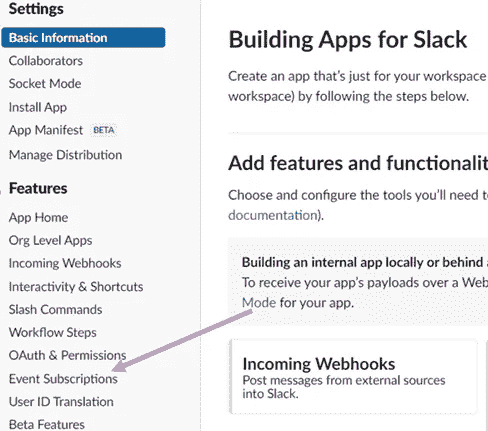

7.为您的 slack 应用程序激活活动订阅

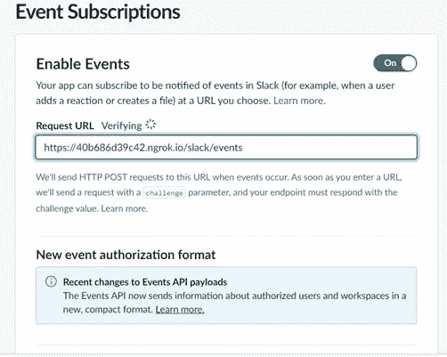

现在，在请求 URL 中，我们需要给出我们的服务的 URL，它应该在 web 上。Slack 将通过向这个 URL 发送 POST 请求来验证这个端点。我们的服务应该返回质询参数作为响应或松弛验证令牌(您可以在基本信息中找到)。一旦这被验证，Slack 应用程序将只在这个端点上发送所有未来的事件。

* *注意，如果您的服务不在 web 上，您可以使用 ngrok 工具，将流量从 ngrok 转发到您的本地端口。*

经过验证应该是这样的:

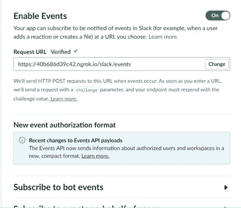

所以到目前为止，我们已经雇了一个人，告诉他们通过给我们的地址在我们的办公室更新我们。

现在让我们给他分配一些工作，意味着为我们的 Slack 应用程序订阅一些事件。

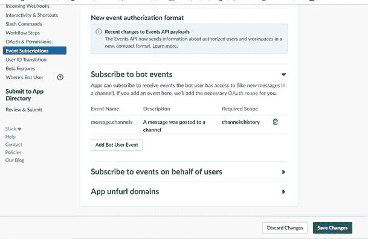

选择 bot 事件后，单击保存更改。

验证终点的代码。

8.单击 OAuth & Permission，将应用程序安装到您的工作区。

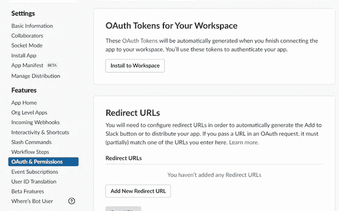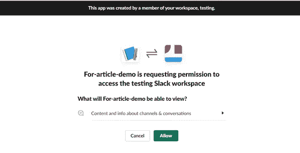

一旦你把我们的应用程序安装到你的工作区，就会生成一个**机器人用户 OAuth 令牌**，用于 API 验证。

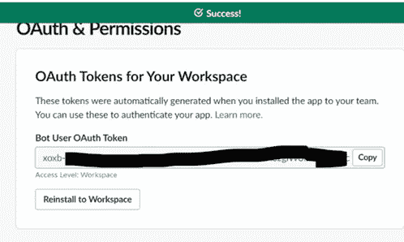

9.现在，让我们将我们的应用程序添加到 slack 通道中，以获取消息作为事件。

1.在聊天框中键入@app_name，然后按回车键

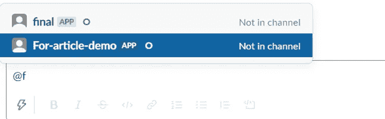

2.这里**为文章演示**是一个应用名称

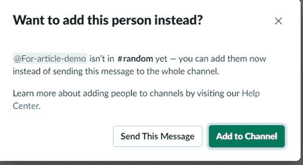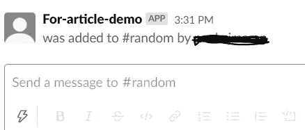

> **步骤 2:现在让我们从 python 服务中消费这些事件**:

让我们在空闲时发送消息。

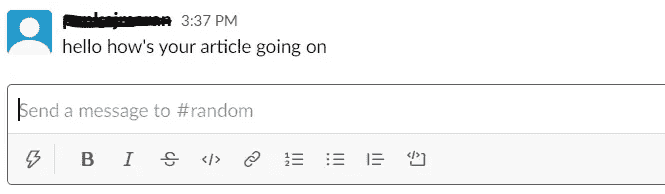

您将在 python 服务中获得名为 message 的事件。

有效负载将如下所示:

*注意:我已经用 xxxxxxxxx 替换了其他详细信息

现在，您将收到您的应用程序订阅的所有 slack 事件。最后，全部完成🤩。

😵这个过程有点长，有点混乱，但是这个特性非常有趣。

希望你喜欢它！！！

> 参考资料:
> 
> [https://api.slack.com/apis/connections/events-api](https://api.slack.com/apis/connections/events-api)，[https://www.youtube.com/watch?v=6gHvqXrfjuo](https://www.youtube.com/watch?v=6gHvqXrfjuo)