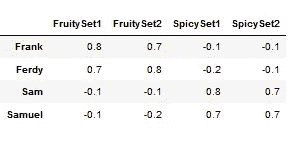
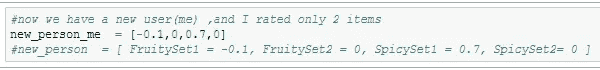
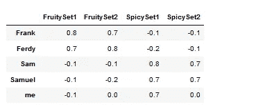
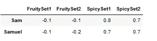
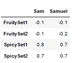
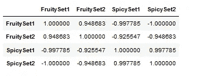
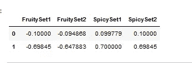
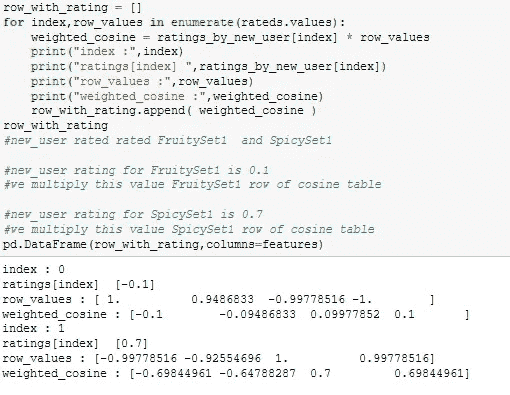
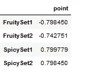

# 基于内容的无内容过滤

> 原文：<https://medium.com/analytics-vidhya/content-based-filtering-without-content-ccb6c2d6bbc?source=collection_archive---------32----------------------->

在这篇文章中，我将解释一点不同的基于内容的过滤系统。显然，传统的基于内容的推荐是与内容一起进行的:)
因此，如果是电影、书籍，你可以选择具有相似描述、元数据的项目。
如果是购物项目，可以勾选类似的关键词(为已经买了咖啡滤网的人提供浓缩咖啡机。但他肯定已经有机器了，对吧？)通常用这种方法，我们用实体的文本相似度。

5-6 年前，我的朋友参与了一个项目，为以前在网上买过食物的人提供食物。我们正在和他谈论他的项目。有一群垃圾食品爱好者(比萨饼、汉堡包),他们从不选择我朋友的内容过滤建议。
**用户 X** :最后 10 个购买，汉堡
**推荐**:他附近 3–4 家汉堡店
**动作**:选择另一个汉堡比建议。
通过查看订单，我们意识到，这个群体中的一些人是学生，他们总是从廉价的连锁餐厅点菜，所以从不选择手工制作的昂贵商店。
还有一个相反的群体，他们是高级汉堡和披萨的消费者，他们从不选择连锁餐厅。因此，我建议我的朋友，不要在基于内容的过滤中使用内容。我们还必须提供汉堡包，但不得使用关键字汉堡包。怎么会？
我们这里说的内容是什么。所以菜单上的项目实际上几乎相同。
**汉堡菜单 1** :汉堡+法式土豆+饮料
**汉堡菜单 2** :汉堡加酱+土豆加特制酱+饮料

如果你检查一下，你会发现它们在词汇方面非常相似。但是有潜在的属性，不能从内容中直接看到。人们可以认为在某种程度上包括价格，但价格并不直接反映质量。(在某种程度上，这意味着)

我们再举一个例子。我住在日本，我喜欢日本食物，但有时我想吃辛辣的食物，比如我的家乡食物(土耳其)。所以平时吃印度菜，特别喜欢。但是我不喜欢甜咖喱(甜菜味、椰子味、香蕉味……)，所以我的印度朋友有时会请我去印度餐馆，但是我不喜欢他们，就像我喜欢其他人一样(或者在片场我不吃甜咖喱，但吃其他的)。
果味**套餐 1** :菜咖喱(2 种)+南+(柴或拉西)
果味**套餐 2** :菜咖喱(2 种)+(南或米饭)+(拉西)
香辣**套餐 1** :菜咖喱(2 种)+南+(柴或拉西)
香辣**套餐 2** :菜咖喱(2 种)+(南或米饭)+(拉西)
如果你因此，让我们来看看用户的评分表。

**每个用户的评分表**

就文本相似性而言，菜单文本非常相似。所以实际上有一个隐藏的风格因素。如果你检查内容，我很喜欢“印度食物”，但潜在的东西是咖喱的甜味。所以真正的优惠一定要找到我喜欢什么样的“印度菜”。这是评级，所以我必须创建喜欢的向量。

如果我不使用内容，我将如何矢量化咖喱套餐(汉堡)？

我将使用用户评级，但不是用于协同过滤，而是用于内容的矢量化。(你们中的一些人可能会说，这是一回事。但我认为它们并不完全相同。)还有一个问题，我们使用基于内容的过滤的原因是，对于当前用户，我们没有太多的评级项目。用户只评价了几个项目，我们如何在这些条件下生成算法。
现在我会一步一步的展示算法，请仔细阅读，好像有点复杂。

现在我们有了新用户(事实上是我)，所以现在我只评价了 2 个地方。

**新用户(me)评分**

因此总表如下。

**0 表示未评级**

现在我想生成项目嵌入，但我必须这样做与我相似的人的评级。所以过滤那些。(我是直接选行。)你可以用一些阈值创建各种过滤算法。山姆和塞缪尔和我一样是辣咖喱爱好者。(当然，我从评分中了解到这一点，他们给我的高评分项目打高分，给低分项目打低分。)

**过滤数据，只包含与我评分相似的人**

现在让我们转置这些数据。

**库里套 x 用户**

你能看到上面是什么吗？对于和我有相似喜欢的人来说是库里集的嵌入矩阵。我可以利用这些，从和我有相似爱好的人的评分中创建一个余弦相似度表。

**库里的相似度表集合了和我有相似爱好的人**

现在这里很重要。
新用户(me)评分**设置 FruitySet1** 评分低。(-0.1 )
我们有一个 **FruitySet1** 与所有其他集合的相似性向量。
如果我将新用户评级乘以 **FruitySet1** 行会发生什么？
我们得到所有集合的加权分数。(即使他没有给其他人打分)
如果你检查表格第一行下面，他们会得到低分。

**加权评分**

新用户将 **SpicySet1** 评为高分。(0.7)
我们有一个 **SpicySet1** 与所有其他的相似性向量。
如果我将新用户评级乘以 **SpicySet1** 行会发生什么？我们得到所有集合的加权分数。(即使他没有给其他人评分)
如果您查看上表第二行，您会发现辣味套餐获得了良好的评分。

其代码块如下所示:

**分数的计算**

我把一切都简单化了。事实上，在这一点之后，我们必须有一个战略。我们是将所有这些评分相加，取平均值、中间值，还是应用一个阈值来消除其中一些评分。为了简单起见，我把它们加起来，因为我加起来和以前的评分不再有相同的维度，小心！！！我们可以看到我对 SpicySet2 的评分会很高，所以很好，我可以订购我的下一次咖喱审判。(或者认为即使有了这个逻辑网络也能给我提供 Biryani 或 dosa set)

**咖喱套餐点表**

现在让我们总结一下我所做的事情。我们知道我喜欢辣咖喱，但不喜欢甜咖喱。从评分中你可以了解到一些咖喱在某些方面和其他的更相似(谁知道是哪个方面！，它是潜在的、隐藏的，但我们依靠评级的力量来暗示这一点)

我想我用复杂的应用方法解释了一个简单的想法。你可以在 github( [Link](https://github.com/mcelikkaya/medium_articles/blob/main/content_based_without_content.ipynb) )查看代码，并应用到你的问题上，如果这个问题和你的领域问题类似的话。在网上购物网站，(食物，鞋子，衣服…)有时候(当然不总是)内容有点误导。有些用户从不选择你的建议。他们会购买你提供的类似商品，但不会购买你提供的商品。我建议你试试这个。