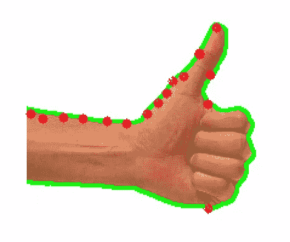

# OpenCV Python 中的轮廓和凸包

> 原文：<https://medium.com/analytics-vidhya/contours-and-convex-hull-in-opencv-python-d7503f6651bc?source=collection_archive---------0----------------------->

大多数计算机视觉问题的答案在于找到并分析图像中存在的形状，而获取轮廓就是这样一种方法。对于初学者，我会把轮廓简单地解释为“*一条连接位于形状*边界上的所有点的曲线”。

假设我有下面这张手的图像，手的轮廓是由绿线表示的曲线。红点显示的是我们通过连接组成轮廓曲线的点。



轮廓点(红色)。连接轮廓点，我们创建轮廓曲线(绿色)

以下是常见形状的轮廓:


常见形状的轮廓(绿色)

我仍然记得我的高等数学课，他们教等高线。但这很难与这个主题的重要性联系起来，因为老师从未提到轮廓在现实世界中的任何应用。今天是我意识到它们在计算机视觉中有多重要的一天。

# 在 OpenCV 中查找轮廓

> 在图像中寻找轮廓的唯一先决条件是图像应该是二值的。要详细了解二进制图像，请查看我的[文章](https://dhruv-pandey93.medium.com/image-simplification-through-binarization-in-opencv-1292d91cae12)。

因此，我使用前一篇文章中讨论的 Canny 边缘检测将我的图像转换为二进制图像:

```
binary_image = edgeDetection(image)
contours, hierarchy = cv2.findContours(binary_image, cv2.RETR_LIST, cv2.CHAIN_APPROX_NONE)
```

一旦你有了二值图像，你只需要把它传给 *findContours()* 就可以了，轮廓已经准备好了。在我们继续之前，让我们讨论这个函数的其他参数。

***第二个参数(轮廓检索模式):***
一个形状(或轮廓)可能存在于另一个形状(或轮廓)内部。所以我们可以称外部形状为父母，称内部形状为孩子。检索模式参数决定是否希望轮廓列表以分级(父-子)方式输出，或者我们只是希望它们作为一个列表(没有分级)。使用 *cv2。RETR _ 列表*用于无层次/普通列表。点击查看更多变体[。](https://docs.opencv.org/4.5.1/d9/d8b/tutorial_py_contours_hierarchy.html)

*注意:* *对轮廓检测没有影响。只是响应表示发生了变化。*


轮廓层次结构

***第三个参数(轮廓近似):***
轮廓只是一个由点的集合表示的形状(第一个图像中的红点)。因此，此参数指定应存储多少个点，以便保留轮廓形状并可以重新绘制。 *cv2。CHAIN _ approximate _ NONE*表示我们存储所有的点(无近似值)。这需要更多的存储空间，但是如果有一条之字形线，我们肯定需要存储所有的点来保持轮廓形状。但是在直线的情况下，2 个点就足够了，因为中间的点可以根据直线的方程来近似，所以我们使用 *cv2。链 _ 近似 _ 简单。*

输出*轮廓*是轮廓点的列表，每个轮廓点具有 x 和 y 坐标。

# 等高线上的操作

1.  **轮廓面积:**您可以根据轮廓面积对其进行排序。

```
contours = sorted(contours, key=lambda x: cv2.contourArea(x), reverse=True)
```

2.**轮廓周长:**你可以计算每个轮廓的周长。

```
for contour in contours:
    perimeter = cv2.arcLength(contour, True)
```

3.**轮廓的顶点:**由于我们知道轮廓只是它的点的 x 和 y 坐标的表示。所以得到轮廓的长度，就给了我们轮廓的顶点。

```
len(contour) == 4   #Rectangle
```

4.**轮廓近似:**这有点棘手，所以需要更多的解释。这非常类似于我们上面讨论的第三个论点，只是它给了我们更多的手动控制。

假设 OpenCV 检测到一个轮廓，如下图(1)所示。你认为能得到的最接近的规则形状会是什么，肯定是一条线(假设峰值对我们不重要)。此外，既然峰值对我们来说并不重要，为什么要浪费我们的存储空间来存储峰值的坐标。相反，如果我们能以某种方式将这个轮廓近似为一条线，我们只需要 2 个坐标来存储我们的轮廓。这就是 cv2.approxPolyDP() 为我们做的事情。它试图将不规则轮廓近似为其他形状，以便简化轮廓。


如何控制轮廓近似

我们如何控制这种近似？ *cv2.approxPolyDP()* 接受一个 *epsilon* 参数，该参数的值告诉 OpenCV，为了得到简化的轮廓，我们可以允许与原始形状有多大的偏差。图像(3)显示了 10%的ε，这意味着我们有点愿意得到简化的轮廓(如 5 中的直线)。图像(4)显示了 20%的ε，这意味着我们更愿意得到简化的轮廓(如 5 中的直线)。随着ε值的增加，峰值向直线方向移动。*更多的ε意味着更愿意得到简化的轮廓。*

```
for contour in contours:
    perimeter = cv2.arcLength(contour, True)
    approximatedShape = cv2.approxPolyDP(contour, 0.02 * perimeter, True)
```

看看我们是如何传递第二个参数(ε)的。最后一个参数只是说如果想要一个封闭的轮廓。

5.**最小封闭圆:**使用 minEnclosingCircle()可以找到一个以最小面积完全覆盖物体轮廓的圆。


```
(centerXCoordinate, centerYCoordinate), radius = cv2.minEnclosingCircle(contour)
```

6.**矩:**矩可以让你提取重要轮廓的物理属性，比如物体的质心，物体的面积等。

```
for contour in contours:
    moment = cv2.moments(contour)
```

你可以用矩来进一步计算轮廓的重要属性，如形心:

```
centroidXCoordinate = int(moment['m10'] / moment['m00'])
centroidYCoordinate = int(moment['m01'] / moment['m00'])
```

您可以在此查看轮廓[上允许的更多此类操作。](https://opencv-python-tutroals.readthedocs.io/en/latest/py_tutorials/py_imgproc/py_contours/py_contour_features/py_contour_features.html)

# 凸包

如果用外行的话来解释，一个物体的凸包就是能够完全包围或者包裹该物体(或者该物体的轮廓)的*最小*边界。


此处引用自[中的](https://theailearner.com/2019/12/05/finding-convex-hull-opencv-python/)

有许多算法可以用来寻找给定轮廓的凸包，但我不会在本文中详细讨论它们。一旦你找到了轮廓，找到凸包就相当简单了

```
for contour in contours:
    convexHull = cv2.convexHull(contour)
    cv2.drawContours(image, [convexHull], -1, (255, 0, 0), 2)

# Display the final convex hull image
cv2.imshow('ConvexHull', image)
cv2.waitKey(0)
```

# 凸面缺陷

轮廓与其凸包的任何偏差都称为凸性缺陷。


最后一张图中的垂直线就是我们所说的凸面缺陷

*注意:可能有多个凸度缺陷点，其中外壳偏离轮廓，但在最后一幅图像中，我只显示了主要的凸度缺陷，以免混淆。*

OpenCV 提供了一种从轮廓和外壳中找到凸面缺陷的简单方法:

```
convexityDefects = cv2.convexityDefects(contour, convexhull)
```

*凸面缺陷*包含所有发现的凸面缺陷列表。该列表中的每个元素都具有以下属性:

*【起点、终点、最远点、到最远点的近似距离】*


特定凸性缺陷的值(3，4)

# 最后的话

大多数计算机视觉问题都有自己的解决方案

1.  找到轮廓，然后
2.  应用轮廓操作以获得期望的结果。

从我的个人经验来看，我会说第一点并不难，但是第二点需要你付出大部分的努力，在进入下一步之前，在每一步结束时仔细检查和调试结果。

希望他的文章能给你一个很好的轮廓入门。我会写更多关于我们实际应用轮廓的真实项目的文章。所以别忘了检查它们。