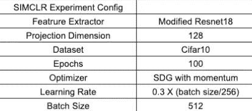

# sim clr——计算机视觉中的对比学习

> 原文：<https://medium.com/analytics-vidhya/contrastive-learning-in-computer-vision-brief-concept-overview-and-sample-code-787c9038e809?source=collection_archive---------8----------------------->

照片由 [Greg Jeanneau](https://unsplash.com/@gregjeanneau?utm_source=medium&utm_medium=referral) 在 [Unsplash](https://unsplash.com?utm_source=medium&utm_medium=referral) 上拍摄

***对比学习是一种学习分布中样本间相对相似性的框架。***

对比学习框架可以是监督的(利用人工注释)和自我监督的(没有人工注释)。在这篇文章中，我们将探讨一个自我监督的变体，[陈等人的 SIMCLR“视觉表征对比学习的简单框架”](http://cse.iitkgp.ac.in/~arastogi/papers/simclr.pdf)

*   首先，我将概述一下 SIMCLR 框架。
*   然后我们将重复论文中的一个实验。

**如果你只是想运行代码，** [**这里有 github repo。**](https://github.com/larsh0103/simclr.git)

自我监督的优点是，它允许我们在几乎没有标记数据的情况下建立性能良好的模型，而 [SIMCLR](http://cse.iitkgp.ac.in/~arastogi/papers/simclr.pdf) 在这方面比以前的方法做得更好。

如果你想快速了解自我监督，你可以看看我的帖子

自监督方法如何规避对大量标记训练数据的需求？

通过让我们的模型解决一个玩具任务(前文本任务)，迫使它学习对解决我们真正关心的任务有用的特征。

在 simclr 中，这个玩具任务，或者在文献中称为文本前任务，是一个条件二进制分类任务。换句话说，给定一个锚图像和许多其他图像，预测它们中的哪一个与锚图像相似，是正对，哪一个不是负对。

条件图像分类图像对

但是我们怎么知道哪些是相似的，哪些不是呢？通过生成同一图像的两个增强版本，我们得到了我们的正对，而负对是通过将来自不同“源”图像的增强图像配对而得到的。

通过增强生成图像对

在 4 个源图像的小批量的情况下，我们得到 8 个增强图像，因此得到 8 个可能的锚。注意，对于锚的每个选择，只有一个正对和 2N-1 个负对，其中 N 是在小批量中使用的源图像的数量。

SIMCLR 小批量中图像对的可视化

现在我们已经对 SIMCLR 上下文中的数据管道和条件分类有了一个很好的概述，让我们引入一些新元素。

SIMCLR 框架

特征提取器是一个神经网络，它将图像作为输入，并将其投影到 m 维空间，基本上将图像转换为 m 维向量。这些向量然后被配对，并且为每个可能的对计算相似性得分(我们使用余弦相似性),这给出了我们的相似性矩阵。我们将对角线上的数值设为大的负数，因为我们不想让网络简单地学习识别同一幅图像的相同副本。由于增强的图像对按顺序输入到我们的网络中，给定源图像 k 的两个正对由下式给出。

这为我们提供了基础事实“标签”,我们将使用它来计算 N-Xent 损耗，即一种修正的交叉熵损耗。

一个图像对的损失是:

其中 T 是一个称为温度的参数。

那么小批量的总损耗为:

希望你现在对 SIMCLR 对比学习框架有了一个不错的理解，让我们继续实现。

我们将复制 SIMCLR 作者在他们的论文[(你可以在论文的附录 B.7 中找到它)](http://cse.iitkgp.ac.in/~arastogi/papers/simclr.pdf)中提出的一个实验。

为了简单起见，我们使用 cifar-10 作为我们的数据集，使用 resnet-18 架构的修改版本作为我们的特征提取器。我们使用 SIMCLR 框架训练一个特征提取器，然后通过使用相同的数据集在其上训练一个线性分类器来评估它的有用性。

SIMCLR 实验配置

线性评估配置

我们使用验证集上的分类准确度作为学习表示的有用性的代理。

验证分类准确度 Cifar-10

哇> 90%的准确率。令人印象深刻。我们已经验证了特征提取器使用 SIMCLR 学习有用的表示。在我的下一篇文章中，我将探索当数据注释不足时，SIMCLR 是否能帮助我们训练更好的对象检测器。

**如果你想自己试试，**[这里有 github 回购。](https://github.com/larsh0103/simclr.git)