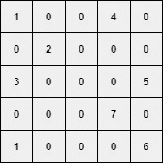
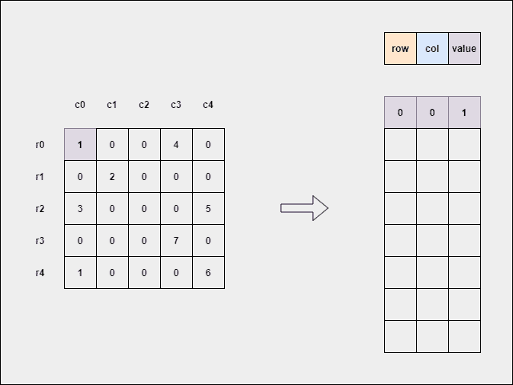

# 用 Python 将规则矩阵转换成稀疏矩阵

> 原文：<https://medium.com/analytics-vidhya/convert-a-regular-matrix-into-sparse-matrix-in-python-3f415614b837?source=collection_archive---------6----------------------->

在本文中，我们将一步一步地使用 Python 将一个规则矩阵转换成一个稀疏矩阵。


由 [Marco Pregnolato](https://unsplash.com/@marco_pregnolato?utm_source=medium&utm_medium=referral) 在 [Unsplash](https://unsplash.com?utm_source=medium&utm_medium=referral) 拍摄的照片

# 介绍

矩阵是一种类似于数组的数据结构，其中值存储在行和列中。这里，值是一种独特的类型。当在机器学习和 NLP 中处理矩阵(线性代数)时，我们经常听到两种类型的矩阵作为-

*   **密集矩阵** —大部分元素不为零的矩阵。在这个矩阵中，零元素非常少。
*   **稀疏矩阵** —相反，大部分元素为零，极少数元素不为零的矩阵。

**注意**——没有这样的标准，即矩阵中有多少个零值确定需要稀疏矩阵。

# 算法解释

假设您有一个包含`N`行和`M`列的大型矩阵，其中大多数值为零。您被要求只考虑非零元素，因为零元素不会增加多少价值。毫无疑问，你有时间和空间的限制，因为你正在处理一个非常大的矩阵。

这里简单的方法是忽略所有的`0`，以**`row_index``col_index``non-zero_value`**的形式存储非零元素。****

******方法:******

1.  ****遍历输入矩阵的每个`row`。****
2.  ****迭代每个`row`的每个`value`。****
3.  ****如果**(值== 0)** →跳过。****
4.  ****如果**(值！= 0)** →从输入矩阵中获取`row`号和`column`号以及`value`号。****
5.  ****将每个`row`和`column`的结果保存为 **[** ，`column`，`value` **]** 。****
6.  ****停下来。****

# ****视觉解释****

****假设我们得到了一个矩阵，这个矩阵的大部分元素都是`0`。****

********

****作者图片****

****下面`GIF`解释如何获得稀疏矩阵。****

********

****作者 GIF****

# ****编码时间到了****

****在本节中，我们将尝试用两种不同的方式对此进行编码。一个是在`scipy`模块的帮助下，另一个是实现我们自己的稀疏矩阵。****

*****让我们开始吧……*****

******必要的进口******

```
**import numpy as np
from scipy.sparse import csr_matrix**
```

******随机矩阵创建******

****只是为了演示，我们将确保矩阵包含最多的`0`元素。****

```
**>>> mat = np.random.randint(low=0, high=3, size=(5, 5))
>>> print(mat)
[[2 2 0 2 0]
 [2 1 0 0 2]
 [2 1 0 1 0]
 [0 1 2 0 2]
 [0 1 2 2 1]]**
```

# ****SCIPY 实现****

****借助于`csr_matrix()`的方法，我们可以很容易地得到稀疏矩阵。****

```
**>>> smat = csr_matrix(mat)
>>> print(smat)
(0, 0)    2
(0, 1)    2
(0, 3)    2
(1, 0)    2
(1, 1)    1
(1, 4)    2
(2, 0)    2
(2, 1)    1
(2, 3)    1
(3, 1)    1
(3, 2)    2
(3, 4)    2
(4, 1)    1
(4, 2)    2
(4, 3)    2
(4, 4)    1**
```

****我们可以认为 python 中的`dictionary`是一对`key`和`value`。上面的输出类似于`dictionary`，其中键是索引位置(行、列)，值是实际的非零元素。****

# ****自定义实现****

****为了从头开始实现它，我们可以遵循我之前解释过的算法方法。****

```
****class** SparseMatrix():
    **def** __init__(self, arr):
        self.arr = arr **def** retain_sparsity(self, to_dict=False):
        sparse_mat = [
            [rindx, cindx, val]
            **for** (rindx, row) **in** **enumerate**(self.arr)
            **for** (cindx, val) **in** **enumerate**(row)
            **if** (val != 0)
        ] **if** to_dict:
            sparse_mat = {(r, c) : v **for** (r, c, v) **in** sparse_mat}
        **return** sparse_mat**
```

****上面的类`SparseMatrix()`有一个方法`retain_sparsity`，其中默认参数`to_dict`是`False`。参数`to_dict`用于是否以`dictionary`的形式获得输出。****

******对象创建******

```
**sparse = SparseMatrix(arr=mat)**
```

******输出—列表******

```
**>>> smat_c = sparse.retain_sparsity()
>>> print(smat_c)
[[0, 0, 2],
 [0, 1, 2],
 [0, 3, 2],
 [1, 0, 2],
 [1, 1, 1],
 [1, 4, 2],
 [2, 0, 2],
 [2, 1, 1],
 [2, 3, 1],
 [3, 1, 1],
 [3, 2, 2],
 [3, 4, 2],
 [4, 1, 1],
 [4, 2, 2],
 [4, 3, 2],
 [4, 4, 1]]**
```

******输出—字典******

```
**>>> smat_d = sparse.retain_sparsity(to_dict=True)
>>> print(smat_d)
{(0, 0): 2,
 (0, 1): 2,
 (0, 3): 2,
 (1, 0): 2,
 (1, 1): 1,
 (1, 4): 2,
 (2, 0): 2,
 (2, 1): 1,
 (2, 3): 1,
 (3, 1): 1,
 (3, 2): 2,
 (3, 4): 2,
 (4, 1): 1,
 (4, 2): 2,
 (4, 3): 2,
 (4, 4): 1}**
```

# ****结论****

*   ****当我们在处理大型矩阵时有空间限制时，通常倾向于将矩阵转换为稀疏表示，这与原始矩阵相比占用的空间更少。****
*   ****事实上，我们可以检查原始矩阵`mat`和`sparse`矩阵所占用的空间(以字节为单位)。****

```
**>>> from sys import getsizeof
>>> # checking the space of original matrix
>>> getsizeof(mat) 
156
>>> # checking the space of scipy sparse matrix
>>> getsizeof(smat)
24
>>> # checking the custom implementation sparse matrix
>>> getsizeof(smat_c)
92**
```

*   ****我们可以观察到的是，`scipy`方法比我们的自定义方法占用的空间少。因为`scipy`是一个优化完善的库，主要用于各种科学计算。****
*   ****使用库方法总是比我们自己的代码更好，这样可以在更少的空间限制下更快地获得结果。****

****请我喝咖啡****

****如果你喜欢我的文章，你可以买些咖啡，在这里支持我。这将激励我去写作和学习更多我所知道的东西。****