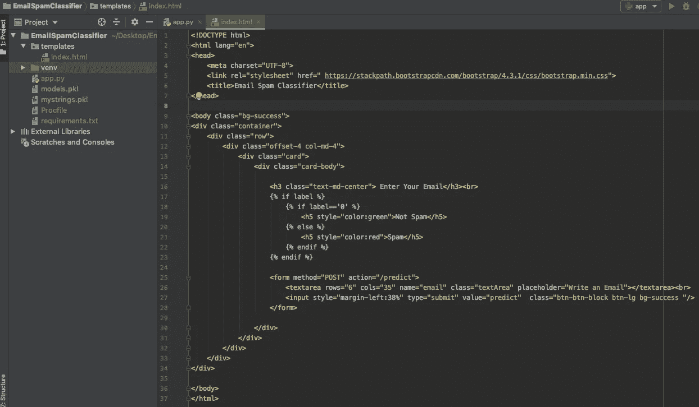
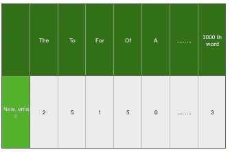
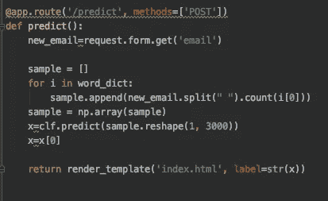
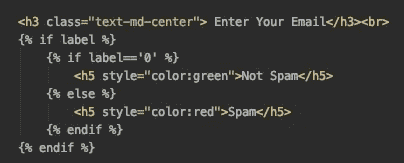

# 将机器学习模型转换成网站

> 原文：<https://medium.com/analytics-vidhya/convert-machinelearning-model-into-website-e966f79487c2?source=collection_archive---------11----------------------->

首先，我想说的是，如果你读过我的关于垃圾邮件分类器的文章，这篇文章真的帮了你很多，在这篇文章中，我解释了所有与垃圾邮件分类器相关的术语。在那篇文章中，我举了一个如何将机器学习模型转换成网站的例子。在这里，我们要将带有朴素贝叶斯的垃圾邮件分类器转换成网站。
以下是链接:-

[https://medium.com/p/a51b8c6290d4/edit](https://medium.com/p/a51b8c6290d4/edit)

在这里，我们将把机器学习模型转换成一个网站，在那里我们接收一封输入邮件，并返回一个输入邮件是垃圾邮件还是垃圾邮件的结果。这是如何工作的，这完全取决于我们在电子邮件垃圾分类器的朴素贝叶斯算法的帮助下训练的逻辑。

因此，在朴素贝叶斯算法的帮助下，我们之前训练了我们的机器学习模型。因此，为了预测邮件是垃圾邮件还是火腿的结果。我们需要两样东西

1.  word_dict 帮助我们统计所有单词在输入邮件中出现的次数，所以我们需要导出 word_dict。
2.  其次，分类器对象(在我们的例子中，分类器是 clf)存储所有的逻辑，无论电子邮件是垃圾邮件还是垃圾邮件，因此我们也导出这个分类器对象，即 clf。

所以我们目标是将这两样东西(word_dict 和存储在 clf 中的分类器对象)从 Jupiter Notebook 文件导出到 PyCharm 以构建一个网站:-
这里您可以看到我们如何使用 Pickle 将这两样东西(word_dict 和存储在 clf 中的分类器对象)从 Jupiter Notebook 文件导出到 PyCharm。

下面的代码是在你训练你的模型的同一个 Jupiter 笔记本上完成的，我们一步一步地看我们如何导出:-

1.  首先我们用**进口泡菜**进口泡菜
2.  接下来，我们使用语法-
    **pickle.dump(clf，open('models.pkl '，' WB ')**以写二进制模式将 clf 序列化到名为 **'models.pkl'** 的文件中
3.  接下来，我们使用语法-
    **pickle . dump(word_dict，open('myStrings.pkl '，' WB ')**以写二进制模式将 word _ dict 序列化到另一个文件 **'myStrings.pkl'**

*现在打开您的 PyCharm，创建一个名为“电子邮件-垃圾邮件-分类器”的目录，在该目录中创建一个 python 文件名“app ”,扩展名为 py，并在电子邮件-垃圾邮件-分类器目录中创建另一个目录，即模板，在模板中创建另一个文件“index.html”。

现在进入 Jupiter 笔记本，复制两个文件**‘models . pkl’和‘mystrings . pkl’**，它们存储在 Jupiter 笔记本文件所在的同一目录中，然后将这些文件粘贴到 PyCharm 的 Email-spam-Classifier 目录中。

现在我们要研究 PyCharm:-

我们将使用 flask 来建立我们的网站，如果你不知道如何使用 Flask，不要担心，在我们的情况下，我们将做一个简单的网站，我们只使用 Flask 的基本功能。

首先在 PyCharm 中打开你的 app.py 文件，为了使用 Flask，我们首先在这个命令的帮助下安装 Flask:-
**pip 在 payCharm 的终端中安装 flask** 。

现在使用 flask import flask
T5**命令在 app.py 文件中导入 Flask 现在创建一个变量 app，它将等于 Flask 类的(__name__)。
语法:- **app=Flask(__name__)****

现在是时候在 app.py 文件中导入那个 pickle 文件“mystrings.pkl”和' models.pkl '了，所以在 **app=Flask(__name__)** 之后你写这个代码
**word _ dict = pickle . load(open(" mystrings . pkl "，" Rb "))
clf = pickle . load(open(' models . pkl '，' Rb ')**

现在，我们创建一个装饰器，并为该装饰器附加一个函数，该函数返回用于渲染 index.html 文件 index.html 文件，我们使用从 flask 导入的 render_template。
语法:-
**@ app . route('/')
def home():
*return render _ template(' index . html ')*#本行需要一个 tab。****

*最后，我们运行我们的应用程序。
语法:-
**if _ _ name _ _ = = " _ _ main _ _ ":
app . run(debug = True)*#这行代码需要一个制表符。****

*现在，我们将在 index.html 中制作一个表单，它接受用户的输入并显示输出。*

***index.html***

**

*在这张图片中，您可以看到我们有一个表单，它的方法是 POST，操作是“/predict ”,这意味着您的请求是通过 POST 发送的，操作显示在提交表单后谁被触发，这意味着用户在表单中输入的数据由 app.py 文件的 predict 函数接收。*

*现在，html 正在发送数据，即输入的电子邮件到预测函数，现在在预测函数中，我们在请求方法的帮助下获取电子邮件，因为我们将从 flask 导入请求。在 predict 函数中导入之后，我们获取电子邮件并存储在一个名为 new_email 的变量中。
语法:-**new _ email = request . form . get(' email ')***

*现在，我们拆分新邮件，检查新邮件中出现的所有单词的出现次数，并存储在一个名为 sample
的列表中，然后将该列表转换为 Numpy 数组，如下所示*

**

*然后，我们将新电子邮件传递给分类器，该分类器预测新电子邮件是垃圾邮件还是垃圾邮件。然后使用变量将结果发送到 index.html，最后将结果呈现到网页中。*

*以下是预测函数的代码*

**

*在预测结果后，在变量“label”
内发送回 index.html，然后在 index.html 我们检查 label 的值并根据条件显示结果。请看下文，了解更多:-*

**

*你也可以在上面 index.html 的图片中看到这段代码。*