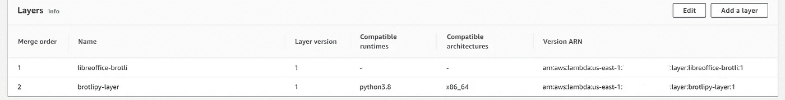

# 使用 AWS Lambda 将 Doc 或 Docx 转换为 pdf

> 原文：<https://medium.com/analytics-vidhya/convert-word-to-pdf-using-aws-lambda-cb111be0d685?source=collection_archive---------0----------------------->

## word —>零管理 pdf！


## 目录:

∘ [简介](#fb4d)
∘ [创意](#13af)
∘ [预建图层](#c7c9)
∘[brotlipy](#49ab)
∘[最后一步](#7bac)
∘ [快速预排](#674c)

## 介绍

我们都在本地将 doc 转换为 pdf，但问题是如何使用运行在 Amazon Linux 上的 AWS 无服务器计算引擎 AWS Lambda 进行转换。与有`win32com`的 windows 不同，没有办法为 API 安装 Microsoft office 工具！

我在网上搜索了很多其他的图书馆，它们在后台使用微软 office，然后转换成 pdf 格式。此外，Microsoft office 附带许可证费用。

谢天谢地，有一个开源工具 LibreOffice，但是如何在一个无服务器的系统上安装它呢？为了不再浪费时间，我按照[这里](https://github.com/vladgolubev/serverless-libreoffice)的步骤创建了我自己的 LibreOffice 层。它生成了一个 brotli 包`lo.tar.br`文件，该文件是 [LibreOffice v6.4.0.1](https://github.com/vladgolubev/serverless-libreoffice/releases/tag/v6.4.0.1) 。您也可以选择创建一个 gzip。

此外，还有一个与 LibreOffice 相关的命令工具，可用于转换为 pdf。

```
**libreoffice** [**--accept=***accept-string*] [**--base**] [**--calc**] [**--convert-to** output_file_extension[:output_filter_name] [--outdir output_dir] *file*]... [**--display** *display*] [**--draw**] [**--global**] [**--headless**] [**--help**|**-h**|**-?**] [**--impress**] [**--invisible**] [**--infilter="<filter>"**] [**--math**] [**--minimized**] [**-n** *file*]... [**--nodefault**] [**--nolockcheck**] [**--nologo**] [**--norestore**] [**-o** *file*]... [**-p** *file*...] [**--print-to-file [--printer-name printer_name] [--outdir output_dir] file]... [--pt** *printername* *file*...] [**--show** *Impress file*]... [**--unaccept=***accept-string*] [**--terminate_after_init**] [**--view** *file*]... [**--web**] [**--writer**] [*file*...]
```

对于 docker 用户:将文件`lo.tar.br`放在/opt 目录下。其余的事情将由代码在处理时负责。

```
# Required for LibreOffice
COPY ./path/lo.tar.br   /opt/
```

## 想法

现在的想法是做以下事情(*大致是*):

1.  这一层只是将`/opt/lo.tar.br`或`/opt/lo.tar.gz`文件添加到你的 Lambda 运行时中。
2.  将 Lambda 执行期间的`/opt/lo.tar.br`或`/opt/lo.tar.gz`文件解压到`/tmp`文件夹，该文件夹有 512 MB 的可用空间。
3.  LibreOffice 二进制文件将在`/opt/instdir/program/soffice.bin`发布

此外，如果您没有时间构建图层，可以使用一些预构建的 arns。

## 预建层

AWS 区域玩家 ARN (brotli)美东-1 `arn:aws:lambda:us-east-1:764866452798:layer:libreoffice-brotli:1`或
欧盟-西-1 `arn:aws:lambda:eu-west-1:764866452798:layer:libreoffice-brotli:1`或
欧盟-中央-1 `arn:aws:lambda:eu-central-1:764866452798:layer:libreoffice-brotli:1`或
美西-2 `arn:aws:lambda:us-west-2:764866452798:layer:libreoffice-brotli:1`或
美东-2 `arn:aws:lambda:us-east-2:764866452798:layer:libreoffice-brotli:1`或
AP-东南-2 `arn:aws:lambda:ap-southeast-2:764866452798:layer:libreoffice-brotli:1`或
欧盟-西-2 `arn:aws:lambda:eu-west-2:764866452798:layer:libreoffice-brotli:1`或
`arn:aws:lambda:eu-west-2:764866452798:layer:libreoffice-gzip:1`AP-东南-1`arn:aws:lambda:ap-southeast-2:764866452798:layer:libreoffice-gzip:1`

## 布罗特利比

该库包含参考 Brotli 编码器/解码器的 Python 绑定，[可从这里](https://github.com/google/brotli)获得。这允许 Python 软件直接从 Python 代码中使用 Brotli 压缩算法。

下一步是为 brotlipy 构建一个层。我为自己创建了一个并保存在这里以备再次使用—

[](https://github.com/kuharan/Lambda-Layers) [## GitHub-kuharan/Lambda-Layers:python 的 AWS lambda 层集合。

### python 的 AWS lambda 图层集合。寻找开发者和开源贡献者来为…构建层

github.com](https://github.com/kuharan/Lambda-Layers) 

将这个也添加到图层中。所以我们有两层功能。



## 最后一步

下面是 python 3.8 中用于转换的快速代码。

```
import os
from io import BytesIO
import tarfile
import boto3
import subprocess
import brotlilibre_office_install_dir = '/tmp/instdir'def load_libre_office():
    if os.path.exists(libre_office_install_dir) and os.path.isdir(libre_office_install_dir):
        print('We have a cached copy of LibreOffice, skipping extraction')
    else:
        print('No cached copy of LibreOffice, extracting tar stream from Brotli file.')
        buffer = BytesIO()
        with open('/opt/lo.tar.br', 'rb') as brotli_file:
            d = brotli.Decompressor()
            while True:
                chunk = brotli_file.read(1024)
                buffer.write(d.decompress(chunk))
                if len(chunk) < 1024:
                    break
            buffer.seek(0)print('Extracting tar stream to /tmp for caching.')
        with tarfile.open(fileobj=buffer) as tar:
            tar.extractall('/tmp')
        print('Done caching LibreOffice!')return f'{libre_office_install_dir}/program/soffice.bin'def download_from_s3(bucket, key, download_path):
    s3 = boto3.client("s3")
    s3.download_file(bucket, key, download_path)def upload_to_s3(file_path, bucket, key):
    s3 = boto3.client("s3")
    s3.upload_file(file_path, bucket, key)def convert_word_to_pdf(soffice_path, word_file_path, output_dir):
    conv_cmd = f"{soffice_path} --headless --norestore --invisible --nodefault --nofirststartwizard --nolockcheck --nologo --convert-to pdf:writer_pdf_Export --outdir {output_dir} {word_file_path}"
    response = subprocess.run(conv_cmd.split(), stdout=subprocess.PIPE, stderr=subprocess.PIPE)
    if response.returncode != 0:
        response = subprocess.run(conv_cmd.split(), stdout=subprocess.PIPE, stderr=subprocess.PIPE)
        if response.returncode != 0:
            return False
    return Truedef lambda_handler(event, context):
    bucket = "xxxx"
    key = "xxxx/xxxx/xxxx/xxxx/SampleDoc.docx"
    key_prefix, base_name = os.path.split(key)
    download_path = f"/tmp/{base_name}"
    output_dir = "/tmp"download_from_s3(bucket, key, download_path)soffice_path = load_libre_office()

    is_converted = convert_word_to_pdf(soffice_path, download_path, output_dir)
    if is_converted:
        file_name, _ = os.path.splitext(base_name)
        upload_to_s3(f"{output_dir}/{file_name}.pdf", bucket, f"{key_prefix}/{file_name}.pdf")
        return {"response": "file converted to PDF and available at same S3 location of input key"}
    else:
        return {"response": "cannot convert this document to PDF"}
```

## 快速演练

**load_libre_office** 会通过在 tmp 中解压 libre office 来安装 libre office，如果不存在的话，每次都会重复使用，直到功能热起来。

函数 **download_from_s3** 会将 word 文件下载到 tmp 中， **convert_word_to_pdf** 会将其转换， **upload_to_s3** 会将其上传到 s3 中。

**convert_word_to_pdf** 使用子流程运行转换命令。

目前，这个东西把 pdf 放在同一个位置，但你可以随时修改它，把它放在其他位置。

> 重要的是整个包的大小仍然是 1.1 KB。

希望这有助于解决大混乱。感谢您的阅读。喜欢就给它鼓掌。如果有问题，请在下面的评论中告诉我。我很乐意帮忙。下次见。再见！