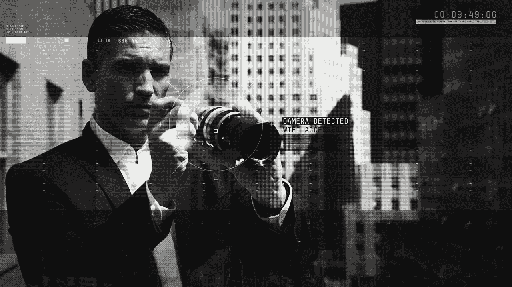
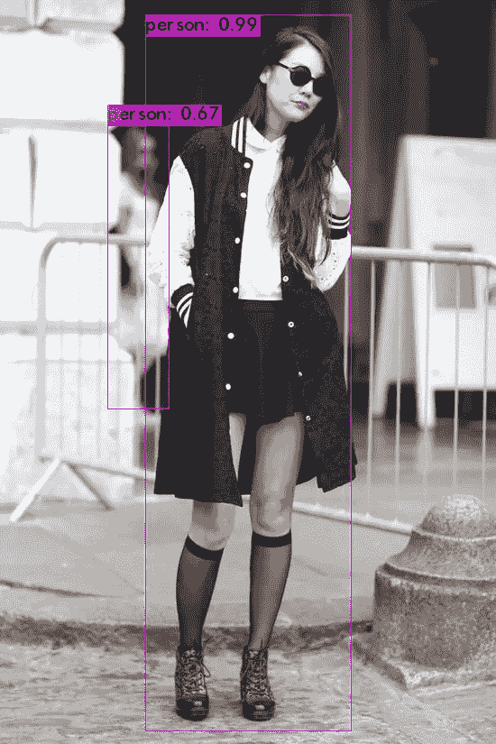
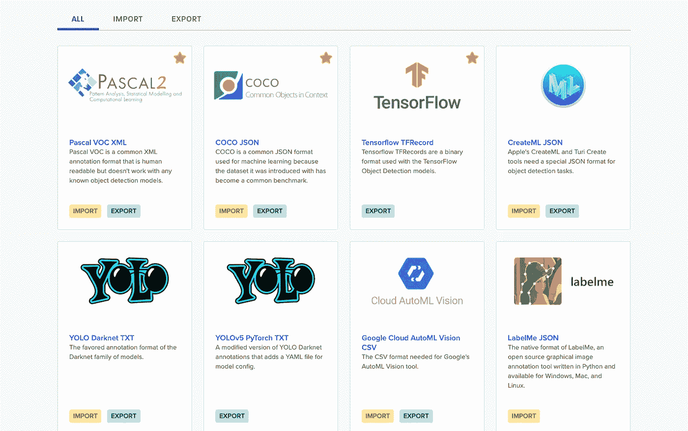
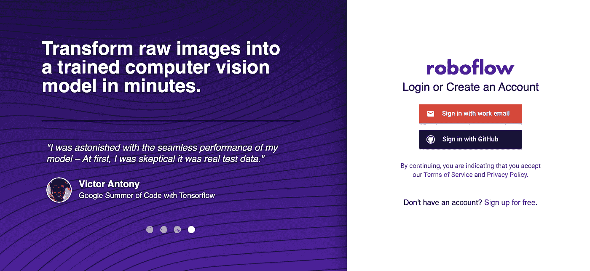
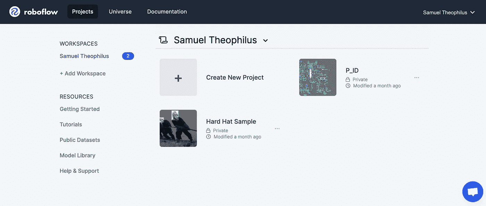
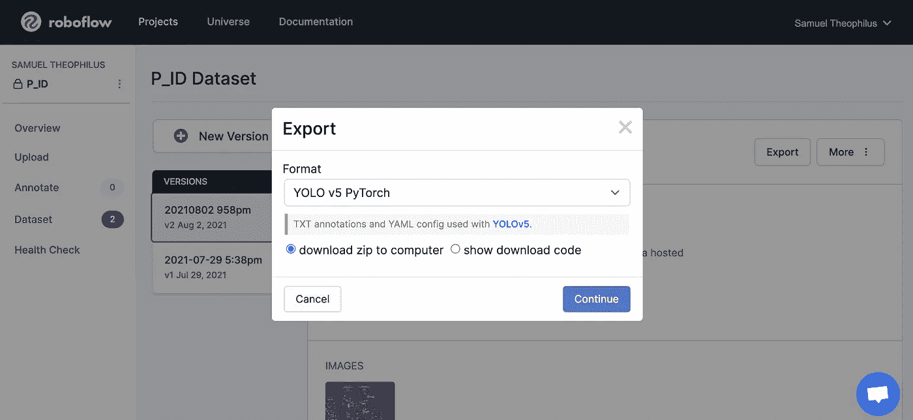

# Roboflow:为对象检测转换注释

> 原文：<https://medium.com/analytics-vidhya/converting-annotations-for-object-detection-using-roboflow-5d0760bd5871?source=collection_archive---------1----------------------->

来源:[涉案人(电视剧:第三季)](http://www.miguellee.com/person-of-interest)

目标检测是机器学习领域中的一个发展中的领域，并且最近受到了关注。它是一种计算机视觉技术，用于定位图像或视频中的对象实例(如人脸、车牌号码、农作物等)。虽然它已经存在了一段时间，但它已经见证了传统方法的快速革命性变化，例如:

1.  viola–Jones 对象检测框架
2.  尺度不变特征变换
3.  方向梯度直方图(HOG)特征

它已经发展到使用机器学习技术，例如:

1.  地区提案(R-CNN、快速 R-CNN、更快 R-CNN 等。)
2.  你只看一次(YOLO)
3.  单触发多盒探测器(SSD)
4.  视网膜网

**机器学习**(深度学习)技术因其在物体检测方面取得的令人印象深刻的成果而受到研究人员和创新者的关注。然而，为了训练一个 ML 模型，我们需要一个带标签的数据集，这些带标签的数据以图像和注释的形式出现(JSON，TXT，XML)。

# 什么是注释？

图像或视频注释是附加标签(预先确定的类别-人、狗、汽车等)的过程。)应用于图像/视频帧，以便视情况识别、计数或跟踪或分割图像/视频中的对象边界。注释可以采用以下任何形式:

1.  边界框
2.  三维长方体
3.  多边形
4.  线条和样条
5.  语义分割

有关注释类型的更多信息，请访问 [TELUS](https://www.telusinternational.com/articles/an-introduction-to-5-types-of-image-annotation) 。

这些注释通常以各种标准格式保存，并可以馈入计算机视觉算法(深度学习)进行模型训练。注释文件包含对象坐标(关于每个对象在给定图像上的位置的信息)。当使用深度学习模型时，熟悉一些流行的注释格式并学习如何将它们转换为其他格式以灵活使用各种对象检测算法是很重要的。

# 注释格式

虽然这不是一个详尽的列表，但这里有一些用于训练 ML 模型的流行格式:

**1。YOLO**

“你只看一次”(YOLO)算法成功地实时识别了图像/视频中的对象。这一成功使得注释格式流行起来，并且随着新的算法变体的开发，它们各自的 YOLO 注释格式也变得流行起来。

*   YOLO 暗网
*   YOLOv5 PyTorch
*   缩放后的 YOLOv4
*   YOLO·克拉斯
*   YOLOv4 PyTorch

**2。COCO** :这种 JSON 格式随着微软在 2015 年发布的 theMS COCO 数据集而流行起来。它已经成为诸如 R-CNN、快速 R-CNN 的对象检测模型的通用格式。

**3。帕斯卡 VOC**

尽管还没有直接处理 VOC XML 标签的模型，但是这种格式仍然被认为是一种流行的注释格式。注释格式是为视觉对象挑战(VOC)而创建的，并且已经成为对象检测标签的通用交换格式。

来源:Roboflow

有关其他注释格式和 Roboflow 通用转换工具的更多信息，请访问 https://roboflow.com/formats。

# 机器人流程:概述

Roboflow 是一个计算机视觉平台，通过提供更好的数据收集、预处理和模型训练技术，允许用户更快、更准确地建立计算机视觉模型。Roboflow 允许用户上传自定义数据集、绘制注释、修改图像方向、调整图像大小、修改图像对比度和执行数据扩充。也可以用来训练模型。

正如我提到的，Roboflow 还有一个通用的注释转换工具，允许用户上传注释并将注释从一种格式转换为另一种格式，而不必为自定义的对象检测数据集编写转换脚本。

## 入门指南

首先，你需要在 https://roboflow.com/[报名。请注意，选择“**公共工作区**”，同时**注册自由层账户**，您可以上传多达 10，000 个源图像的图像数据集。](https://roboflow.com/)

**创建新项目**

创建项目后，下一步是上传包含图像和现有注释文件(可以是 JSON、Txt 或 XML 格式)的数据集，或者从头开始绘制注释。 [**要全面了解 Roboflow，请观看这段 YouTube 视频**](https://www.youtube.com/watch?v=VDqsK3FDIsQ) 。

**导出数据集**

准备数据集后的最后一步是以首选格式导出数据:

# 结论

如果你想接触代码，我建议你看看这个 GitHub 库:

 [## GitHub-nikhilgunti/Annotation-Converters:这个报告涵盖了 Object……

### 这个报告涵盖了用于对象检测的所有格式的注释，并且可以很容易地使用…

github.com](https://github.com/nikhilgunti/Annotation-Converters) 

有问题吗？想修正文章中的某些东西？

**联系我:**

1.  领英:[https://www.linkedin.com/in/samuelnnitiwetheophilus/](https://www.linkedin.com/in/samuelnnitiwetheophilus/)
2.  insta gram:【https://www.instagram.com/nnitiwe/ 
3.  个人网站:【https://nnitiwe-dev.github.io/】T4