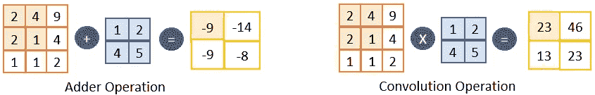

# 将新型神经网络架构转换为 tensort——AdderNet to tensort

> 原文：<https://medium.com/analytics-vidhya/converting-novel-neural-network-architectures-to-tensorrt-addernet-to-tensorrt-20b11d7fe5cf?source=collection_archive---------11----------------------->

当涉及到边缘人工智能设备中预训练神经网络(NN)的部署和推理时，我们必须减少 NN 的内存占用(大小)以适应边缘设备的内存。此外，我们必须减少神经网络中的计算数量，以实现更高的吞吐量，同时保持所需的精度。为此，我们可以使用以下神经网络压缩方法。

*   修剪神经网络的冗余权重、过滤器、层。
*   量化神经网络的权重。(浮点 64 至浮点 32，浮点 16，整数 8)
*   开发一个有效的神经网络结构。
*   知识的升华。

如果你不熟悉上述方法，最好读一点文献，了解它们的基本概念，因为这将有助于你在人工智能生产线上部署高性能模型。

## NVIDIA TensorRT

NVIDIA TensorRT 是一款高性能深度学习推理的 SDK。它包括一个深度学习推理优化器和运行时，为深度学习推理应用程序提供低延迟和高吞吐量。换句话说，TensorRT 为我们做了 NN 压缩工作。您可能已经知道，卷积神经网络(CNN)部署到 NVIDIA Jetson 开发套件需要将我们的 CNN 模型转换为 NVIDIA-TensorRT 格式。那么只有它可以在 NVIDIA Jetson 部署套件中运行，如 TX1、TX2、Nano、Xavier AGX 和 Xavier NX。

## AdderNet

[**AdderNet**](https://arxiv.org/abs/1912.13200) 是一种用**新型加法滤波器**代替传统**卷积滤波器**的细胞神经网络。通常**加法运算**在计算上**比**乘法运算**便宜**。加法器滤波器使用这个概念，并且**在卷积滤波器中用加法代替乘法。**由加法滤波器组成的卷积层称为**加法层**。

**卷积运算** —计算输入特征图和卷积滤波器之间的**互相关**。

**加法器操作** —首先，计算输入特征图和加法器滤波器之间的**绝对 L1 范数距离**。第二，取绝对值的负值计算出来。

> 加法器操作-> | 2–1 |+| 4–2 |+| 2–4 |+| 1–5 | = 9 *(-1)=-9
> 
> 卷积运算-> (2*1) + (4*2) + (2*4) + (1*5) = 23



加法器运算与卷积运算

AdderNet 使用**全精度梯度**来更新反向传播过程中的加法器滤波器。它还使用**自适应学习速率**方法提高了加法器滤波器的学习速率。除此之外，加法器层应该是**，然后是批量标准化** **层**，以将负输出缩放到更好的范围，以便与传统 CNN 架构中的 Relu 激活一起工作。

## **AdderNetMnist**

在我的实验中，我使用了一个手工制作的 AdderNet 神经网络架构，该架构在 **PyTorch** 中实现，用于 MNIST 分类。从这里开始，我将把这个 NN 称为 **AdderNetMnist** 。 **AdderNetMnist** 如以下代码片段所示。该体系结构由两个加法器层组成，后面是批量标准化层和最大池层。然后有两个密集层用于 SoftMax 分类。你可以在我的 Github repo 中的源文件[**addernet _ mnist . py**](https://github.com/chinthysl/AdderNetTensorRT/blob/master/addernet_mnist.py)中找到这个实现。

```
class Net(nn.Module):
    def __init__(self):
        super(Net, self).__init__()
        self.adder1 = adder.adder2d(1, 20, kernel_size=5, stride=1, padding=0, bias=False)
        self.bn1 = nn.BatchNorm2d(20)
        self.pool1 = nn.MaxPool2d(kernel_size=2, stride=2)
        self.adder2 = adder.adder2d(20, 50, kernel_size=5, stride=1, padding=0, bias=False)
        self.bn2 = nn.BatchNorm2d(50)
        self.pool2 = nn.MaxPool2d(kernel_size=2, stride=2)
        self.fc1 = nn.Linear(800, 500)
        self.relu1 = nn.ReLU(inplace=True)
        self.fc2 = nn.Linear(500, 10)

    def forward(self, x):
        x = self.adder1(x)
        x = self.bn1(x)
        x = self.pool1(x)
        x = self.adder2(x)
        x = self.bn2(x)
        x = self.pool2(x)
        x = x.view(-1, 800)
        x = self.fc1(x)
        x = self.relu1(x)
        x = self.fc2(x)
        return F.softmax(x, dim=1)
```

加法器层的实现( **adder2d** )可以在[原 AdderNet 研究论文实现](https://github.com/huawei-noah/AdderNet/blob/master/adder.py)中找到。这个实现只使用 CPU 完成，没有在 CUDA 中实现 GPU 加速。

## 将 AdderNet 转换为 TensorRT

要将神经网络架构转换为 TensorRT，首先我们必须使用所需的数据集(在我的例子中是 MNIST)训练现有的神经网络，并保存网络及其权重以供将来使用。

然后我们将保存的模型转换成 TensorRT。在 TensorRT 中，有两种方法可以处理来自不同 DL 框架的已保存模型。

1.  张量流— tf2onnx 转换，TF-TRT 转换，TF-UFF 转换。
2.  PyTorch 或其他框架——转换成 ONNX，然后转换成 TRT。

在我的实验中，我使用了第二种方法。首先，我尝试使用下面的脚本[**addernet _ mnist _ ONNX . py**](https://github.com/chinthysl/AdderNetTensorRT/blob/master/addernet_mnist_onnx.py)将我的 PyTorch 模型直接转换为 ONNX。

```
model = MnistModel()
model.network.load_state_dict(torch.load('./saved_models/addernet_mnist.pth'))
model.network.to('cuda')

dummy_input = torch.randn(1, 1, 28, 28, device='cuda')

# convert pytorch model to onnx format
torch.onnx.export(model.network, dummy_input,
                  "./saved_models/addernet_mnist.onnx",
                  verbose=True, opset_version=OPSET)
```

不幸的是***torch . onnx . export****方法给出了一个错误，因为 ONNX 不支持我的神经网络架构中的新型加法器层的转换。如果我们的神经网络架构中有了新的层类型或者新的运算类型，**你们大多数人！！！可能会以 ONNX 错误**结束这个阶段。为了从这个阶段开始，我们需要使用 tensort**API**从头开始实现 tensort**不支持的自定义层或操作，以使其可转换。***

*在这种情况下，我们可以通过使用 tensort[c++](https://docs.nvidia.com/deeplearning/sdk/tensorrt-api/c_api/classnvinfer1_1_1_i_plugin_v2_ext.html)和[Python](https://docs.nvidia.com/deeplearning/sdk/tensorrt-api/python_api/infer/Plugin/IPluginV2Ext.html)API 提供的 **IPluginV2** 接口实现自定义层来扩展 tensort 功能。**自定义层**在 TensorRT 中通常被称为**插件**。如果你熟悉 OOP 编程的话， **IPluginV2** 就是接口或者父类。我们要做的是创建一个继承父类功能的子类。所以我们的**自定义层类**可以根据我们自定义 NN 层的功能扩展并实现 **IPluginV2 基类**中的虚拟方法。*

*在我的实验中，我在 repo 中将加法器层实现为[**Adder 2d plugin . h**](https://github.com/chinthysl/AdderNetTensorRT/blob/master/plugin/Adder2dPlugin.h)**。 **Adder2dPlugin** 子类扩展 IPluginV2 基类。为了从 **Adder2dPlugin 创建一个对象，** TensortRT 给了我们另一个名为**iplugcincrator 的接口。adder 2 dplugcincrator**是扩展**iplugcincrator 的子类。**这两个类的实现都可以在源文件[**adder 2d plugin . Cu**](https://github.com/chinthysl/AdderNetTensorRT/blob/master/plugin/Adder2dPlugin.cu)**中找到。**总之，这两个类负责**为我们的加法器层定义特征映射维度、数据类型、管理 GPU 内存和正向推理计算**。请看一下**adder 2d plugin::enqueue()**方法，该方法使用我设计的自定义**并行 CUDA 算法**进行正向推理计算。***

***用于定制层的并行 CUDA 算法的实现包括 CUDA 编程接口中的并行编程模式的知识。我已经使用一个 CUDA 内核**_ _ global _ _ void Adder filter()**映射了加法器操作，它可以在 source[**Adder 2 dplugin . Cu**](https://github.com/chinthysl/AdderNetTensorRT/blob/master/plugin/Adder2dPlugin.cu)中找到。我的加法器操作的 CUDA 映射可以如下所示。***

******

***将加法器过滤器映射到并发 CUDA 内核***

***在使用 C++成功实现并测试了 **Adder2dPlugin** 之后，我们可以创建一个 **C++共享库**对象(。so 文件)包含此功能。然后，我们必须使用 py bind 11([**adder 2 dpytrt . CPP**](https://github.com/chinthysl/AdderNetTensorRT/blob/master/plugin/Adder2dPyTrt.cpp))创建将这个 **Adder2dPlugin** 作为 Python 包加载的能力。***

***下一步是使用 Python 导入这个 **Adder2dPlugin** 。更多信息请参考源代码[**addernet _ mnist _ TRT . py**](https://github.com/chinthysl/AdderNetTensorRT/blob/master/addernet_mnist_trt.py)**中名为 **def get_adder2d_plugin()** 的函数。*****

*****在这一点上，我们已经完成了我们的自定义神经网络层-加法器层的实现。现在我们要做的是使用这一层，将整个 **AdderNetMnist** 网络架构转换为 TensorRT。为此，我们在 TensorRT python API 中复制了整个 py torch**addernet NIST**网络架构。[**addernet _ mnist _ TRT . py**](https://github.com/chinthysl/AdderNetTensorRT/blob/master/addernet_mnist_trt.py)**里面的函数 **def populate_network()** 为us 做这个工作。*******

*****艰难的工作现在结束了。因此，我们可以使用 PyTorch 模型中 AdderNetMnist 的预训练权重来构建 TensorRT 推理机，并运行推理。这项工作的整个开发流程如下图所示。*****

**********

## *****结果和结论备注*****

**********

*   *****结果表明， TensorRT 模型在精度损失 **0.83%的情况下，可以实现比 AdderNet Mnist 模型极低的推理延迟( **5000x** )。*******
*   ***TensorRT 模型中的更高精度显示了加法器层实现的**正确性**。***
*   ***这种**实现可以扩展**以部署任何其他具有加法器层的 NN 架构，如原始研究论文中提到的 ResNet20 和 ResNet50。***
*   ***目前，**这是 AdderNet 唯一成功的 CUDA 和 TensorRT 实施**。***
*   ***这项工作花了我三个星期才完成。我希望这篇文章能帮助 AI 行业和学术界的每个人，那些尝试使用 NVIDIA Jetson 开发套件的人。***

## ***下一步***

***我想将加法器过滤器的 CUDA 实现集成到现有的 DL 库中，如 Tensorflow 和 PyTorch。在这里，我只在 CUDA 中为部署实现了正向推理。但是我需要在 CUDA 中实现反向传播，也是为了训练的目的。***

***给我一个掌声❤️，如果你喜欢这个职位:)希望你会拉代码，并尝试自己。[https://github.com/chinthysl/AdderNetTensorRT](https://github.com/chinthysl/AdderNetTensorRT)。***

***关注我的 GitHub 页面，开始对你重要的项目。***

***我做深度学习咨询、研究、开发，喜欢研究有趣的问题。如果你有一个我们可以合作的项目，请通过我的电子邮件联系我:**gamanayaka.chinthaka@gmail.com*****

***以后工作用 LinkedIn 联系我:【https://www.linkedin.com/in/chinthaka-gamanayake】**/*****

*****我必须提到并感谢我的同事，Nuran，作为一名经验丰富的生产级人工智能工程师，他帮助我完成了这个项目！*****

*******参考文献:*******

*   *****[AdderNet 研究论文](https://arxiv.org/pdf/1912.13200.pdf)*****
*   *****[华为原始 AddeNet 文件实现](https://github.com/huawei-noah/AdderNet/)*****
*   *****[腾索特开发者指南](https://docs.nvidia.com/deeplearning/tensorrt/developer-guide/)*****
*   *****[腾索特最佳实践](https://docs.nvidia.com/deeplearning/tensorrt/best-practices/index.html)*****
*   *****[TensorRT python API](https://docs.nvidia.com/deeplearning/tensorrt/api/python_api/)*****
*   *****[TensorRT 样本层插件](https://github.com/NVIDIA/TensorRT/tree/master/samples/opensource/samplePlugin)*****
*   *****[https://github.com/zerollzeng/tiny-tensorrt](https://github.com/zerollzeng/tiny-tensorrt)*****
*   *****[https://github.com/NVIDIA-AI-IOT/torch2trt](https://github.com/NVIDIA-AI-IOT/torch2trt)*****
*   *****[https://github.com/TrojanXu/onnxparser-trt-plugin-sample](https://github.com/TrojanXu/onnxparser-trt-plugin-sample)*****
*   *****[https://github.com/ceccocats/tkDNN](https://github.com/ceccocats/tkDNN)*****