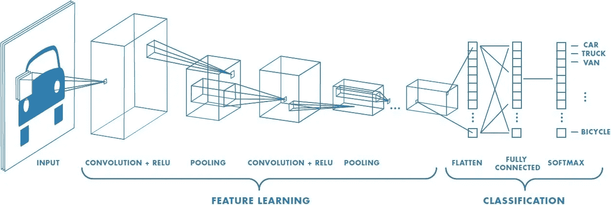

# ConvNets:什么和如何？

> 原文：<https://medium.com/analytics-vidhya/convnets-what-and-how-b3d9285edef4?source=collection_archive---------7----------------------->

## 对卷积的理解——什么、为什么和如何

什么是卷积？

对于图像的分类，一个密集的神经网络查看一个图像的所有像素(来自数据集)，然后试图猜测它是什么；这是一件令人厌烦的工作。所以在这里，图像卷积进入画面。卷积帮助我们挑选出图像的重要或独特特征，而不是猜测每个像素代表什么。

简而言之，卷积是一个过程，在这个过程中，我们对数据集中的图像进行过滤，以挑选出有助于区分特征的重要特征。

**为什么需要卷积？**

当我们必须对数据进行分类时，密集神经网络通常是一个很好的选择。但是由于其高精度，细胞神经网络主要用于图像分类和识别。CNN 倾向于提取任何图像的重要特征，并据此学习分类，从而使其成为图像分类的更好选择。

CNN 也有许多应用，一些重要的应用是用于生成模型、分割等。

**CNN 是如何工作的？**



美国有线电视新闻网(CNN)的图像表示，正在对车辆图像进行训练。

CNN 有以下几层在工作:1)卷积层 2)汇集层 3)全连接层

前两层(卷积层和池层)用于提取要素，即从数据集中提取重要的要素。FC 层利用提取的特征对图像进行分类。


特征提取和分类阶段。

*   **卷积层**

对于卷积过程，我们有一个数组，称为内核或过滤器。该数组的维数通常小于数据集中图像的维数。我们用图像的每个像素的 RGB 值来取核的点积。我们从左上角开始，如下图所示。然后，内核遍历整个图像。


在决定我们想要突出图像的什么特征时，内核是非常重要的。当我们想要显示某些特性时，我们使用特定类型的内核。


突出不同特性的内核。

输出值存储在一个新数组中，称为特征映射。在我们继续之前，我们需要了解一些术语。

*   **步幅:**下一次卷积运算前内核跳过的像素数。
*   **填充:**为了保持图像的形状，附加在每个边缘旁边的像素数。

*为什么需要填充？*填充有助于降低图像的分辨率，突出重要特征，同时减少计算量。填充的几种类型有:

*   **有效填充/无填充**:此处填充为零。


我们会丢失有效或“无”填充的信息。

*   **相同填充/零填充**:填充是以这样一种方式完成的，即输出与数据具有相同的形状，唯一的区别是，输出图像的边缘用零分层。


由相同或“零”填充产生的零层由空白表示。

固定了步幅和填充的值后，内核开始进行下一个卷积。首先，内核按行移动(从左到右)，然后跳到下一行，记住步幅，从左边开始。下面是一个例子:


跨距=1 且填充=0 的卷积。

在卷积之后，与图像的 RGB 值矩阵相比，结果阵列具有更小的维度。

现在，我们想要去除具有零或相对较小值的像素，因为它们不显示任何有助于检测对象特征的特征。例如，如果我们有一个手提包的图像，使其可被察觉的特征是包的把手或拉链。图像可能包含空白，这对检测手提包的任何重要特征没有帮助，去除它们会使分类更容易。为了有助于这一点，汇集出现了。

*   **汇集层**

池化是一个过程，我们在图像上传递一个过滤器，就像我们对卷积所做的那样，但是这一次，我们不把它乘以任何东西。有两种类型的池:

*   **Max pooling** :当滤波器在输入端移动时，它选择具有最大值的像素发送到输出数组。


步幅=2 时的最大池。

*   **Average pooling** :当过滤器在输入中移动时，它计算过滤器内值的平均值，并发送到输出数组。


步幅=2 的平均池。

*但是什么时候使用哪种类型的池呢？*平均池挑选平均值，因此，图像的特征被平滑，并且没有检测到更尖锐的特征；而对于最大池，选择最高值，因此很容易检测到最亮的颜色。

在经历了几次卷积和合并过程后，我们现在得到了相对较小尺寸的图像。这些小尺寸输出包含使分类更容易的对象的那些特征。这些图像然后被发送到一个密集的神经网络中，在那里它们被重新整形为一个阵列，并发生向前和向后传播的过程。

**全连接层**


在完整的卷积过程发生多次后，图像被展平并传递给 DNN。对于上面显示的 DNN，我们有一个输入层、两个隐藏(或密集)层和一个输出层。

在密集层中，图中用圆圈表示的单个单元称为感知器。


每个感知器单元都有一个与之相关的权重“w”。在数学上，所有感知器单元的权重形成大小为“nx1”的矩阵，其中“nx1”也是展平图像矩阵的大小，用 x 表示。展平图像和权重相乘，得到 Z=wᵗx+b，其中“b”是偏差，一个标量。

权重的存在是为了给图像的某些特征提供比其他特征更大的重要性。权重的值将随着训练而改变，以便模型学习哪些特征更重要。

在这之后，我们应用激活函数，(通常，sigmoid 函数，由σ=eᶻ/(1+eᶻ)).表示在这种情况下，我们使用 ReLU，它代表“校正线性单位”。它是一个线性函数，如果输入为正，它将直接输出输入，否则，它将输出零。


然后，在下一层感知器中，我们应用 softmax 激活以及交叉熵损失函数。它有助于减少损耗，即实际输出与期望输出的偏差。


至此，我们结束了向前传播的一个步骤，这基本上是在 DNN 中向前移动的过程，以计算损失函数。在此之后，我们执行反向传播，也就是说，我们试图通过改变感知器的权重值来最小化这种损失。

我们计算权重和偏差的导数，将它们乘以一个称为学习率的常数，然后更新参数值。每执行一次这一步，损失就会降低。这被称为“梯度下降”。


在多次执行前馈和反向传播步骤后，我们达到了最小损耗。在这一点上，我们说我们的模型是为分类而训练的。

**构建一个基本 CNN 的代码**

在这里，例如，我们将尝试建立一个基本的 CNN，它将在来自 MNIST 数据集的图像上进行训练，它将尝试从图像中对数字进行分类。
附:这段代码可以粘贴在一个 colab 笔记本上执行！

我们首先导入所需的 MNIST 数据集 TensorFlow，并加载训练和测试图像及其标签。

```
import tensorflow as tf
mnist=tf.keras.datasets.mnist
(x_train,y_train),(x_test,y_test)=mnist.load_data()
```

默认情况下，MNIST 数据集中的影像为 28x28。但为了确保万无一失，我们将所有图像的大小调整为 28x28。由于所有的像素值都在 0 到 255 的范围内，我们通过将它们除以 255 来标准化图像。归一化的优点是，当所有值都在范围[0，1]内时，梯度下降变得更有效，并且我们的模型给出更准确的结果。

```
x_train=x_train.reshape(60000, 28, 28, 1)
x_train=x_train/255.0
x_test= x_test.reshape(10000, 28, 28, 1)
x_test=x_test/255.0
```

最后，我们创建一个顺序神经网络，命名为“模型”，它首先有卷积和池层。

在第一层 Conv2D 中，我们让我们的图像进行 64 次卷积，核是一个 3×3 的矩阵。在第二层 MaxPooling2D 中，我们有一个 2x2 的池过滤器，它将从图像的 2x2 空间中挑选出最大值。进一步的层就像一个普通的前馈神经网络，在执行这个之后，我们的模型就可以被训练了。

```
model = tf.keras.models.Sequential([
tf.keras.layers.Conv2D(64, (3,3), activation='relu', input_shape=(28, 28, 1)),
tf.keras.layers.MaxPooling2D(2, 2),
tf.keras.layers.Conv2D(64, (3,3), activation='relu'),
tf.keras.layers.MaxPooling2D(2,2),
tf.keras.layers.Flatten(),
tf.keras.layers.Dense(128, activation='relu'),
tf.keras.layers.Dense(10, activation='softmax')
])
```

现在我们的模型已经准备好了，我们需要在我们的训练数据集上训练它，然后在测试数据集上测试它。下面的代码完成了必要的工作:

```
model.compile(optimizer='adam', loss='sparse_categorical_crossentropy', metrics=['accuracy'])
model.summary()model.fit(x_train, y_train, epochs=5)
test_loss = model.evaluate(x_test, y_test)
```

就这样，一个简单的 CNN 就呼之欲出了，准确率差不多 98%！这段代码只需几层 DNN 就能有效工作，因为我们是在 MNIST 数据集上训练它的，该数据集包含 28x28 维的图像，质量相当低。但是，要建立一个 CNN，即使对于更高维的图像也能有效地工作，我们需要添加更多的层。

**参考文献:**

1.  [DL 入门课程](https://www.coursera.org/learn/introduction-tensorflow/home/welcome)
2.  [洞察到填充](https://www.machinecurve.com/index.php/2020/02/07/what-is-padding-in-a-neural-network/)
3.  [损失和激活功能](https://gombru.github.io/2018/05/23/cross_entropy_loss/)
4.  [IBM 对 CNN 的见解](https://www.ibm.com/cloud/learn/convolutional-neural-networks)
5.  [MNIST 数据集](https://keras.io/api/datasets/mnist/)