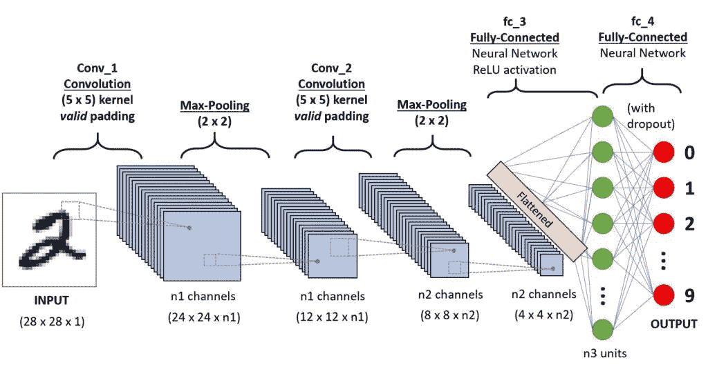
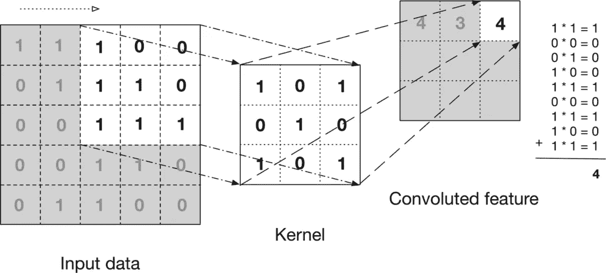
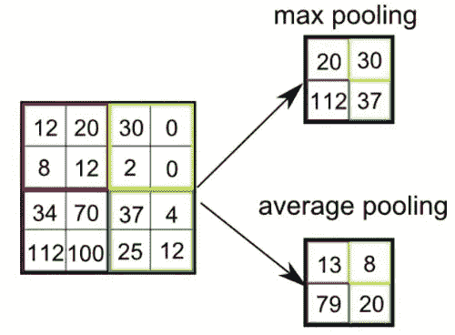

# 卷积神经网络(CNN)——深度学习的基础——白痴开发者

> 原文：<https://medium.com/analytics-vidhya/convolution-neural-network-cnn-fundamental-of-deep-learning-idiot-developer-3d1aa82e5c85?source=collection_archive---------9----------------------->

卷积神经网络(CNN)用于解决广泛的视觉任务，如[图像分类](https://idiotdeveloper.com/dog-breed-classification-using-transfer-learning-in-tensorflow/)，物体检测，[语义分割](https://idiotdeveloper.com/unet-segmentation-in-tensorflow/)，等等。CNN 由一系列具有非线性激活函数的卷积层和一些下采样层组成。这些 CNN 能够捕捉层次模式并产生图像表示。

概述:

1.  什么是卷积神经网络？
2.  为什么卷积神经网络优于前馈神经网络？
3.  CNN 的主要组成部分

*   卷积层
*   活化层
*   汇集层
*   全连接层

# 什么是卷积神经网络？

卷积神经网络(CNN)或简称 ConvNets 是一类[深度神经网络](https://idiotdeveloper.com/what-is-deep-learning/)，普遍用于可视化数据分析。该视觉数据可以是图像或视频的形式。CNN 的灵感来自于哺乳动物的视觉皮层。它们是作为自然视觉感知的计算模型开发的，类似于人的视觉系统。CNN 的应用有[图像分类](https://idiotdeveloper.com/dog-breed-classification-using-transfer-learning-in-tensorflow/)，物体检测[，语义分割](https://idiotdeveloper.com/unet-segmentation-in-tensorflow/)，[医学图像分析](https://idiotdeveloper.com/unet-segmentation-with-pretrained-mobilenetv2-as-encoder/)等等。

卷积神经网络(CNN)获取输入图像，对其执行一系列操作，然后将其分类到某些类别下(例如:猫或狗)。根据我们试图解决的问题的类型，结果会有所不同。在图像分类的情况下，我们得到一个标签(概率得分)。在语义分割的情况下，我们得到分割图，其中每个像素都标有类别标签。

识别手写数字的 CNN。

卷积神经网络(CNN)的基本架构由以下几层组成:

*   卷积层— CONV
*   激活层— ACT
*   池层-池
*   全连接层— FC

所有这些层以某种组合方式用于构建卷积神经网络。对于图像分类任务，一般架构如下:

输入-> [CONV -> ACT -> POOL] x N 次-> [FC -> ACT] x M 次->输出

# 为什么卷积神经网络优于前馈神经网络？

现在问题出现了，如果我们有一个前馈神经网络，为什么我们需要卷积神经网络？

前馈神经网络也可以代替卷积神经网络用于图像分类。前馈神经网络将输入作为多个特征(批次、特征)。为此，我们需要将图像展平为一维表示，这样我们会丢失图像所表示的空间信息。为了利用这种空间信息，我们使用卷积神经网络。卷积神经网络将图像的批次作为输入，而不对其形状进行任何修改。卷积神经网络的输入形状是(批次、高度、宽度、通道)。

前馈神经网络本质上非常密集，因为它们具有许多可训练的参数(权重)，这使得它们容易出现过拟合的问题。

在卷积神经网络的情况下，存在参数共享或权重共享，因此与前馈神经网络相比，它们具有非常少的参数，因此与前馈神经网络相比，它们在训练中花费较少的时间。

# CNN 的主要组成部分

众所周知，卷积神经网络是由一些相互堆叠的层组成的。这些层形成了卷积神经网络的构造块。

# 卷积层

卷积神经网络(CNN)的中心构建块是卷积层，它使网络能够通过在每层的局部感受域内融合空间和信道信息来构建信息特征。

卷积层由数学卷积运算组成，它需要两个输入，首先是图像矩阵和一个小的核矩阵。内核滑过输入图像并产生输出特征图。

卷积层的基本工作原理。

卷积运算的目的是从输入图像中提取诸如边缘、直线、曲线等高级特征。从广义上来说，我们可以说卷积层的作用是将图像简化为一种更容易处理的形式，而不丢失基本特征。

# 活化层

激活层在神经网络中引入了非线性。ReLU(校正线性单元)是卷积神经网络中最常用的激活函数。它用于除输出图层之外的所有图层。输出层的激活函数取决于我们试图解决的问题的类型。与分类的情况一样，我们使用 sigmoid 表示单个类，使用 softmax 表示多个类。

# 汇集层

共用图层用于减少空间维度，即输入要素地图的高度和宽度。它有助于通过降维来减少处理特征图所需的计算资源。

有两种主要类型的池:

*   最大池化
*   平均池

两种类型的池:最大池和平均池。

一个池操作需要一个内核大小和一个跨距值。内核大小决定了从特征图中提取值以创建新特征图的面片大小。步幅值帮助我们在特征图上移动。

# 全连接层

在一系列卷积层、激活层和汇集层之后，我们展平传入的特征地图，并将它们作为输入馈送到完全连接的层进行分类。

完全连接的图层或密集图层采用展平的输入要素和一定数量的输出要素。

例如:

池图层中要素的输入形状为(B，H，W，N)。现在，我们通过将特征图整形为(B，H*W*N)来展平它们。现在，我们将其输入全连接图层，输出要素的数量为 O。全连接图层给出的要素地图的形状为(B，O)。

之后，我们在完全连接的层的输出上应用激活函数，我们得到一个概率分数，该分数用于确定输入图像的标签。

*原载于 2021 年 5 月 19 日 https://idiotdeveloper.com***。**