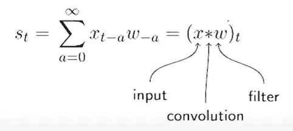
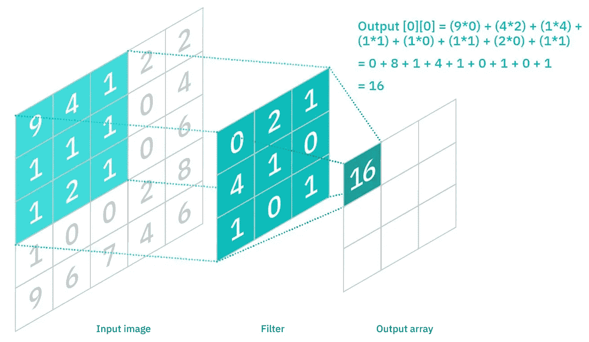
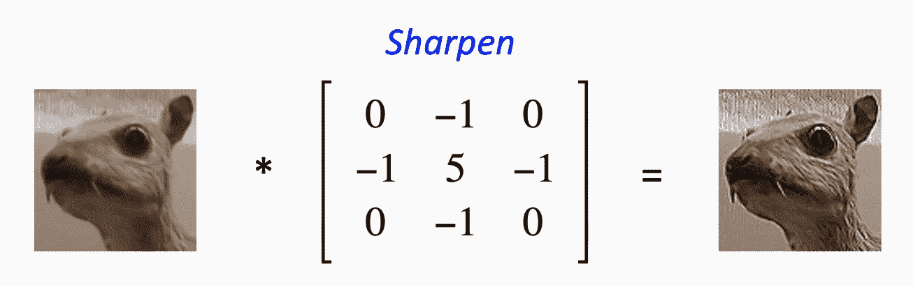
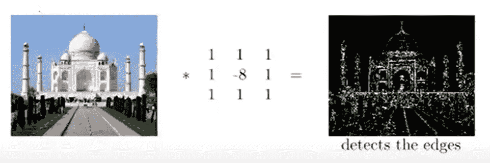
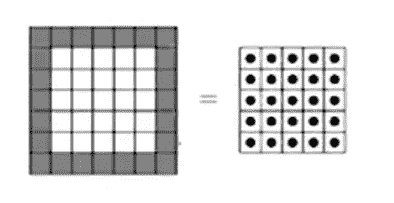
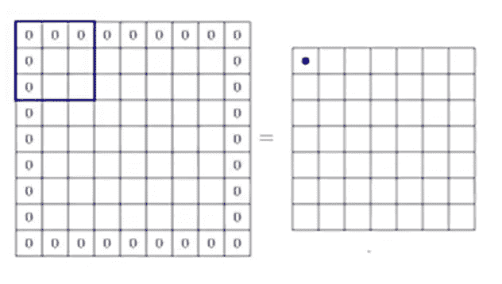

# CNN 中的卷积运算；

> 原文：<https://medium.com/analytics-vidhya/convolution-operation-in-cnn-a3352f21613?source=collection_archive---------9----------------------->

图片来源:走向数据科学

## 那么什么是卷积运算呢:

**卷积运算:** As 卷积是对两个函数的数学运算，产生第三个函数，表示一个函数的形状如何被另一个函数修改。

类似地，CNN 更像是一种卷积运算，我们进行不同的测量，并更多地依赖于邻近的测量来获得更好的结果。因此，我们在这里采用修正的测量值，这是所采用的测量值的加权平均值，使得最近的测量值被赋予比先前所采用的测量值更大的权重。

卷积运算

类似地，对于 2D 输入，我们通过对所有相邻像素进行加权平均来重新估计每个像素。

图片来源:IBM

## **我们可以通过应用不同的滤镜来给我们的图像应用不同的效果:**

1.  **模糊图像**:用加权平均代替每个像素。

资料来源:国家公共电话公司

2.**锐化图像:**取当前像素的 5 倍，并从中减去相邻像素，从而得到锐化的图像。

3.**边缘检测器:**当邻居与像素相同时，它将产生零输出，当邻居不同时，即在边界的情况下，它将作为边缘检测器。

资料来源:国家公共电话公司

将 k 个过滤器应用于输入会产生 k 个特征地图。对于 1d 输入和 1d 滤波器，我们有 1d 输出，对于 2d 输入和 2d 滤波器，我们有 2d 输出，而对于 3d 输入和 3d 滤波器，我们将有 2d 输出，因为输入和滤波器的深度是相同的。

## 输入尺寸、过滤器尺寸和输出尺寸之间的关系:

假设输入参数是:

W1:输入的宽度，H1:输入的高度，D1:输入的深度。

f:过滤器的空间范围，K:过滤器的数量，过滤器的深度:D1。

输出参数将是:

因此，如果我们应用空间范围 F 的过滤器，输出数组的宽度和高度减少的 F-1 小于输入数组的宽度和高度。因为滤波器不能捕获一些像素，因为这样滤波器将超出边界。

过滤器无法捕捉以黑色突出显示的像素。

`W2 = W1-(F-1) , H2 = H1-(F-1)`

→ **填充:**如果我们希望输出的大小与输入的大小相同，我们可以应用填充。有了这个的帮助，我们甚至可以捕捉到那些我们以前无法通过假设它们周围的边界来捕捉的像素。

现在输出尺寸将增加，因为过滤器能够捕捉更多的像素。

所以填充后输入输出参数之间的关系是:

`W2 = W1-(F-1)+2*P , H2= H1-(F-1)+2*P`

因为填充 1 意味着在顶部和底部添加 1 行，在左侧和右侧添加 1 列，所以我们添加了两倍的填充。

→ **步幅**:应用滤镜的间隔。如果 stride 为 2，这意味着我们正在对交替像素应用过滤器，因此输出的大小将会减小。所以在施加步幅时，输入和输出的大小之间的关系是:

`W2 = ((W1-F+2*P)/S) +1 , H2 = ((H1-F+2*P)/S) +1`

→ **输出深度:**因为每个滤镜产生一个 2d 输出，所以应用 k 个滤镜产生 k 深度的输出。

`D2 = Number Of Filters = K`

文章结束。

希望有帮助！

谢谢，祝您愉快:)