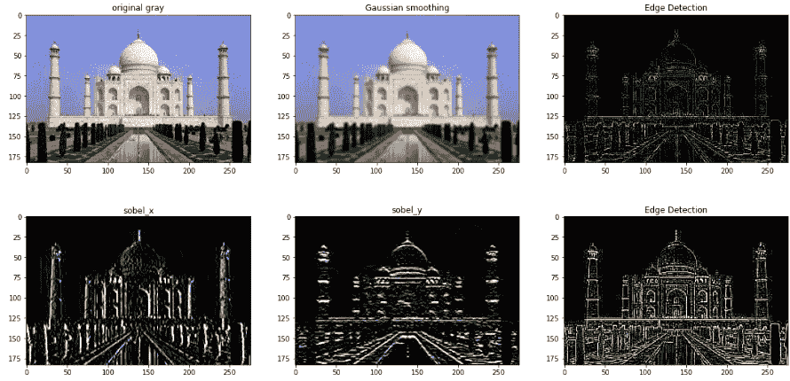

# 理解 CNN 中的“卷积”运算

> 原文：<https://medium.com/analytics-vidhya/convolution-operations-in-cnn-deep-learning-compter-vision-128906ece7d3?source=collection_archive---------5----------------------->

卷积神经网络是深度学习的主要构建模块，它有助于计算机视觉任务中的图像分类、目标检测、图像识别等。我们使用许多卷积运算技术，我们将在本文中讨论。

[来源](https://developersbreach.com/convolution-neural-network-deep-learning/)

***你用过照片编辑工具吗？***

哪一个使您的图像更清晰或删除了您想要删除的照片的一部分？

***如果是*** ，那么你已经对你的照片进行了隐含卷积运算。

# **理解卷积运算**

## 什么是内核/过滤器？

内核是一个长方形的小矩阵，从左到右，从上到下在图像上滑动。

内核/过滤器

## 什么是 stride？

内核在输入图像上滑动的像素数量称为一个步幅。

[来源](http://deeplearning.stanford.edu/wiki/index.php/Feature_extraction_using_convolution)

## 什么是卷积运算？

卷积运算是隐含两个函数的组合产生第三个函数的过程。结果，在整个输入图像上使用滤波器允许滤波器发现图像的该特征。也称为特征图。

我们通过一个拼图游戏的简单类比来理解。拼图游戏是卷积运算的完美例子。

在拼图游戏中，每块拼图都有一个图像的一部分，当它被组合在一起时，可以显示出整个画面的一些信息。

就像卷积网络中的拼图游戏一样，多个滤波器被用来对图像进行切片，并逐个映射它们，从而学习输入图像的不同部分。

[来源](https://github.com/whitcrrd/puzzle-image-segmentation)

例如，我们将输入图像 3x4 作为 I，将 2x2 内核 K 作为 I，卷积是两个矩阵的逐元素乘法，之后是总和 Sij。

我们使用以下公式计算输出(当前像素的重新估计值):

这里 m 和 n 代表行数和列数

在原始图像 I 的每个像素处，我们重新估计位于图像核心中心的像素的邻域。然后，我们取这个像素邻域，将它们与核 k 进行卷积，并获得单个输出值 Sij。对于较大图像，内核可以从左到右和从上到下滑动

这个操作的输出将是:(aw + bx + ey + fz)。然后，我们以步长 1 水平移动内核，这将给出权重和(bw + cx + fy + gz)

因此，在此之后，第一层的输出将如下所示:

我们有不同的过滤器，如模糊(平均平滑，高斯平滑，中值平滑等。)、边缘检测(拉普拉斯、索贝尔、沙尔、普鲁伊特等。)，以及锐化—所有这些操作都是为了执行特定的功能而设计的。

让我们以**高斯平滑滤波器**为例，如果我们取平均值(将加权和值除以 9)，它将稀释该值/模糊图像，该值用于平滑和减少图像中的噪声。

高斯平滑滤波器

不同内核/过滤器的应用

## **使用 3D 滤波器的 2D 卷积运算**

在 3D 输入的情况下(RGB 图像有 3 个通道，分别对应红、绿、蓝，所有这些通道都相互叠加，这就是我们获得最终图像的方式)，我们有 3 个通道(深度)，每个通道对应图像中的每种 RGB。

**所以我们在这里分别核算所有 3 个通道的卷积运算？**

我们也在沿着深度滑动过滤器吗？

不，我们使用与输入深度相同的过滤器，并将过滤器置于输入之上，计算所有 3 个维度的加权和。

[来源](https://indoml.com/2018/03/07/student-notes-convolutional-neural-networks-cnn-introduction/)

这里我们输入图像和内核是 3D 的，但是我们正在做的操作是 2D 操作，因为我们在水平(从左到右)和垂直(从上到下)两个方向上移动内核。

3D 图像上的 3D 滤镜

因此，我们已经知道，我们可以使用滤波器的卷积运算从图像中提取重要的特征。因此，我们可以使用多个过滤器从图像中提取不同的特征并产生多个特征图，而不是使用一个过滤器。每个滤波器负责提取不同的特征，如水平边缘、垂直边缘、非线性特征等。

## **什么是填充？**

在拐角处，我们不能放置内核，因此很明显，卷积运算的输出小于输入图像。

***如果我们希望输出和输入一样大呢？或者***

***如果滤镜不适合输入图像怎么办？***

在这种情况下，我们根据所需的大小和内核大小在图像周围添加 0 的人工填充，如下图所示，也称为**零** - **填充。**

[来源](https://stackoverflow.com/questions/60088496/i-wanted-to-implement-convolutional-neural-network-without-builtin-functions-so)

例如，假设我们正在执行步长为 2 的卷积运算。当我们将过滤器移动两个像素时，有可能到达边界，过滤器不适合输入图像。我们使用零填充来保留图像边界。

[来源](http://datahacker.rs/what-is-padding-cnn/)

**结论**

*   卷积神经网络将过滤器应用于输入图像以创建特征图，该特征图总结了输入中检测到的特征。
*   如何计算卷积神经网络中 2D 和三维卷积层的特征图？
*   填充如何在使用不同大小的过滤器创建的特征图中添加边框效果。

如果你有任何需要我改进的反馈，或者如果你想分享任何关于这方面的想法或经验，请随时发表评论。

你想要更多吗？在 [LinkedIn](https://www.linkedin.com/in/aditi-kothiya/) 和 [GitHub](https://github.com/Aditi81) 上关注我。