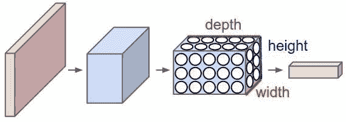
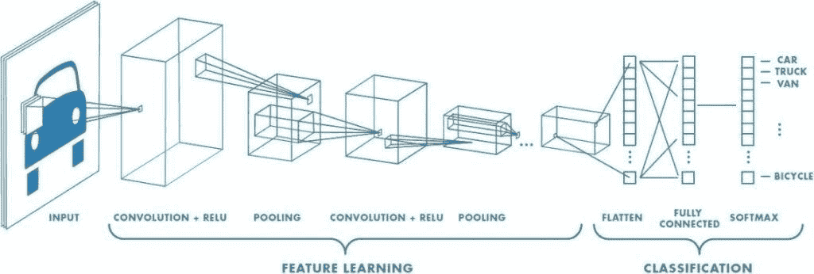

# 卷积神经网络:什么是卷积神经网络及其工作原理

> 原文：<https://medium.com/analytics-vidhya/convolutional-neural-network-22a9649cee8?source=collection_archive---------13----------------------->

在本文中，我们将讨论**卷积神经网络(CNN)** 。

你刚刚开始你在[深度学习](https://www.neuragate.it/intelligenza-artificiale/deep-learning-cose-e-come-funziona/)的旅程吗？我推荐你阅读整篇文章，因为我将从总体上解释 CNN 是什么。

我不会在这篇文章中使用数学概念。

你准备好了吗？

让我们开始吧，从基础开始！

# 什么是卷积神经网络？

卷积神经网络是一种[人工神经网络](https://www.neuragate.it/intelligenza-artificiale/cosa-sono-le-reti-neurali/)架构，用于**检测大于 64 x 64 像素的图像**。

与普通的人工神经网络( **ANN** )不同，CNN 被用于实现更好的图像检测(我们将在后面详细介绍)。

这种类型的神经网络也称为 **ConvNet** ，常用于物体识别。事实上，它们被用于医疗领域(如[癌症检测](https://www.neuragate.it/intelligenza-artificiale/radiografia-con-lai-aiuta-a-rilevare-il-cancro-nei-polmoni/))、自动驾驶汽车[(如特斯拉)、农业领域的识别等等。](https://www.neuragate.it/tech/robotaxi-il-servizio-di-taxi-autonomi-di-autox/)

在[计算机视觉](https://www.neuragate.it/intelligenza-artificiale/che-cose-la-computer-vision/)中使用的卷积神经网络近年来变得非常流行，因为新的和越来越强大的深度学习算法正在被发现(随着技术的进步)。

写完序言后，我终于可以开始和你讨论普通神经网络和 ConvNet 之间的区别了。

# CNN 和人工神经网络的区别是什么？

人工神经网络的结构与卷积神经网络的结构完全不同。

理论上，你可以使用人工神经网络来执行图像识别，但这会导致完全灾难性的结果。现在我将试着更好地解释我到目前为止所说的话。

想象一个正常的人工神经网络，有成千上万个神经元和隐藏层相互连接:

由于其深度和复杂性，将会出现以下问题:

*   高计算成本
*   梯度下降会爆炸

为了避免这种问题，使用了 CNN，因为与普通的人工神经网络不同，它们适合于分析图像，这归功于放置在三维空间中的神经元，也称为通道:**高度 x 宽度 x 深度**:

除了不费吹灰之力获得更好的结果之外，卷积神经网络还具有以下优点:

*   **参数共享**
*   **连接的稀疏性**，即:在每一层中，每个输出值只取决于少量的输入。

我希望现在你已经清楚了，因为现在我已经解释了两种类型的神经网络之间的主要差异以及为什么应该使用 CNN 进行图像识别，让我们来看看卷积神经网络实际上是如何工作的。

**又读** : [如何学习人工智能](https://antoniofurioso.medium.com/how-to-study-artificial-intelligence-bb7bc6640d9c)

# 卷积神经网络是如何工作的？

神经网络的基本结构包括:

1.  **卷积层**
2.  **非线性激活功能**
3.  **联营**
4.  **全连接网络(即我们的 NN)**

让我们按顺序来看看这些特征对于构建我们的卷积神经网络是如何重要的。

## 卷积层

卷积层是我们网络的初始部分，在这一层发生了所谓的“**卷积**”，CNN 由此得名:

在卷积中，我们提取图像特征。

我们拿一个图像来说:它被分成正方形(以绿色正方形为例，把它做得像一个图像)。

执行此步骤后，将图像乘以一个矩阵(称为**【滤波器】**或**【内核】**或**【特征检测器】** —黄色方块)，从而获得卷积(或**【特征图】** —粉色方块)。

为了让你更好地理解我们将要做的事情，请看下面的图片:

[*图像来源*](https://ujjwalkarn.me/2016/08/11/intuitive-explanation-convnets/)

需要记住的一件重要事情是，这里的滤波器充当原始输入图像的特征检测器。我们有不同类型的过滤器，进而形成不同类型的**“特征图”**:

*   **步距**:在开窗过程中，如果步距未被应用，过滤器将开始分析下一个方块(如上图所示)。另一方面，例如，如果我们应用一个`stride = 2`，过滤器将从第二个连续的方块开始，每次跳过下一个。
*   **填充**:在图像周围添加一层 0。这个**避免了两个负面**:
*   每次应用滤镜时图像的缩小
*   和边缘处像素可用性的缺乏所导致的信息损失。

非线性激活函数被应用于该卷积层。

## 非线性激活的功能

我们有几种类型的激活功能，但最常见的是: **Sigmoid、ReLu(整流线性单元)和 Tanh** 。

每次在卷积层之后应用激活函数，因为 ConvNet 是线性的，并且因为我们不想预测(例如)房屋的价格，所以我们必须应用非线性函数。

上面提到的每个功能都适用于不同的情况。我们以 ReLu 函数为例，这是最常用的一个。

与之前提到的其他函数不同， **ReLu 的学习速度更快，并且当‘Z’很大或很小时，在梯度上获得更好的结果**。

最后，在应用我们的非线性函数之后，我们可以继续进行**池化**。

**建议** : [深度学习专业化复习](https://antoniofurioso.medium.com/deep-learning-specialization-review-2021-5404ba3cd9a4)

## CNN 中的共享

Pooling 没有要设置的参数，但这可以是不同的类型:**最大值**、**总和**、**平均值**等。

这**减小了“特征图”的大小，但同时保留了每个特征图最重要的信息**。

让我们以从第一步获得的特征图为例，使用 MaxPooling 对其应用 a `2×2 filter`和`stride = 2`，我们将获得以下结果:

通过汇集，我们获得了以下**好处**:

*   使输入表示更小，更易于管理
*   减少网络中的参数和计算数量，从而控制[过拟合](https://en.wikipedia.org/wiki/Overfitting)
*   使网络对输入图像中的小变换、扭曲和平移保持不变(输入中的小扭曲不会改变池化的输出，因为我们取最大值/平均值)。
*   帮助我们获得图像的不变表示(称为“等变”)。这是非常强大的，因为我们可以检测图像中的物体，不管它们位于哪里。

这三个步骤是每一个通信网的基础，构成了通信网的第一层。在网络中，可以添加由该基础形成的其他层，然后添加完全连接的层。

## 全连接层

这一层意味着每个神经元都连接到上一层和下一层。

完全连接的层和到目前为止描述的网络的其余部分之间的组合，设法在预测中给出更好的结果。

不要忘记，线性激活函数**‘soft max’**应用于这最后一级，并将返回我们的输出。

Softmax 是一项允许您在一幅图像中同时检测多个对象的功能。

# 这是一个 ConvNet:

# 结论

这篇文章旨在对 CNN 做一个简单的介绍，事实上，正如你所看到的，我没有详细介绍以免使你到目前为止所学的变得复杂。如果你想研究这个课题，我推荐你去参加[的这个免费课程](https://www.coursera.org/learn/convolutional-neural-networks?specialization=deep-learning)。